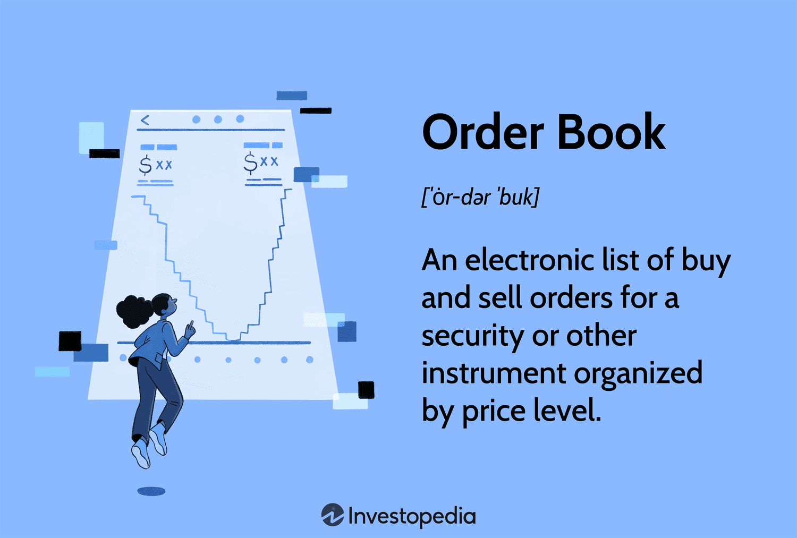

## Table of Contents

## What is an order book?

An order book is a list that shows all the buy and sell orders for a specific thing, like a stock or a cryptocurrency, at different prices. It helps people see how many others want to buy or sell at certain prices. Think of it like a big chart that updates all the time, showing what people are willing to pay and what they want to sell for.

When someone wants to buy or sell, their order goes into the order book. If the price someone is willing to pay matches the price someone else is willing to sell at, a trade happens. The order book is really important because it helps everyone see the current demand and supply, which can affect the price of the thing being traded. It's like a live snapshot of the market's activity.

## How does an order book work in trading?

An order book in trading is like a big list that shows all the orders people have placed to buy or sell a specific thing, like a stock or a cryptocurrency. It's split into two parts: one part shows all the buy orders, called bids, and the other part shows all the sell orders, called asks. The bids are listed from the highest price someone is willing to pay down to the lowest, and the asks are listed from the lowest price someone is willing to sell at up to the highest. This helps everyone see at a glance what prices people are willing to trade at.

When someone wants to trade, they place an order in the [order book](/wiki/order-book-trading-strategies). If the price of a new buy order matches or is higher than the lowest sell order, or if a new sell order matches or is lower than the highest buy order, a trade happens right away. This is called a market order. If someone wants to buy or sell at a specific price and is willing to wait, they can place a limit order. The order stays in the book until someone else is willing to trade at that price. The order book is always changing as new orders come in and trades happen, giving everyone a real-time view of what's going on in the market.

## What are the main components of an order book?

An order book has two main parts: the bids and the asks. The bids are all the orders from people who want to buy something. They are listed from the highest price someone is willing to pay down to the lowest. The asks are all the orders from people who want to sell something. They are listed from the lowest price someone is willing to sell at up to the highest. These two parts help everyone see what prices people are willing to trade at.

When someone places an order, it goes into the order book. If a new buy order's price matches or is higher than the lowest sell order, or if a new sell order's price matches or is lower than the highest buy order, a trade happens right away. This is called a market order. If someone wants to buy or sell at a specific price and is willing to wait, they can place a limit order. The order stays in the book until someone else is willing to trade at that price. The order book is always changing as new orders come in and trades happen, giving everyone a real-time view of the market.

## What is the difference between a bid and an ask in an order book?

A bid in an order book is an order from someone who wants to buy something. It shows the highest price someone is willing to pay for it. All the bids are listed from the highest price down to the lowest. This helps everyone see how much people are willing to spend to buy the thing they want.

An ask in an order book is an order from someone who wants to sell something. It shows the lowest price someone is willing to sell it for. All the asks are listed from the lowest price up to the highest. This helps everyone see how little people are willing to accept to sell the thing they have. The difference between the highest bid and the lowest ask is called the spread, and it's important because it shows how much the price might change when a trade happens.

## How do market orders and limit orders interact with the order book?

A market order is when someone wants to buy or sell something right away at the best available price. When someone places a market order to buy, it will match with the lowest ask in the order book, which is the lowest price someone is willing to sell at. If someone places a market order to sell, it will match with the highest bid in the order book, which is the highest price someone is willing to buy at. This means the market order will be filled immediately, but the price might not be exactly what the person expected because it depends on the current orders in the book.

A limit order is when someone wants to buy or sell something at a specific price and is willing to wait. When someone places a limit order to buy, it goes into the order book as a bid at the price they set. If someone places a limit order to sell, it goes into the order book as an ask at the price they set. The limit order will only be filled if someone else is willing to trade at that exact price. If no one is willing to trade at that price, the limit order stays in the book until someone matches it or the person who placed the order cancels it. This gives the person more control over the price they trade at, but it might take longer for the order to be filled.

## What is the significance of the order book depth?

Order book depth shows how many buy and sell orders there are at different prices. It's like looking at a big list and seeing how many people want to buy or sell something at each price. If there are a lot of orders at many different prices, the order book is deep. This means the market is more stable because there are more people ready to trade, and it's harder for the price to change a lot quickly.

A deep order book is important because it can help keep prices steady. If there are only a few orders, the price can jump around a lot when someone wants to buy or sell a big amount. But with a deep order book, there are more orders to match with, so big trades don't move the price as much. This makes the market feel safer for people who want to trade, because they know the price won't change too wildly.

## How can traders use the order book to make informed decisions?

Traders can use the order book to see what prices people are willing to buy and sell at. By looking at the order book, they can tell if there are a lot of people wanting to buy at a certain price, which might mean the price could go up soon. Or, if there are a lot of people wanting to sell at a certain price, it might mean the price could go down. This helps traders decide if they should buy or sell right now, or wait for a better price.

The order book also shows how deep the market is. If there are a lot of orders at many different prices, it means the market is stable and less likely to have big price jumps. Traders can use this information to feel more confident about making trades, knowing that the price won't change too much right after they buy or sell. By understanding the order book, traders can make smarter choices about when and at what price to trade.

## What is the role of an order book in market liquidity?

An order book plays a big role in showing how easy it is to buy or sell something in the market, which we call [liquidity](/wiki/liquidity-risk-premium). Liquidity means there are lots of people ready to trade, so you can buy or sell quickly without the price changing too much. When the order book has a lot of orders at many different prices, it means the market is very liquid. This is good because it means you can trade easily and the price won't jump around a lot.

If the order book doesn't have many orders, it means the market is not very liquid. In a market like this, it can be hard to buy or sell quickly because there aren't many people ready to trade. If someone wants to buy or sell a big amount, the price can change a lot because there aren't enough orders to match with. So, the order book helps traders see how liquid the market is and make better decisions about when to trade.

## How do high-frequency trading algorithms utilize order book data?

High-frequency trading algorithms use order book data to make very quick trades. They look at the order book to see all the buy and sell orders at different prices. By analyzing this data, these algorithms can spot patterns and predict small changes in the market. They can then buy or sell things very fast, sometimes in just a few milliseconds, to make a profit from these small changes. This is why high-frequency trading is all about speed and using computers to make decisions faster than humans can.

The order book helps these algorithms understand the market's liquidity, which means how easy it is to buy or sell something. If the order book shows a lot of orders at many different prices, the market is liquid, and the algorithms can trade more easily without causing big price changes. But if there are only a few orders, the market is less liquid, and the algorithms need to be more careful. By using the order book data, high-frequency trading algorithms can make smarter and quicker trades, taking advantage of even the tiniest price movements.

## What are the differences between visible and hidden orders in an order book?

Visible orders in an order book are the ones everyone can see. When someone places a visible order, it shows up in the order book with the price they want to buy or sell at. Other people can see these orders and know what prices people are willing to trade at. This helps everyone understand the market better because they can see how many people want to buy or sell at different prices.

Hidden orders, also called iceberg orders, are different because they are not fully shown in the order book. Someone might want to buy or sell a big amount without letting everyone know their whole plan. So, they place a hidden order where only a small part of it shows up in the order book. The rest of the order stays hidden until the visible part gets traded. This can be useful for big traders who don't want to affect the market too much by showing their whole order at once.

## How does the order book reflect market sentiment and potential price movements?

The order book shows what people think about the market and where the price might go next. If there are a lot of buy orders at high prices, it means people are feeling good about the thing they want to buy. They think the price might go up, so they're willing to pay more. On the other hand, if there are a lot of sell orders at low prices, it means people are feeling worried or want to get out of their position. They think the price might go down, so they're willing to sell for less.

By looking at the order book, traders can guess what might happen to the price. If the order book shows more buy orders than sell orders, it might mean the price will go up because there's more demand. If there are more sell orders than buy orders, it might mean the price will go down because there's more supply. The order book helps traders see these patterns and make better choices about when to buy or sell.

## What are the technological challenges and solutions in maintaining real-time order books?

Keeping an order book up to date in real time is hard because lots of people are buying and selling all the time. Computers need to be very fast to handle all these orders quickly. If the computer is slow, it can cause delays, and people might miss out on trades. Also, the system needs to be able to handle a lot of orders at the same time without crashing. This means the technology has to be strong and reliable.

To solve these problems, trading platforms use special computers and software that are built to be very fast and handle a lot of work. They use things like high-speed networks and special servers to make sure orders are processed quickly. They also have backup systems so if something goes wrong, the trading can keep going without big problems. By using these technologies, trading platforms can keep the order book updated in real time and make sure people can trade smoothly.

## References & Further Reading

[1]: Bergstra, J., Bardenet, R., Bengio, Y., & Kégl, B. (2011). ["Algorithms for Hyper-Parameter Optimization."](https://dl.acm.org/doi/10.5555/2986459.2986743) Advances in Neural Information Processing Systems 24.

[2]: ["Advances in Financial Machine Learning"](https://www.amazon.com/Advances-Financial-Machine-Learning-Marcos/dp/1119482089) by Marcos Lopez de Prado

[3]: ["Evidence-Based Technical Analysis: Applying the Scientific Method and Statistical Inference to Trading Signals"](https://www.amazon.com/Evidence-Based-Technical-Analysis-Scientific-Statistical/dp/0470008741) by David Aronson

[4]: ["Machine Learning for Algorithmic Trading"](https://github.com/stefan-jansen/machine-learning-for-trading) by Stefan Jansen

[5]: ["Quantitative Trading: How to Build Your Own Algorithmic Trading Business"](https://www.amazon.com/Quantitative-Trading-Build-Algorithmic-Business/dp/1119800064) by Ernest P. Chan