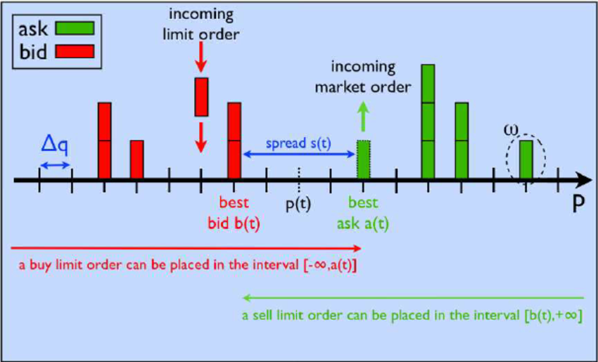

Algorithmic trading, often referred to as algo trading, involves the use of computer programs to execute buy and sell orders in financial markets according to predefined criteria. This approach harnesses the speed and computational power of modern technology to make trading decisions, often based on complex mathematical models and algorithms. One of the core elements in algorithmic trading is the order book, which serves as a detailed and real-time representation of supply and demand for a specific security. The order book lists all current buy and sell orders, displaying bid prices from buyers and ask prices from sellers, thereby providing critical insights into market behavior and sentiment.

The continuous movement and interaction of these buy and sell orders lead to what is known as order book dynamics. These dynamics are crucial for traders as they reflect the fluid nature of market activities influenced by various factors such as market sentiment, liquidity, and trading volume. Monitoring and understanding these changes enable algorithmic traders to predict potential price movements, thereby increasing the precision and efficiency of trade executions.



In this article, we focus on understanding the complexities of order book dynamics, particularly how they pertain to algorithmic trading strategies. By dissecting the order book and its fluctuations, algorithmic traders can gain a deeper understanding of market conditions and improve their strategies for better trade outcomes.

## Table of Contents

## Understanding the Order Book

An order book is a fundamental component in the trading of securities and financial instruments, serving as a comprehensive digital record of both buy and sell orders. It systematically lists these orders along with their respective prices, which are crucial for determining the market dynamics for a specific asset. The order book is particularly valued for its transparency in illustrating the market sentiment at any given moment, offering a snapshot of supply and demand by displaying the bid prices at which buyers are prepared to purchase, and the ask prices at which sellers are willing to sell.

In the context of trading, particularly algorithmic trading, an order book equips traders and algorithms with essential information to make informed decisions. By analyzing the order book, traders can discern not only the current market equilibrium but also predict potential price movements. This analysis often seeks to identify trends such as resistance and support levels, based on the concentration and distribution of bid and ask orders.

In algorithmic trading, where trades are executed based on preset algorithms without human intervention, the order book plays a crucial role. It provides real-time data that algorithms leverage to react to market changes swiftly. Algorithms scan the order book to determine optimal entry and [exit](/wiki/exit-strategy) points for trades, aiming to enhance execution efficiency and improve returns.

To illustrate with an example, consider an algorithm designed to engage in [market making](/wiki/market-making) strategies. It utilizes the [order book](/wiki/order-book-trading-strategies) data to place buy and sell orders that are close to the current bid and ask prices, respectively. This position benefits from the spread between bid and ask prices, while also providing [liquidity](/wiki/liquidity-risk-premium) to the market. The ability to analyze the depth of the order book, which signifies the [volume](/wiki/volume-trading-strategy) of buy and sell orders at different price levels, is essential. This depth informs the algorithm of potential price changes before executing trades, allowing the algorithm to adjust its strategies proactively.

Order book analysis goes beyond identifying pricing trends. It also encompasses the monitoring of order flow, which refers to the rate at which orders are submitted and canceled. This aspect of the order book reveals the [momentum](/wiki/momentum) and aggressiveness of market participants, offering insights into potential future price action. Algorithms meticulously analyze these nuances to enhance decision-making processes.

In conclusion, the order book is indispensable in understanding and navigating the intricate dynamics of trading. For [algorithmic trading](/wiki/algorithmic-trading), analyzing order book data is not merely advantageous; it is a critical component that directly influences the effectiveness of trading strategies. By mining the data within the order book, traders and algorithms alike can gain insights that are pivotal for executing trades that align with their financial goals.

## Order Book Dynamics in Algo Trading

Order book dynamics in algorithmic trading entail the continuous fluctuations in bid and ask prices, as well as changes in volume and liquidity over time. These dynamics are crucial to the development of various trading strategies, including market making and [arbitrage](/wiki/arbitrage). Market making involves providing liquidity to the market by simultaneously posting buy and sell orders. This strategy relies heavily on the order book's depth and liquidity to optimize spreads between buy and sell prices. Arbitrage, on the other hand, seeks to exploit price discrepancies for the same asset across different markets or financial instruments, requiring precise analysis of order book data to execute trades swiftly and effectively.

Real-time analysis of order book dynamics allows algorithms to adjust to current market conditions and enhance trade execution. Algorithms are designed to analyze the order book by assessing live feeds of changing bid and ask prices. This involves high-frequency data analysis, requiring advanced computational capabilities to interpret vast amounts of data in real-time. For example, an algorithm might be programmed to buy when a significant order imbalance suggests upward pressure and sell when downward pressure is evident. Such real-time adaptability is pivotal to remain competitive in rapidly fluctuating markets.

Several factors significantly influence order book dynamics. Market [volatility](/wiki/volatility-trading-strategies) is a primary [factor](/wiki/factor-investing), with high volatility often leading to rapid changes in bid and ask prices, thus affecting liquidity and volume. To quantify volatility, measures such as standard deviation or variance of returns can be employed. In code, a simple calculation of volatility over a time window might look like this:

```python
import numpy as np

def calculate_volatility(prices, window_size):
    returns = np.diff(prices) / prices[:-1]
    return np.std(returns[-window_size:])

# Example usage
prices = [100, 101, 102, 99, 98, 101, 104]
volatility = calculate_volatility(prices, window_size=5)
print("Volatility:", volatility)
```

Order size also plays a critical role, as large trades can disrupt the existing balance of the order book, causing sharp price movements. Timing is equally vital; executing a trade at the right moment can mean the difference between profit and loss, especially in markets characterized by [high frequency](/wiki/high-frequency-trading) fluctuations.

Overall, understanding the dynamics within the order book is essential for algorithmic traders aiming to optimize their strategies and achieve effective trade execution. As technology advances, the ability to process and analyze these dynamics in real-time will continue to be a key differentiator in the competitive landscape of algorithmic trading.

## Key Factors Affecting Order Book Dynamics

Liquidity is a critical determinant of the stability of an order book, with higher liquidity generally correlating with diminished price volatility. Liquidity refers to the availability of assets for buying and selling, and its abundance facilitates smooth transactions with minimal impact on prices. A liquid market features tight bid-ask spreads and significant market depth, offering traders confidence that they can execute large orders without causing drastic price shifts.

Market sentiment, influenced by trader behavior, news, and economic events, plays a significant role in shaping order book dynamics. Positive sentiment can incite buying pressure, raising bid prices and tightening spreads, whereas negative sentiment may lead to increased sell orders and expanded spreads. Real-time data on market news and economic indicators can affect sentiment and, consequently, the distribution of demand and supply in the order book.

Trade volume is another pivotal factor affecting order book dynamics. Large trades, especially when executed as block trades, can disrupt the existing balance by consuming available liquidity at particular price levels. This can lead to temporary price impact and significant alterations in the order book's structure. Algorithms designed to handle large volumes often execute trades incrementally to mitigate adverse price effects, maintaining market stability.

Algorithmic strategies significantly influence order book dynamics. The presence of multiple algorithms, each executing its unique strategy, can result in rapid and frequent changes. These algorithms include market making—which provides continuous bids and offers to capture the bid-ask spread—and arbitrage, which exploits price discrepancies across markets or instruments. The computational speed and strategic complexity of these algorithms enable them to interact with the order book in ways that can reshape its dynamics almost instantaneously.

In conclusion, understanding the interplay of liquidity, market sentiment, trade volume, and algorithmic strategies is essential for recognizing the complexities of order book dynamics. The interaction of these factors can lead to substantial variations in the order book's state, influencing the overall trading environment.

## Techniques for Analyzing Order Book Dynamics

Data visualization plays a critical role in analyzing order book dynamics by providing a clear representation of complex data sets. Tools such as heatmaps and depth charts are widely used to visualize the order book. Heatmaps display the intensity of buy and sell pressures at different price levels, highlighting areas of high demand or supply. Depth charts provide a graphical representation of all buy and sell orders in the order book, allowing traders to observe the market depth and potential liquidity.

In addition to visualization, statistical models are integral to analyzing order book dynamics. Machine learning techniques, including supervised and unsupervised learning, help predict future price movements by identifying patterns within historical data. Predictive analytics involves statistical algorithms to forecast the impact of market changes on the order book. For example, regression models can predict the response of the order book to different market stimuli based on past behaviors.

Market simulation is another valuable technique, enabling traders to explore "what if" scenarios to understand potential changes in the order book dynamics. By using simulated environments, traders can model the effects of various strategies without risking actual capital. Simulations can test the impact of large trades on market liquidity or explore the outcomes of specific algorithmic strategies, providing valuable insights into likely market reactions.

Real-time analysis is crucial for traders to respond promptly to changes in order book dynamics. Continuous monitoring of the order book, facilitated by algorithms capable of processing high-frequency data, allows for immediate decision-making. This requires sophisticated technology to handle large volumes of data with minimal latency. Real-time alerts can be programmed to notify traders of significant changes in the order book, ensuring timely responses to opportunities or risks.

Overall, these techniques—data visualization, statistical modeling, market simulation, and real-time analysis—form a comprehensive toolkit for analyzing order book dynamics. By leveraging these tools, traders can gain a deeper understanding of market behaviors and enhance the effectiveness of their trading strategies.

## Challenges and Considerations

High-frequency trading ([HFT](/wiki/high-frequency-trading-strategies)) presents significant challenges in interpreting order book updates due to the velocity at which these changes occur. Advanced technology is required to process and analyze data quickly enough to execute trades based on real-time insights. Without such technology, the risk of missed opportunities and erroneous trades increases, affecting overall trading efficiency and profitability.

Data latency poses another challenge, as delays in data transmission can lead to discrepancies between the perceived state of the order book and its actual condition. Inaccurate readings of order book dynamics can result in suboptimal trade decisions. Traders often invest in high-performance computing infrastructure and co-location services near exchange servers to minimize latency and improve the accuracy of data reception.

Regulatory factors also play a critical role in how algorithms interact with the order book. Different markets impose various regulations that affect how trades are executed and reported. Compliance with these regulations is essential to avoid penalties and maintain operational integrity. Traders must ensure that their algorithms adhere to relevant laws and industry standards, which can involve extensive testing and validation.

Risk management is pivotal when utilizing order book dynamics for trading. Traders must comprehend the inherent risks, such as market manipulation and sudden liquidity shifts, which can lead to significant losses. Employing strategies like stop-loss orders and diversification can help mitigate these risks. Additionally, stress testing algorithms against historical data and hypothetical scenarios aids in anticipating potential vulnerabilities.

The combination of rapid data changes in HFT, issues with data latency, regulatory requirements, and risk management creates a complex environment for traders. Addressing these challenges requires a robust technological infrastructure, comprehensive understanding of the regulatory landscape, and effective risk mitigation strategies to navigate the dynamics of order [books](/wiki/algo-trading-books) successfully.

## Conclusion

Order book dynamics are integral to algorithmic trading, offering crucial insights into market behavior that aid traders in making well-informed decisions. By analyzing changes in bid and ask prices, volumes, and liquidity, traders can better understand the underlying forces influencing security prices. The ability for algorithms to process this data in real-time enhances the efficiency and precision of trade execution.

As technology continues to advance, the sophistication of order book analysis within algorithmic trading is poised to evolve further. Innovations in [machine learning](/wiki/machine-learning), [artificial intelligence](/wiki/ai-artificial-intelligence), and data processing will likely lead to enhanced models that better predict future price movements based on order book changes. This progression demands that traders and market participants stay informed about technological advancements to maintain their competitive edge.

In addition to technological developments, traders must also consider the impact of regulatory changes on algorithmic trading strategies. Regulations can influence how algorithms operate, affecting factors such as execution speed and transparency. Staying current with such changes is essential for leveraging order book dynamics effectively while ensuring compliance with market standards.

Ultimately, the ability to understand and adapt to order book dynamics offers traders a significant competitive advantage in the rapidly evolving landscape of algorithmic trading. By continuously refining their strategies in response to both technological advancements and market regulations, traders can position themselves for success in this fast-paced environment.

## References & Further Reading

[1]: Bouchaud, J.-P., Farmer, J. D., & Lillo, F. (2009). ["How Markets Slowly Digest Changes in Supply and Demand."](https://arxiv.org/abs/0809.0822) Review of Modern Physics, 80(4), 1275–1303.

[2]: Gould, M. D., Porter, M. A., Williams, S., McDonald, M., Fenn, D. J., & Howison, S. D. (2013). ["Limit Order Books."](https://arxiv.org/abs/1012.0349) Quantitative Finance, 13(11), 1709-1742.

[3]: Cartea, Á., Jaimungal, S., & Penalva, J. (2015). ["Algorithmic and High-Frequency Trading."](https://assets.cambridge.org/97811070/91146/frontmatter/9781107091146_frontmatter.pdf) Cambridge University Press.

[4]: Lopez de Prado, M. (2018). ["Advances in Financial Machine Learning."](https://www.amazon.com/Advances-Financial-Machine-Learning-Marcos/dp/1119482089) Wiley.

[5]: Jansen, S. (2020). ["Machine Learning for Algorithmic Trading: Predictive models to extract signals from market and alternative data for systematic trading strategies with Python."](https://github.com/stefan-jansen/machine-learning-for-trading) Packt Publishing.

[6]: Chan, E. P. (2009). ["Quantitative Trading: How to Build Your Own Algorithmic Trading Business."](https://github.com/egorpe/EPChan-QuantitativeTrading/blob/master/example7_6.m) Wiley Trading.

[7]: Harris, L. (2002). ["Trading and Exchanges: Market Microstructure for Practitioners."](https://www.acsu.buffalo.edu/~keechung/MGF743/Readings/Trading-Exchanges-Market-Microstructure-Practitioners%20Draft%20Copy.pdf) Oxford University Press.