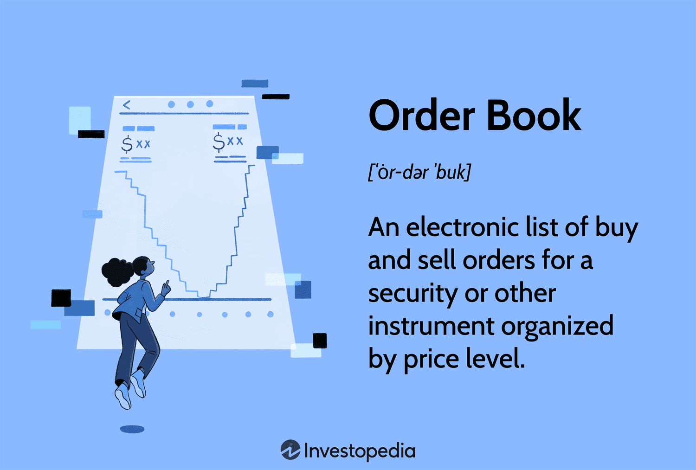

## Table of Contents

## What is an order book?

An order book is a list that shows all the buy and sell orders for a specific thing, like a stock or a cryptocurrency. It helps people see what prices others are willing to buy or sell at. The book is updated in real-time, so it always shows the current situation in the market.

When someone wants to buy or sell, they can look at the order book to decide if they want to go ahead with their order. For example, if you want to buy a stock, you can see the lowest price someone is willing to sell it for. If you want to sell, you can see the highest price someone is willing to buy it for. This helps everyone make better decisions about when and at what price to trade.

## How does an order book function in a trading system?

An order book in a trading system is like a big list that keeps track of all the orders people want to make. When someone wants to buy or sell something, like a stock or a cryptocurrency, they put their order into the order book. The book shows two sides: one side for people who want to buy, and the other side for people who want to sell. The buy side is called the "bid" and shows the highest prices people are willing to pay. The sell side is called the "ask" and shows the lowest prices people are willing to accept.

When a new order comes in, the trading system looks at the order book to see if it can match the new order with an existing one. If someone wants to buy at a price that someone else is willing to sell at, the trade happens right away. This is called a "match." If the new order can't be matched right away, it stays in the order book until it can be matched later. The order book is always changing as new orders come in and trades happen, so it gives everyone a real-time view of what's happening in the market.

## What are the main components of an order book?

An order book has two main parts: the bid side and the ask side. The bid side shows all the orders from people who want to buy. It lists the prices they are willing to pay, starting with the highest price at the top. The ask side shows all the orders from people who want to sell. It lists the prices they are willing to accept, starting with the lowest price at the top. The difference between the highest bid price and the lowest ask price is called the "bid-ask spread."

When someone places a new order, it goes into the order book. If the new order can match with an existing order on the other side, a trade happens right away. For example, if someone wants to buy at a price that someone else is willing to sell at, they can trade immediately. If the new order can't be matched right away, it stays in the order book until it can be matched later. The order book keeps updating as new orders come in and trades happen, so it always shows what's happening in the market right now.

## What is the difference between a bid and an ask in an order book?

In an order book, a bid is an order from someone who wants to buy something. It shows the highest price that someone is willing to pay for it. The bid side of the order book lists all these buy orders, starting with the highest price at the top. When you look at the bid side, you can see how much people are willing to spend to get what they want.

An ask, on the other hand, is an order from someone who wants to sell something. It shows the lowest price that someone is willing to accept for it. The ask side of the order book lists all these sell orders, starting with the lowest price at the top. By looking at the ask side, you can see how little people are willing to take to let go of what they have. The difference between the highest bid price and the lowest ask price is called the "bid-ask spread," and it's an important thing to watch in trading.

## How are orders prioritized in an order book?

Orders in an order book are sorted by price and time. On the bid side, where people want to buy, the highest price orders are at the top. If two people want to buy at the same price, the one who put their order in first goes higher up in the list. On the ask side, where people want to sell, the lowest price orders are at the top. If two people want to sell at the same price, the one who put their order in first also goes higher up in the list.

This way of sorting helps make sure that the best possible trades happen first. If someone wants to buy and their price matches someone else's sell price, they can trade right away. If no one's price matches, the orders stay in the book until someone else comes along with a matching price. This keeps the market fair and organized for everyone.

## What is the role of an order book in price discovery?

An order book helps people find out what something should cost by showing all the orders to buy and sell it. When someone wants to buy or sell, they can look at the order book to see what prices other people are willing to pay or accept. This helps everyone decide what a fair price might be. If a lot of people want to buy at a high price, the price might go up. If a lot of people want to sell at a low price, the price might go down.

The order book is always changing as new orders come in and trades happen. This means the price can change a lot, and everyone can see what's happening right now. By looking at the order book, people can guess where the price might go next and make better choices about when to buy or sell. This process of figuring out the price is called price discovery, and the order book is a big part of it.

## How does an order book contribute to market liquidity?

An order book helps make the market more liquid by showing all the buy and sell orders for something. When there are a lot of orders in the book, it means more people are ready to trade. This makes it easier for someone who wants to buy or sell to find someone else who wants to do the opposite. The more orders there are, the easier it is to make a trade happen quickly, which means the market is more liquid.

Having a lot of orders also helps keep the difference between the highest bid price and the lowest ask price small. This difference is called the bid-ask spread. When the spread is small, it's easier and cheaper for people to trade. So, a full order book with lots of orders helps make the market more liquid by making it easier and cheaper for everyone to buy and sell.

## What are the different types of orders that can be placed in an order book?

There are a few different types of orders that people can put into an order book. A market order is one where someone wants to buy or sell right away at the best price they can get. This type of order is quick because it uses the prices that are already in the order book. A limit order is different because it lets someone set a specific price they want to buy or sell at. If that price isn't available right away, the order stays in the book until someone else is willing to trade at that price.

Another type of order is a stop order, which is used to buy or sell when the price reaches a certain level. For example, someone might use a stop order to sell if the price goes down to a certain point, to limit their losses. There are also variations like stop-limit orders, which combine a stop order and a limit order. This means the order turns into a limit order when the price hits the stop price, and then it tries to trade at the limit price. Each type of order helps people trade in different ways, depending on what they want to do in the market.

## How do market makers interact with an order book?

Market makers are people or companies that help make trading easier by always being ready to buy or sell. They put their own orders into the order book to make sure there are always prices for others to trade at. When someone wants to buy or sell, they can often do it right away because market makers are there with their orders. This helps keep the market moving smoothly and makes it easier for everyone to trade.

Market makers look at the order book to see what prices people are willing to buy or sell at. They then put their own orders in to make the difference between the highest bid and the lowest ask smaller. This difference is called the bid-ask spread, and a smaller spread means it's cheaper for people to trade. By doing this, market makers help make the market more liquid, which means more people can trade more easily.

## What is the impact of high-frequency trading on order books?

High-frequency trading (HFT) is when computers trade very quickly, often in just a few seconds or less. These fast trades can change the order book a lot. HFT traders put in many orders and take them out very quickly. This can make the order book look very busy, but sometimes the orders are not real trades. They are just there to see what other people might do. This can make it hard for other people to know what is really happening in the market.

Because HFT traders can trade so fast, they can also make the prices change a lot. If a lot of HFT traders want to buy or sell at the same time, the prices in the order book can go up or down very quickly. This can be good because it can make the market more liquid, meaning it's easier for everyone to trade. But it can also be bad because it can make the market feel less stable. People who are not using HFT might find it harder to trade because the prices are moving so fast.

## How can order book data be used for market analysis?

Order book data can help people understand what's happening in the market. By looking at the order book, someone can see all the buy and sell orders that people have put in. This shows how many people want to buy or sell and at what prices. If there are a lot of buy orders at high prices, it might mean that the price could go up soon. If there are a lot of sell orders at low prices, it might mean the price could go down. By watching these orders, people can guess where the market might be headed.

Using order book data also helps people see how easy it is to trade in the market. If there are a lot of orders, it means the market is liquid, and it's easier for people to buy and sell quickly. If there are not many orders, it can be harder to trade. People can also look at how the orders change over time to see if the market is getting more or less busy. This can help them decide when might be a good time to trade.

## What are the technological challenges in maintaining and updating an order book in real-time?

Keeping an order book updated in real-time is hard because a lot of orders come in very quickly. Computers need to be very fast to handle all these orders without making mistakes. If the computer is slow, it might miss some orders or make the wrong trades. This can cause problems in the market, like prices changing in weird ways or people not being able to trade when they want to. So, the technology needs to be strong and fast to keep up with all the orders coming in.

Another challenge is making sure the order book is always right. When a lot of people are trading at the same time, it's easy for things to get mixed up. The system has to check every order very quickly to make sure it goes into the right place in the book. If something goes wrong, it can mess up the whole order book. So, the technology needs to be very careful and accurate to keep the order book correct and up to date all the time.

## References & Further Reading

[1]: Hasbrouck, J. (2007). ["Empirical Market Microstructure: The Institutions, Economics, and Econometrics of Securities Trading"](https://academic.oup.com/book/52241) Oxford University Press.

[2]: Harris, L. (2003). ["Trading and Exchanges: Market Microstructure for Practitioners"](https://academic.oup.com/book/52292) Oxford University Press.

[3]: Aldridge, I. (2010). ["High-Frequency Trading: A Practical Guide to Algorithmic Strategies and Trading Systems"](https://www.ahmetbeyefendi.com/wp-content/uploads/2020/07/High-Frequency-Trading-Irene-Aldridge.pdf) Wiley.

[4]: Narang, R. (2009). ["Inside the Black Box: The Simple Truth About Quantitative Trading"](https://onlinelibrary.wiley.com/doi/book/10.1002/9781118267738) Wiley.

[5]: Easley, D., López de Prado, M. M., & O'Hara, M. (2012). ["Flow Toxicity and Liquidity in a High-Frequency World"](https://www.semanticscholar.org/paper/Flow-Toxicity-and-Liquidity-in-a-High-Frequency-Easley-Prado/9369430bd005d194f9332ae7cbd5a57ace5e9ab3) Journal of Financial Economics, 105(3), 85-103.