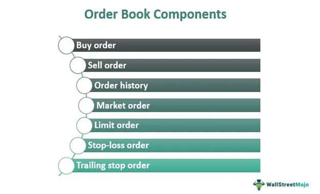

Understanding the dynamics of financial markets is crucial for investors and traders. These markets are complex ecosystems where the forces of supply, demand, investor sentiment, and geopolitical events intersect to determine asset prices. The ability to navigate these markets effectively requires not only an understanding of fundamental and technical analysis but also the capability to interpret large volumes of data in real-time.

Technology has significantly transformed how trading is conducted, particularly through the development and adoption of algorithmic trading. Algorithmic trading, or algo trading, involves using computer programs to execute trading strategies based on predetermined criteria. This method allows traders to execute orders at speeds and frequencies that are impossible with human intervention, leading to higher efficiency and accuracy in transaction execution.

In this article, we will explore the concepts of order book trading and algo trading within financial markets. Order book trading involves analyzing the order book, a digital list of buy and sell orders for a specific security, to make informed trading decisions. By understanding order book dynamics, traders can gain insights into market liquidity and potential price movements, enhancing their ability to strategize effectively.

We will discuss how these techniques can enhance trading efficiency and profitability. Order book and algorithmic trading strategies are not mutually exclusive and can be combined to optimize trade execution. By integrating real-time order book data into algorithmic trading systems, traders can improve decision-making, reduce transaction costs, and better capture market inefficiencies.

This guide will provide insights for both novice traders and experienced financial market participants. Whether you are just starting your journey in financial markets or looking to refine your strategies, understanding these tools is critical for staying competitive. By leveraging the power of technology and data, traders can adapt to the evolving landscape of financial markets and seize new opportunities for profit.

## Table of Contents

## What is Order Book Trading?

An order book is a digital record consisting of buy and sell orders for a specific security or financial instrument, systematically organized by price level. This record provides an overview of current trading interest and helps traders gauge the depth of the market. Order book trading involves analyzing this data to make informed trading decisions, focusing on understanding the components and dynamics of the order book to execute strategies based on anticipated market movements.

The structure of an [order book](/wiki/order-book-trading-strategies) typically includes various price levels, with each level showing the [volume](/wiki/volume-trading-strategy) of buy and sell orders. The key components of an order book include bids, asks, and the spread.

1. **Bids**: These are the buy orders placed by traders who wish to purchase an asset. Bids are listed alongside the prices prospective buyers are willing to pay. In most instances, bids in an order book are arranged in descending order of price, with the highest bid placed at the top. This prioritization reflects the demand at each price level, providing insights into the asset's perceived value.

2. **Asks**: Conversely, asks represent the sell orders by traders who aim to offload their holdings of an asset. These are organized in ascending order by the price at which sellers are ready to sell, with the lowest ask price at the bottom. Analyzing the asks helps traders understand the supply dynamics and potential resistance levels in the market.

3. **Spread**: The spread is the difference between the highest bid and the lowest ask. It serves as an indicator of the asset's liquidity and transaction costs. A narrower spread typically suggests higher liquidity and lower trading costs, as there is a smaller gap between what buyers are willing to pay and what sellers are asking. Conversely, a wide spread indicates lower liquidity and potentially higher costs due to greater price uncertainty.

Traders leverage order book data to identify trends and gauge [liquidity](/wiki/liquidity-risk-premium) levels, as well as to predict potential price movements. The information displayed in the order book helps traders assess the strength of supply and demand at various price levels, guiding them in making buy or sell decisions.

For example, a large number of bids at a specific price level might suggest a strong support area, while a high volume of asks could signal potential resistance. Traders might use these insights to develop strategies such as buying near support levels or selling near resistance points. Additionally, by monitoring changes in the order book, traders can detect shifts in market sentiment and adapt their strategies accordingly.

In summary, order book trading is predicated on the thorough analysis of the order book's structure, allowing traders to make strategic decisions based on real-time market data. This methodology empowers traders to optimize their trades by anticipating market dynamics and leveraging the transparency afforded by the order book.

## The Rise of Algorithmic Trading

Algorithmic trading, commonly referred to as algo trading, employs complex mathematical models and automated systems to make trading decisions in financial markets. This approach leverages the power of computer algorithms to execute orders with speed and precision unattainable by human traders, resulting in increased efficiency and accuracy.

The origins of [algorithmic trading](/wiki/algorithmic-trading) can be traced back to the 1970s with the advent of electronic exchanges. The development of computer technology and telecommunication systems laid the groundwork for the automation of trading strategies. As software capabilities advanced, so did the sophistication of trading algorithms, propelling algo trading to the forefront of financial markets. It has revolutionized how trades are executed, providing a competitive edge in terms of speed and cost-effectiveness.

Algo trading has gained prominence due to its ability to quickly analyze vast amounts of data and execute trades at speeds that were previously impossible. It minimizes human error by systematically adhering to predefined rules and conditions, thereby reducing emotional decision-making. This has made it an indispensable tool for many institutional investors and hedge funds, allowing them to run thousands of trades per second and capture market opportunities that would otherwise be missed.

Several types of trading algorithms are employed to exploit different market conditions and strategies:

1. **Market-Making Algorithms**: These are designed to profit from the bid-ask spread by placing buy and sell orders simultaneously. Market-making algorithms focus on providing liquidity to the market and capturing the small differences between the buy and sell prices.

2. **Trend-Following Algorithms**: These algorithms detect and capitalize on market momentum by analyzing price patterns and trends. Trend-following strategies perform well in trending markets by buying in an uptrend and selling in a downtrend.

3. **Statistical Arbitrage**: This involves identifying price inefficiencies between related financial instruments. Statistical arbitrage algorithms use quantitative models to exploit these inefficiencies, often conducting pairs trading or spread betting based on statistical correlations.

Algo trading also plays a role in reducing transaction costs. By employing strategies such as order slicing, large trades can be broken down into smaller parts to minimize market impact and slippage. Advanced algorithms can place these smaller orders in a manner that is less detectable by other market participants, optimizing trade execution.

While algorithmic trading offers significant benefits, it also poses certain challenges and risks. Issues such as flash crashes, where rapid trading activity leads to sudden price fluctuations, highlight the need for robust risk management systems and regulatory oversight. Nonetheless, its adoption continues to grow, driven by advancements in technology and data analytics.

Investors value algorithmic trading for its ability to capitalize on market inefficiencies by tapping into the vast streams of data generated by modern financial markets. As technology continues to evolve, so too will the tools and strategies at the disposal of those using algorithmic trading to gain a competitive advantage.

## Integration of Order Book and Algo Trading

Combining the insights from order book analysis with algorithmic trading techniques represents a cutting-edge approach to financial market strategies, serving to optimize trade execution and enhance decision-making processes. The synergy between these two methodologies allows traders to create sophisticated algorithms responsive to real-time market conditions, thereby optimizing trade strategies based on evolving market dynamics.

At its core, integrating order book data with algorithmic trading involves developing automated systems capable of interpreting large volumes of data quickly and accurately. By programming algorithms to interact intelligently with order book information, traders can capture a granular view of market depth, liquidity, and potential price movements. This process often involves analyzing the bids and asks within an order book to deduce actionable insights regarding supply-demand balance, [momentum](/wiki/momentum) potential, and market participant behavior.

For instance, market-making algorithms, which typically aim to profit from the bid-ask spread by placing simultaneous buy and sell orders, can be significantly enhanced by real-time order book data. These algorithms can adjust their strategies based on order book dynamics, such as detecting large buy or sell orders that might indicate an impending price swing, thereby optimizing entry and [exit](/wiki/exit-strategy) points for trades. 

Python, a versatile language commonly used for developing trading algorithms, can be employed to automate such strategies. A simple Python snippet could involve using libraries like `pandas` for data manipulation and `numpy` for handling large-scale computations efficiently. Algorithms can be designed to analyze real-time data from APIs provided by various trading platforms, adjusting trading strategies on the fly based on up-to-the-moment market conditions.

Additionally, case studies exemplify successful amalgamations of order book analysis within algorithmic frameworks. For example, quantitative hedge funds often utilize sophisticated [machine learning](/wiki/machine-learning) models trained on vast historical order book data, enabling these algorithms to predict short-term price movements with high precision. By integrating predictive models with real-time data access, traders can develop strategies that adapt in real-time, allowing for dynamic positioning based on predictive confidence intervals.

However, challenges are inherent in merging order book data with algorithmic trading strategies. One primary concern is the latency associated with data processing—algorithms must be equipped to handle high-frequency data at speeds that keep pace with rapidly shifting market conditions. There is also the challenge of overfitting algorithms to historical order book data, risking reduced effectiveness in live trading environments. Moreover, the complexity of regulatory requirements around transparency and fairness in algorithmic trading environments necessitates robust compliance frameworks.

In conclusion, the integration of order book insights with algorithmic trading stands as a paradigm of modern trading methodology aimed at leveraging technology to refine market strategies. The capability to respond to real-time market dynamics not only offers the potential for improved trading outcomes but also necessitates a careful appraisal of the attendant risks and challenges associated with this sophisticated approach.

## Benefits and Risks of Order Book and Algo Trading

Order book trading and algorithmic trading each bring unique advantages to modern financial markets, contributing to more informed decision-making and efficient trade execution. Order book trading facilitates transparency by displaying real-time buy and sell orders, thereby providing traders with insights into market liquidity and depth. This visibility allows traders to assess supply and demand dynamics at various price levels, enabling more informed entry and exit points and the identification of support and resistance levels.

Algorithmic trading, on the other hand, enhances trading efficiency and precision by executing trades automatically based on pre-set criteria. It allows for high-frequency trading where large volumes of trades are conducted in fractions of a second, capitalizing on minute price discrepancies. This method minimizes human error and can reduce transaction costs by optimizing the timing and volume of trades.

However, both strategies come with inherent risks. One major risk associated with order book trading is market [volatility](/wiki/volatility-trading-strategies), which can lead to sudden and significant changes in the order book structure, potentially resulting in unexpected trading outcomes. Traders relying on real-time data must be prepared for rapid shifts and adjust their strategies accordingly.

Algorithmic trading poses the risk of technical failures, such as system malfunctions or connectivity issues, which can disrupt trading operations. Additionally, the misuse of algorithms can exacerbate market volatility, as evidenced in events like the "flash crash" of 2010[1]. Algorithms can react to false signals or cascade sell-offs, leading to large market swings. Moreover, reliance on historical data for algorithm development can result in overfitting, making the algorithm less effective in different market conditions.

To navigate these risks, traders should adopt robust risk management strategies. This includes setting appropriate stop losses, regularly updating and testing algorithms, and monitoring market conditions for anomalies. Understanding the limitations and potential pitfalls of each method is crucial for effectively harnessing their capabilities.

In conclusion, while order book and algo trading offer significant benefits in terms of market transparency, efficiency, and execution speed, they require careful risk management and understanding of their constraints. By balancing these advantages and risks, traders can optimize their strategies and improve their trading outcomes.

[1] "The Flash Crash: The Impact of High Frequency Trading on an Electronic Market", Journal of Finance, 2012.

## Future Trends in Order Book and Algo Trading

Technological advancements continue to play a pivotal role in reshaping the landscape of financial trading, particularly in the domains of order book and algorithmic trading. Among these advancements, [artificial intelligence](/wiki/ai-artificial-intelligence) (AI) and machine learning (ML) are becoming crucial elements in the creation of more sophisticated trading algorithms. These technologies enable algorithms to learn from vast amounts of data, adapt to market changes, and make informed trading decisions with heightened precision and speed.

AI and ML can process and analyze complex patterns within market data that are often indistinguishable to human traders. For instance, machine learning algorithms can identify hidden patterns and correlations within order book data, offering insights into potential price movements. This can be particularly beneficial for developing predictive models that anticipate market volatility and inform trading strategies. The integration of machine learning in trading algorithms allows for strategies that are not only reactive but also predictive, providing a significant competitive edge.

Order book trading is also expected to witness evolution, largely driven by the introduction of new financial instruments and the potential for increased regulation. As financial markets progress, regulatory frameworks are likely to become more robust, ensuring that market participants adhere to fair and transparent trading practices. This may result in more structured order [books](/wiki/algo-trading-books) and could lead to enhanced liquidity and price discovery mechanisms.

Moreover, technological innovations such as quantum computing, although still in nascent stages, could revolutionize trading by solving complex optimization problems far more efficiently than classical computers. This capability may open new avenues for developing and executing highly complex trading strategies that were previously computationally prohibitive.

Decentralized finance (DeFi) platforms, fueled by blockchain technology, are another innovation poised to impact order book and algorithmic trading. These platforms promise increased transparency and reduced reliance on central intermediaries, which might introduce novel trading approaches and potentially lower transaction costs.

In summary, the future of order book and algo trading is set to be defined by a blend of technological advancements, regulatory changes, and financial innovation. Traders and investors must remain vigilant and adaptable, leveraging these evolving tools and frameworks to navigate the complexities of modern financial markets effectively. As algorithms become increasingly sophisticated, the ability to harness real-time data and predictive analytics will be crucial for success in this dynamic environment.

## Conclusion

Order book and algorithmic trading strategies have become indispensable tools for those navigating the intricacies of modern financial markets. These methodologies offer a robust framework for traders seeking to optimize their decision-making processes and achieve superior trading outcomes. By effectively utilizing insights from order book trading, which provides transparency and data about market liquidity and depth, traders can make informed decisions that reflect real-time market conditions.

Algorithmic trading, known for its precision and speed, allows traders to automate their strategies, thereby reducing the potential for human error and taking advantage of even the slightest market inefficiencies. This ability to execute trades with high accuracy and efficiency enhances the profitability and reliability of trading activities.

In the fast-paced world of financial trading, continuous learning and adaptation are paramount. The financial markets are ever-evolving, driven by technological advancements and shifts in economic conditions. Traders and investors who commit to constantly updating their knowledge and strategies are more likely to maintain a competitive edge.

This article has aimed to provide a comprehensive overview of the significance and functioning of order book and algorithmic trading. By highlighting their roles and benefits, traders are better equipped to understand these complex concepts and apply them effectively in real-world scenarios.

We encourage traders and investors alike to further explore these strategies. Engaging in ongoing education and embracing innovative tools and techniques will ensure that they remain competitive and can make well-informed decisions in an increasingly sophisticated trading environment.

## References & Further Reading

[1]: Hasbrouck, J. (2007). ["Empirical Market Microstructure: The Institutions, Economics, and Econometrics of Securities Trading"](https://academic.oup.com/book/52241) Oxford University Press.

[2]: Harris, L. (2003). ["Trading and Exchanges: Market Microstructure for Practitioners"](https://academic.oup.com/book/52292) Oxford University Press.

[3]: Aldridge, I. (2010). ["High-Frequency Trading: A Practical Guide to Algorithmic Strategies and Trading Systems"](https://www.ahmetbeyefendi.com/wp-content/uploads/2020/07/High-Frequency-Trading-Irene-Aldridge.pdf) Wiley.

[4]: Narang, R. (2009). ["Inside the Black Box: The Simple Truth About Quantitative Trading"](https://onlinelibrary.wiley.com/doi/book/10.1002/9781118267738) Wiley.

[5]: Easley, D., López de Prado, M. M., & O'Hara, M. (2012). ["Flow Toxicity and Liquidity in a High-Frequency World"](https://www.semanticscholar.org/paper/Flow-Toxicity-and-Liquidity-in-a-High-Frequency-Easley-Prado/9369430bd005d194f9332ae7cbd5a57ace5e9ab3) Journal of Financial Economics, 105(3), 85-103.