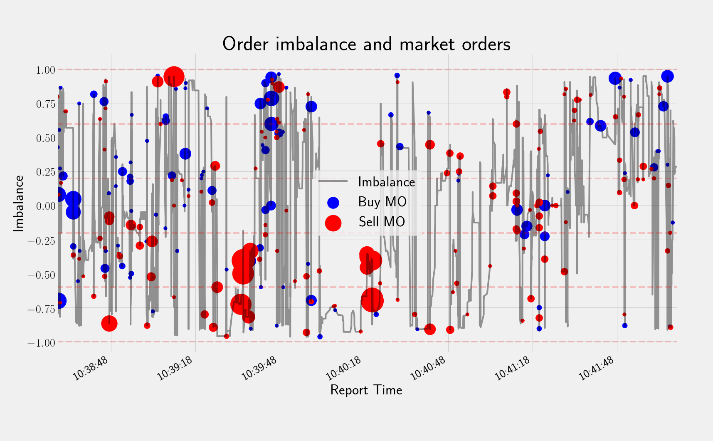

High-frequency trading (HFT) has significantly altered the landscape of financial markets by facilitating the swift execution of trades through the use of complex algorithms. This rapid trading style depends on cutting-edge technology and sophisticated computational models to capitalize on small price movements at extremely high speeds. A foundational concept crucial to understanding and navigating HFT environments is order book imbalance, which assesses the underlying supply and demand dynamics at a detailed, granular level.

Order book imbalance evaluates the disparity between buy (bid) and sell (ask) orders in an electronic order book. This metric, often calculated using high-frequency tick data, provides insights into short-term market fluctuations. It encapsulates the liquidity available at various price levels and can indicate potential price movements. By analyzing volume and price changes at the best bid and ask levels, traders can infer which side of the market—the buyers or sellers—holds more influence at any given moment.



This exploration focuses on algorithmic trading strategies that leverage order book imbalance to inform decision-making processes. Such strategies, grounded in sophisticated data analytics, aim to predict short-term price movements and optimize trading outcomes by interpreting the book's supply-demand imbalances. Understanding these dynamics allows traders to refine their strategies, offering the possibility of greater profitability. However, these strategies are not without their complexities and limitations, which must be addressed to harness their full potential.

In examining the practical application of order book imbalance, this article will assess both the profitability and the inherent constraints of these algorithmic systems, providing insights necessary for successful high-frequency trading. Through careful consideration of these factors, traders and quant analysts can better navigate the intricacies of modern financial markets, leveraging advanced trading concepts for more effective decision-making.

## Table of Contents

## Understanding Order Book Imbalance

Order book imbalance serves as an essential indicator for assessing the discrepancy between buy (bid) and sell (ask) orders within a financial market. It offers valuable insights into short-term market dynamics and liquidity, playing a critical role in high-frequency trading. This metric is typically derived from high-frequency tick data, which captures each market event, allowing for a granular analysis of order flow.

The calculation of order book imbalance involves understanding the volume and price at the best bid and ask levels. The basic formula for calculating order book imbalance can be expressed as:

$$
\text{Imbalance} = \frac{\text{Volume}_{\text{bid}} - \text{Volume}_{\text{ask}}}{\text{Volume}_{\text{bid}} + \text{Volume}_{\text{ask}}}
$$

Where:
- $\text{Volume}_{\text{bid}}$ represents the total volume of buy orders at the best bid level.
- $\text{Volume}_{\text{ask}}$ represents the total volume of sell orders at the best ask level.

The resultant value ranges from -1 to 1, where a positive value indicates a dominance of buy orders (more demand), while a negative value suggests a predominance of sell orders (more supply). A value close to zero would indicate a balanced [order book](/wiki/order-book-trading-strategies) at the prevailing bid and ask levels.

Order book imbalance is utilized to anticipate short-term price movements. For instance, a sustained imbalance where buy orders consistently outweigh sell orders might signal an impending price increase, as the demand pressure could drive prices upward. Conversely, a persistent sell order imbalance might foreshadow a price decline.

High-frequency traders employ order book imbalance metrics to optimize their trading strategies by predicting the direction of price changes more accurately. By continuously monitoring fluctuations in the order book, traders can make informed decisions about when to enter or [exit](/wiki/exit-strategy) trades. This approach requires sophisticated technology and algorithms capable of processing vast amounts of data in real time.

## The Role of Machine Learning in Order Book Dynamics

Advanced [machine learning](/wiki/machine-learning) models such as Convolutional Neural Networks (CNNs), Long Short-Term Memory networks (LSTMs), and Multilayer Perceptrons (MLPs) have become instrumental in analyzing order book dynamics to predict price movements. Machine learning techniques have provided significant advantages over traditional statistical methods by capturing intricate patterns and correlations within the vast and complex datasets generated from order [books](/wiki/algo-trading-books).

Convolutional Neural Networks (CNNs) are particularly effective in identifying spatial hierarchies within the data by applying multiple layers of filters to extract features from the raw input level. In the context of order book data, CNNs can analyze the spatial representation of order flow at various price levels. This capacity is vital in detecting shifts in market sentiment, as small, nuanced changes in the order book can indicate larger trends or imminent price movements.

Long Short-Term Memory networks (LSTMs), a specialization of recurrent neural networks, excel in capturing temporal dependencies, making them well-suited for time-series prediction tasks associated with order book data. The inclusion of memory cells allows LSTMs to retain information for extended periods, hence understanding the sequential nature of order flow changes and improving predictive performance regarding future price movements. 

Multilayer Perceptrons (MLPs), though simpler than CNNs and LSTMs, can still play a crucial role in learning non-linear mappings within the data. By employing multiple layers of neurons, MLPs capture complex, non-linear relationships between input features, such as the different states of buy and sell orders, enabling the prediction of order book imbalances with improved accuracy.

These [deep learning](/wiki/deep-learning) approaches can refine order flow imbalance metrics, enhancing their predictiveness. For instance, by periodizing the [volume](/wiki/volume-trading-strategy) and price changes at the best bid and ask levels, CNNs can be trained to identify significant imbalance patterns indicative of future price shifts. By fine-tuning the model, practitioners can better infer market directionality from these imbalances, thereby achieving more accurate trading signals. This process is supported through backpropagation mechanisms within the model that iteratively minimize prediction errors over extensive datasets, facilitating the enhancement of [algorithmic trading](/wiki/algorithmic-trading) strategies.

By leveraging these sophisticated models, traders and researchers can derive a more granular understanding of order book dynamics, offering promising avenues for generating profitable trading strategies that navigate the complexities and rapid fluctuations of modern financial markets.

## Implementing Order Book Imbalance in Algo Trading Strategies

Algorithmic trading strategies based on order book imbalance aim to exploit the subtle dynamics of supply and demand within the order book to predict short-term price movements. These strategies involve calculating the disparity between the buy (bid) and sell (ask) volumes at various price levels and using this information to make informed trading decisions. 

The core concept relies on setting specific thresholds for imbalance metrics, which, when exceeded, trigger buy or sell signals. This threshold setting is crucial, as the sensitivity of the strategy to market movements depends, in part, on these parameters. For example, a simple imbalance metric can be defined as:

$$
\text{Imbalance} = \frac{V_{\text{bid}} - V_{\text{ask}}}{V_{\text{bid}} + V_{\text{ask}}}
$$

where $V_{\text{bid}}$ and $V_{\text{ask}}$ represent the volumes at the best bid and ask prices, respectively. A positive imbalance suggests a stronger buying interest, possibly indicating a forthcoming price increase, while a negative imbalance points to stronger selling interest.

To implement these strategies effectively, robust and efficient data storage and processing technologies are essential, given the high data throughput common in high-frequency trading ([HFT](/wiki/high-frequency-trading-strategies)) environments. QuestDB, an open-source time-series database, provides capabilities specifically suited for such scenarios, offering high ingestion rates and SQL-like queries to handle vast amounts of tick data efficiently.

Moreover, statistical analysis plays a pivotal role in refining these trading strategies. Languages like Julia offer high-performance computing capabilities needed for [backtesting](/wiki/backtesting) and real-time analyses. Julia's syntax combines the ease of Python with the speed of C, making it ideal for creating complex trading algorithms that necessitate quick computations and real-time data handling.

The pseudo code below illustrates a basic algorithm for implementing an order book imbalance strategy:

```python
# Define the imbalance threshold
IMBALANCE_THRESHOLD = 0.2

def calculate_imbalance(bid_volume, ask_volume):
    return (bid_volume - ask_volume) / (bid_volume + ask_volume)

def execute_trade(imbalance):
    if imbalance > IMBALANCE_THRESHOLD:
        return "Buy Signal"
    elif imbalance < -IMBALANCE_THRESHOLD:
        return "Sell Signal"
    else:
        return "Hold"

# Example usage with sample data
bid_vol = 1000
ask_vol = 800
imbalance = calculate_imbalance(bid_vol, ask_vol)
trade_signal = execute_trade(imbalance)
print(trade_signal)
```

This algorithm serves as a foundational example, where a more sophisticated strategy would include factors such as dynamic threshold setting, real-time market condition analysis, and integration with other predictive indicators.

Implementing order book imbalance in algo trading strategies is not without challenges. Traders must consider latency, market impact, and adaptive measures to respond to volatile market conditions. Despite these challenges, when effectively developed and tested, order book imbalance strategies have the potential to provide significant advantages in competitive trading environments.

## Backtesting and Evaluating Strategy Performance

Backtesting is the process of simulating a trading strategy using historical data to evaluate its effectiveness. This critical step helps in understanding how a particular strategy would have performed in the past, offering insights into its potential future performance. One of the core aspects of backtesting is the calculation of key performance metrics, such as mean absolute error (MAE), R-squared values, and the Sharpe ratio.

The mean absolute error provides a measure of the average magnitude of prediction errors in trading signals. It is a straightforward metric that quantifies how close the predicted values are to the actual observed values, without considering their direction. Mathematically, it can be expressed as:

$$
\text{MAE} = \frac{1}{n}\sum_{i=1}^{n}|y_i - \hat{y_i}|
$$

where $y_i$ represents the actual value, $\hat{y_i}$ is the predicted value, and $n$ denotes the total number of observations.

R-squared is another critical metric, offering insights into the proportion of variance in the dependent variable that is predictable from the independent variable(s). It is a measure of model fit, expressed as:

$$
R^2 = 1 - \frac{\sum_{i=1}^{n}(y_i - \hat{y_i})^2}{\sum_{i=1}^{n}(y_i - \bar{y})^2}
$$

where $\bar{y}$ is the mean of the observed data.

The Sharpe ratio is essential for assessing risk-adjusted returns, enabling traders to understand the excess return per unit of risk. It is calculated as:

$$
\text{Sharpe Ratio} = \frac{E[R_p - R_f]}{\sigma_p}
$$

where $R_p$ denotes the portfolio return, $R_f$ the risk-free rate, and $\sigma_p$ the standard deviation of the portfolio's excess return.

Avoiding overfitting is a significant challenge during backtesting. Overfitting occurs when a model is too complex and captures noise along with the underlying market signal, leading to poor performance on new, unseen data. One approach to mitigate overfitting is to use cross-validation techniques, where the data is segmented into training and test sets to validate the model's predictive power.

Furthermore, it is crucial to ensure the trading model does not rely on future data. This is known as the look-ahead bias, and it can be avoided by structuring data pipelines to strictly use information available at each decision point in time. Testing the strategy under different market conditions and varying datasets can help validate the robustness and adaptability of the model.

Overall, effective backtesting and careful evaluation of strategy performance are foundational to the development of reliable algorithmic trading systems. These processes enable traders and analysts to make informed decisions and refine strategies before deploying them in live trading environments.

## Challenges and Limitations

High-frequency trading (HFT) strategies face several challenges and limitations that can significantly influence their profitability. One of the most significant concerns is trading costs and slippage. In fast-paced markets, the difference between the expected price of a trade and the actual execution price, referred to as slippage, can quickly erode potential profits. The highly competitive nature of HFT also means that even small inefficiencies can result in substantial losses over time.

An essential metric for evaluating the potential success of these strategies is the Sharpe ratio. This ratio provides a measure of risk-adjusted return by comparing excess returns relative to the risk-free rate with the [volatility](/wiki/volatility-trading-strategies) of the strategy's returns. Mathematically, it is expressed as:

$$

\text{Sharpe Ratio} = \frac{E[R_i - R_f]}{\sigma_i} 
$$

where $E[R_i - R_f]$ is the expected excess return of the strategy compared to a risk-free investment, and $\sigma_i$ is the standard deviation of the strategy's returns. A meaningful Sharpe ratio indicates that the returns from a strategy sufficiently compensate for the risks undertaken. However, a high Sharpe ratio does not automatically validate an HFT strategy, specifically if it is primarily driven by data anomalies or if it fails to account for transaction costs adequately.

Moreover, the risk of employing limited datasets requires careful handling. High-frequency trading relies heavily on extensive and high-quality datasets to train models and develop strategies. Using inadequate datasets may lead to misleading conclusions about a strategy's effectiveness. It is critical to ensure that the datasets adequately represent the market conditions to which the strategy will be exposed. Furthermore, there exists a potential issue of information leakage, where data that should not be part of the model's training set inadvertently influences it. This can happen when future information, unintentionally incorporated into the training data, makes the model perform exceptionally well on past data but poorly on unseen data, leading to overfitting.

Avoiding overfitting in model development is another formidable challenge. Overfitting occurs when a model is too complex and learns not only the underlying patterns but also the noise in the training dataset. This complexity implies that while a model may achieve impressive results on historical data, its predictive power diminishes when applied to new, unseen data.

In summary, high-frequency traders must navigate these hurdles with precision and robustness. By accounting for trading costs, effectively analyzing risk-adjusted returns, utilizing comprehensive datasets, and preventing overfitting, traders can improve the efficacy of their algorithmic strategies and adapt to the ever-evolving market landscape.

## Potential Applications and Real-world Utilization

Order book imbalance metrics have significant applications in enhancing algorithmic trading strategies, particularly in market-making and execution algorithms. These metrics provide valuable directional insights that can aid in predicting short-term price movements, making them highly effective in a high-frequency trading environment.

Market-making algorithms aim to provide [liquidity](/wiki/liquidity-risk-premium) by quoting both buy and sell prices to capture the spread. Order book imbalance metrics can enhance these algorithms by offering a clearer picture of supply and demand dynamics. When there is a significant imbalance, such as more buy orders than sell orders, it may indicate upward price pressure, prompting market makers to adjust their spread to optimize for better returns or mitigate risks. By continuously monitoring these imbalances, market makers can dynamically adjust their strategies to remain competitive and profitable.

Execution algorithms, which are designed to minimize market impact and execute large orders efficiently, benefit from order book imbalance by timing trades more strategically. An imbalance indicating a dominant sell pressure can suggest waiting for a more opportune moment to execute buy orders, while a buy-dominated order book might expedite sell orders. This alignment with market conditions helps improve execution quality and reduce costs associated with slippage.

Moreover, when order book imbalance strategies are properly integrated and tested alongside other market indicators, they offer traders a considerable edge. For example, combining order book imbalance metrics with [momentum](/wiki/momentum) indicators or moving averages can lead to more robust trading signals. This approach requires rigorous backtesting and real-time testing to fine-tune the integration and validate its effectiveness.

In sum, the practical applications of order book imbalance metrics allow traders and algorithms to navigate the complexities of modern markets more effectively, thereby maintaining a competitive advantage through enhanced strategy performance and execution precision.

## Conclusion

Order book imbalance strategies are increasingly recognized as valuable instruments in high-frequency trading environments. By offering insights into the disparity between buying and selling pressure, these strategies enable traders to glean information that can lead to profitable trading decisions. However, the promise of these strategies comes with the critical caveat that rigorous testing and validation are necessary to ensure their practical efficacy. 

Backtesting on historical data is a fundamental step in evaluating the performance of these strategies. It helps in understanding their effectiveness and adjusting parameters to optimize performance. However, backtests must be carefully interpreted as they can be susceptible to errors such as overfitting, where a model performs well in sample data but poorly in real-world scenarios. 

Moreover, continuous refinement is essential due to the dynamic nature of financial markets. Market conditions can change rapidly, influenced by factors ranging from economic data releases to geopolitical events. Staying updated with current market conditions and adapting strategies accordingly is crucial for sustained success. This could involve tuning algorithm parameters, incorporating new data sources, or integrating evolving technologies such as advances in machine learning models.

Despite the inherent challenges, order book imbalance strategies offer traders a competitive edge when properly tested and executed. They provide the potential to preempt price movements and optimize trade timings, thus improving the likelihood of achieving desirable returns. As trading systems evolve, the ongoing development and adaptation of order book imbalance strategies remain a key focus area for traders seeking to maximize their advantages in high-frequency trading scenarios.

## References & Further Reading

[1]: Lopez de Prado, M. (2018). ["Advances in Financial Machine Learning."](https://www.amazon.com/Advances-Financial-Machine-Learning-Marcos/dp/1119482089) John Wiley & Sons.

[2]: Cartea, Á., Jaimungal, S., & Penalva, J. (2015). ["Algorithmic and High-Frequency Trading."](https://assets.cambridge.org/97811070/91146/frontmatter/9781107091146_frontmatter.pdf) Cambridge University Press.

[3]: Bouchaud, J.-P., Farmer, J. D., & Lillo, F. (2008). ["How Markets Slowly Digest Changes in Supply and Demand."](https://arxiv.org/abs/0809.0822) In Handbook of Financial Markets: Dynamics and Evolution.

[4]: Zhang, Y., & Zohren, S. (2019). ["DeepLOB: Deep Convolutional Neural Networks for Limit Order Books."](https://arxiv.org/abs/1808.03668) Advances in Neural Information Processing Systems 32.

[5]: Chan, E. (2008). ["Quantitative Trading: How to Build Your Own Algorithmic Trading Business."](https://github.com/ftvision/quant_trading_echan_book) John Wiley & Sons.