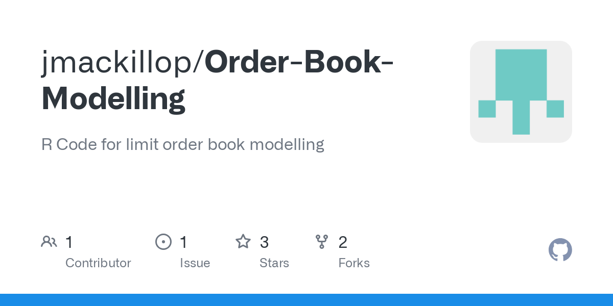

## Table of Contents

## What is an order book in financial markets?

An order book is like a list that keeps track of all the buy and sell orders for a specific financial product, like a stock or a cryptocurrency, in a market. It shows how many people want to buy or sell at different prices. When someone wants to buy, their order goes into the "bid" side of the book, and when someone wants to sell, their order goes into the "ask" side. The highest price someone is willing to pay to buy is called the "best bid," and the lowest price someone is willing to sell at is called the "best ask."

The order book helps to determine the current market price of a financial product. When a new buy order comes in at a higher price than the current best ask, a trade happens right away because the buyer and seller agree on the price. This keeps the market moving and helps set the price that everyone sees. If there are more buy orders than sell orders, the price might go up because more people want to buy. If there are more sell orders, the price might go down because more people want to sell.

## How does an order book function in trading?

An order book is like a big list that keeps track of all the orders to buy and sell a certain thing, like a stock or a cryptocurrency. It has two sides: the bid side for people who want to buy, and the ask side for people who want to sell. Each side shows different prices and how many people want to buy or sell at those prices. The highest price someone is willing to pay to buy is called the best bid, and the lowest price someone is willing to sell at is called the best ask. When someone places an order, it goes into the order book at the price they want.

When a new buy order comes in at a price that's higher than the current best ask, a trade happens right away. This is because the buyer and seller agree on the price, so they can complete the trade. The [order book](/wiki/order-book-trading-strategies) updates to show this trade, and the prices might change. If there are more people wanting to buy than sell, the price might go up because there's more demand. If more people want to sell than buy, the price might go down because there's more supply. This way, the order book helps set the current market price by showing what people are willing to pay or accept.

## What are the key components of an order book?

An order book has two main parts: the bid side and the ask side. The bid side shows all the orders from people who want to buy something, like a stock or a [cryptocurrency](/wiki/cryptocurrency). Each order on the bid side has a price and a quantity, showing how much someone is willing to pay and how many they want to buy. The highest price on the bid side is called the best bid. The ask side shows all the orders from people who want to sell. Each order on the ask side also has a price and a quantity, showing how much someone is willing to sell for and how many they want to sell. The lowest price on the ask side is called the best ask.

When someone places a new order, it goes into the order book at the price they want. If a new buy order comes in at a price that's higher than the current best ask, a trade happens right away because the buyer and seller agree on the price. This trade updates the order book, and the prices might change. The order book helps set the current market price by showing what people are willing to pay or accept. If there are more buy orders than sell orders, the price might go up because more people want to buy. If there are more sell orders, the price might go down because more people want to sell.

## What is the difference between a limit order and a market order in an order book?

A limit order is when you tell the market you want to buy or sell something at a specific price or better. If you want to buy a stock and you put in a limit order at $50, your order will only go through if you can buy it for $50 or less. If you want to sell and you put in a limit order at $50, your order will only go through if you can sell it for $50 or more. Your order will sit in the order book until someone is willing to buy or sell at your price. This gives you more control over the price you pay or receive, but there's a chance your order might not get filled if the market price never reaches your limit.

A market order is when you tell the market you want to buy or sell something right away at the best available price. If you put in a market order to buy a stock, your order will be filled at the current best ask price in the order book. If you put in a market order to sell, your order will be filled at the current best bid price. Market orders are faster because they get filled right away, but you might end up paying more or receiving less than you expected if the market price changes quickly. This type of order is good if you want to make sure your trade happens, but you have less control over the final price.

## How can order book data be used to analyze market depth?

Order book data helps us understand market depth by showing how many people want to buy and sell at different prices. When we look at the order book, we can see all the buy orders on one side and all the sell orders on the other side. If there are a lot of buy orders at prices close to the current price, it means there's a lot of demand, and the market is deep on the buy side. If there are a lot of sell orders at prices close to the current price, it means there's a lot of supply, and the market is deep on the sell side. By looking at how many orders there are at different prices, we can tell if the market can handle big trades without the price moving too much.

This information is really useful for traders. If the order book shows a deep market, a big trade won't change the price much because there are enough orders to match it. But if the order book is thin, with not many orders at different prices, a big trade can move the price a lot because there aren't enough orders to match it. Traders use this data to decide when to buy or sell, and how big their orders should be, so they can make better trading decisions and manage their risks.

## What are the common strategies for order book modeling?

One common strategy for order book modeling is called the "queue-reactive" model. In this approach, we look at how orders come in and how they affect the order book. We pay attention to the size of the orders, the prices they're placed at, and how they get filled or canceled. By studying these patterns, we can predict how the order book might change over time. This helps us understand what might happen to the price of a stock or a cryptocurrency. Traders use this information to make better decisions about when to buy or sell.

Another strategy is the "agent-based" model. This method imagines the market as a bunch of different people or "[agents](/wiki/agents)" making decisions. Each agent has its own rules for buying and selling, and we watch how all these agents interact with each other. By running simulations with these agents, we can see how the order book might look in different situations. This helps us understand how the market might react to big news or changes in the economy. It's like playing out different scenarios to see what could happen to the price of a stock or a cryptocurrency.

## How do order book imbalances affect price movements?

Order book imbalances happen when there are more buy orders than sell orders, or more sell orders than buy orders. When there are more buy orders, it means more people want to buy than sell. This can push the price up because there's more demand for the stock or cryptocurrency. On the other hand, if there are more sell orders, it means more people want to sell than buy. This can push the price down because there's more supply than demand.

Traders watch these imbalances closely because they can give clues about where the price might go next. If the order book shows a lot more buy orders than sell orders, traders might think the price will go up soon. They might decide to buy now to take advantage of the expected price increase. If the order book shows a lot more sell orders than buy orders, traders might think the price will go down. They might decide to sell now to avoid losing money if the price drops. By understanding these imbalances, traders can make better decisions about when to buy or sell.

## What are the challenges in modeling high-frequency order book data?

Modeling high-frequency order book data is really hard because the market changes so fast. When we look at high-frequency data, we see lots of orders coming in and out in just a few seconds. This makes it tough to keep up with all the changes and predict what will happen next. The order book can change a lot in a very short time, and even small changes can affect the price. So, we need to use special tools and math to handle all this fast-moving data and make good guesses about where the price might go.

Another challenge is that high-frequency trading can be affected by things that happen outside the market, like news or big events. These things can make the order book change suddenly and in ways that are hard to predict. Also, high-frequency traders use very fast computers and special strategies to trade quickly, which can make the order book even more complicated. To model this data well, we need to think about all these different factors and use really smart math and computer programs to keep up with everything that's happening.

## How can machine learning be applied to improve order book models?

Machine learning can help make order book models better by learning from past data. It looks at all the orders that came in and out of the order book and finds patterns in how they affect the price. By using these patterns, [machine learning](/wiki/machine-learning) can predict what might happen next. For example, if it sees that a lot of buy orders usually make the price go up, it can use that information to guess what will happen when it sees a lot of buy orders again. This can help traders make better decisions about when to buy or sell.

Another way machine learning can help is by handling the fast-changing data in high-frequency trading. It can quickly look at lots of orders coming in and out and figure out what they mean. This is really useful because the order book can change a lot in just a few seconds. Machine learning can also learn from things that happen outside the market, like news or big events, and use that information to make better predictions. By using machine learning, traders can get a better understanding of the market and make smarter trades.

## What are the limitations of current order book modeling techniques?

One big problem with the way we model order [books](/wiki/algo-trading-books) now is that the market changes really fast. High-frequency trading makes the order book change a lot in just a few seconds, and it's hard to keep up with all those changes. Even small changes can affect the price a lot, so our models need to be really quick and smart to handle all this fast-moving data. But it's tough to make models that can do that, and sometimes they can't predict what will happen next because the market moves too fast.

Another issue is that things outside the market, like news or big events, can suddenly change the order book in ways that are hard to predict. Our models usually look at past data to make guesses about the future, but they can't always see these big surprises coming. Also, high-frequency traders use very fast computers and special strategies to trade quickly, which can make the order book even more complicated. So, even though our models are good at finding patterns in the data, they can still miss important things that affect the market.

## How do different market structures impact order book dynamics?

Different market structures can change how the order book works. In a centralized market, like a stock exchange, all the orders go into one big order book. This makes it easier to see what's happening and match buyers with sellers. But in a decentralized market, like some cryptocurrency markets, orders can be spread out across different places. This can make it harder to see the whole picture and can lead to more price differences between different places.

Another way market structures can affect the order book is through the rules about how orders are handled. Some markets use a "first-come, first-served" rule, where the oldest orders get filled first. This can make the order book more stable because people know their orders will be treated fairly. But other markets might use different rules, like giving priority to bigger orders or orders from certain traders. This can make the order book more unpredictable because people might try to game the system to get their orders filled faster.

## What advanced statistical methods are used in expert-level order book modeling?

One advanced method used in order book modeling is called "point process models." These models look at the timing of when orders come into the order book and when they get filled or canceled. By studying these patterns, we can predict how the order book might change in the future. This helps us understand what might happen to the price of a stock or a cryptocurrency. Traders use this information to make better decisions about when to buy or sell. Point process models are good at handling the fast-moving data in high-frequency trading because they can quickly look at lots of orders coming in and out and figure out what they mean.

Another method is called "machine learning." Machine learning can learn from past data to find patterns in how orders affect the price. By using these patterns, it can predict what might happen next. For example, if it sees that a lot of buy orders usually make the price go up, it can use that information to guess what will happen when it sees a lot of buy orders again. Machine learning is also good at handling the fast-changing data in high-frequency trading. It can quickly look at lots of orders coming in and out and figure out what they mean. This helps traders get a better understanding of the market and make smarter trades.

## References & Further Reading

[1]: Gould, M.D., Porter, M.A., Williams, S., McDonald, M., Fenn, D.J., & Howison, S.D. (2013). ["Limit Order Books."](https://arxiv.org/abs/1012.0349) Quantitative Finance, 13(11), 1709-1742.

[2]: Lopez de Prado, M. (2018). ["Advances in Financial Machine Learning."](https://www.amazon.com/Advances-Financial-Machine-Learning-Marcos/dp/1119482089) Wiley.

[3]: Cartea, Á., Jaimungal, S., & Penalva, J. (2015). ["Algorithmic and High-Frequency Trading."](https://assets.cambridge.org/97811070/91146/frontmatter/9781107091146_frontmatter.pdf) Cambridge University Press.

[4]: Bouchaud, J.P., Gefen, Y., Potters, M., & Wyart, M. (2004). ["Fluctuations and response in financial markets: The subtle nature of ‘random’ price changes."](https://arxiv.org/abs/cond-mat/0307332) The European Physical Journal B, 41(4), 587-600.

[5]: Lehalle, C.A., Laruelle, S., Burgot, R., Pelin, A., & Lasnier, M. (2013). ["Market Microstructure in Practice."](https://www.semanticscholar.org/paper/Market-Microstructure-in-Practice-Lehalle-Laruelle/2df52569ee044db799cc9ae865de4689847d6f83) Wiley.

[6]: Boukȧlȧs, I., & Iori, G. (2018). ["Econometric modeling of limit order books: A review."](https://dl.acm.org/doi/10.1145/3677052.3698679) Handbook of Financial Markets.