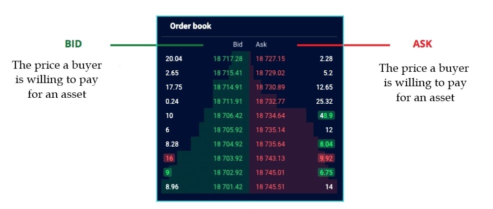

An order book is a fundamental component in the world of trading, serving as a real-time, continuously updated ledger of buy and sell orders for an asset. These orders, placed by market participants, create a detailed map of trading activity, showcasing both the depth and range of market interest at various price levels. The order book is not just a tool for recording transactions; it acts as the heartbeat of market dynamics, revealing the interplay between supply and demand in vivid detail.

Understanding and analyzing order book data is crucial for traders aiming to gain a comprehensive view of the market. This data provides insights that are pivotal in making informed trading decisions, particularly for short-term and intraday traders. By effectively interpreting order book data, traders can gauge market sentiment, identify potential price movements, and develop strategies that align with the ebbs and flows of market liquidity and volatility.

In essence, the order book is more than a simple list of orders; it is a window into the market's soul, offering clarity amidst the often chaotic world of trading. For traders looking to elevate their market strategies, mastering the art of order book analysis is not just beneficial – it's essential. This article aims to unveil advanced strategies and insights for leveraging order book data, helping traders navigate the market with greater confidence and precision.

## Table of Contents

## Understanding the Order Book

The mechanics of order books are integral to understanding market operations across various trading platforms. At its core, an order book is a list of buy and sell orders organized by price level. It acts as a ledger, showing real-time demand and supply for a particular asset. Each order listed in the book has a specific price and quantity, representing a trader's willingness to buy or sell at that price.

In markets like stock exchanges, forex, and even cryptocurrency exchanges, order books play a crucial role. They provide a transparent view of the market's trading activity, allowing traders to see the quantity of orders at different price points. This transparency is vital for fair and efficient market functioning.

When a buy order matches a sell order in terms of price, a trade occurs, and these orders are removed from the book. This process is facilitated by a **matching engine**, a sophisticated system that pairs buy and sell orders based on their price and time priority. The price at which these orders match becomes the latest market price for the asset.

One of the key elements of an [order book](/wiki/order-book-trading-strategies) is the bid-ask spread, which is the difference between the highest price buyers are willing to pay (bid) and the lowest price sellers are willing to accept (ask). A narrower spread often indicates a more liquid market, whereas a wider spread can signal lower [liquidity](/wiki/liquidity-risk-premium).

Market depth, another crucial aspect, refers to the [volume](/wiki/volume-trading-strategy) of orders at different price levels. A deeper market with more orders at each price level can absorb larger trades without a significant impact on the market price. This depth is visually represented in the order book, allowing traders to gauge potential price movements and liquidity.

Here are the key elements:

- **Bid and Ask Prices**: The order book is divided into two main sections: bids (buy orders) and asks (sell orders). The bid price is the highest price a buyer is willing to pay for an asset, while the ask price is the lowest price a seller is willing to accept. The visibility of multiple bid and ask prices gives traders insights into the market's supply and demand dynamics.

- **Market Spread**: This is the difference between the highest bid price and the lowest ask price. The spread is a crucial factor for traders, as it represents the immediate cost of executing a market order. A tighter spread generally indicates a more liquid market, while a wider spread can point to lower liquidity or higher volatility.

- **Market Depth**: Depth refers to the quantity of orders at each price level and is indicative of the market's ability to sustain large orders without significant price fluctuations. A deeper market, with more orders at each price level, can absorb larger trades more easily, reducing the impact on the asset's price.

- **Order Size and Quantity**: Each order in the book has a specified size or quantity, indicating how many units of the asset are being bought or sold. This information helps traders gauge the strength and commitment behind certain price levels.
- **Market Breadth**: This is a broader view of the order book, showing how many orders exist at varying price levels beyond the closest bid and ask prices. Market breadth can be used to anticipate potential price movements if the market moves beyond the immediate top levels of the order book.
- **Time Priority**: Orders in an order book are typically arranged not only by price but also by the time they were entered. Orders at the same price level are executed in the order they were received, making time a critical factor in order book dynamics.
- **Price Levels**: These are the different prices at which buy and sell orders are placed. Monitoring these levels helps in identifying potential support and resistance areas based on the concentration of orders.
- **Historical Data**: Some order books provide historical data about completed transactions, offering insights into past market behavior, which can be valuable for predicting future movements.

## Role of Order Books in Trading

Order [books](/wiki/algo-trading-books) play a pivotal role in shaping the dynamics of financial markets. They are central to understanding price movements, liquidity, and market sentiment. Here's how:

- **Price Movements**: The constant flux of buy and sell orders in an order book directly influences price changes. When buy orders outnumber sell orders, there's upward pressure on prices, and vice versa. This continuous battle between buying and selling forces is what causes price fluctuations.
- **Liquidity Indication**: Liquidity, or the ease with which assets can be bought or sold without causing a significant price change, is evident in the order book. A dense order book, packed with orders at various price levels, indicates high liquidity, suggesting that large orders can be executed with minimal impact on market price. Conversely, a thin order book, with fewer orders, signals lower liquidity and potentially higher volatility.
- **Market Sentiment**: By analyzing the depth and breadth of an order book, traders can gauge the prevailing market sentiment. For instance, a dominance of buy orders might indicate bullish sentiment, while an abundance of sell orders might reflect bearish sentiment. This understanding aids traders in predicting potential market movements.

The order book serves as an essential decision-making tool for traders. It provides a real-time, transparent view of the market's interest at various price levels, which is crucial for:

- **Trade Execution**: Traders can use order book data to decide the most advantageous points for entering or exiting positions. By examining the depth of the market, they can determine the potential impact of their trades and choose appropriate order types and sizes to minimize slippage.
- **Strategy Formulation**: The order book is instrumental in formulating various trading strategies. For example, a trader might identify key support and resistance levels by observing the accumulation of orders at certain price points. This information can be used to set stop-loss orders or take-profit targets.
- **Anticipating Breakouts or Reversals**: Traders can predict breakouts or reversals by monitoring changes in the order book. A sudden increase in buy orders at higher price levels, for example, might indicate an impending breakout, prompting traders to position themselves accordingly.
- **Risk Management**: Order books help in managing risk by providing insights into possible price ranges and market depth. Traders can assess the likelihood of order execution at desired prices and plan their trades to mitigate risks associated with price gaps and market illiquidity.

In summary, the order book is a dynamic and multifaceted tool that reflects the real-time pulse of the market. It empowers traders with the necessary information to make educated decisions, strategize effectively, and manage risk more efficiently. Understanding and utilizing the data from an order book can significantly enhance a trader's ability to navigate the complexities of financial markets.

## Analyzing Order Book Data

### Market Orders vs. Limit Orders

In order book trading, understanding the distinction between market orders and limit orders is fundamental. Each type of order interacts with the order book differently, reflecting distinct trading intentions and strategies. Here’s a breakdown of their differences and how they are represented in the order book:

|  | **Market Orders** | **Limit Orders** |
| --- | --- | --- |
| **Definition** | A market order is an instruction to buy or sell a security immediately at the best available current price. It prioritizes execution speed over price control. | A limit order is an order to buy or sell a security at a specific price or better. Unlike market orders, they provide price control but do not guarantee execution. |
| **Order Book Reflection** | Market orders directly impact the order book by consuming the liquidity available at the top of the book. For instance, a market buy order will match the lowest available sell order (ask), potentially moving the price upwards if it is large enough to consume multiple sell orders. Similarly, a market sell order fulfills the highest available buy order (bid), affecting the price in the downward direction. | Limit orders contribute to the depth of the order book. A buy limit order placed below the current market price adds to the bid side of the book, while a sell limit order above the current market price adds to the ask side. These orders create the layers of prices at which traders are willing to transact, shaping the market depth and breadth. |
| **Usage and Strategy** | Traders use market orders when the certainty of execution is more critical than the execution price. It's often used in fast-moving markets where obtaining a position takes precedence over price considerations. | Limit orders are favored by traders who prioritize price control and are willing to wait for the market to reach their specified price. They are commonly used in less volatile markets or when a trader has a specific entry/exit price in mind. |

Market and limit orders play complementary roles in an order book. Market orders provide immediate liquidity by filling available limit orders, while limit orders create a structured market depth, offering multiple price levels for execution.

The balance between market and limit orders can influence price movement. An excess of market buy orders can exhaust available sell limit orders, driving prices up, whereas an abundance of market sell orders can push prices down by filling up buy limit orders.

The ratio of limit to market orders at different price levels can indicate market sentiment. A dense cluster of limit sell orders at higher prices might signal resistance, whereas a concentration of limit buy orders at lower prices could indicate support levels.

### Reading and Interpreting Data

Effectively reading and interpreting order book data is a critical skill for any trader looking to leverage the insights it offers. The order book is a real-time ledger displaying buy and sell orders for a security, and understanding it can provide a significant advantage. Here are key aspects to focus on when analyzing order book data:

**Understanding Bid and Ask**:

- **Bid**: Represents the highest price buyers are willing to pay for a security. It's a critical indicator of immediate demand.
- **Ask**: Shows the lowest price sellers are willing to accept. It reflects the immediate supply.
- **Analysis Tip**: Watch how these numbers change in real-time, as shifts can indicate upcoming price movements.

**Market Depth Analysis**:

- **Depth**: Refers to the volume of orders lined up at different price levels beyond the current bid and ask.
- **Analysis Tip**: A deep order book, with significant orders at various price levels, suggests a liquid market. Large orders at certain levels can act as support (in case of buy orders) or resistance (in case of sell orders).

**Spread Interpretation**:

- **Spread**: The difference between the highest bid and the lowest ask.
- **Analysis Tip**: Narrow spreads often indicate a healthy, liquid market, whereas wider spreads can suggest volatility or lower liquidity.

**Order Flow Momentum**:

- **Momentum**: The rate at which orders are filled.
- **Analysis Tip**: Rapid execution of orders may signal strong buying or selling pressure, influencing the short-term price direction.

**Identifying Imbalances**:

- **Imbalances**: Disproportion between buy and sell orders.
- **Analysis Tip**: A significant imbalance can foreshadow a move in the price. For example, a surplus of buy orders might indicate an upcoming price increase.

**Time and Sales Data Integration**:

- **Time and Sales**: A real-time feed showing executed trades.
- **Analysis Tip**: Combining this with order book data can validate the strength of buying or selling pressure and the likely sustainability of a price trend.

**Identifying Fake Orders**:

- **Fake Orders**: Sometimes, large orders are placed to create false market signals.
- **Analysis Tip**: Be wary of large orders that don't get filled and are frequently withdrawn or modified – these may be 'spoofing' attempts to manipulate the market.

**Watching for Order Book Patterns**:

- **Patterns**: Certain configurations of orders can suggest trading patterns.
- **Analysis Tip**: Patterns like a 'wall' of buy orders could suggest a strong support level, while a 'wall' of sell orders might indicate a strong resistance level.

**Leveraging Historical Data**:

- **Historical Context**: Past order book data can offer context.
- **Analysis Tip**: Compare current order book dynamics with historical patterns to understand how similar scenarios played out previously.

In essence, mastering the order book involves a blend of quantitative analysis and intuitive understanding of market psychology. By meticulously analyzing the bid-ask spread, market depth, and order flow, traders can gain valuable insights into potential market movements and make more informed trading decisions. Remember, the order book is a dynamic entity; thus, maintaining agility in analysis and decision-making is crucial for capitalizing on the opportunities it reveals.

## Order Book Trading Strategies

Identifying and capitalizing on security trading patterns using order book data is a powerful strategy for traders. The order book, which lists all buy and sell orders for a security, is a treasure trove of information that can reveal patterns indicating future price movements. Here's how traders can spot and utilize these patterns:

**Accumulation and Distribution Phases**

This pattern appears when there are consistent buy orders at lower price levels over time, suggesting a building upward [momentum](/wiki/momentum). The opposite of accumulation, it's seen when sell orders accumulate at higher price levels, indicating potential downward pressure.

**Support and Resistance Levels**

Order books can reveal where large numbers of buy (support) or sell (resistance) orders are placed. Identifying these levels helps in predicting where the price might struggle to fall below (support) or rise above (resistance).

**Breakout Patterns**

Breakouts occur when the price moves outside a defined range, often accompanied by high volume. An order book can show a buildup of orders beyond support or resistance levels, hinting at a potential [breakout](/wiki/breakout-trading).

**Wall Detection**

A 'wall' in an order book is a large number of buy or sell orders at a specific price point. Walls can indicate strong buying or selling interest, and the price often reacts significantly when it reaches these levels.

**Spoofing and Fake Walls**

Some large traders might place and then cancel large orders to manipulate market perceptions (spoofing). Discerning between genuine and fake walls is critical, as falling for spoofing can lead to poor trading decisions.

**Order Book Imbalance**

An imbalance between buy and sell orders can indicate which direction the price might move. A heavier buy side suggests upward price pressure, while a heavier sell side indicates downward pressure.

**Flash Orders and Rapid Changes**

Sudden appearances or disappearances of large orders can signal an upcoming price movement. These rapid changes often precede volatile market actions.

**Scalping Small Changes**

Scalpers use the order book to make quick profits from small price movements. They look for patterns where they can enter and [exit](/wiki/exit-strategy) trades rapidly, capitalizing on tiny but frequent price changes.

**Combining with Technical Analysis**

Patterns in the order book are more powerful when combined with technical indicators. For example, a resistance level in the order book aligned with a technical resistance level on a chart significantly increases the likelihood of the price reacting at that point.

**Algorithmic Pattern Recognition**

Advanced traders use algorithms to automatically detect patterns in order books. These algorithms can process vast amounts of data quickly, spotting opportunities that humans might miss.

Understanding and using these security trading patterns require continuous monitoring of the order book, a keen eye for detail, and an understanding of market psychology. Successful application of these strategies can significantly improve trading decisions, enhance profitability, and minimize risk. However, traders should always be aware of the ever-changing nature of markets and adapt their strategies accordingly.

## Advantages of Using Order Book Data

The use of order book data in trading offers numerous advantages, providing traders with a crucial edge in various market conditions and enhancing their risk management strategies. Here's a breakdown of these key benefits:

**In-Depth Market Insight**

Order book data provides a transparent and real-time view of market activity, including the depth of buy and sell orders. This insight is invaluable for understanding market dynamics. Traders can gauge the strength or weakness of market trends, assess liquidity levels, and identify potential resistance and support levels.

**Improved Decision-Making**

Access to detailed order book data enables traders to make more informed decisions. By analyzing the accumulation of buy and sell orders, traders can anticipate potential price movements. This data allows traders to strategically place their orders, optimizing their entry and exit points in the market.

**Enhanced Risk Management**

Order book data aids in better risk assessment by revealing the concentration of orders at different price levels. Traders can use this information to set more effective stop-loss orders and manage their exposure to market [volatility](/wiki/volatility-trading-strategies).

**Identifying Market Sentiment**

The order book reflects the real-time sentiment of market participants. A dense accumulation of orders at certain price levels can indicate bullish or bearish tendencies. Understanding this sentiment helps traders align their strategies with the prevailing market mood.

**Opportunity for Arbitrage**

Traders can exploit discrepancies in order book data across different exchanges for [arbitrage](/wiki/arbitrage) opportunities. This involves buying a security at a lower price on one exchange and selling it at a higher price on another. The real-time nature of order book data is crucial for such strategies as arbitrage opportunities can be fleeting.

**Strategic Order Placement**

By analyzing order book data, traders can strategically place their orders to improve the likelihood of execution. This is especially beneficial in markets with lower liquidity. Traders can also detect and avoid areas with large orders that could lead to slippage.

**Predictive Analysis**

Sophisticated traders use historical order book data for predictive analysis, anticipating how certain patterns in the order book might influence future price movements. This approach is particularly popular among algorithmic traders who employ statistical models to predict market behavior.

**Competitive Edge in Fast-Paced Environments**

In high-frequency trading environments, having access to real-time order book data provides a significant competitive advantage. Quick analysis of this data enables rapid execution of trades.

**Customizable Strategies**

Order book data can be tailored to suit different trading styles and strategies. Whether a trader prefers [scalping](/wiki/gamma-scalping), [day trading](/wiki/day-trading-spy), or swing trading, order book data provides relevant insights for all.

In summary, order book data is a powerful tool that offers traders an edge in the competitive world of trading. It enables deeper market understanding, enhances decision-making, and significantly contributes to effective risk management. As trading evolves with technological advancements, the role of order book data will likely become even more integral to successful trading strategies.

## System Engine Basics

The system engine is a fundamental component in order book trading, serving as the backbone for processing and analyzing order book data. This section will cover the basic principles and functionalities of such engines, providing traders with an understanding of how these systems operate and their significance in trading strategies.

**Data Processing and Management**

The system engine is responsible for efficiently processing vast amounts of order book data. It constantly updates buy and sell orders, reflecting real-time changes in market depth, price levels, and order volumes.

It also manages historical data, crucial for [backtesting](/wiki/backtesting) trading strategies and analyzing market trends.

**Real-Time Analysis**

Speed is crucial in order book trading. The system engine provides real-time analysis of market data, enabling traders to make swift decisions based on the current state of the order book.

This includes instantaneous calculations of market depth, spread, and other key indicators that impact trading decisions.

**Integration with Trading Algorithms**

The engine seamlessly integrates with trading algorithms, allowing for the automation of trades based on predefined criteria derived from order book data.

This integration is crucial for [algorithmic trading](/wiki/algorithmic-trading) strategies, where the timing and precision of trades are determined by fluctuations in the order book.

**User Interface and Visualization**

A user-friendly interface is essential for traders to effectively interact with the system. This includes clear visualization of order book data, such as depth charts and price action.

The interface often provides customization options, enabling traders to tailor the data presentation to their specific trading style and needs.

**Scalability and Performance**

System engines are designed to be scalable to handle increasing data volumes and complex analytical tasks without compromising performance.

This is vital in fast-paced trading environments where delay or downtime can result in missed opportunities or substantial risks.

**Security and Reliability**

Given the sensitive nature of trading data, the system engine incorporates robust security measures to protect against unauthorized access and data breaches.

Reliability is also a critical [factor](/wiki/factor-investing), as the engine must operate continuously without errors or interruptions, especially during high market volatility.

**Customization and Flexibility**

Many system engines offer customization options, allowing traders to tailor the processing and analysis of order book data according to their specific trading approach.

Flexibility in integrating with various trading platforms and tools is also a key feature, enabling a seamless trading experience.

Understanding the basics of the system engine used for processing order book data equips traders with the knowledge to utilize these tools effectively in their trading strategies. The engine's ability to handle real-time data analysis, integrate with trading algorithms, and provide a secure and reliable trading environment is crucial for success in order book trading.

## Conclusion

This guide delved into order book trading, explaining its mechanics, importance, and strategies. It started with defining an order book and its role in trading, emphasizing the need for traders to understand and utilize this data.

We covered key components of order books, such as market spread, depth, and breadth, and their impact on market dynamics, including price movements, liquidity, and sentiment. This was crucial for informed trading decisions.

The guide also discussed analyzing order book data, distinguishing between market and limit orders, and provided strategies for interpreting this data. It included insights into trading patterns, timing trades, algorithmic approaches, and automatic order matching systems.

The advantages of using order book data, especially in gaining a trading edge and improving risk management, were highlighted. We included practical applications, case studies, simulation, and backtesting.

Technological aspects like trading algorithms and system engines were covered, along with cautions and limitations in order book trading, such as common pitfalls and special considerations.

## Frequently Asked Questions

**What Is an Order Book?**

An order book is a list of buy and sell orders organized by price level that's used in various markets to gauge supply and demand for a specific asset.

**How Do Traders Use Order Books?**

Traders use order books to understand market dynamics, such as price movements, liquidity, and market sentiment, which helps in making informed trading decisions.

**What's the Difference Between Market and Limit Orders in an Order Book?**

Market orders are executed immediately at the current market price, while limit orders are set to be executed at a specific price or better.

**Can Order Book Data Predict Market Movements?**

While not a crystal ball, order book data can provide insights into potential price movements based on existing buy and sell orders.

**What Are Some Common Order Book Trading Strategies?**

Strategies include identifying security trading patterns, timing trades, and algorithmic trading based on the data in the order book.

## References & Further Reading

- ["Trading and Exchanges: Market Microstructure for Practitioners"](https://www.amazon.com/Trading-Exchanges-Market-Microstructure-Practitioners/dp/0195144708) by Larry Harris – A comprehensive guide on market structures, including detailed discussions on order books.
- ["Algorithmic Trading: Winning Strategies and Their Rationale"](https://www.amazon.com/Algorithmic-Trading-Winning-Strategies-Rationale/dp/1118460146) by Ernie Chan – Offers insights into developing algorithmic trading strategies that can include order book analysis.