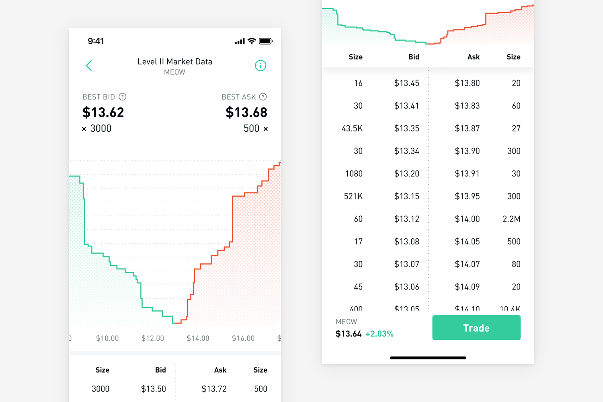

## Table of Contents

## What is an order book in trading?

An order book is like a list that keeps track of all the buy and sell orders for a specific item, like a stock or cryptocurrency, on a trading platform. It shows you how many people want to buy the item at different prices and how many people want to sell it at different prices. This helps traders see the current demand and supply for the item they are interested in.

Imagine you want to buy a toy. The order book would show you how many people are willing to sell that toy and at what prices, and also how many people want to buy it and at what prices. By looking at the order book, you can decide if you want to buy the toy at the current best price or wait for a better price to come along. This way, the order book helps everyone make smarter trading decisions.

## How does an order book work?

An order book is a tool used in trading that shows all the buy and sell orders for a specific item, like a stock or a cryptocurrency. It's like a big list that keeps track of who wants to buy the item and at what price, and who wants to sell it and at what price. When someone wants to buy or sell, they put their order into the order book. The orders are organized by price, with the highest buy orders and the lowest sell orders at the top of the list.

When a new order comes in, it gets added to the order book. If someone wants to buy at a price that matches or is higher than the lowest sell order, a trade happens. The buy order and the sell order match, and the item gets traded at the agreed price. The order book then updates to show the new highest buy order and the new lowest sell order. This process keeps happening as new orders come in, and the order book helps everyone see the current demand and supply for the item they are interested in.

## What are the main components of an order book?

An order book has two main parts: the bid side and the ask side. The bid side shows all the orders from people who want to buy the item. It lists the prices they are willing to pay, starting with the highest price at the top. The ask side shows all the orders from people who want to sell the item. It lists the prices they are willing to accept, starting with the lowest price at the top. The difference between the highest bid price and the lowest ask price is called the spread.

When someone puts in a new order, it goes into the order book on either the bid side or the ask side, depending on whether they want to buy or sell. If a new buy order comes in at a price that matches or is higher than the lowest sell order, a trade happens. The buy and sell orders match, and the item gets traded at the agreed price. The order book then updates to show the new highest bid and the new lowest ask. This keeps happening as new orders come in, helping everyone see the current demand and supply for the item.

## What is the difference between a bid and an ask in an order book?

In an order book, a bid is an order from someone who wants to buy an item, like a stock or a cryptocurrency. The bid side of the order book shows all the prices people are willing to pay to buy the item. The highest bid price is at the top of the list, and it shows the most someone is willing to pay right now. When you look at the bid side, you can see how much demand there is for the item at different prices.

An ask, on the other hand, is an order from someone who wants to sell the item. The ask side of the order book shows all the prices people are willing to accept to sell the item. The lowest ask price is at the top of the list, and it shows the least someone is willing to sell for right now. By looking at the ask side, you can see how much supply there is for the item at different prices. The difference between the highest bid and the lowest ask is called the spread, and it shows how much the price might change when a trade happens.

## How can you read an order book?

To read an order book, you need to look at two main parts: the bid side and the ask side. The bid side shows all the orders from people who want to buy the item. It lists the prices they are willing to pay, starting with the highest price at the top. This tells you how much people are willing to spend to get the item. The ask side shows all the orders from people who want to sell the item. It lists the prices they are willing to accept, starting with the lowest price at the top. This tells you how much people want to get for selling the item.

When you look at an order book, you can see the current demand and supply for the item. The highest price on the bid side is the most someone is willing to pay right now, and the lowest price on the ask side is the least someone is willing to sell for right now. The difference between these two prices is called the spread. By watching the order book, you can see how the prices might change as new orders come in and trades happen. This helps you make better decisions about when to buy or sell the item.

## What is the significance of the order book depth?

The order book depth shows how many buy and sell orders there are at different prices. It's like looking at a big list that tells you how many people want to buy or sell an item at each price. When the order book has a lot of orders at many different prices, it's called a deep order book. This means there's a lot of interest in the item, and it can be easier to buy or sell without the price changing too much.

A deep order book is important because it can make the market more stable. If there are a lot of orders, a big trade won't change the price as much as it would if there were only a few orders. This helps traders feel more confident because they know they can buy or sell the item without causing big price swings. On the other hand, a shallow order book, with fewer orders, can make the market more unpredictable because even small trades can cause big price changes.

## How does an order book affect market liquidity?

An order book affects market liquidity by showing how many people want to buy and sell an item at different prices. When there are a lot of orders in the order book, it means the market has good liquidity. This is because there are many people ready to trade, so it's easier to buy or sell the item without the price changing too much. A deep order book, with lots of orders at many different prices, makes it easier for traders to find someone to trade with quickly.

On the other hand, if the order book has fewer orders, the market has less liquidity. This means there are fewer people ready to trade, so it can be harder to buy or sell the item without causing big price changes. A shallow order book can make the market more unpredictable because even small trades can move the price a lot. So, the order book is important for understanding how easy or hard it is to trade in the market.

## What is the role of an order book in price discovery?

An order book helps people figure out the price of an item by showing all the buy and sell orders. When someone wants to buy or sell, they put their order into the order book. The order book lists all these orders, with the highest buy orders and the lowest sell orders at the top. By looking at the order book, everyone can see what prices people are willing to pay and accept. This helps everyone understand what the item is worth right now.

The order book changes as new orders come in and trades happen. If a new buy order comes in at a price that matches or is higher than the lowest sell order, a trade happens. The item gets traded at the agreed price, and the order book updates to show the new highest buy order and the new lowest sell order. This process keeps happening, and the order book helps everyone see how the price might change. By watching the order book, people can make better guesses about what the price will be in the future.

## How do high-frequency trading strategies interact with order books?

High-frequency trading (HFT) strategies use computers to trade very quickly, often in milliseconds. These strategies look at the order book to find small changes in prices and try to make money from them. HFT traders use special programs to watch the order book all the time. When they see a chance to make a quick profit, they send in their orders very fast. This can mean buying and selling the same item many times in a short time, trying to make a little bit of money each time.

HFT can affect the order book a lot. Because HFT traders trade so quickly, they can add and remove orders from the order book very fast. This can make the order book change a lot, which can make prices move up and down quickly. Sometimes, HFT can make the market more liquid because there are more orders in the order book. But it can also make the market more unpredictable because the fast trading can cause big price changes in a short time.

## What are the differences between order books in centralized and decentralized exchanges?

Order books in centralized exchanges are managed by a single company or organization. This means that all the buy and sell orders go through the same place, and the company keeps track of everything. When you want to trade on a centralized exchange, you send your order to the company, and they match it with other orders in the order book. This can make trading faster and easier because there's one place where all the orders are kept. But, it also means you have to trust the company to handle your orders fairly and keep your information safe.

In decentralized exchanges, the order book is spread out across many different computers and users. Instead of one company managing everything, everyone who uses the exchange helps keep track of the orders. This can make trading a bit slower because the orders have to travel between different computers to be matched. But, it also means you don't have to trust one company because the system is run by many people together. This can make it harder for anyone to cheat or change the orders, but it can also be more complicated to use.

## How can order book imbalances be used to predict price movements?

Order book imbalances happen when there are a lot more buy orders than sell orders, or a lot more sell orders than buy orders. If there are a lot more buy orders, it means more people want to buy the item than sell it. This can push the price up because people might have to pay more to get the item. On the other hand, if there are a lot more sell orders, it means more people want to sell the item than buy it. This can push the price down because people might have to lower their price to sell the item.

Traders look at these imbalances to guess where the price might go next. If they see a big imbalance with more buy orders, they might think the price will go up soon. So, they might decide to buy the item now, hoping to sell it later at a higher price. If they see a big imbalance with more sell orders, they might think the price will go down soon. So, they might decide to sell the item now, or wait to buy it later at a lower price. By watching the order book imbalances, traders can make better guesses about future price movements.

## What advanced analytics can be applied to order book data for trading strategies?

Advanced analytics on order book data can help traders make better decisions by looking at patterns and trends that are hard to see with just a quick look. One way to do this is by using machine learning to study the order book and find out what usually happens before big price changes. For example, if the machine learning model sees that a certain pattern of orders often leads to a price increase, it can tell traders to buy the item before the price goes up. Another way is by using statistical methods to measure how much the order book changes over time. This can help traders understand if the market is getting more or less stable, which can affect their trading decisions.

Another important advanced analytic is called order flow analysis. This looks at how orders come into the order book and how they affect the price. By studying the flow of orders, traders can see if there are more people buying or selling, and how this might change the price. For example, if there's a sudden rush of buy orders, it might mean the price will go up soon. Also, some traders use something called volume-weighted average price (VWAP) analysis. This looks at the average price of the item, taking into account how many orders there were at each price. By comparing the current price to the VWAP, traders can decide if the item is a good buy or sell right now.

## References & Further Reading

[1]: Bouchaud, J.P., Farmer, J.D., & Lillo, F. (2009). ["How Markets Slowly Digest Changes in Supply and Demand."](https://arxiv.org/abs/0809.0822) In Handbook of Financial Markets: Dynamics and Evolution.

[2]: Harris, L. (2003). ["Trading and Exchanges: Market Microstructure for Practitioners."](https://www.amazon.com/Trading-Exchanges-Market-Microstructure-Practitioners/dp/0195144708) Oxford University Press.

[3]: Simone, R. (2017). ["Market Microstructure in Practice."](https://books.google.com/books/about/Market_Microstructure_In_Practice_Second.html?id=TtFKDwAAQBAJ) Wiley.

[4]: O’Hara, M. (1995). ["Market Microstructure Theory."](https://www.wiley.com/en-us/Market+Microstructure+Theory-p-9780631207610) Blackwell Publishing.

[5]: Gould, M.D., Porter, M.A., Williams, S., McDonald, M., Fenn, D.J., & Howison, S.D. (2013). ["Limit Order Books."](https://arxiv.org/abs/1012.0349) Quantitative Finance.