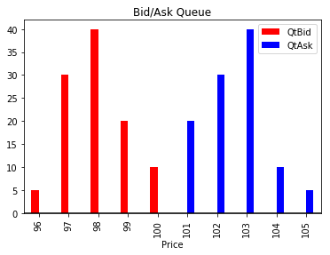

## Table of Contents

## What is an order book (LOB) in financial markets?

An order book, or Limit Order Book (LOB), is a list that shows all the buy and sell orders for a specific financial asset, like a stock or a cryptocurrency, at different price levels. It's like a real-time record that traders use to see who wants to buy or sell, and at what prices. The order book helps traders understand the supply and demand for the asset, which can influence their trading decisions.

The order book is divided into two main parts: the bid side and the ask side. The bid side shows all the orders from people who want to buy the asset, listing the highest prices they are willing to pay at the top. The ask side shows all the orders from people who want to sell the asset, with the lowest prices they are willing to accept at the top. By looking at these two sides, traders can see the current best prices for buying and selling, known as the bid-ask spread, and make more informed trading choices.

## How does an order book function in trading?

An order book in trading is like a list that keeps track of all the buy and sell orders for a certain asset, like a stock or a cryptocurrency. It shows how many people want to buy or sell the asset and at what prices. When someone wants to buy or sell, they put their order into the order book. The order book sorts these orders by price, so you can see the highest price someone is willing to pay to buy (the bid) and the lowest price someone is willing to sell (the ask) at the top of the list.

When a new order comes in, it can either match with an existing order or wait in the book. If someone wants to buy at a price that someone else is willing to sell at, their orders match, and a trade happens. The order book updates right away to show the new highest bid and lowest ask prices. Traders look at the order book to understand the supply and demand for the asset, which helps them decide when and at what price to trade. This way, the order book helps keep the market organized and shows everyone what's happening in real time.

## What are the main components of an order book?

An order book has two main parts: the bid side and the ask side. The bid side shows all the orders from people who want to buy the asset. It lists the highest prices they are willing to pay at the top. This helps traders see the best price they can get if they want to sell their asset right away. The ask side shows all the orders from people who want to sell the asset. It lists the lowest prices they are willing to accept at the top. This helps traders see the best price they can get if they want to buy the asset right away.

The difference between the highest bid price and the lowest ask price is called the bid-ask spread. This spread is important because it shows how much the price might change if a trade happens. The order book also shows the size of each order, which tells traders how many shares or units of the asset are involved in each order. By looking at all this information, traders can understand the supply and demand for the asset and make better trading decisions.

## What is the difference between a bid and an ask in an order book?

In an order book, a bid is the price that someone is willing to pay to buy an asset. It's like saying, "I want to buy this stock, and here's the highest price I'm willing to pay for it." The bid side of the order book shows all these buy orders, with the highest bid price at the top. This helps traders see the best price they can get if they want to sell their asset right away.

On the other hand, an ask is the price that someone is willing to accept to sell an asset. It's like saying, "I want to sell this stock, and here's the lowest price I'm willing to take for it." The ask side of the order book shows all these sell orders, with the lowest ask price at the top. This helps traders see the best price they can get if they want to buy the asset right away. The difference between the highest bid and the lowest ask is called the bid-ask spread, which shows how much the price might change if a trade happens.

## How do market orders and limit orders interact with the order book?

When someone places a market order, they want to buy or sell an asset right away at the best available price. If someone wants to buy with a market order, their order will match with the lowest ask price in the order book. This means they'll buy the asset at the lowest price someone is willing to sell it for. If someone wants to sell with a market order, their order will match with the highest bid price in the order book. This means they'll sell the asset at the highest price someone is willing to pay for it. Market orders make trades happen quickly, but the price isn't guaranteed because it depends on what's in the order book at that moment.

Limit orders work differently. When someone places a limit order, they set a specific price at which they want to buy or sell the asset. If someone wants to buy with a limit order, their order goes into the bid side of the order book at the price they set. If the price in the market goes down to their limit price or lower, their order will match with a sell order. If someone wants to sell with a limit order, their order goes into the ask side of the order book at the price they set. If the price in the market goes up to their limit price or higher, their order will match with a buy order. Limit orders give more control over the price, but there's no guarantee the order will be filled if the market price doesn't reach the limit price.

## What is the significance of the order book's depth?

The depth of an order book shows how many buy and sell orders there are at different prices. It's like looking at a ladder where each step is a different price, and the number of orders at each step tells you how deep the market is at that price. If there are a lot of orders at many different prices, the order book is deep. This means the market can handle big trades without the price changing a lot. But if there are only a few orders at a few prices, the order book is shallow, and big trades can make the price jump around more.

A deep order book is important because it shows that the market is liquid. This means it's easier to buy or sell the asset without the price moving too much. Traders like deep order books because they can make bigger trades without worrying about the price changing too much. On the other hand, a shallow order book can be risky because even small trades can cause big price changes. This can make the market feel less stable and can make traders more cautious about making big trades.

## How can traders use the order book to make informed decisions?

Traders can use the order book to see how many people want to buy or sell an asset and at what prices. By looking at the bid side, traders can see the highest prices people are willing to pay to buy the asset. This helps them understand the demand for the asset. On the ask side, traders can see the lowest prices people are willing to sell at, which shows them the supply of the asset. By comparing the bid and ask sides, traders can see the bid-ask spread, which tells them how much the price might change if a trade happens. This information helps traders decide if it's a good time to buy or sell.

Traders also look at the depth of the order book to understand the market's liquidity. A deep order book with many orders at different prices means the market can handle big trades without the price changing too much. This makes traders feel more confident about making bigger trades. If the order book is shallow, with fewer orders, even small trades can cause big price changes. This can make the market feel less stable, and traders might be more cautious. By understanding the depth and the bid-ask spread, traders can make better decisions about when to trade and at what price.

## What are some common strategies for analyzing an order book?

One common strategy for analyzing an order book is to look at the bid-ask spread. Traders check the difference between the highest price someone is willing to pay (the bid) and the lowest price someone is willing to sell (the ask). A small spread means the market is more liquid and it's easier to buy or sell without the price changing much. A big spread can mean the market is less liquid, and traders might need to be more careful because the price could change a lot with their trades. By watching how the spread changes over time, traders can get a sense of the market's stability and decide when it's a good time to trade.

Another strategy is to look at the depth of the order book. Traders see how many orders are at different price levels. A deep order book with lots of orders at many prices means the market can handle big trades without big price changes. This makes traders feel more confident about making bigger trades. If the order book is shallow, with fewer orders, even small trades can cause big price changes. Traders might use this information to decide if they should break up their trades into smaller parts to avoid moving the market too much. By understanding the depth, traders can better plan their trades and manage their risks.

Traders also use the order book to spot trends and patterns. They might look for big orders that could move the market, called "walls," on the bid or ask side. If there's a big buy wall, it might mean there's strong demand, and the price could go up. If there's a big sell wall, it might mean there's a lot of supply, and the price could go down. By watching these walls and how they change, traders can predict where the price might go next and make their trading decisions based on that.

## How does the order book reflect market liquidity?

The order book shows how easy or hard it is to buy or sell an asset, which is called market liquidity. If the order book has a lot of orders at many different prices, it means the market is deep and liquid. This is good because it means you can buy or sell a lot of the asset without the price changing too much. Traders like this because they can make big trades without worrying about the price moving a lot.

If the order book doesn't have many orders, it means the market is shallow and less liquid. This can be risky because even small trades can make the price jump around a lot. Traders need to be more careful in these markets because their trades can change the price more than they expect. By looking at the order book, traders can see how liquid the market is and decide the best way to trade.

## What are the challenges in interpreting data from an order book?

One challenge in interpreting data from an order book is that it can change very quickly. The prices and the number of orders can move in seconds, so what you see one moment might be different the next. This makes it hard to make decisions because the information you're using might be out of date by the time you act on it. Traders need to be quick and keep watching the order book to stay on top of these changes.

Another challenge is understanding what the data means. Just looking at the numbers and prices in the order book doesn't always tell you the whole story. For example, big orders might not be real trades but just people trying to influence the market. Also, the order book only shows what people are willing to do, not what they will actually do. So, traders need to think about what the data might mean and not just take it at face value. This can be tricky and takes a lot of experience to get right.

## How do high-frequency trading algorithms utilize order books?

High-frequency trading algorithms use order books to make quick trades. These algorithms look at the order book all the time to see the best prices for buying and selling. They can spot small changes in the order book and make trades in milliseconds. This helps them buy low and sell high very quickly. They also use the order book to see how many people want to buy or sell at different prices, which helps them decide when to trade.

These algorithms can also try to trick the market by putting in fake orders. They might put a big order in the book to make it look like there's a lot of demand or supply, but then they take it away before it gets filled. This can make other traders think the price will go up or down and make them trade in a way that helps the high-frequency traders. By using the order book in these ways, high-frequency trading algorithms can make a lot of small profits very quickly.

## What advanced metrics can be derived from order book data for expert analysis?

Expert traders can use order book data to calculate something called the "order book imbalance." This metric shows if there are more buy orders or sell orders at different price levels. If there are a lot more buy orders than sell orders, it might mean the price is going to go up because there's more demand. On the other hand, if there are more sell orders, it might mean the price is going to go down because there's more supply. By looking at the order book imbalance, traders can get a sense of where the market might be heading next and make their trading decisions based on that.

Another useful metric is "market depth." This tells traders how many orders there are at different prices, which shows how liquid the market is. A deep market with lots of orders means it's easier to buy or sell without the price changing too much. A shallow market with fewer orders can be riskier because even small trades can cause big price changes. By understanding market depth, traders can decide the best way to trade and manage their risks. They might choose to break up big trades into smaller ones if the market is shallow, to avoid moving the price too much.

## References & Further Reading

[1]: Gould, M. D., Porter, M. A., Williams, S., McDonald, M., Fenn, D. J., & Howison, S. D. (2013). ["Limit Order Books."](https://arxiv.org/abs/1012.0349) Philosophical Transactions of the Royal Society A: Mathematical, Physical and Engineering Sciences.

[2]: Bouchaud, J.-P., Farmer, J. D., & Lillo, F. (2009). ["How Markets Slowly Digest Changes in Supply and Demand."](https://arxiv.org/abs/0809.0822) Reviews of Modern Physics.

[3]: Cont, R., & Kukanov, A. (2014). ["Optimal Order Placement in Limit Order Markets."](https://arxiv.org/abs/1210.1625) Quantitative Finance.

[4]: Cartea, Á., Jaimungal, S., & Penalva, J. (2015). ["Algorithmic and High-Frequency Trading."](https://assets.cambridge.org/97811070/91146/frontmatter/9781107091146_frontmatter.pdf) Cambridge University Press.

[5]: Lopez de Prado, M. (2018). ["Advances in Financial Machine Learning."](https://www.amazon.com/Advances-Financial-Machine-Learning-Marcos/dp/1119482089) Wiley.

[6]: Tsang, M., Chen, Z., & Wang, J. X. (2018). ["Limit Order Books: Learning by Representation."](https://onlinelibrary.wiley.com/doi/full/10.1002/adma.201704382) arXiv.