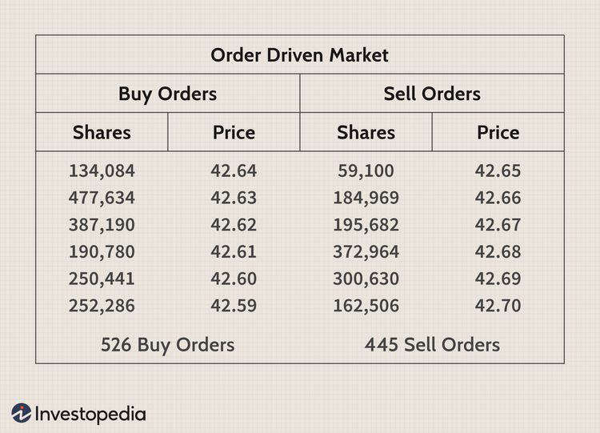

Understanding market structures and mechanisms is crucial in finance and trading. This article explores key concepts such as market structure, market mechanisms, order-driven markets, and algorithmic trading. These elements play a significant role in determining how trades are executed and how market participants interact. By examining these components, traders and investors can develop a clearer understanding of market dynamics. This knowledge is essential for navigating the complex landscape of modern financial markets. Market structures refer to the organization and characteristics of a market, encompassing the number of participants, the level of competition, and the types of products traded. Analyzing these factors allows individuals to identify potential advantages and challenges within a market, aiding in making informed strategic decisions.

Market mechanisms are the systems and rules that facilitate buying and selling activities, determining price setting and trade execution. Understanding these mechanisms enhances a trader's ability to anticipate market movements effectively. Order-driven markets, such as stock exchanges like the NYSE and NASDAQ, are characterized by publicly displayed buy and sell orders, allowing for efficient price formation. The transparency of these order books provides comprehensive market data crucial for strategic trade executions.



Algorithmic trading, on the other hand, employs automated systems to execute trades based on predefined criteria, significantly transforming trading by increasing speed and accuracy. By analyzing vast datasets to identify patterns, algorithms implement complex strategies that have reshaped market structures, occasionally introducing challenges like flash crashes. The integration of technology in trading practices highlights the dynamic nature of markets and the need for participants to remain informed. Together, these elements form the backbone of trading systems worldwide, continuously evolving with technological advancements and offering exciting opportunities for future exploration.

## Table of Contents

## Understanding Market Structure

Market structure denotes the organization and characteristics of a market, encompassing elements such as the number of market participants, the degree of competition, and product types available for trade. It is a foundational concept that shapes market behavior and interactions among participants.

Market structures are typically classified into several types, each with specific implications:

1. **Perfect Competition**: This structure is characterized by numerous small firms, homogenous products, and easy market entry and exit. Participants are price takers due to the high level of competition. In perfectly competitive markets, the price equals marginal cost, leading to an efficient allocation of resources. For example, agricultural markets often exhibit characteristics of perfect competition.

2. **Monopoly**: A monopoly exists when a single firm dominates the entire market, with significant control over pricing and supply. Barriers to entry are high, preventing new firms from entering the market. Monopolies can result in higher prices and lower output compared to competitive markets. Classic examples include utility companies in regions where they are the sole providers of electricity or water services.

3. **Oligopoly**: This structure consists of a few large firms that dominate the market, leading to interdependent decision-making. Oligopolistic markets often engage in non-price competition, such as advertising and product differentiation. The automotive industry is an example where a few major players hold substantial market share.

Understanding market structure is crucial for identifying potential advantages and challenges within a marketplace. For instance, firms operating in a monopoly might focus on innovation and product development to maintain their competitive edge, whereas firms in perfectly competitive markets strive for operational efficiency.

A thorough analysis of market structure aids businesses and investors in making informed strategic decisions. By recognizing factors such as competition levels, market entry barriers, and product differentiation, stakeholders can devise strategies that align with the market environment, optimize resource allocation, and enhance competitive positioning.

## Exploring Market Mechanisms

Market mechanisms are critical components in financial markets as they define the processes by which prices are established and trades are executed. Central to these mechanisms are the systems and rules that govern the buying and selling activities within a marketplace. Two predominant types of market mechanisms are the order-driven and quote-driven markets, each offering distinct methods of operation and influencing [liquidity](/wiki/liquidity-risk-premium) and price discovery in various ways.

Order-driven markets rely on buy and sell orders from participants to set prices, with these orders usually listed in an [order book](/wiki/order-book-trading-strategies). Each order specifies the number of units to be bought or sold and the price at which they are willing to transact. In this setup, trades occur when buy and sell orders overlap, meaning a buyer's willing-to-pay price matches a seller's asking price. This type of market is lauded for its transparency, as all participants can view the order book's depth, aiding in effective price discovery. Stock exchanges like the New York Stock Exchange (NYSE) and NASDAQ exemplify this mechanism by displaying public order [books](/wiki/algo-trading-books) that facilitate trades based on supply and demand dynamics.

On the other hand, quote-driven markets, also known as dealer markets, rely on market makers or dealers to provide buy and sell quotes. Dealers are participants who commit to buying and selling securities at publicly quoted prices, continually providing liquidity to the market. The prices set in quote-driven markets reflect the market maker's assessment of a security's value, along with a spread intended to cover costs and provide profit. A classic example of a quote-driven market is the foreign exchange market, where dealers create a continuous flow of buy and sell quotes to enable trade between currency pairs.

Each of these market mechanisms has implications for liquidity and price discovery. Order-driven markets typically offer high levels of transparency, enabling participants to make informed decisions based on visible market depth. This transparency can enhance liquidity by attracting more participants willing to trade, assured by the visibility into available prices and volumes. In quote-driven markets, liquidity is generally provided by market makers rather than order flow, creating an environment where quick transactions can occur even during periods of high [volatility](/wiki/volatility-trading-strategies). However, this can sometimes come at the cost of wider spreads, especially during uncertain times.

Understanding these market mechanisms allows traders to anticipate potential market movements more accurately. By analyzing visible order flows in order-driven markets or understanding dealer behavior in quote-driven markets, traders can better position themselves to capitalize on price movements. Moreover, the choice of trading environment can be strategic, as it affects transaction costs, execution speed, and the overall risk exposure.

Overall, a comprehensive awareness of how market mechanisms function not only supports trader strategy but also facilitates improved market efficiency and robustness. As these mechanisms are integral to market operations, their continued examination offers deeper insights into market behaviors and the evolving landscape of financial trading.

## Order-Driven Markets Explained

Order-driven markets depend on the active participation of buyers and sellers to set prices through public buy and sell orders. These markets, such as the New York Stock Exchange (NYSE) and NASDAQ, exemplify the functioning of order-driven systems. A key feature of these markets is the order book, a publicly accessible list showing all buy and sell orders, which serves as a crucial tool for matching buyers with sellers.

The order book's transparency provides comprehensive market data, which in turn facilitates efficient price formation. This efficiency is achieved by allowing market participants to see the supply and demand at various price levels, enabling them to make informed trading decisions. By displaying all existing orders, the order book helps market participants understand the depth of the market and the potential impact of large trades.

For instance, if a trader wants to buy shares, they can see the available sell orders at different prices and choose to execute a trade at the most favorable level. This transparency is beneficial in fostering fair trading conditions and enhancing market liquidity, as it encourages participation by reducing the information asymmetry often present in less transparent markets.

Understanding the dynamics of order-driven markets is crucial for participants aiming to execute trades strategically. Traders need to be aware of how their orders might affect the market, especially in terms of the potential for slippage, which occurs when a trade is executed at a price different from the expected one due to market movements. Therefore, strategic trading in order-driven markets involves not only deciding on the size and timing of trades but also managing the order types used, such as limit orders, which specify the maximum or minimum price at which a trader is willing to buy or sell.

In summary, the order-driven market structure, with its transparent order book mechanism, facilitates efficient price discovery and fair trading conditions. Market participants must understand these dynamics to optimize their trade executions and minimize costs, making order-driven markets an essential component of the global financial landscape.

## The Rise of Algorithmic Trading

Algorithmic trading, also known as algo trading or automated trading, refers to the use of computer programs and systems to execute trading orders automatically per predefined criteria. This approach has revolutionized the trading landscape by greatly enhancing speed and precision. Algorithms can analyze vast datasets to detect patterns, optimize timing, and execute complex strategies much faster than any human could.

The fundamental advantage of [algorithmic trading](/wiki/algorithmic-trading) lies in its ability to handle large volumes of trades effectively and with minimal human intervention. These systems execute trades based on a wide range of indicators including price, [volume](/wiki/volume-trading-strategy), and time, optimizing overall performance and reducing transaction costs. They are capable of processing real-time data feeds, scanning multiple markets, and making split-second decisions that were previously unachievable.

Algorithmic trading has brought significant alterations to market structures, influencing the way trades are executed and even the behavior of markets overall. One of the notable phenomena associated with algorithmic trading is the occurrence of "flash crashes." These are rapid and deep market declines, followed by equally swift recoveries, often attributed to the cascading effects of algorithms acting on erroneous data or feedback loops. A prominent example is the flash crash of May 6, 2010, which saw the Dow Jones Industrial Average plummet and recover within minutes.

Despite its transformative potential, algorithmic trading is not without challenges and risks. Market participants must contend with the risk of systemic errors, algorithmic failures, and the potential for market manipulation. Moreover, the development of robust and effective algorithms requires a deep understanding of both mathematical modeling and financial markets. Errors in design or implementation can lead to substantial financial losses.

The benefits of algorithmic trading are evident in enhanced market liquidity, tighter bid-ask spreads, and improved price discovery. Algorithms help to balance supply and demand more efficiently, facilitating smoother market operations. They are also employed in high-frequency trading ([HFT](/wiki/high-frequency-trading-strategies)), where the goal is to capture minute price discrepancies over very short timescales.

In summary, while algorithmic trading offers numerous benefits like increased trading efficiency and reduced costs, it also necessitates rigorous risk management and oversight. The evolution of this technology continues to reshape financial markets, presenting both opportunities and challenges for traders and regulators alike.

## Interplay Between Market Structure and Algorithms

Algorithmic trading algorithms must be crafted with an acute awareness of the foundational market structures within which they will operate. Success in algorithmic trading is not solely a function of advanced computational capabilities; it requires a nuanced appreciation of how different market environments can affect algorithm performance. The effectiveness of algorithms is highly contingent upon a spectrum of market elements, including market liquidity, volatility, and other structural characteristics.

Market liquidity denotes the ease with which assets can be bought or sold without causing a significant movement in prices. In markets with high liquidity, algorithmic trading systems can efficiently execute large orders without substantial price impacts, thereby reducing execution costs. Conversely, in less liquid markets, the algorithms may face considerable execution obstacles, potentially increasing slippage—the difference between the expected price of a trade and the actual price.

Volatility, or the degree of variation in trading prices over time, also plays a crucial role. High volatility may offer favorable conditions for algorithms that capitalize on short-term price movements, notably affecting strategies such as statistical [arbitrage](/wiki/arbitrage) or [momentum](/wiki/momentum) trading. However, excessive volatility can also lead to unpredictable market conditions that adversely impact the timing and execution of trades.

Hence, the strategic alignment of algorithms with market structure is essential for optimizing trading performance. For instance, in high-frequency trading (HFT), algorithms are designed to operate within highly liquid markets to exploit fleeting price inefficiencies with minimal delay. To achieve this, algorithms must incorporate sophisticated models to predict order flows and manage risks in real-time.

Consider a Python snippet that illustrates a basic approach to algorithmic trading that takes into account market volatility:

```python
import numpy as np
import pandas as pd

def calculate_volatility(price_data: pd.Series) -> float:
    return np.std(price_data) / np.mean(price_data)

def trading_strategy(price_data: pd.Series) -> str:
    volatility = calculate_volatility(price_data)
    if volatility > 0.05:  # threshold set for high volatility
        return "High volatility strategy: Focus on momentum trades"
    else:
        return "Low volatility strategy: Consider mean reversion"

price_data = pd.Series([100, 101, 102, 103, 98, 97, 105])
strategy = trading_strategy(price_data)
print(strategy)
```

In this snippet, volatility is calculated, and a trading strategy is selected based on the observed volatility. This highlights how algorithms can be adjusted to suit different market environments, enhancing their adaptability and effectiveness. Thus, understanding and incorporating the dynamic interplay between market structures and algorithmic trading is imperative for traders aiming to maintain an edge in increasingly automated financial markets.

## Conclusion

Market structures and mechanisms provide the essential framework for trading systems globally. Technological advancements have significantly influenced the evolution of order-driven markets and algorithmic trading, resulting in faster and more efficient trading processes. Order-driven markets, where buy and sell orders are openly visible, benefit from improved transparency and liquidity. They have become more sophisticated with enhanced data analytics and trading algorithms that ensure accurate price discovery.

The rise of algorithmic trading has introduced unprecedented speed and precision, making it an integral aspect of modern finance. With algorithms capable of analyzing large datasets and executing complex trading strategies, they have reshaped market dynamics, potentially increasing volatility in certain instances. The emergence of flash crashes highlights the dual-edged nature of these technologies, emphasizing the need for robust risk management strategies.

A deep understanding of market structures and mechanisms is crucial for traders at all levels. Novice traders can employ this knowledge to build foundational trading skills, while experienced traders can leverage it to refine their strategies and maintain a competitive edge. Staying informed about evolving market dynamics and technological trends is vital, providing traders with the insights needed to capitalize on emerging opportunities and mitigate risks.

The synergy between traditional market mechanisms and cutting-edge algorithmic trading methods opens new avenues for exploration. As these elements continue to coalesce, they offer promising prospects for enhancing the efficiency and resilience of financial markets. The ongoing evolution presents a dynamic landscape where traders and investors can harness innovation to achieve superior trading outcomes.

## References & Further Reading

[1]: Bergstra, J., Bardenet, R., Bengio, Y., & Kégl, B. (2011). ["Algorithms for Hyper-Parameter Optimization."](https://proceedings.neurips.cc/paper/2011/file/86e8f7ab32cfd12577bc2619bc635690-Paper.pdf) Advances in Neural Information Processing Systems 24.

[2]: ["Advances in Financial Machine Learning"](https://www.amazon.com/Advances-Financial-Machine-Learning-Marcos/dp/1119482089) by Marcos Lopez de Prado

[3]: ["Evidence-Based Technical Analysis: Applying the Scientific Method and Statistical Inference to Trading Signals"](https://www.amazon.com/Evidence-Based-Technical-Analysis-Scientific-Statistical/dp/0470008741) by David Aronson

[4]: ["Machine Learning for Algorithmic Trading"](https://github.com/stefan-jansen/machine-learning-for-trading) by Stefan Jansen

[5]: ["Quantitative Trading: How to Build Your Own Algorithmic Trading Business"](https://www.amazon.com/Quantitative-Trading-Build-Algorithmic-Business/dp/1119800064) by Ernest P. Chan