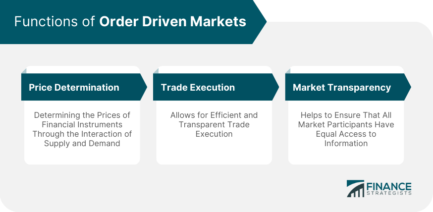

## Table of Contents

## What is an order-driven market?

An order-driven market is a type of financial market where buyers and sellers come together to trade directly with each other. In this system, the price of a stock or other financial instrument is determined by the orders that people place. If someone wants to buy a stock, they put in a "buy order" at a certain price, and if someone wants to sell, they put in a "sell order" at their desired price. The market matches these orders, and a trade happens when the buy and sell prices meet.

This type of market is different from a quote-driven market, where dealers set the prices and trade with customers. In an order-driven market, there are no dealers setting prices; instead, it's all about the orders from the participants. This can make the market more transparent because everyone can see the orders and know what prices others are willing to buy or sell at. It's commonly used in stock exchanges around the world, like the New York Stock Exchange and the Tokyo Stock Exchange.

## How does an order-driven market differ from a quote-driven market?

An order-driven market and a quote-driven market are two different ways that people can buy and sell things like stocks. In an order-driven market, buyers and sellers place their own orders. If someone wants to buy a stock, they say how much they are willing to pay, and if someone wants to sell, they say how much they want. The market then matches these orders. When a buyer's price meets a seller's price, a trade happens. This means the price of the stock is decided by what everyone is willing to pay or accept.

On the other hand, a quote-driven market works differently. In this type of market, there are dealers who set the prices. If you want to buy or sell a stock, you go to these dealers. They give you a price to buy (the "ask" price) and a price to sell (the "bid" price). You can choose to trade with them at those prices. The dealers make money from the difference between the bid and ask prices. This system can be less transparent because the dealers control the prices, and you might not know what other people are willing to pay or accept.

Both types of markets have their own advantages and are used in different places. Order-driven markets are often used in big stock exchanges like the New York Stock Exchange, where everyone can see the orders and prices. Quote-driven markets are more common in places like the foreign exchange market, where dealers play a big role in setting prices.

## What are the main components of an order-driven market?

In an order-driven market, the main components are the orders that people place and the system that matches these orders. When someone wants to buy or sell a stock, they put in an order with their desired price. There are two types of orders: buy orders and sell orders. Buy orders are from people who want to buy the stock, and they say how much they are willing to pay. Sell orders are from people who want to sell the stock, and they say how much they want for it. The market keeps track of all these orders.

The other important part is the system that matches the orders. This system looks at all the buy and sell orders and tries to find matches. A match happens when someone's buy price is the same as or higher than someone else's sell price. When this happens, the trade goes through, and the stock changes hands. This matching system makes sure that the price of the stock is fair because it's based on what everyone is willing to pay or accept. This is how an order-driven market works, with orders and a matching system as its main components.

## Can you explain the process of order matching in an order-driven market?

In an order-driven market, order matching is how trades happen. When someone wants to buy a stock, they put in a buy order with the price they are willing to pay. When someone wants to sell a stock, they put in a sell order with the price they want. The market keeps track of all these orders. The matching system looks at all the buy and sell orders to find matches. A match happens when a buy order's price is the same as or higher than a sell order's price. When this happens, the trade goes through, and the stock changes hands.

The matching system works to make sure the price is fair. It does this by following some rules. One rule is "price priority," which means the highest buy order and the lowest sell order get matched first. Another rule is "time priority," which means if two orders have the same price, the one that came in first gets matched first. This way, the system makes sure that everyone gets a fair chance to trade, and the price of the stock is based on what everyone is willing to pay or accept.

## What types of orders can be placed in an order-driven market?

In an order-driven market, there are mainly two types of orders: market orders and limit orders. A market order is when someone wants to buy or sell a stock right away at the best available price. If you put in a market order to buy, you will get the stock at the lowest price someone is willing to sell it for. If you put in a market order to sell, you will sell your stock at the highest price someone is willing to buy it for.

A limit order is when someone wants to buy or sell a stock at a specific price or better. If you put in a limit order to buy, you say the highest price you are willing to pay. Your order will only go through if someone is willing to sell at that price or lower. If you put in a limit order to sell, you say the lowest price you are willing to accept. Your order will only go through if someone is willing to buy at that price or higher. Limit orders give you more control over the price you trade at, but they might not get filled if the market price doesn't reach your limit.

## How do limit orders and market orders function within an order-driven market?

In an order-driven market, a market order is used when someone wants to buy or sell a stock right away at the best available price. If you want to buy a stock and you place a market order, you will get the stock at the lowest price someone is willing to sell it for at that moment. If you want to sell a stock and you place a market order, you will sell it at the highest price someone is willing to buy it for right then. Market orders are quick and easy, but you don't have control over the exact price you will get because it depends on what prices are available in the market at that time.

A limit order is different because it lets you set a specific price at which you want to buy or sell a stock. If you want to buy a stock and you place a limit order, you say the highest price you are willing to pay. Your order will only go through if someone is willing to sell the stock at your limit price or lower. If you want to sell a stock and you place a limit order, you say the lowest price you are willing to accept. Your order will only go through if someone is willing to buy the stock at your limit price or higher. Limit orders give you more control over the price, but there's a chance your order won't be filled if the market price doesn't reach your limit.

## What role do order books play in order-driven markets?

In an order-driven market, an [order book](/wiki/order-book-trading-strategies) is like a list that keeps track of all the buy and sell orders people have placed. It shows the prices people are willing to pay to buy a stock and the prices people want to get when they sell a stock. Everyone can see this list, which makes the market more open and fair. The order book is important because it helps the market match up buy and sell orders. When someone puts in a new order, the system looks at the order book to see if there's a match. If there is, a trade happens.

The order book also helps set the price of the stock. The highest price someone is willing to pay to buy the stock is called the "bid," and the lowest price someone is willing to sell the stock for is called the "ask." The difference between the bid and the ask is called the "spread." By looking at the order book, you can see how much demand there is for the stock and how much supply there is. This information helps everyone in the market decide what price they want to trade at. So, the order book is a key part of how an order-driven market works.

## How does price discovery occur in an order-driven market?

In an order-driven market, price discovery happens when people who want to buy and people who want to sell a stock come together. Everyone can see the orders in the order book, which lists all the buy and sell orders. The highest price someone is willing to pay to buy the stock is called the bid, and the lowest price someone is willing to sell the stock for is called the ask. The market matches these orders, and a trade happens when a buyer's price meets a seller's price. This way, the price of the stock is decided by what everyone is willing to pay or accept.

The process of matching orders helps find the right price for the stock. If there are a lot of people who want to buy the stock, the bid price might go up because they are willing to pay more. If a lot of people want to sell the stock, the ask price might go down because they want to get rid of it. The market keeps finding the right price by looking at all the orders and matching them. This makes sure that the price is fair and based on what everyone thinks the stock is worth.

## What are the advantages and disadvantages of order-driven markets compared to other market structures?

Order-driven markets have some good things about them. They are very open because everyone can see the orders in the order book. This means you can see what prices people are willing to buy or sell at, which helps you make better choices. Also, the price of the stock is decided by what everyone is willing to pay or accept, so it's fair. This can make the market more active because people feel they have a good chance to trade at a fair price. Another good thing is that order-driven markets can handle a lot of trades quickly because the matching system works fast.

But order-driven markets also have some problems. One big problem is that the price can change a lot because it depends on what everyone is willing to pay or accept. This can make the market feel risky because the price might go up and down a lot. Also, if there are not many orders in the market, it can be hard to buy or sell a stock at the price you want. This can make it harder to trade, especially if you need to buy or sell a lot of stock at once. So, while order-driven markets have some good points, they also have some challenges that people need to think about.

## How do order-driven markets handle large volumes of trades and maintain liquidity?

Order-driven markets handle large volumes of trades by using a matching system that works quickly and efficiently. When lots of people want to buy and sell stocks, the system looks at all the orders and tries to match them up as fast as it can. This means that even if there are many orders coming in, the market can still make trades happen without too much delay. The system uses rules like price priority and time priority to make sure that orders are matched fairly and in the right order. This helps keep the market running smoothly, even when there are a lot of trades happening at the same time.

Maintaining [liquidity](/wiki/liquidity-risk-premium) in an order-driven market is important because it means there are enough buyers and sellers to make trades happen easily. Liquidity is helped by having a lot of orders in the order book. When there are many orders, it's easier to find someone who wants to buy at the price you want to sell, or someone who wants to sell at the price you want to buy. This makes the market more active and helps keep the price stable. If there are not many orders, it can be harder to trade, and the price might change a lot. So, having a lot of people wanting to trade helps keep the market liquid and working well.

## What are the potential impacts of high-frequency trading on order-driven markets?

High-frequency trading can change how order-driven markets work. It means using computers to buy and sell stocks very fast, often in just a few seconds. This can make the market more active because there are more orders coming in all the time. It can also help keep the price of stocks more stable because high-frequency traders often buy and sell a lot, which adds more liquidity to the market. This means it's easier for everyone to trade because there are always people willing to buy or sell.

But high-frequency trading can also cause problems. Because these traders move so fast, they can make the price of stocks go up and down a lot in a short time. This can make the market feel risky because the price might change suddenly. Also, high-frequency traders can use their speed to get a better deal than other people, which might not seem fair. So while high-frequency trading can help make the market more active and liquid, it can also make it more unpredictable and less fair for some people.

## How do regulatory frameworks influence the operation and efficiency of order-driven markets?

Regulatory frameworks help keep order-driven markets fair and safe for everyone. They set rules that everyone has to follow, like making sure all orders are shown in the order book so everyone can see them. This helps stop people from cheating or hiding information. Regulators also make sure that the market is open and honest by checking that the prices are fair and that there's enough information for everyone to make good choices. They might also watch for any bad behavior, like people trying to trick the market or using secret information to make money.

But sometimes, these rules can make the market slower or more complicated. For example, if there are too many rules, it might take longer for trades to happen because the market has to check everything carefully. This can make the market less efficient because it's harder to buy and sell quickly. Also, some rules might make it harder for new people to join the market or for new ideas to be tried out. So, while regulations are important for keeping the market fair and safe, they need to be balanced so they don't make it too hard for the market to work well.

## References & Further Reading

[1]: Bergstra, J., Bardenet, R., Bengio, Y., & Kégl, B. (2011). ["Algorithms for Hyper-Parameter Optimization."](https://proceedings.neurips.cc/paper/2011/file/86e8f7ab32cfd12577bc2619bc635690-Paper.pdf) Advances in Neural Information Processing Systems 24.

[2]: ["Advances in Financial Machine Learning"](https://www.amazon.com/Advances-Financial-Machine-Learning-Marcos/dp/1119482089) by Marcos Lopez de Prado

[3]: ["Evidence-Based Technical Analysis: Applying the Scientific Method and Statistical Inference to Trading Signals"](https://www.amazon.com/Evidence-Based-Technical-Analysis-Scientific-Statistical/dp/0470008741) by David Aronson

[4]: ["Machine Learning for Algorithmic Trading"](https://github.com/stefan-jansen/machine-learning-for-trading) by Stefan Jansen

[5]: ["Quantitative Trading: How to Build Your Own Algorithmic Trading Business"](https://www.amazon.com/Quantitative-Trading-Build-Algorithmic-Business/dp/1119800064) by Ernest P. Chan