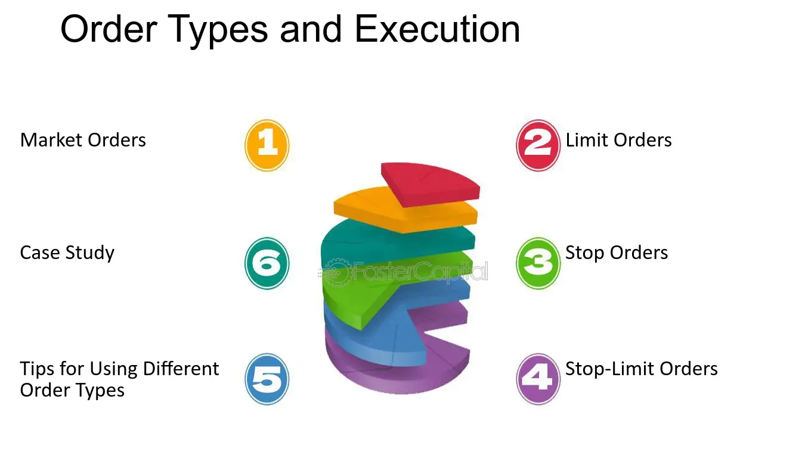

## Table of Contents

## What is order execution in trading?

Order execution in trading is the process of completing a buy or sell order in the market. When a trader decides to buy or sell a stock, they place an order with their broker. The broker then tries to find someone on the other side of the trade who is willing to buy or sell at the price the trader wants. This process can happen very quickly, especially in markets with high liquidity where there are many buyers and sellers.

The speed and quality of order execution can be important to traders. A fast execution means the trader gets the price they want more quickly, which can be crucial in fast-moving markets. On the other hand, if the execution is slow, the price might change before the order is completed, leading to a worse price for the trader. Brokers often use advanced technology and algorithms to help get the best possible execution for their clients.

## What are the different types of orders in trading?

In trading, there are several types of orders that traders can use to buy or sell assets. The most common type is a market order, which is an order to buy or sell at the current market price. When you place a market order, it gets executed immediately at the best available price. Another type is a limit order, where you set a specific price at which you want to buy or sell. The order will only be executed if the market reaches your specified price, so it might not get filled if the market doesn't move in your favor.

There are also stop orders, which are used to limit losses or protect profits. A stop order becomes a market order once the stock reaches a certain price, known as the stop price. For example, if you own a stock and want to limit your loss, you can set a stop-loss order below the current price. If the stock falls to that price, the stop order turns into a market order and sells your stock. A variation of this is a stop-limit order, which combines the features of a stop order and a limit order. Once the stop price is reached, it turns into a limit order instead of a market order, giving you more control over the price at which your order is executed.

Lastly, there are more specialized orders like trailing stop orders, which adjust the stop price as the market price moves in your favor. This type of order helps you lock in profits while still giving the stock room to move up. Understanding these different types of orders can help traders manage their trades more effectively and achieve their investment goals.

## How does a market order work?

A market order is a type of order where you tell your broker to buy or sell a stock right away at the best price available. When you place a market order, it gets filled quickly because it's meant to happen fast. For example, if you want to buy a stock, your broker will find the lowest price someone is willing to sell at and buy it for you. If you want to sell, your broker will find the highest price someone is willing to buy at and sell your stock for you.

Market orders are good when you want to make sure your trade happens quickly. But, the price you get might not be exactly what you see on the screen when you place the order. This is because the price can change in the time it takes for your order to go through, especially in fast-moving markets. So, while market orders are fast, you might end up paying a bit more or getting a bit less than you expected.

## What is a limit order and when should it be used?

A limit order is when you tell your broker to buy or sell a stock at a specific price or better. For example, if you want to buy a stock, you can set a limit order to buy it only if the price drops to your chosen price or lower. If you want to sell, you can set a limit order to sell only if the price goes up to your chosen price or higher. Unlike a market order, a limit order won't happen right away if the price isn't right. It will only happen when the stock reaches your limit price.

You should use a limit order when you want to control the price you pay or get for a stock. It's good if you're not in a hurry and you have a specific price in mind. For example, if you think a stock is worth $50 but it's currently at $55, you can set a limit order to buy at $50. This way, you won't buy the stock unless it drops to your price. But remember, there's a chance your order might not happen at all if the stock never reaches your limit price.

## Can you explain stop orders and their types?

A stop order is a way to tell your broker to buy or sell a stock when it reaches a certain price, called the stop price. It's like setting a trigger. When the stock hits that price, the stop order turns into a market order and gets filled at the best price available at that moment. People often use stop orders to limit their losses or to lock in profits. For example, if you own a stock that's going down, you can set a stop order below the current price to sell it before it drops too much. This is called a stop-loss order.

There are different types of stop orders. One type is a stop-limit order. This is a bit like a stop order, but instead of turning into a market order, it turns into a limit order when the stock hits the stop price. So, you set both a stop price and a limit price. When the stock reaches the stop price, it will only buy or sell if it can do so at your limit price or better. This gives you more control over the price, but there's a risk that your order might not get filled if the stock price moves away from your limit price quickly.

Another type is a trailing stop order. This one is special because it moves with the stock price. You set a percentage or a dollar amount that the stock can fall before the order is triggered. As the stock price goes up, the stop price goes up too, but if the stock price goes down, the stop price stays where it is. This way, you can lock in profits as the stock rises, but still have a safety net if the stock starts to fall.

## What are the advantages and disadvantages of using a stop-loss order?

Using a stop-loss order has several advantages. It helps you limit your losses by automatically selling a stock when it drops to a certain price. This means you don't have to watch the market all the time. It's like having a safety net. If the stock price goes down a lot, the stop-loss order kicks in and sells your stock before you lose too much money. It can also help you stick to your trading plan and avoid making emotional decisions when the market gets scary.

However, there are also some disadvantages to using a stop-loss order. One big problem is that the stock price can be very unpredictable. Sometimes, the price might drop suddenly because of a short-term event, and then go right back up. If your stop-loss order gets triggered during this dip, you might end up selling your stock at a low price just before it goes back up. This is called being "stopped out." Also, if the market is moving fast, your stop-loss order might turn into a market order and get filled at a worse price than you expected. So, while stop-loss orders can protect you, they can also lead to selling at the wrong time or at a bad price.

## How do trailing stop orders function in volatile markets?

In volatile markets, trailing stop orders can be really helpful but also tricky. A trailing stop order moves with the stock price, so if the stock goes up, the stop price goes up too. This means you can lock in profits as the stock rises. But in a volatile market, where prices can swing a lot, the stock might drop suddenly and hit your trailing stop price, even if it's just a short-term dip. If that happens, your order turns into a market order and sells your stock, which might not be what you want if the price goes back up quickly.

Because of this, using a trailing stop order in a volatile market can be risky. You might get stopped out of your position during a big price swing, selling your stock at a lower price than you hoped. But if you set the trailing stop at the right percentage or dollar amount, it can still protect your profits and limit your losses. It's all about finding the right balance so that the trailing stop helps you without kicking in too soon because of the market's ups and downs.

## What is an iceberg order and how is it used in large trades?

An iceberg order is a big order to buy or sell a stock, but it's split into smaller parts so that other people in the market can't see the whole thing at once. It's called an iceberg order because, like an iceberg, most of it is hidden under the surface. When you place an iceberg order, only a small part of it shows up on the market at a time. Once that part is filled, another part shows up, and this keeps going until the whole order is done.

Iceberg orders are used by big traders, like big investors or institutions, who want to buy or sell a lot of stock without making the price move too much. If they put in a huge order all at once, it could scare other traders and make the price go up or down a lot. By using an iceberg order, they can keep their big trade secret and buy or sell their stock without causing a big stir in the market. This helps them get a better price and not mess up the market too much.

## How does order execution speed affect trading outcomes?

Order execution speed is really important in trading because it can change how much money you make or lose. When you place an order, you want it to happen fast so you can get the price you see on the screen. If the order takes too long, the price might change before your order goes through. This can mean you end up paying more to buy a stock or getting less when you sell it. In fast-moving markets, where prices can change in a second, having a quick order execution can make a big difference.

In some cases, slow order execution can lead to something called "slippage." This is when the price you get is different from the price you wanted because the market moved while you were waiting. Traders who need to make quick decisions, like day traders, really care about order execution speed. They use special tools and brokers that can get their orders filled fast. For people who hold onto stocks for a long time, the speed might not matter as much, but for anyone trying to make money from small price changes, it's a big deal.

## What role do algorithms play in order execution?

Algorithms play a big role in making order execution faster and better. They are like smart computer programs that brokers use to find the best price for your order. When you place an order, the algorithm looks at the market and tries to get you the best deal. It can split your order into smaller pieces and spread them out over time, so it doesn't affect the price too much. This is really helpful for big orders, where moving the whole thing at once could change the market price.

Algorithms also help in deciding when and how to fill your order. They can look at lots of information, like how the market is moving and how much of the stock is being traded. This helps them choose the right time to buy or sell, so you get a better price. For traders who need to make quick decisions, algorithms can make a big difference. They can execute orders much faster than a person could, which is important in fast-moving markets where prices change quickly.

## How can slippage impact the execution of trades?

Slippage happens when the price you get for your trade is different from the price you wanted. It can happen because the market moves fast, and by the time your order goes through, the price has changed. This is more likely to happen in fast-moving or volatile markets where prices can jump around a lot. If you're buying a stock, slippage means you might end up paying more than you planned. If you're selling, it means you might get less money than you hoped for.

Slippage can affect your trading in a big way, especially if you're making a lot of trades or trading big amounts. It can eat into your profits or make your losses bigger. To deal with slippage, traders might use limit orders instead of market orders. A limit order lets you set a specific price, so you won't buy or sell unless the market hits that price. This can help you avoid slippage, but it also means your order might not get filled if the market doesn't move in your favor.

## What advanced strategies can be employed to optimize order execution in high-frequency trading?

In high-frequency trading, one advanced strategy to optimize order execution is using smart order routing. This means using special computer programs to send your order to the best place to get the best price. These programs look at different markets and choose the one where your order can be filled the fastest and at the best price. They can also split your order into smaller pieces and send them to different places to get the best overall price. This helps reduce the impact of your trade on the market and can save you money.

Another strategy is using algorithms to time your trades better. These algorithms can look at lots of data, like how the market is moving and how much of the stock is being traded, to decide the best time to buy or sell. They can also use techniques like "order slicing," where they break your order into smaller parts and spread them out over time. This helps avoid big price changes that can happen when you trade a lot of stock at once. By using these smart strategies, high-frequency traders can get better prices and make more money from their trades.

## References & Further Reading

[1]: Harris, L. (2002). ["Trading and Exchanges: Market Microstructure for Practitioners"](https://academic.oup.com/book/52292). Oxford University Press.

[2]: Aldridge, I. (2013). ["High-Frequency Trading: A Practical Guide to Algorithmic Strategies and Trading Systems"](https://www.amazon.com/High-Frequency-Trading-Practical-Algorithmic-Strategies/dp/1118343506). Wiley.

[3]: Kissell, R. (2014). ["The Science of Algorithmic Trading and Portfolio Management"](https://www.sciencedirect.com/book/9780124016897/the-science-of-algorithmic-trading-and-portfolio-management). Academic Press.

[4]: Narang, R. K. (2013). ["Inside the Black Box: A Simple Guide to Quantitative and High-Frequency Trading"](https://onlinelibrary.wiley.com/doi/book/10.1002/9781118662717). Wiley.

[5]: Rosu, I. (2019). ["Liquidity and the Dynamics of Limit Order Markets"](https://papers.ssrn.com/sol3/papers.cfm?abstract_id=1286193). Chicago Booth Research Paper.