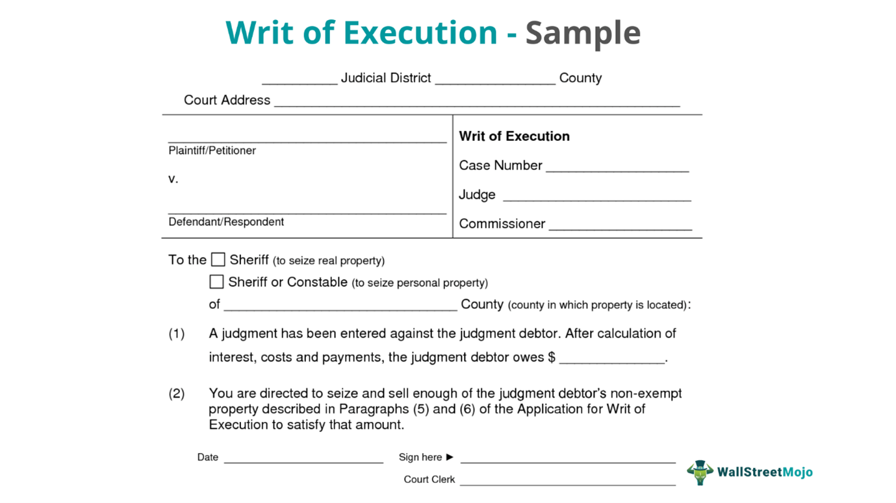

The financial markets are experiencing a rapid transformation, fueled by technological advancements and an unrelenting pursuit of efficiency and profitability. In this evolving landscape, order execution and algorithmic trading have become essential elements of modern trading strategies. These components are crucial in enhancing trading performance and optimizing capital allocation.

Order execution, the process by which buy and sell orders are matched and completed, has been significantly influenced by technology. The transition from traditional trading methods to electronic platforms has introduced advanced techniques that streamline this process, making transactions faster and more precise. Algorithmic trading, which employs computer algorithms to execute trades automatically, further enhances efficiency by minimizing human intervention. This approach allows for swift, data-driven decisions that outpace the capabilities of manual trading.



Algorithmic trading and order execution are intrinsically linked, working together to maximize the effectiveness of trading strategies. By improving the accuracy and speed of executions, algorithms reduce transaction costs and make real-time adjustments to navigate market fluctuations. The synergy between these elements contributes to more efficient markets and better capital utilization.

However, while algorithmic trading offers numerous benefits, it also presents challenges that need careful consideration. Managing the technological and operational risks associated with deploying complex algorithms is vital to maintaining market stability. Traders and financial institutions must weigh these challenges against the advantages to harness the full potential of algorithmic trading in the contemporary financial landscape.

## Table of Contents

## Understanding Financial Markets

Financial markets are essential frameworks where buyers and sellers engage in the trading of various assets, including stocks, bonds, currencies, and derivatives. These markets are crucial for facilitating price discovery, a process where the prices of assets are determined through the interaction of supply and demand. This interaction helps in reflecting the true value of assets in the market. Additionally, financial markets provide liquidity, ensuring that assets can be quickly bought or sold without causing a significant impact on their market price. This liquidity is vital for the efficient allocation of capital among investors, allowing for the seamless flow of funds to sectors where they are most needed.

A primary function of financial markets is order execution, an integral process that involves matching buy and sell orders swiftly and efficiently. Effective order execution is fundamental to the success of trading strategies, as it can significantly influence transaction costs and the overall market impact. The efficiency of order execution affects both institutional and retail investors, as it can lead to more favorable pricing and reduced trading costs.

The advent of technology has brought about transformative changes in traditional trading methods. With the introduction of electronic trading platforms, the trading landscape has been reshaped, moving away from open outcry systems to digital transactions. These platforms enable market participants to execute trades with higher speed and accuracy, significantly reducing the latency previously associated with manual trading systems.

Advanced order execution techniques have emerged as a result of technological advancements, allowing traders to optimize their trades further. Techniques such as [algorithmic trading](/wiki/algorithmic-trading) rely on preset criteria and sophisticated algorithms to execute trades automatically, minimizing human intervention and emotional bias. This approach to order execution has become increasingly prevalent, reflecting its effectiveness in enhancing trade efficiency.

In conclusion, financial markets serve as vital ecosystems that facilitate not only the trading of assets but also the efficient execution of orders through cutting-edge technologies. The evolution of these markets underscores their importance in the global financial system, where technological advancements continue to drive innovation and efficiency in trading practices.

## Order Execution in Trading

Order execution refers to the process of completing a buy or sell order in financial markets, a fundamental determinant of both the cost and success of a trading strategy. The effectiveness of order execution is measured by several critical factors, including speed, cost, and accuracy. Each of these factors plays a significant role:

1. **Speed**: In fast-moving financial markets, the ability to execute orders quickly can mean the difference between profit and loss. A slight delay might lead to unfavorable price changes, a phenomenon known as slippage. Technologies such as high-frequency trading platforms and low-latency networks have been developed to minimize these delays, enhancing the speed of execution.

2. **Cost**: The cost of executing an order includes various transaction fees and the bid-ask spread—the difference between the highest price a buyer is willing to pay (bid) and the lowest price a seller will accept (ask). Optimizing these costs while ensuring timely execution is a balancing act crucial for effective trading strategies.

3. **Accuracy**: The precision with which orders are executed impacts trading performance. Errors in execution can arise from mismatched orders, incorrect pricing, or unintentional order sizes, each potentially detrimental to trading outcomes. Accurate execution systems help avoid such pitfalls.

Market participants typically utilize two primary types of orders—market orders and limit orders—each with distinct execution implications:

- **Market Orders**: These are executed immediately at the current market price, ensuring speed but possibly at the expense of higher costs if the market is volatile.

- **Limit Orders**: These orders specify a price limit at which the trade will be executed, prioritizing price over speed. This approach reduces the risk of slippage but might result in the order not being executed at all if the specified price is not met.

Recent advancements in trading technology have significantly transformed order execution processes. Automation has become prevalent, reducing human involvement and introducing greater precision. Algorithmic trading systems execute orders based on predetermined criteria, ensuring rapid and accurate fulfillment. The integration of sophisticated algorithms allows for dynamic adjustment to market conditions, improving execution effectiveness and providing traders with a competitive edge.

Overall, the progressive automation and technological enhancement of order execution in trading have reshaped the landscape of financial markets, making them more efficient and accessible to a broader array of participants.

## What is Algorithmic Trading?

Algorithmic trading, often referred to as algo trading, utilizes computer algorithms to automate trade execution based on predetermined criteria. The primary objective is to leverage the computational power of algorithms to process vast datasets, identify trading opportunities, and execute trades at speeds far beyond the capabilities of human traders.

These algorithms perform sophisticated data analysis to detect patterns, trends, and trading signals that indicate the optimal times to buy or sell financial instruments. By using historical and real-time data, algorithms can assess market conditions and predict future price movements. Financial indicators, statistical models, and even news sentiment analysis can be components of these complex trading systems.

Algo trading strategies range from simple rule-based systems to intricate [machine learning](/wiki/machine-learning) models. Simple strategies might include basic moving averages or mean reversion techniques, whereas advanced strategies could involve neural networks or [deep learning](/wiki/deep-learning) models trained on extensive datasets. A classic example of a simple algorithm might involve executing a buy order when a short-term moving average crosses above a long-term moving average, signaling a potential upward trend.

In Python, a basic moving average crossover strategy could be implemented as follows:

```python
import numpy as np
import pandas as pd

# Example price data
data = pd.DataFrame({'price': np.random.randn(100).cumsum() + 100})

# Calculate moving averages
data['short_mavg'] = data['price'].rolling(window=5).mean()
data['long_mavg'] = data['price'].rolling(window=20).mean()

# Generate signals
data['signal'] = 0
data.loc[data['short_mavg'] > data['long_mavg'], 'signal'] = 1
data.loc[data['short_mavg'] < data['long_mavg'], 'signal'] = -1

# Display signals
print(data[['price', 'short_mavg', 'long_mavg', 'signal']])
```

By reducing human intervention, algorithmic trading also minimizes emotional bias, a common issue where traders' decisions are influenced by fear, greed, or other emotional factors, leading to inconsistent performance. Without the psychological influences, trades are made based strictly on predefined logic and data, ensuring more systematic and disciplined trading practices.

Overall, algorithmic trading enhances efficiency and consistency within financial markets. As technology advances, the scope and complexity of algorithmic trading strategies continue to grow, offering market participants powerful tools for executing trades with precision and speed.

## Benefits of Algorithmic Trading in Order Execution

Algorithmic trading offers significant advantages in executing trades, particularly in environments characterized by rapid market movements. The use of algorithms in trading not only enhances the speed and accuracy of executing orders but also optimizes transaction costs. By leveraging advanced mathematical models and real-time data analysis, algorithmic trading systems can identify the optimal timing and routing for order execution, minimizing the impact of market fluctuations on trading costs.

One of the key benefits of algorithmic trading is the ability to adjust to market conditions in real-time. Algorithms can process vast amounts of market data instantaneously, enabling them to react to price changes or emerging patterns faster than any human trader could. This responsiveness helps reduce slippage, which occurs when there is a difference between the expected price of a trade and the actual price at which it is executed.

Risk management is another area where algorithmic trading excels. By employing predefined risk parameters, algorithms ensure consistent application across all trades, thereby minimizing exposure to undesirable market risks. Automated systems can monitor and adjust trading strategies based on real-time risk assessments, allowing for a more disciplined approach to risk management.

Moreover, the transparency and auditability of algorithmic trades provide enhanced compliance and oversight capabilities. Every algorithmic trade is logged digitally, creating an auditable record that regulators and compliance officers can review. This transparency is crucial in ensuring that trading practices adhere to legal and ethical standards, thereby reducing the risk of regulatory infractions.

In summary, algorithmic trading enhances trade execution by providing speed, cost efficiency, real-time adaptability, robust risk management, and transparent compliance. These advantages make algorithmic trading a cornerstone of modern financial markets, facilitating more efficient and effective trading strategies.

## Challenges of Algo Trading in Financial Markets

Algorithmic trading, while providing substantial benefits in terms of speed and efficiency, also presents a number of challenges within financial markets. These challenges span technological and operational risks, each carrying the potential to impact market dynamics and financial stability.

High-frequency trading ([HFT](/wiki/high-frequency-trading-strategies)) algorithms, a subset of algorithmic trading, are designed to execute orders at exceptionally high speeds. While these algorithms can improve [liquidity](/wiki/liquidity-risk-premium) and market efficiency, they also have the potential to exacerbate market [volatility](/wiki/volatility-trading-strategies). Rapid trading can lead to significant price fluctuations, sometimes resulting in flash crashes, as witnessed during the 2010 "Flash Crash" [1]. These situations raise regulatory concerns as they can undermine investor confidence and market integrity.

Algorithmic strategies are crafted based on historical data analysis, which inherently carries the risk of overfitting. Overfitting occurs when a model describes random error instead of the underlying relationship, performing exceptionally well on historical data but failing to generalize to new, unseen data. This can result in significant financial losses when the algorithm is deployed in real-world trading scenarios. Overfitting is a common issue in machine learning, where a model fits noise rather than the actual signal in training data, thus underperforming in live environments.

Technological infrastructure supporting algorithmic trading is complex and requires robust systems to ensure consistent operation. System failures or glitches, such as network disruptions or software bugs, can lead to substantial financial repercussions. For instance, the famous case of Knight Capital in 2012 saw the firm lose $440 million due to a software error that triggered a series of unintended stock trades [2]. Such incidents highlight the crucial need for thorough testing and validation of trading algorithms before real-world implementation.

Ensuring the quality of data and robustness of algorithms continues to be a challenge. Algorithms rely on high-quality, accurate, and timely data to make informed trading decisions. Poor data quality can lead to erroneous trades and increased risk exposure. Hence, traders and developers must prioritize data integrity and implement comprehensive data cleaning and validation processes.

Maintaining the robustness of algorithms is equally vital. This involves stress testing algorithms against diverse market conditions to ensure stability and reliability. Developers employ techniques such as [backtesting](/wiki/backtesting) using historical market data and forward testing with live data to refine and enhance algorithmic strategies. Rigorous validation helps mitigate the risk of failure in volatile market environments.

In summary, while algorithmic trading offers efficiency and precision, addressing these challenges is imperative for sustainable and secure trading operations. Mitigating technological and operational risks, managing the implications of HFT on market stability, avoiding overfitting, and ensuring data integrity are critical considerations for market participants.

References:

[1] U.S. Securities and Exchange Commission, "Findings Regarding the Market Events of May 6, 2010," 2010.

[2] Patterson, S. (2012). "The Knight Capital Meltdown." The Wall Street Journal.

## The Role of Technology in Enhancing Algo Trading

Technological advancements have been pivotal in revolutionizing algorithmic trading, enhancing its efficiency and effectiveness in financial markets. High-speed internet and low-latency trading platforms have become essential in facilitating rapid order execution, allowing market participants to capitalize on fleeting opportunities and gain a competitive edge. The ability to disseminate and process vast amounts of data in milliseconds has reduced execution delays, significantly impacting the profitability of trading strategies.

Artificial Intelligence (AI) and Machine Learning (ML) have transformed algorithmic trading by enabling the development of advanced trading models capable of analyzing large datasets with precision. These technologies allow for the identification of patterns and trends that may not be observable through traditional methods, thus empowering traders to make informed decisions. AI-driven models can adapt to changing market conditions, continuously refining their strategies to improve performance over time.

Cloud computing offers scalable resources for backtesting and deploying trading algorithms, providing the computational power necessary to process complex calculations and store extensive datasets. The flexibility of cloud infrastructure allows financial institutions to scale resources on demand, optimizing costs and enhancing operational efficiency. For instance, cloud platforms enable the parallel processing of multiple simulations, accelerating the backtesting process, which is vital for developing robust trading strategies.

Blockchain technology and smart contracts are emerging as innovative tools in enhancing transparency, security, and efficiency in trading. By employing a decentralized ledger system, blockchain ensures that all transactions are recorded in a transparent and immutable manner. This enhances trust among market participants and reduces the risk of fraud. Smart contracts further streamline trading processes by automatically executing predefined actions when certain conditions are met, reducing the need for intermediaries and lowering transaction costs.

In summary, the role of technology in algorithmic trading extends far beyond mere automation. It provides the infrastructure and analytical capabilities necessary to optimize trading strategies and execution. As technology continues to advance, its integration into algorithmic trading strategies will likely deepen, paving the way for more sophisticated and efficient financial markets.

## Conclusion

Order execution and algorithmic trading are indispensable elements of modern financial markets, offering significant advantages in terms of efficiency and profitability. These concepts have revolutionized how trades are conducted, allowing for quicker transaction times and improved accuracy. The continuous evolution of technology is expected to further shape the landscape of trading, creating new opportunities and challenges. Innovations such as [artificial intelligence](/wiki/ai-artificial-intelligence), machine learning, and blockchain are poised to enhance trading capabilities, while also posing potential regulatory and operational challenges.

Traders and financial institutions are now tasked with balancing the benefits of advanced algorithms with the potential risks and ethical considerations. The speed and efficiency offered by algorithmic trading can be offset by issues such as market manipulation and increased volatility. Regulatory bodies are continually adapting to oversee these changes, ensuring that the markets remain fair and transparent. 

Leveraging technology wisely is crucial for market participants who aim to navigate the complexities of today's dynamic trading environment. By doing so, they can maximize their trading performance while minimizing risks associated with rapid technological changes. Institutions need to invest in robust risk management systems and ensure compliance with regulatory standards to maintain market integrity.

As financial markets grow more complex, the role of algo trading in order execution will only become more critical. This evolution underscores the need for continuous advancement in technology and strategy. Market participants who successfully integrate these advanced technologies stand to gain competitive advantages, while those who fail to adapt may find themselves at a disadvantage. Ultimately, the future of trading lies in the symbiotic relationship between technological innovation and sound financial strategies.

## References & Further Reading

[1]: Bergstra, J., Bardenet, R., Bengio, Y., & Kégl, B. (2011). ["Algorithms for Hyper-Parameter Optimization."](https://dl.acm.org/doi/10.5555/2986459.2986743) Advances in Neural Information Processing Systems 24.

[2]: ["Advances in Financial Machine Learning"](https://www.amazon.com/Advances-Financial-Machine-Learning-Marcos/dp/1119482089) by Marcos Lopez de Prado

[3]: ["Evidence-Based Technical Analysis: Applying the Scientific Method and Statistical Inference to Trading Signals"](https://www.amazon.com/Evidence-Based-Technical-Analysis-Scientific-Statistical/dp/0470008741) by David Aronson

[4]: ["Machine Learning for Algorithmic Trading"](https://github.com/stefan-jansen/machine-learning-for-trading) by Stefan Jansen

[5]: ["Quantitative Trading: How to Build Your Own Algorithmic Trading Business"](https://www.amazon.com/Quantitative-Trading-Build-Algorithmic-Business/dp/1119800064) by Ernest P. Chan