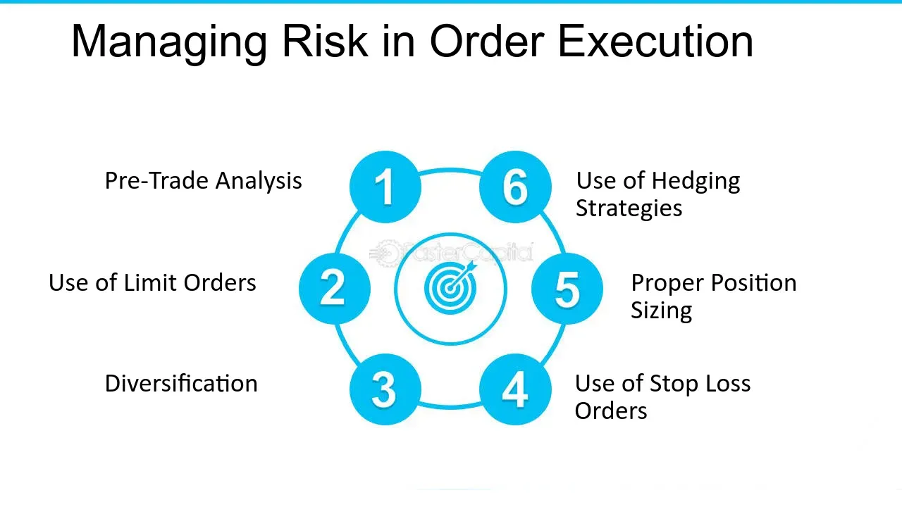

## Table of Contents

## What is order execution in trading?

Order execution in trading is when a trader's order to buy or sell a stock or other financial product is completed. When a trader decides to make a trade, they send an order to their broker. The broker then tries to find someone to take the other side of the trade. Once the broker finds a match, the order is executed, and the trade is done.

This process can happen very quickly, especially with modern technology. The speed of order execution can be important because prices in the market can change fast. If a trader wants to buy a stock at a certain price, but the price goes up before the order is executed, they might end up paying more than they wanted. That's why traders often look for brokers who can execute orders quickly and at the best possible price.

## How does order execution affect trading outcomes?

Order execution can really change how well a trader does. When a trader wants to buy or sell something, they want it to happen fast and at the price they expect. If the order takes too long to be completed, the price might change. For example, if a trader wants to buy a stock at $50, but the price goes up to $52 before the order is done, the trader will have to pay more. This can make the trade less profitable or even cause a loss.

The speed and accuracy of order execution also matter a lot. Some brokers can execute orders faster than others, which can be a big advantage in fast-moving markets. If a trader's order is executed quickly, they are more likely to get the price they want. On the other hand, if the execution is slow, the trader might miss out on good opportunities or get stuck with a bad price. So, choosing a broker with good order execution can make a big difference in trading success.

## What are the different types of order execution?

There are a few main types of order execution that traders use. The first type is called market order execution. When a trader uses a market order, they want to buy or sell something right away at the current market price. This type of order is fast, but the price might be a little different from what the trader expected because the market can change quickly.

Another type is called limit order execution. With a limit order, the trader sets a specific price they want to buy or sell at. The order will only be executed if the market reaches that price. This can help the trader get a better price, but it might take longer for the order to be completed, and there's a chance it won't happen at all if the market doesn't reach the set price.

The last type is stop order execution. A stop order is used to limit losses or protect profits. It becomes a market order once the stock reaches a certain price, called the stop price. For example, if a trader wants to sell a stock if it drops to $40, they can set a stop order at $40. Once the stock hits $40, the order turns into a market order and is executed at the next available price. This type of order helps traders manage risk but doesn't guarantee a specific price.

## What is the difference between market and limit orders?

A market order is when a trader wants to buy or sell something right away at the current market price. It's fast because the order gets done quickly, but the price might not be exactly what the trader expected. The market can change in a blink, so the trader might end up paying a bit more or getting a bit less than they thought.

A limit order is different because the trader sets a specific price they want to buy or sell at. The order will only happen if the market reaches that price. This can help the trader get a better deal, but it might take longer for the order to go through. Sometimes, the market might never reach the set price, so the order might not happen at all.

## How can slippage impact order execution?

Slippage is when the price a trader gets for a trade is different from the price they expected. This can happen during order execution, especially with market orders. When a trader uses a market order, they want to buy or sell fast at the current price. But the market can change quickly, so by the time the order goes through, the price might be a little different. This difference is called slippage, and it can make the trade less profitable or even cause a loss.

Slippage can be a big deal in fast-moving markets or when trading big amounts. If a trader wants to buy a lot of a stock, their order might move the market price. This means the price could go up before the whole order is done, so the trader ends up paying more than they planned. To avoid slippage, traders might use limit orders, which let them set a specific price they're willing to pay. But limit orders can take longer to execute and might not go through if the market doesn't reach the set price.

## What role does a broker play in order execution?

A broker is like a middleman who helps traders buy and sell stocks or other financial products. When a trader wants to make a trade, they send their order to the broker. The broker's job is to find someone on the other side of the trade, like another trader who wants to buy if the first trader wants to sell, or vice versa. Once the broker finds a match, they complete the trade, which is called order execution. Brokers use special systems and technology to do this quickly and at the best possible price.

The broker's role in order execution is really important because it can affect how well a trader does. If the broker can execute orders fast and at good prices, the trader is more likely to be happy with their trades. But if the broker is slow or can't get good prices, the trader might end up paying more or getting less than they wanted. So, choosing a good broker can make a big difference in trading success.

## How do electronic trading platforms facilitate order execution?

Electronic trading platforms make it easier and faster for traders to buy and sell stocks or other financial products. These platforms are like big online marketplaces where traders can send their orders directly. When a trader wants to make a trade, they just need to enter their order into the platform, and the system quickly looks for someone who wants to take the other side of the trade. This can happen in seconds, which is much faster than calling a broker and waiting for them to find a match.

These platforms also help traders get better prices. They show real-time prices from lots of different places, so traders can see the best available prices and choose the one they want. This means traders can often get a better deal than if they were using a traditional broker. Plus, electronic trading platforms can handle lots of orders at the same time, so even if lots of traders are trying to buy or sell at the same time, the orders can still be executed quickly and smoothly.

## What are the best practices for optimizing order execution?

To optimize order execution, traders should first choose a good broker. A broker that can execute orders quickly and at good prices can make a big difference. Traders should look for brokers with fast technology and a good reputation for getting the best prices. It's also important to check if the broker charges low fees, because high fees can eat into profits.

Another important practice is using the right type of order. Market orders are fast but can lead to slippage, where the price changes before the order is done. Limit orders can help avoid slippage by setting a specific price, but they might not get executed if the market doesn't reach that price. Traders should think about what they want from their trade and choose the order type that fits best. For example, if speed is more important than price, a market order might be better, but if getting a certain price is key, a limit order is the way to go.

Lastly, traders should keep an eye on market conditions. In fast-moving markets, orders can take longer to execute, and prices can change quickly. Being aware of what's happening in the market can help traders decide when to place their orders and what type of order to use. By staying informed and adjusting their strategies, traders can improve their chances of getting the best possible outcome from their trades.

## How do regulatory requirements influence order execution?

Regulatory requirements play a big role in how orders are executed. Governments and financial watchdogs make rules to make sure trading is fair and safe. These rules say things like how fast orders need to be done, how prices should be shown, and what information brokers need to give to traders. For example, in the United States, the SEC has rules that say brokers have to try to get the best price for their customers when executing orders. This means brokers have to look at prices from different places and pick the best one.

These rules can affect how brokers do their jobs and what tools they use. Brokers might need special systems to follow the rules, like systems that can execute orders quickly and show the best prices. If a broker doesn't follow the rules, they can get in trouble and have to pay fines. So, traders need to know about these rules too, because they can affect how well their orders are executed and whether they get a good deal. By understanding the rules, traders can make better choices about which brokers to use and how to place their orders.

## What advanced strategies can be used to improve order execution?

One advanced strategy to improve order execution is using [algorithmic trading](/wiki/algorithmic-trading). This is when traders use computer programs to automatically place and manage their orders. These programs can look at lots of data really fast and make smart decisions about when and how to trade. For example, they can break up big orders into smaller ones to avoid moving the market price too much. This can help traders get better prices and avoid slippage. But, setting up these programs can be tricky and might need special skills or help from experts.

Another strategy is using smart order routing. This means sending orders to different places to get the best price. Smart order routing systems can look at prices from lots of different markets and pick the one that's best for the trader. This can help avoid big price changes and make sure the order gets done at a good price. It's like shopping around to find the best deal. Traders can use this strategy to make sure their orders are executed as well as possible, but they need to make sure their broker supports smart order routing and that they understand how it works.

## How does order execution vary across different financial markets?

Order execution can be different in various financial markets because each market has its own rules and ways of doing things. In the stock market, orders are usually executed through big electronic systems that match buyers and sellers. These systems can handle lots of orders at the same time and are really fast. But in the foreign exchange market, or [forex](/wiki/forex-system), trading happens all over the world and can be more spread out. Forex traders often use brokers who can connect them to different markets and banks to get the best prices.

In the futures market, which is for trading contracts to buy or sell something in the future, orders are often executed through big exchanges like the Chicago Mercantile Exchange. These exchanges have special rules about how orders are handled and when they can be executed. On the other hand, in the [cryptocurrency](/wiki/cryptocurrency) market, trading can happen on lots of different platforms, and the rules can be different from one place to another. This can make order execution more complicated because traders need to keep track of prices and rules on different platforms.

## What are the future trends in order execution technology?

In the future, order execution technology is going to get even faster and smarter. Right now, computers help traders a lot, but soon they will be able to do even more. They will use something called [artificial intelligence](/wiki/ai-artificial-intelligence), or AI, to look at lots of data and make quick decisions. This means traders can get their orders done faster and at better prices. Also, new technology will make it easier for traders to connect to different markets all over the world, so they can find the best deals no matter where they are.

Another big trend is blockchain technology. Blockchain is like a special way of keeping records that lots of people can see and trust. It can make trading safer and more transparent. In the future, blockchain might be used to make sure orders are executed fairly and that everyone can see what's happening. This could help stop fraud and make traders feel more confident about their trades. Overall, these new technologies will make order execution better and more reliable for everyone.

## References & Further Reading

[1]: Bergstra, J., Bardenet, R., Bengio, Y., & Kégl, B. (2011). ["Algorithms for Hyper-Parameter Optimization."](https://dl.acm.org/doi/10.5555/2986459.2986743) Advances in Neural Information Processing Systems 24.

[2]: ["Advances in Financial Machine Learning"](https://www.amazon.com/Advances-Financial-Machine-Learning-Marcos/dp/1119482089) by Marcos Lopez de Prado

[3]: ["Evidence-Based Technical Analysis: Applying the Scientific Method and Statistical Inference to Trading Signals"](https://www.amazon.com/Evidence-Based-Technical-Analysis-Scientific-Statistical/dp/0470008741) by David Aronson

[4]: ["Machine Learning for Algorithmic Trading"](https://github.com/stefan-jansen/machine-learning-for-trading) by Stefan Jansen

[5]: ["Quantitative Trading: How to Build Your Own Algorithmic Trading Business"](https://www.amazon.com/Quantitative-Trading-Build-Algorithmic-Business/dp/1119800064) by Ernest P. Chan