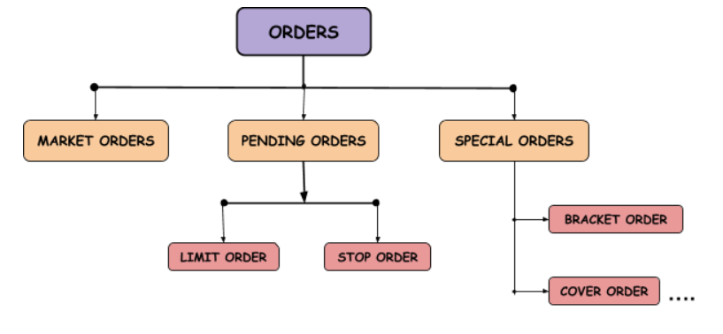

## Table of Contents

## What is order in financial markets?

In financial markets, an order is a request by an investor to buy or sell a specific amount of a financial asset, like stocks, bonds, or commodities. When someone wants to buy or sell something in the market, they place an order through a broker or an online trading platform. The order includes details like the type of asset, the quantity, and the price at which the investor wants to trade.

There are different types of orders, such as market orders and limit orders. A market order is an instruction to buy or sell at the current market price, which means the trade will happen quickly but the exact price might be slightly different from what was expected. On the other hand, a limit order allows the investor to set a specific price at which they are willing to buy or sell. This type of order might not be executed immediately if the market price doesn't reach the specified limit, but it gives the investor more control over the price.

Orders are important because they help keep the financial markets running smoothly. They allow investors to enter and exit positions in a systematic way, and they help match buyers with sellers. By understanding and using different types of orders, investors can manage their trades more effectively and according to their investment strategies.

## What are the basic types of orders in financial markets?

In financial markets, there are two main types of orders that people use to buy or sell things like stocks or bonds: market orders and limit orders. A market order is when you tell your broker to buy or sell something right away at the current price. This means your order will happen quickly, but the exact price might be a little different from what you see at that moment. Market orders are good if you want to make a trade fast.

A limit order is different because you set a specific price at which you want to buy or sell. For example, if you want to buy a stock, you can say you'll only buy it if the price drops to a certain level. This gives you more control over the price, but there's a chance your order won't happen if the market price never reaches your limit. Limit orders are useful if you want to be sure you're getting a good deal.

Besides these, there are other types of orders like stop orders and stop-limit orders, but market and limit orders are the most common. A stop order turns into a market order once the stock reaches a certain price, and a stop-limit order turns into a limit order at that price. Understanding these basic types of orders can help you trade more effectively in the financial markets.

## How does a market order work?

A market order is a simple way to buy or sell something in the financial markets. When you place a market order, you're telling your broker to buy or sell a stock, bond, or other asset right away at the best available price. This means your order will happen quickly, usually within seconds. It's like saying, "I want to buy this stock now, no matter what the exact price is at this moment."

The main thing to know about market orders is that the price you get might be a little different from what you see when you place the order. This is because the price can change very fast in the market. If you're okay with that, a market order is a good choice because it's fast and easy. But if you want to be sure you're getting a specific price, you might want to use a different type of order, like a limit order.

## What is a limit order and how is it different from a market order?

A limit order is a way to buy or sell something in the financial markets at a specific price that you choose. When you place a limit order, you tell your broker, "I want to buy this stock, but only if the price drops to this amount," or "I want to sell this stock, but only if the price goes up to this amount." This gives you more control over the price you pay or receive. The downside is that your order might not happen right away, or at all, if the market price never reaches your limit.

The main difference between a limit order and a market order is how they handle the price. A market order says, "Buy or sell this right now at the best available price," so it happens quickly but the exact price might be a bit different from what you see. A limit order, on the other hand, says, "Only buy or sell at this specific price," so it gives you more control but might take longer or not happen at all. If you want to make a trade fast and don't mind a small difference in price, use a market order. If you want to be sure you're getting a good deal and are okay with waiting, use a limit order.

## Can you explain stop orders and their uses?

A stop order is a type of order you can use in the financial markets to buy or sell something when the price reaches a certain level. It's like setting a trigger. For example, if you own a stock and you want to sell it if the price drops to a certain point, you can set a stop order at that price. When the stock hits that price, the stop order turns into a market order, which means it will sell the stock at the best available price at that moment. This can help you limit your losses if the price starts to fall.

Stop orders are useful for managing risk. If you're worried that a stock you own might go down a lot, a stop order can help you get out before it falls too far. It's a way to protect your investment. But remember, because a stop order turns into a market order, the price you get might be a bit different from your stop price, especially if the market is moving fast. So, while stop orders can help you manage risk, they don't guarantee a specific price.

## What are the advantages and disadvantages of using stop-loss orders?

Stop-loss orders can be really helpful for managing risk. They let you set a price at which you want to sell a stock if it starts to drop. This can help you limit your losses and protect your money. For example, if you bought a stock at $50 and you set a stop-loss order at $45, the stock will be sold automatically if the price hits $45. This way, you don't have to watch the market all the time, and you can avoid big losses if the stock price falls a lot.

But stop-loss orders also have some downsides. One big problem is that the price you get when the stop-loss order turns into a market order might be different from your stop price. If the market is moving fast, you might end up selling your stock for less than you expected. Also, sometimes the stock price might drop to your stop price but then go back up quickly. If that happens, your stop-loss order will still sell the stock, and you might miss out on the chance to make more money if the price goes up again. So, while stop-loss orders can help protect you, they don't always work perfectly.

## How do trailing stop orders function in trading?

A trailing stop order is a special kind of stop order that helps you manage your trades while also trying to make more money. It works by setting a stop price that moves along with the market price. For example, if you set a trailing stop order with a $2 distance on a stock you bought at $50, the stop price will be $48 at first. If the stock price goes up to $55, the stop price will move up to $53, keeping the $2 distance. This way, if the stock keeps going up, your stop price follows it, giving you a chance to sell at a higher price if the stock starts to drop.

The main advantage of a trailing stop order is that it can help you lock in profits as the stock price rises. If the stock price suddenly drops, the trailing stop will trigger a sale, and you'll still make some money because the stop price moved up with the stock. But there are also some risks. If the stock price jumps up and then back down very quickly, the trailing stop might sell your stock at a lower price than you hoped. Also, like all stop orders, a trailing stop doesn't guarantee a specific price because it turns into a market order when it's triggered. So, while trailing stops can be useful, they need to be used carefully.

## What are conditional orders and when might they be used?

Conditional orders are special types of orders in the financial markets that only happen if certain things happen first. They are like setting up rules for when you want to buy or sell something. For example, you might say, "I want to buy this stock, but only if it goes up by 5% today." If the stock doesn't go up by 5%, your order won't happen. This can help you make smarter trades by waiting for the right moment.

People use conditional orders when they want to be more careful about when they buy or sell. They are useful if you have a specific plan or if you want to make sure the market is moving in a way you like before you make a trade. For example, if you think a stock will go up after a company announces good news, you can set a conditional order to buy the stock right after the news comes out. This way, you don't have to watch the market all the time and can still make your trade at the right time.

## How do iceberg orders help in managing large trades?

Iceberg orders are a special type of order that helps people trade large amounts of stocks without showing everyone how much they want to buy or sell. When you use an iceberg order, only a small part of your total order shows up in the market at a time. This is like the tip of an iceberg, where you can only see a little bit above the water, but there's a lot more hidden below. By showing just a small part of the order, it helps keep the market from moving too much because of your big trade.

This can be really helpful if you want to buy or sell a lot of stock without making the price go up or down too much. If everyone knew you wanted to buy a million shares, the price might go up because other people would want to sell to you at a higher price. But with an iceberg order, you can slowly buy or sell your shares without everyone knowing your full plan. This way, you can get a better price and not scare the market with your big trade.

## What role do algorithmic orders play in modern trading?

Algorithmic orders, often called algo orders, are a big part of trading today. They use computer programs to buy or sell stocks based on rules you set up. These rules can be about the price, the time, or even how the market is moving. Traders like algo orders because they can handle big trades without making the market go crazy. They can also find the best times to trade and do it all really fast, which is hard for a person to do by themselves.

Algo orders are used a lot by big investors like banks and hedge funds. They help these big players trade without everyone knowing what they're doing, which can keep the market stable. But algo orders aren't just for the big guys. Regular people can use them too, through their brokers. They can help you make smarter trades and maybe even make more money. But you have to be careful because algo orders can be tricky, and if you don't set them up right, they might not work the way you want.

## How do dark pool orders affect market transparency and liquidity?

Dark pool orders are trades that happen away from public stock exchanges. They are called "dark" because the details of these trades, like the price and the amount of stock being traded, are not shown to everyone in the market. This can make the market less transparent because people can't see all the trades happening. If a lot of trading happens in dark pools, it can be harder for everyone to know what's really going on in the market. This might make some people feel like the market is not fair because they don't have all the information.

On the other hand, dark pool orders can help with [liquidity](/wiki/liquidity-risk-premium), which means making it easier to buy and sell stocks. Big investors like to use dark pools because they can trade large amounts of stock without moving the market price too much. If a big investor tried to buy a lot of stock on a public exchange, the price might go up because everyone would see what they were doing. But in a dark pool, they can trade without everyone knowing, which can help keep the market stable. So, while dark pools might make the market less transparent, they can also make it easier for big trades to happen without causing big price changes.

## What are the regulatory considerations for different types of orders in financial markets?

Regulators keep a close eye on different types of orders in financial markets to make sure everything is fair and transparent. For example, market orders and limit orders are pretty straightforward, but regulators still set rules to make sure brokers handle these orders correctly. They want to stop any bad practices, like front-running, where someone might trade ahead of a big order to make a quick profit. Regulators also make sure that the prices people get for their market orders are fair and that limit orders are filled according to the rules.

More complex orders like stop orders, trailing stop orders, and algorithmic orders have extra rules to follow. These orders can be tricky because they might affect the market in ways that are hard to predict. Regulators want to make sure these orders are used correctly and don't cause problems like sudden big price changes. For example, they might set limits on how fast an algorithmic order can trade or require more transparency about how these orders work. This helps keep the market stable and fair for everyone.

Dark pool orders also get special attention from regulators because they can make the market less transparent. Regulators want to balance the benefits of dark pools, like better liquidity for big trades, with the need for a fair and open market. They might require dark pools to report more information about their trades or set rules about who can use them and how. This way, regulators can help make sure that dark pools don't harm the overall market while still letting them help with big trades.

## References & Further Reading

[1]: Aldridge, I. (2013). "[High-Frequency Trading: A Practical Guide to Algorithmic Strategies and Trading Systems](https://www.wiley.com/en-us/High+Frequency+Trading%3A+A+Practical+Guide+to+Algorithmic+Strategies+and+Trading+Systems%2C+2nd+Edition-p-9781118343500)." Wiley.

[2]: Harris, L. (2002). "[Trading and Exchanges: Market Microstructure for Practitioners](https://www.acsu.buffalo.edu/~keechung/MGF743/Readings/Trading-Exchanges-Market-Microstructure-Practitioners%20Draft%20Copy.pdf)." Oxford University Press.

[3]: Kissell, R. (2013). "[The Science of Algorithmic Trading and Portfolio Management](https://www.sciencedirect.com/book/9780124016897/the-science-of-algorithmic-trading-and-portfolio-management)." Academic Press.

[4]: Narang, R.K. (2013). "[Inside the Black Box: A Simple Guide to Quantitative and High-Frequency Trading](https://onlinelibrary.wiley.com/doi/book/10.1002/9781118662717)." Wiley.

[5]: Hull, J. (2015). "[Options, Futures, and Other Derivatives](https://www.amazon.com/Options-Futures-Other-Derivatives-9th/dp/0133456315)." Pearson.

[6]: Hasbrouck, J. (2007). "[Empirical Market Microstructure: The Institutions, Economics, and Econometrics of Securities Trading](https://academic.oup.com/book/52241)." Oxford University Press.

[7]: Wooldridge, J.M. (2016). "[Introductory Econometrics: A Modern Approach](https://faculty.cengage.com/titles/9781337558860)." Cengage Learning.