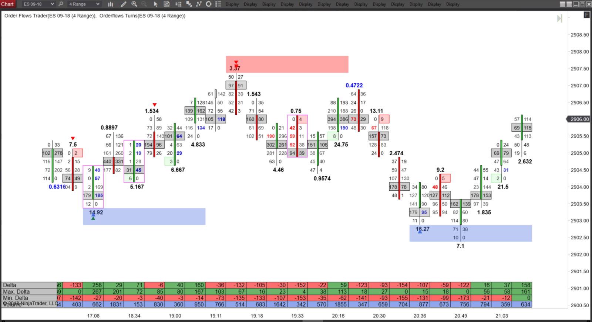

## Table of Contents

## What is order flow analysis?

Order flow analysis is a way to understand how people are buying and selling in the stock market. It looks at the orders that traders place, like whether they want to buy or sell, and at what price. By studying this information, traders can get a better idea of what might happen to the price of a stock next. It's like trying to predict the future by looking at what people are doing right now.

This type of analysis can be really helpful for traders who want to make quick decisions. They use special tools and charts to see the order flow in real time. This helps them spot trends and patterns that might not be obvious just by looking at the stock price alone. For example, if a lot of people are suddenly placing buy orders, it might mean the price is about to go up. By paying attention to these signals, traders can try to make smarter trades and hopefully make more money.

## Why is order flow analysis important in trading?

Order flow analysis is important in trading because it helps traders see what is really happening in the market. Instead of just looking at the final price of a stock, order flow analysis looks at all the buy and sell orders that people are placing. This gives traders a clearer picture of whether more people want to buy or sell a stock at any given moment. By understanding this, traders can make better guesses about where the price might go next.

This kind of analysis is especially useful for traders who make quick decisions. They use special tools to watch the order flow in real time, which helps them spot trends and patterns that others might miss. For example, if a lot of big buy orders come in suddenly, it might mean the price is about to go up. By paying attention to these signals, traders can try to buy or sell at the right time and hopefully make more money.

## How does order flow analysis differ from technical analysis?

Order flow analysis and technical analysis are two different ways to look at the stock market. Order flow analysis looks at the actual buy and sell orders that traders place. It's like watching the behind-the-scenes action of the market to see who is buying and who is selling. This helps traders understand the real demand and supply for a stock at any given moment. By seeing these orders in real time, traders can spot trends and make quick decisions based on what's happening right now.

On the other hand, technical analysis focuses on the historical price and [volume](/wiki/volume-trading-strategy) data of a stock. It uses charts and indicators to find patterns and trends that might predict future price movements. Technical analysts believe that all the information they need is already in the price and volume data, so they don't need to look at the individual orders. Instead, they study things like moving averages, support and resistance levels, and other chart patterns to make their trading decisions.

Both methods have their strengths. Order flow analysis gives traders a more immediate and detailed view of market activity, which can be really helpful for short-term trading. Technical analysis, on the other hand, provides a broader view of market trends over time, which can be useful for longer-term investing. Many traders use both methods together to get a complete picture of the market and make the best possible trading decisions.

## What are the key components of order flow?

Order flow is all about looking at the buy and sell orders that people place in the market. The first key part of order flow is the bid and ask prices. The bid price is what people are willing to pay to buy a stock, and the ask price is what people are asking to sell it for. The difference between these two prices is called the spread. By watching how these prices change, traders can see if more people want to buy or sell a stock.

Another important part of order flow is the volume of orders. This means how many orders are coming in and how big they are. If a lot of big buy orders come in quickly, it might mean the price is about to go up. On the other hand, if there are a lot of big sell orders, the price might go down. Traders also look at the [order book](/wiki/order-book-trading-strategies), which is a list of all the buy and sell orders waiting to be filled. By studying the order book, traders can see where the big orders are and guess what might happen next.

## How can one identify buying and selling pressure using order flow?

To identify buying and selling pressure using order flow, you need to look at the bid and ask prices and the volume of orders. The bid price is what people are willing to pay to buy a stock, and the ask price is what people want to sell it for. If the bid price is going up and there are a lot of buy orders coming in, it means there's a lot of buying pressure. This happens when more people want to buy the stock than sell it, which can push the price higher. On the other hand, if the ask price is going down and there are a lot of sell orders, it shows there's a lot of selling pressure. This means more people want to sell the stock than buy it, which can push the price lower.

You can also look at the order book to see the buying and selling pressure. The order book is like a list of all the buy and sell orders waiting to be filled. If you see a lot of big buy orders at the top of the order book, it means there's strong buying pressure. These big orders can soak up a lot of sell orders and keep the price from falling. If you see a lot of big sell orders at the top, it means there's strong selling pressure. These big orders can overwhelm the buy orders and push the price down. By watching these things, you can get a good idea of whether the market is leaning towards buying or selling.

## What tools are commonly used for order flow analysis?

Order flow analysis uses special tools to help traders see what's happening in the market. One common tool is the Level II quotes, which show the bid and ask prices and the size of the orders. This helps traders see the buying and selling pressure in real time. Another tool is the Time and Sales window, which shows every trade that happens, including the price and the number of shares traded. By watching this, traders can see if there's a lot of buying or selling going on.

Another important tool is the order book, which lists all the buy and sell orders waiting to be filled. Traders can use this to see where the big orders are and guess what might happen next. Some traders also use software like Volume Profile or Market Delta, which show the volume of trades at different price levels. These tools help traders spot trends and patterns that might not be obvious just by looking at the price alone. By using these tools together, traders can get a better understanding of the market and make smarter trading decisions.

## How does the order book contribute to order flow analysis?

The order book is like a list that shows all the buy and sell orders waiting to be filled. It helps traders see where the big orders are and understand the buying and selling pressure. If there are a lot of big buy orders at the top of the order book, it means there's strong buying pressure. These big orders can soak up a lot of sell orders and keep the price from falling. On the other hand, if there are a lot of big sell orders at the top, it means there's strong selling pressure. These big orders can overwhelm the buy orders and push the price down.

By looking at the order book, traders can get a good idea of what might happen next. For example, if the order book shows a lot of buy orders at a certain price, it might mean the price is about to go up. Traders can use this information to make quick decisions and try to buy or sell at the right time. The order book is a key part of order flow analysis because it gives traders a clear picture of the market's demand and supply at any given moment.

## What are some common order flow trading strategies?

One common order flow trading strategy is called "order flow imbalance." Traders using this strategy look for times when there are a lot more buy orders than sell orders, or vice versa. If there are a lot more buy orders, it means there's a lot of buying pressure, and the price might go up soon. So, the trader would buy the stock quickly to try to make money when the price goes up. On the other hand, if there are a lot more sell orders, it means there's a lot of selling pressure, and the price might go down. The trader would then sell the stock quickly to avoid losing money.

Another strategy is called "volume analysis." Traders using this strategy watch the volume of trades to see if there's a big change. If the volume suddenly goes up a lot, it might mean something important is happening. For example, if a lot of people are suddenly buying a stock, it could mean the price is about to go up. Traders would then buy the stock to try to make money from the price increase. If a lot of people are suddenly selling, it could mean the price is about to go down, and traders would sell the stock to avoid losing money.

A third strategy is "order book analysis." Traders using this strategy look at the order book to see where the big orders are. If they see a lot of big buy orders at a certain price, they might think the price is about to go up. They would then buy the stock at that price to try to make money. If they see a lot of big sell orders at a certain price, they might think the price is about to go down. They would then sell the stock at that price to avoid losing money. By watching the order book, traders can make quick decisions based on what they see.

## How can order flow analysis be used to predict market movements?

Order flow analysis helps traders predict market movements by looking at the buy and sell orders that people place. When traders see a lot of buy orders coming in, it means there's a lot of buying pressure. This can push the price of a stock up because more people want to buy it than sell it. On the other hand, if there are a lot of sell orders, it means there's a lot of selling pressure. This can push the price down because more people want to sell the stock than buy it. By watching these orders, traders can guess what might happen to the price next.

Traders also use tools like the order book to help them predict market movements. The order book shows all the buy and sell orders waiting to be filled. If there are big buy orders at a certain price, it might mean the price is about to go up. Traders can use this information to buy the stock quickly and try to make money from the price increase. If there are big sell orders at a certain price, it might mean the price is about to go down. Traders can then sell the stock quickly to avoid losing money. By paying attention to these signals, traders can make better guesses about where the market is headed.

## What are the limitations and challenges of order flow analysis?

Order flow analysis can be really helpful, but it also has some limitations and challenges. One big challenge is that it can be hard to get all the data you need. Not all markets show all the buy and sell orders, so you might not see the full picture. Also, the data can change really fast, so you need to be quick to make decisions. If you're not fast enough, you might miss out on good trading chances.

Another limitation is that order flow analysis can be tricky to understand. It's not always easy to tell what the orders mean. Sometimes, big orders might not lead to big price changes, and small orders can have a big impact. This can make it hard to predict what will happen next. Plus, order flow analysis works best for short-term trading, so it might not be as useful if you're trying to make long-term investments.

## How does order flow analysis integrate with other forms of market analysis?

Order flow analysis can be used together with other types of market analysis to give traders a better understanding of the market. For example, traders often use order flow analysis along with technical analysis. Technical analysis looks at the historical price and volume data of a stock to find patterns and trends. By combining order flow analysis with technical analysis, traders can see both the real-time buying and selling pressure and the longer-term trends. This can help them make smarter trading decisions by understanding both the immediate market action and the bigger picture.

Another way to integrate order flow analysis is with [fundamental analysis](/wiki/fundamental-analysis). Fundamental analysis looks at the financial health and performance of a company to decide if its stock is a good buy. By using order flow analysis with fundamental analysis, traders can see if the market's buying and selling pressure matches up with the company's actual value. If a company is doing well but there's a lot of selling pressure, it might be a good time to buy because the stock could be undervalued. By looking at both the order flow and the company's fundamentals, traders can get a complete view of the market and make better-informed trades.

## What advanced techniques can be applied to enhance order flow analysis?

One advanced technique to enhance order flow analysis is using algorithms and automated trading systems. These systems can process a lot of data very quickly and make trading decisions based on the order flow. For example, an algorithm might look for patterns in the order book and the time and sales data to find the best times to buy or sell. This can help traders make decisions faster and more accurately than they could on their own. By using these systems, traders can take advantage of small price movements that might be hard to spot otherwise.

Another technique is combining order flow analysis with other types of data, like news and social media sentiment. Traders can use special software to see how news stories or social media posts are affecting the buying and selling pressure. If a lot of people are talking about a stock on social media, it might lead to more buy or sell orders. By looking at this information along with the order flow, traders can get a better idea of what might happen to the stock price. This can help them make more informed trading decisions and maybe even predict big price movements before they happen.

## References & Further Reading

[1]: Kissell, R. (2013). ["The Science of Algorithmic Trading and Portfolio Management"](https://www.sciencedirect.com/book/9780124016897/the-science-of-algorithmic-trading-and-portfolio-management). Academic Press.

[2]: Bouchaud, J-P., & Bonart, J.B. (2014). ["Trades, Quotes and Prices: Financial Markets Under the Microscope"](https://www.semanticscholar.org/paper/Trades%2C-Quotes-and-Prices%3A-Financial-Markets-Under-Bouchaud-Bonart/5822f8496a8a497f7038d15bb3413fb54528da8b). Cambridge University Press.

[3]: Harris, L. (2002). ["Trading and Exchanges: Market Microstructure for Practitioners"](https://academic.oup.com/book/52292). Oxford University Press.

[4]: Kyle, A. S. (1985). ["Continuous Auctions and Insider Trading"](https://personal.utdallas.edu/~nina.baranchuk/Fin7310/papers/Kyle1985.pdf). Econometrica, 53(6), 1315-1335.

[5]: "Order Flow in the FX Market" - A White Paper from LMAX Group, available at [LMAX Exchange](https://www.lmax.com/fx-market-leadership). 

[6]: Lopez de Prado, M. (2018). ["Advances in Financial Machine Learning"](https://www.amazon.com/Advances-Financial-Machine-Learning-Marcos/dp/1119482089). Wiley. 

[7]: Jansen, S. (2020). ["Machine Learning for Algorithmic Trading"](https://github.com/stefan-jansen/machine-learning-for-trading). Packt Publishing. 

[8]: Chan, E. P. (2009). ["Quantitative Trading: How to Build Your Own Algorithmic Trading Business"](https://github.com/ftvision/quant_trading_echan_book). Wiley.