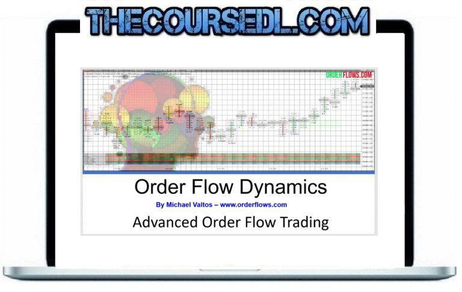

Order Flow Dynamics in algorithmic trading is an emerging concept that offers a significant edge to traders wanting to understand market mechanics more deeply. The core idea revolves around analyzing the flow of buy and sell orders, which allows traders to gauge the supply and demand dynamics effectively. By understanding these dynamics, traders gain insights into the subtle forces driving price fluctuations and market trends.

The concept of order flow analysis is integral to modern trading methodologies. It involves scrutinizing the interactions among various market participants, such as buyers, sellers, and market makers, to observe how their actions influence price action. This analytical approach furnishes traders with valuable information regarding market sentiment and potential future movements.



Orderflows Algo is one of the tools that exploit order flow dynamics to enhance trading precision and consistency. By utilizing real-time data, this tool helps traders identify zones of liquidity and potential price reversals with greater accuracy. Such advanced analytical tools provide traders with the capability to optimize their trading strategies by aligning them more closely with the underlying market mechanics.

Overall, the potential of order flow analysis lies in its ability to transform traditional trading strategies by providing deeper insights into the market forces at play. Whether through enhanced decision-making or improved prediction of price movements, mastering the understanding of order flow is becoming increasingly critical for both retail and institutional traders.

## Table of Contents

## Understanding Order Flow Analysis in Algo Trading

Order flow is a pivotal element in algorithmic trading, representing the mechanism through which buy and sell orders are issued, executed, and managed within the market. This process provides valuable insights into the underlying market mechanics and is integral for developing robust trading strategies.

Algorithmic trading utilizes order flow dynamics to refine the decision-making process. Algorithms are designed to interpret and analyze the continuous stream of order flow data, enabling the identification of market trends and opportunities. By comprehensively understanding these dynamics, trading algorithms can enhance precision in timing transactions, ultimately optimizing trade execution.

The real-time analysis of order flow offers a window into the current market equilibrium between buyers and sellers. This balance is crucial as it influences price movements and [volatility](/wiki/volatility-trading-strategies). When traders analyze real-time order flow, they gain the ability to gauge the intensity of supply and demand at any given moment. This analysis is instrumental in determining points where price levels may shift or [momentum](/wiki/momentum) might accelerate.

Order flow analysis also sheds light on how these flows impact price action. By examining the sequence and magnitude of trades, traders can discern patterns that may signal upcoming price changes. For example, a surge in buy orders without a corresponding rise in sell orders could indicate potential upward momentum. Conversely, a predominance of sell orders may foreshadow a downward price movement.

In summary, understanding order flow in [algorithmic trading](/wiki/algorithmic-trading) is essential for crafting effective trading strategies. It allows traders to interpret market sentiments and forecast price movements accurately. By integrating order flow dynamics into algorithmic systems, traders are better equipped to navigate the market landscape, enhancing their potential for success.

## Order Driven Markets: Key Players and Their Roles

Order-driven markets fundamentally rely on the continuous interaction between key market participants: individual traders, institutional investors, and market makers. Each actor plays a decisive role in shaping the order flow dynamics, which in turn influences price movements within the market.

Individual traders, or retail traders, are distinguished by their relatively smaller trade sizes and their tendency to focus on short-term trading opportunities. They often react swiftly to market changes, contributing to intra-day [liquidity](/wiki/liquidity-risk-premium). Their trades may be influenced by technical analysis, market news, or a combination of both. Despite their smaller trade sizes, the collective actions of individual traders can lead to significant order flow, particularly in highly liquid markets.

Institutional investors, including hedge funds, mutual funds, and pension funds, typically operate with larger capital bases. Their trades are often executed over longer time horizons compared to individual traders. The large [volume](/wiki/volume-trading-strategy) of their orders can have a pronounced impact on order flow and price dynamics. Institutional strategies might involve significant transactions that aim to either acquire or liquidate sizable positions discreetly, often by breaking them into smaller orders to minimize market impact.

Market makers are integral to order-driven markets by continuously quoting buy and sell prices, thereby providing liquidity and narrowing bid-ask spreads. They stand ready to buy and sell securities, profiting from the spread between the buy (bid) and sell (ask) prices. Market makers help stabilize the market by absorbing excess supply or demand, thus playing a crucial role in mitigating price volatility. Their activities ensure that there is always a counterparty for traders who wish to enter or [exit](/wiki/exit-strategy) the market.

Understanding the motivations and strategies of these participants can provide strategic advantages in trading. For instance, recognizing when institutional traders are active can indicate potential large-scale moves, while patterns in market maker behavior can signal liquidity shifts. By analyzing these interactions and the ensuing order flow, traders can better predict price movements and adjust their strategies accordingly. This intricate understanding of market dynamics is essential for developing robust trading strategies that exploit order flow imbalances.

## Analyzing Order Flow Dynamics: Tools and Techniques

Analyzing order flow dynamics involves scrutinizing two primary elements: bid-ask spreads and market depth. The bid-ask spread is the difference between the highest price a buyer is willing to pay for an asset and the lowest price a seller is willing to accept. This spread provides insight into the liquidity of the market and potential volatility; narrower spreads typically indicate a highly liquid market, while wider spreads suggest lower liquidity and potentially more volatility.

Market depth, on the other hand, reflects the market's ability to sustain large orders without significant impact on the price. It showcases the quantity of buy and sell orders at various price levels. A deep market with many orders on both sides suggests stability and can absorb substantial trades without major price fluctuations. Conversely, a shallow market might experience significant price shifts with relatively small trades.

Technical tools like Orderflows Algo enhance the analysis of order flow dynamics by offering a comprehensive overview of concentrated orders. These tools allow traders to see the distribution of buy and sell orders across the market, identifying zones where the probability of price movement is higher due to order accumulation.

Advanced analytics and visual tools are crucial in transforming raw order flow data into actionable insights. These tools can employ sophisticated algorithms and visual representations to highlight high-probability trading zones. Heatmaps, volume profile tools, and [order book](/wiki/order-book-trading-strategies) visualization are examples that help traders pinpoint areas with significant order concentration. For instance, heatmaps can visually represent where order clusters exist, guiding traders to potential support and resistance levels.

Here's a basic Python example of how data might be processed to create a simple order flow visualization using matplotlib and numpy:

```python
import numpy as np
import matplotlib.pyplot as plt

# Simulated order flow data
price_levels = np.linspace(100, 110, 100)
buy_orders = np.random.poisson(20, 100)
sell_orders = np.random.poisson(15, 100)

plt.figure(figsize=(12, 6))
plt.bar(price_levels, buy_orders, width=0.1, color='green', label='Buy Orders')
plt.bar(price_levels, -sell_orders, width=0.1, color='red', label='Sell Orders')
plt.title('Order Book Visualization')
plt.xlabel('Price Level')
plt.ylabel('Number of Orders')
plt.legend()
plt.show()
```

In this example, the green bars represent buy orders, while the red bars indicate sell orders at various price levels. By examining visuals like these, traders can better understand where significant buying or selling pressure may affect an asset's price.

In summary, analyzing order flow dynamics through bid-ask spreads and market depth, supported by tools such as Orderflows Algo, enables traders to identify high-probability trading zones. Utilizing advanced analytics and visualization techniques translates complex data into discernible market signals, equipping traders with the insights needed to enhance decision-making and trading precision.

## Impact of Order Flow on Price Movements

Order flow dynamics play a pivotal role in determining price movements within financial markets. These dynamics encapsulate the collective trading decisions of all market participants, thereby offering a lens through which traders can interpret market sentiment and anticipate future trends. Large buy or sell orders, commonly referred to as block trades, exert considerable influence on market prices. When such orders are executed, they can create supply and demand imbalances that drive price movements. For example, a substantial buy order may lead to a scarcity of available shares for purchase, prompting price increases as buyers compete for the remaining shares. Conversely, a large sell order can flood the market with excess supply, potentially driving prices down as sellers attempt to offload their positions.

The concept of order imbalances is central to understanding the impact of order flow on price movements. An order imbalance occurs when there is a significant discrepancy between buy and sell orders in the market. Such imbalances are indicative of shifting market sentiment and can serve as precursors to price changes. For instance, a persistent imbalance where buy orders consistently outweigh sell orders may signal bullish sentiment, suggesting that prices could trend upwards. Conversely, a sell-side imbalance could indicate bearish sentiment, forecasting potential price declines.

To quantitatively analyze these dynamics, traders often employ various analytical tools and techniques. One approach involves examining the order book, which provides a detailed view of pending buy and sell orders at different price levels. By analyzing the liquidity and depth of the order book, traders can identify potential support and resistance levels—areas where large numbers of orders are concentrated, potentially halting or reversing price movements.

In addition, sophisticated algorithms and [machine learning](/wiki/machine-learning) models are increasingly used to process and interpret large volumes of order flow data in real-time. These models can identify patterns and anomalies that may not be immediately apparent through traditional analysis. For example, clustering algorithms can detect unusual clustering of buy or sell orders, which could signal upcoming price shifts.

The effect of order flow on price movements is not uniform across all markets or instruments. Factors such as market structure, participant behavior, and external economic conditions can modify its impact. As such, traders must consider a multifaceted approach, integrating order flow analysis with other market indicators and news events to formulate comprehensive trading strategies.

In summary, understanding and interpreting order flow dynamics is crucial for anticipating market trends and making informed trading decisions. By recognizing patterns of large orders and order imbalances, traders can gain insights into market sentiment and position themselves advantageously within the evolving market landscape.

## Strategies for Leveraging Order Flow in Algo Trading

Scalping and momentum trading stand out as widely adopted strategies in algorithmic trading, capitalizing on order flow analysis to refine entry and exit points. Scalping involves executing numerous trades over very short periods, aiming to capture small price movements. By analyzing real-time order flow, scalpers identify immediate shifts in supply and demand, allowing them to preemptively position trades with high precision. This strategy demands robust execution speeds and minimal latency to gain a competitive edge.

Momentum trading, another strategic approach, involves capitalizing on the continued trajectory of an asset's price. Traders utilizing order flow dynamics can detect robust buying or selling pressure, offering insights into persistent trends. By monitoring order book imbalances and large trade executions, momentum traders can align themselves with dominant market directions, optimizing their entry and exit decisions.

Reversal trading strategies offer another avenue by relying on identifying potential order flow exhaustion points, which are indicators of impending price reversals. By scrutinizing the intricacies of order flow, traders can pinpoint when buying or selling pressure may be waning. These signs of potential exhaustion enable traders to anticipate price corrections, allowing them to prepare reversal trades that capitalize on these expected market shifts.

Order Flow Analysis also aids traders in optimizing liquidity analysis and real-time trading decisions. By examining market depth and the bid-ask spreads, traders obtain a nuanced understanding of the liquidity landscape, facilitating more informed trade placements. Enhancing liquidity analysis through order flow dynamics ensures that trades are executed with reduced slippage and at optimal price points, thereby improving overall trading performance and efficiency.

By integrating these strategies, traders leverage the full potential of order flow analysis, enhancing their trading accuracy and profitability in the ever-evolving landscape of algorithmic trading.

## Challenges and Limitations in Order Flow Analysis

Order flow analysis, while a powerful tool for traders, is not without its challenges and limitations. One of the primary issues is data availability. Access to comprehensive and high-quality order flow data can be limited and costly. Many retail traders may not have the resources to obtain real-time data feeds that are crucial for accurate order flow analysis. This data limitation can hinder the ability to make timely and informed trading decisions.

Market noise is another significant challenge. The financial markets are influenced by a myriad of factors, and the abundance of data can sometimes act as noise, obscuring valuable trading signals. High-frequency trading ([HFT](/wiki/high-frequency-trading-strategies)) and algorithmic decisions contribute to this noise, as they introduce rapid order modifications and cancellations that may not reflect genuine market sentiment. These activities can distort order flow signals, making it difficult for traders to distinguish between short-term market fluctuations and meaningful trends.

The complexity of modern trading environments further complicates order flow analysis. The integration of multiple markets and the speed at which trading occurs require advanced analytical tools and algorithms to process and interpret data efficiently. This complexity necessitates a robust understanding of both market mechanics and technology, posing a barrier for less-advanced traders.

To address these limitations, it is crucial for traders to refine their strategies continuously. This involves filtering out noise from useful data and leveraging sophisticated tools capable of processing large data sets. For instance, employing machine learning algorithms to identify patterns within the order flow data can enhance the accuracy of the analysis. Using Python, traders could implement a simple moving average to smooth out the noise in data, as shown below:

```python
import numpy as np
import pandas as pd

def moving_average(data, window_size):
    return data.rolling(window=window_size).mean()

# Example order flow data
order_data = pd.Series([1.2, 1.3, 1.4, 1.2, 1.1, 1.5, 1.7, 1.8])

# Calculate moving average with a window size of 3
smoothed_data = moving_average(order_data, 3)
print(smoothed_data)
```

In this code snippet, the `moving_average` function calculates the mean of the order flow data over a specified window, which helps mitigate the effects of short-term volatility and noise. By understanding and acknowledging these challenges, traders can adapt and enhance their methodologies to achieve consistent trading success.

## Conclusion: The Future of Order Flow Dynamics in Trading

Harnessing order flow dynamics is becoming increasingly critical in the competitive world of algorithmic trading. As financial markets continue to evolve, integrating sophisticated order flow analysis into trading strategies promises both enhanced precision and increased profitability. The ability to interpret the subtle nuances of order flow provides traders with an edge in anticipating market movements, adjusting positions, and executing trades with optimal efficiency.

Traders who leverage advanced tools like the Orderflows Algo are better positioned to capitalize on these market insights. By offering a comprehensive view of buy and sell order concentrations, these tools help identify high-probability trading zones and facilitate timely decisions. This precision is particularly beneficial in reducing slippage and improving the execution of orders, directly contributing to higher profitability.

Moreover, as technology propels market systems toward greater complexity, understanding and mastering order flow dynamics is becoming indispensable. Both retail and professional traders will need to invest in acquiring the skills and tools that allow them to adapt to and anticipate the rapidly changing market conditions. The ability to dissect order flow data not only aids in formulating robust trading strategies but also in adapting these strategies to shifting market indicators, ensuring continued success and competitiveness.

In conclusion, the future of trading lies in the mastery of order flow dynamics. As this field matures, its significance in algorithmic trading will only grow, making it a cornerstone for traders aiming to excel in both current and future market landscapes.

## References & Further Reading

[1]: Aldridge, I. (2013). ["High-Frequency Trading: A Practical Guide to Algorithmic Strategies and Trading Systems"](https://www.amazon.com/High-Frequency-Trading-Practical-Algorithmic-Strategies/dp/1118343506). Wiley.

[2]: Harris, L. (2003). ["Trading and Exchanges: Market Microstructure for Practitioners"](https://academic.oup.com/book/52292). Oxford University Press.

[3]: Hasbrouck, J. (2007). ["Empirical Market Microstructure: The Institutions, Economics, and Econometrics of Securities Trading"](https://academic.oup.com/book/52241). Oxford University Press.

[4]: Bouchaud, J-P., Farmer, J. D., & Lillo, F. (2009). ["How Markets Slowly Digest Changes in Supply and Demand"](https://arxiv.org/abs/0809.0822). In T. Hens & K. R. Schenk-Hoppé (Eds.), Handbook of Financial Markets: Dynamics and Evolution.

[5]: Biais, B., Glosten, L., & Spatt, C. (2005). ["Market Microstructure: A Survey of Microfoundations, Empirical Results, and Policy Implications"](https://www.sciencedirect.com/science/article/abs/pii/S1386418104000382). Journal of Financial Markets, Vol. 8, pp. 217-264.

[6]: Ait-Sahalia, Y., & Saglam, M. (2014). ["High Frequency Traders: Taking Advantage of Speed"](https://papers.ssrn.com/sol3/papers.cfm?abstract_id=2342011). Journal of Financial Economics, 113(2), pp. 253-271.