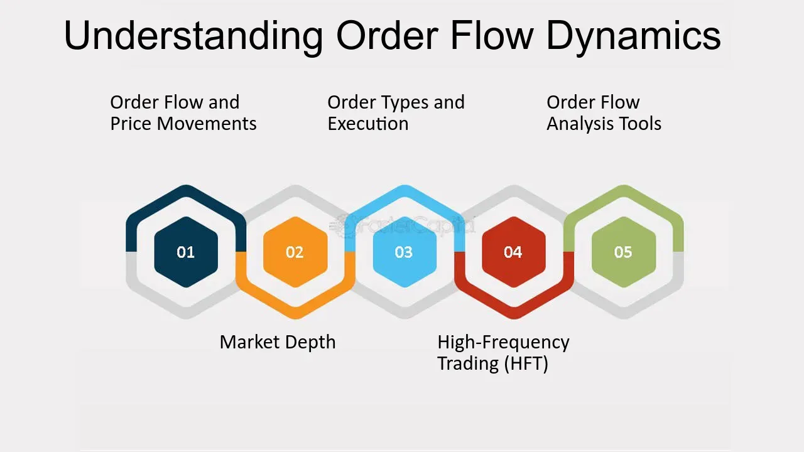

## Table of Contents

## What is order flow in financial markets?

Order flow in financial markets refers to the process of how buy and sell orders are placed and executed. It's like watching a stream of orders coming in and seeing which ones get filled first. Traders and investors use this information to understand the market's direction and make better decisions. For example, if there are more buy orders than sell orders, it might mean that the price of a stock could go up soon.

Understanding order flow can be really helpful for traders. By looking at the order flow, they can see if there's a lot of interest in buying or selling a particular stock. This can give them clues about what might happen next with the stock's price. For instance, if a lot of big buy orders come in quickly, it might signal that the stock is about to rise, so traders might decide to buy it too.

## How does order flow affect market prices?

Order flow directly affects market prices by showing the balance between buying and selling pressure. When there are more buy orders than sell orders, it means more people want to buy the stock than sell it. This extra demand can push the price up because buyers might have to offer more money to get the stock. On the other hand, if there are more sell orders, it means more people want to get rid of the stock. This extra supply can push the price down because sellers might have to lower their price to find a buyer.

Traders watch order flow closely to predict price movements. If they see a lot of big buy orders coming in, they might think the price will go up soon and decide to buy the stock too. This can create a feedback loop where more buying leads to higher prices, attracting even more buyers. Similarly, if they see a lot of big sell orders, they might think the price will go down and decide to sell their stock before it loses value. This way, order flow not only reflects current market conditions but also influences future price changes.

## What are the basic components of order flow?

Order flow is made up of buy orders and sell orders. Buy orders are when people want to buy a stock, and sell orders are when people want to sell a stock. These orders come in different sizes and at different prices. When someone places a buy order, they are saying they want to buy the stock at a certain price or better. When someone places a sell order, they are saying they want to sell the stock at a certain price or better.

The balance between buy and sell orders is what makes the market move. If there are more buy orders than sell orders, the price of the stock might go up because there are more people wanting to buy than there are people wanting to sell. If there are more sell orders than buy orders, the price might go down because there are more people wanting to sell than there are people wanting to buy. Traders look at this balance to guess what might happen next with the stock's price.

## Can you explain the difference between buy and sell orders in order flow?

In order flow, buy orders are when people want to buy a stock. They tell the market they are willing to pay a certain price or better for the stock. If someone places a buy order at $50, they are saying they want to buy the stock if it's $50 or less. More buy orders can mean more people want the stock, which might push the price up because there's more demand.

Sell orders are when people want to sell a stock. They tell the market they are willing to sell at a certain price or better. If someone places a sell order at $50, they are saying they want to sell the stock if it's $50 or more. More sell orders can mean more people want to get rid of the stock, which might push the price down because there's more supply.

The balance between buy and sell orders is what moves the market. If there are more buy orders than sell orders, the price might go up because there's more demand than supply. If there are more sell orders than buy orders, the price might go down because there's more supply than demand. Traders watch this balance to guess what might happen next with the stock's price.

## How do market makers use order flow information?

Market makers use order flow information to make money and keep the market running smoothly. They look at all the buy and sell orders coming in to figure out where the price of a stock might go next. If they see a lot of people wanting to buy a stock, they might buy it themselves and then sell it to those people at a slightly higher price. This way, they make a small profit on each trade. They also use order flow to decide how much of a stock to keep in their inventory, so they can always buy or sell when someone wants to trade.

Market makers also help keep the market balanced. If there are more people wanting to sell a stock than buy it, the market maker might buy some of the stock to keep the price from falling too fast. On the other hand, if there are more people wanting to buy than sell, they might sell some of their stock to keep the price from going up too fast. By doing this, they help make sure there's always someone to buy or sell, which keeps the market stable and fair for everyone.

## What role does order flow play in market liquidity?

Order flow is super important for keeping the market liquid. Liquidity means how easy it is to buy or sell something without the price changing a lot. When there are lots of buy and sell orders coming in, it means the market is liquid. More orders make it easier for people to trade because there's always someone on the other side of the trade. If you want to sell your stock, there's a good chance someone wants to buy it at the same time.

Market makers use order flow to help keep the market liquid. They watch the orders and make sure there's always someone to buy or sell. If there are more people wanting to sell than buy, market makers might buy some of the stock to keep the price from dropping too fast. If there are more people wanting to buy than sell, they might sell some of their stock to keep the price from going up too fast. This way, they help make sure the market stays balanced and easy to trade in.

## How can traders use order flow to predict market movements?

Traders can use order flow to predict market movements by watching the balance between buy and sell orders. If there are more buy orders than sell orders, it means more people want to buy the stock than sell it. This can signal that the price might go up soon because there's more demand. Traders might decide to buy the stock too, hoping to make money as the price rises. On the other hand, if there are more sell orders, it means more people want to sell the stock than buy it. This can signal that the price might go down because there's more supply. Traders might decide to sell their stock before the price drops.

By looking at the size and speed of the orders, traders can also get clues about what might happen next. If a lot of big buy orders come in quickly, it can mean that big investors think the stock is about to go up. This might make traders want to buy the stock too, to ride the wave of the price increase. If a lot of big sell orders come in quickly, it can mean that big investors think the stock is about to go down. Traders might then decide to sell their stock to avoid losing money. By understanding these patterns in order flow, traders can make better guesses about where the market is headed.

## What are some common order flow indicators used by traders?

Traders use several common order flow indicators to predict how the market might move. One popular indicator is the volume profile, which shows how much trading happens at different price levels. If a lot of trading happens at a certain price, it might be a key level where the price could go back to. Another indicator is the order book, which shows all the buy and sell orders waiting to be filled. Traders look at the order book to see if there are more people wanting to buy or sell at different prices.

Another useful indicator is the time and sales data, often called the "tape." This shows all the trades that have happened in real-time, including the price and size of each trade. Traders watch this to see if big trades are happening, which can signal that big investors are moving the market. Lastly, there's the order flow imbalance, which shows if there are more buy orders or sell orders coming in. If there are more buy orders, it might mean the price is going to go up soon, and if there are more sell orders, it might mean the price is going to go down.

## How does high-frequency trading impact order flow dynamics?

High-frequency trading (HFT) can really shake up the order flow in financial markets. HFT uses super fast computers to trade stocks in milliseconds. These traders look at lots of order flow data to make quick decisions. They can put in and take out orders really fast, which can make the market move a lot. For example, if a high-frequency trader sees a lot of buy orders coming in, they might jump in to buy the stock too, hoping to sell it at a higher price soon after. This can make the price go up even faster.

But HFT can also make the market more liquid. Because high-frequency traders are always putting in and taking out orders, there are usually more orders to buy and sell. This makes it easier for other traders to find someone to trade with. However, it can also make the market feel more unpredictable. The quick changes in order flow from HFT can make prices jump around a lot, which can be hard for other traders to deal with. So, while HFT can help keep the market moving, it can also make it a bit more wild.

## What are the challenges in accurately measuring order flow?

Measuring order flow accurately can be tough because it's like trying to catch a fast-moving river. The market is always changing, with new buy and sell orders coming in all the time. High-frequency trading makes it even harder because these traders can put in and take out orders in the blink of an eye. This means the data you're looking at can change before you even finish looking at it. Plus, not all order flow data is public. Some big traders keep their orders secret, so you might not see the whole picture.

Another challenge is that different places where you can trade, like stock exchanges or dark pools, might not share their data the same way. This can make it hard to get a full view of what's happening across the whole market. Also, the tools and indicators used to measure order flow can be tricky. They might not always show the real story because they're based on past data, and the market can change quickly. So, even with the best tools, it's hard to be sure you're seeing the whole truth about order flow.

## How do different market structures influence order flow dynamics?

Different market structures can really change how order flow works. In a centralized market, like a big stock exchange, all the buy and sell orders come together in one place. This makes it easier to see the whole picture of what's happening with order flow. But in a decentralized market, like a lot of cryptocurrency trading, orders are spread out across different places. This can make it harder to understand the full order flow because you might not see all the orders in one spot.

Another way market structures affect order flow is through things like dark pools and electronic communication networks (ECNs). Dark pools let big traders hide their orders, so they don't move the market too much. This means the public order flow might not show everything that's happening. ECNs, on the other hand, let traders match orders directly with each other, which can make the market more liquid but also more complex. So, the way a market is set up can make a big difference in how easy or hard it is to see and understand order flow.

## What advanced strategies can be employed to analyze order flow for expert trading?

Expert traders use advanced strategies to analyze order flow and make smart trading decisions. One strategy is to use algo trading, which means using computer programs to look at a lot of order flow data really fast. These programs can find patterns that might be hard for people to see. For example, they can spot when big traders are buying or selling a lot, which can signal that the price might move soon. Traders can then use this information to decide when to buy or sell their own stocks.

Another strategy is to use market depth analysis. This means looking at the order book to see how many buy and sell orders are waiting at different price levels. By understanding the market depth, traders can see where the price might go next. If there are a lot of buy orders waiting at a certain price, it might mean that the price will have a hard time going below that level. Traders can use this to set their buy or sell orders at the best prices. Both of these strategies help traders make better guesses about where the market is headed by looking closely at order flow.

## References & Further Reading

[1]: Aldridge, I. (2013). ["High-Frequency Trading: A Practical Guide to Algorithmic Strategies and Trading Systems"](https://www.amazon.com/High-Frequency-Trading-Practical-Algorithmic-Strategies/dp/1118343506). Wiley.

[2]: Harris, L. (2003). ["Trading and Exchanges: Market Microstructure for Practitioners"](https://academic.oup.com/book/52292). Oxford University Press.

[3]: Hasbrouck, J. (2007). ["Empirical Market Microstructure: The Institutions, Economics, and Econometrics of Securities Trading"](https://academic.oup.com/book/52241). Oxford University Press.

[4]: Bouchaud, J-P., Farmer, J. D., & Lillo, F. (2009). ["How Markets Slowly Digest Changes in Supply and Demand"](https://arxiv.org/abs/0809.0822). In T. Hens & K. R. Schenk-Hoppé (Eds.), Handbook of Financial Markets: Dynamics and Evolution.

[5]: Biais, B., Glosten, L., & Spatt, C. (2005). ["Market Microstructure: A Survey of Microfoundations, Empirical Results, and Policy Implications"](https://www.sciencedirect.com/science/article/abs/pii/S1386418104000382). Journal of Financial Markets, Vol. 8, pp. 217-264.

[6]: Ait-Sahalia, Y., & Saglam, M. (2014). ["High Frequency Traders: Taking Advantage of Speed"](https://papers.ssrn.com/sol3/papers.cfm?abstract_id=2342011). Journal of Financial Economics, 113(2), pp. 253-271.