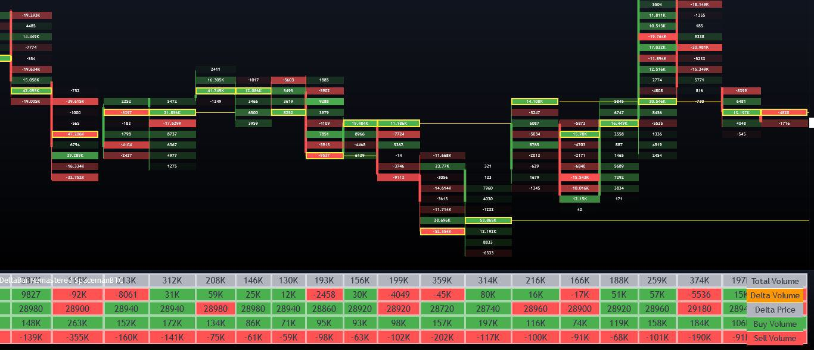

Order Flow Imbalance Indicators are essential instruments in algorithmic trading, particularly within the realm of high-frequency trading. These indicators are designed to identify the imbalance between buy and sell orders, providing valuable insights into market supply and demand dynamics. In high-frequency trading environments, where speed and accuracy are paramount, understanding these imbalances can give traders a significant edge.

This article provides a comprehensive exploration of order flow imbalance indicators, covering their fundamental definitions, the methodology behind their calculation, and their integration into trading strategies. These tools serve as vital components for traders aiming to enhance decision-making processes and forecasting capabilities in financial markets. Moreover, the discussion extends to their potential profitability, assessing how these indicators can act as reliable market signals when used within algorithmic trading.



The profitability of order flow imbalance indicators is evaluated by examining their effectiveness as market indicators. By accurately predicting short-term price movements, these indicators support traders in maximizing profit opportunities while minimizing risks. Additionally, their implementation in algorithmic trading is not without challenges, including trading costs and market noise. However, by addressing these challenges, order flow imbalance indicators can be leveraged effectively within a comprehensive trading strategy.

For traders committed to improving their strategies and gaining a competitive edge in financial markets, understanding order flow imbalance indicators is crucial. As the use of technology and data analysis continues to grow rapidly, the role of these indicators in algorithmic trading strategies will likely become increasingly significant.

## Table of Contents

## What Are Order Flow Imbalance Indicators?

Order Flow Imbalance (OFI) indicators are specialized metrics designed to gauge the disparity between buy and sell orders within financial markets. These indicators are integral to understanding the dynamics of supply and demand, with a particular focus on short-term market fluctuations. 

An OFI is computed by assessing the changes in both the quantity and pricing of buy and sell orders available in the market. A positive OFI value indicates an excess of buy orders, suggesting buying pressure. Conversely, a negative OFI reflects an abundance of sell orders, denoting selling pressure. As such, OFI can be a valuable tool for predicting near-term price movements, often employed in algorithmic trading strategies to capitalize on these shifts.

The utility of OFI lies in its ability to reveal the aggressive behavior of market participants. By scrutinizing the [order book](/wiki/order-book-trading-strategies), OFI highlights whether buyers or sellers are dominant, offering an insight into market sentiment at specific moments. Market participants, particularly those engaged in high-frequency trading, leverage OFI to make informed decisions within split seconds, thereby gaining a competitive edge. 

Through careful analysis of OFI, traders can infer the immediate intentions of large traders or institutions, making it possible to align their strategies with the prevailing market forces. This predictive capability underscores the value of OFI as a critical component in [algorithmic trading](/wiki/algorithmic-trading) models, enabling the anticipation of market trends before they fully materialize.

## Calculating Order Flow Imbalance

To calculate Order Flow Imbalance (OFI), the process begins with an analysis of changes in the best bid and offer prices, along with corresponding order sizes. OFI quantifies the imbalance between buying and selling activities by identifying the directional flow of trades. 

Mathematically, OFI is determined by observing variations in the bid and ask prices and the sizes of orders over specified time intervals. For each time interval, one may compute the OFI using the difference between [volume](/wiki/volume-trading-strategy) executed at the ask price and the volume executed at the bid price:

$$
\text{OFI} = (\text{Volume}_{\text{ask}} - \text{Volume}_{\text{bid}})
$$

Where:
- $\text{Volume}_{\text{ask}}$ is the total number of shares/contracts traded at the ask price.
- $\text{Volume}_{\text{bid}}$ is the total number of shares/contracts traded at the bid price.

In practical terms, calculating OFI involves summing up the impacts of price fluctuations on both supply and demand. This can be implemented through algorithmic computations using programming languages like Python. Below is a simple Python snippet showcasing how one might begin calculating OFI:

```python
def calculate_ofi(order_data):
    ofi_values = []
    prev_bid = None
    prev_ask = None

    for current_bid, current_ask, vol_bid, vol_ask in order_data:
        if prev_bid is not None and prev_ask is not None:
            delta_bid = current_bid - prev_bid
            delta_ask = current_ask - prev_ask

            ofi = (vol_ask * delta_ask) - (vol_bid * delta_bid)
            ofi_values.append(ofi)

        prev_bid = current_bid
        prev_ask = current_ask

    return ofi_values

# Sample order data (current_bid, current_ask, vol_bid, vol_ask)
order_data = [
    (100, 101, 200, 150),
    (101, 102, 180, 170),
    # More data points...
]

ofi_result = calculate_ofi(order_data)
print(ofi_result)
```

In this example, the calculation involves iterating through data containing bids, asks, and volumes, allowing for the assessment of OFI values over time. 

Typically, OFI is aggregated over high-frequency intervals to yield insights significant enough to inform trading decisions. This aggregation enhances the precision of interpretations drawn from OFI, rendering it a powerful component in high-frequency trading strategies. By regularly updating the OFI at these intervals, traders can gain continuous insights into market dynamics, often leading to more informed and timely decision-making.

## Using OFI in Predictive Trading Models

Order Flow Imbalance (OFI) can be a key component in predictive trading models to forecast market trends. By leveraging OFI values, traders aim to refine market predictions and bolster trading strategies. In the context of linear regression models, OFI acts as an independent variable explaining variations in dependent price movement variables. This relationship can be expressed mathematically as:

$$

P(t+1) = \beta_0 + \beta_1 \cdot \text{OFI}(t) + \epsilon 
$$

Here, $P(t+1)$ is the predicted price at time $t+1$, $\beta_0$ and $\beta_1$ are coefficients, and $\epsilon$ is the error term that accounts for randomness not explained by OFI.

The incorporation of OFI into predictive models introduces both potential benefits and significant challenges. OFI indicators can augment the responsiveness and accuracy of predictions when integrated into models. However, challenges such as overfitting, where the model captures noise rather than the signal, and information leakage, where future data inadvertently influences the model, must be addressed to uphold model validity.

Moreover, OFI's utility is not limited to linear regression models. It can act as a stand-alone predictor in [machine learning](/wiki/machine-learning) algorithms aimed at predicting market trends. These models can range from simple decision trees to sophisticated neural networks, each benefiting from OFI's insights into market pressures resulting from order book activities.

Extensive [backtesting](/wiki/backtesting) using historical market data is a crucial step in verifying OFI's predictive effectiveness. Backtesting involves simulating the predictive model's strategies on past data to evaluate their potential performance. This process helps in identifying the economic viability of trading strategies integrating OFI, ensuring they are robust against variations across different market conditions.

Python, with its robust libraries such as NumPy, pandas, scikit-learn, and TensorFlow, is particularly suitable for developing and testing models incorporating OFI. Here is a simple example of using OFI in a linear regression model with Python:

```python
import numpy as np
import pandas as pd
from sklearn.linear_model import LinearRegression
from sklearn.model_selection import train_test_split

# Sample data loading
data = pd.read_csv('order_flow_data.csv')

# Assume 'OFI' and 'price' are columns in the data
X = data[['OFI']]
y = data['price']

# Splitting data into training and test sets
X_train, X_test, y_train, y_test = train_test_split(X, y, test_size=0.2, random_state=42)

# Building the linear regression model
model = LinearRegression()
model.fit(X_train, y_train)

# Making predictions
predictions = model.predict(X_test)

# Outputting model performance
print(f'Model Coefficient: {model.coef_}')
print(f'Mean Squared Error: {np.mean((predictions - y_test)**2)}')
```

This script illustrates how to prepare data, train a linear regression model with OFI as an input, and assess the model's performance. Overall, by carefully constructing and validating models, traders can utilize OFI to generate actionable insights and enhance algorithmic trading strategies.

## Practical Applications and Challenges

Order Flow Imbalance (OFI) indicators offer nuanced insights into trading strategies but also present certain challenges when deployed as standalone tools. One central difficulty is the cost of trading, which can erode potential profits gleaned from OFI insights. This includes both explicit costs like trade commissions and those implicit like slippage—unintended changes in price between order initiation and execution.

Despite these challenges, OFI's utility as a supplementary tool in market-making is notable. In such strategies, where [liquidity](/wiki/liquidity-risk-premium) provision takes center stage, OFI partakes by guiding quote placements. For instance, a positive OFI signal (indicative of buying pressure) can prompt a market maker to adjust quotes upwards to improve spreads and capture potential gains from anticipated price shifts.

In execution algorithms tasked with handling large orders, OFI's role extends to optimizing trade execution timing and aggression. By recognizing periods of high buying or selling pressure, traders can better time market entries or exits, minimizing unfavorable price impacts. For example, executing large sell orders during periods of high buying pressure can mitigate downward price movements.

Yet, deploying OFI in real-time demands high computational power due to vast data volumes. Efficiently processing, interpreting, and acting on this information requires robust technological infrastructure and advanced algorithms. Moreover, constructing predictive models based on OFI necessitates extensive historical datasets to accurately capture market behaviors and ensure model generalization.

Another critical aspect is data noise—random fluctuations that do not represent true market sentiments—which can obscure underlying trends essential for OFI's accurate exploitation. Derived insights could be misleading if noise isn't adequately filtered, highlighting the importance of data preprocessing.

Python, with its data-centric libraries like Pandas and NumPy, provides a solid foundation for implementing OFI calculations and iterations on streaming market data. For example, a simple moving average convergence divergence (MACD) strategy modulated by OFI could be implemented as follows:

```python
import pandas as pd

# Assuming df is a DataFrame containing 'price', 'bid_size', and 'ask_size'
df['delta_bid'] = df['bid_size'].diff() * (df['price'].diff() > 0)
df['delta_ask'] = df['ask_size'].diff() * (df['price'].diff() < 0)

def calculate_ofi(row):
    return row['delta_bid'] - row['delta_ask']

df['OFI'] = df.apply(calculate_ofi, axis=1)

# Implementing OFI for decision-making
def execute_trade_signal(ofi, threshold):
    if ofi > threshold:
        return "buy"
    elif ofi < -threshold:
        return "sell"
    else:
        return "hold"

df['signal'] = df['OFI'].apply(lambda x: execute_trade_signal(x, threshold=50))
```

In conclusion, OFI indicators offer tangible benefits in enhancing trading strategies when incorporated wisely. However, their efficacy is contingent on a trader's ability to navigate associated challenges—such as trading costs, data noise, and computational demands—ensuring that their deployment aligns seamlessly within broader, multifaceted [quantitative trading](/wiki/quantitative-trading) frameworks.

## Conclusion

Order Flow Imbalance Indicators represent a significant advancement in the landscape of algorithmic trading. They enhance trade decisions by offering insights into the current balance between buy and sell orders, thus highlighting market sentiment and potential movement directions. While these indicators show promise for profitability, their full potential is realized only when incorporated into broader, multifaceted trading strategies. Their standalone predictive power is somewhat limited; however, when combined with other analytical metrics, OFI can significantly contribute to an enriched understanding of market dynamics.

As technological advancements continue, particularly in computing power and machine learning, the efficacy of Order Flow Imbalance Indicators is poised to improve. With machine learning models capable of processing vast datasets and uncovering complex patterns, the deployment of OFI within these frameworks might yield more accurate and reliable trading signals. Nevertheless, traders must remain cognizant of the inherent limitations of OFI. The complexity of financial markets means no single indicator can ensure success, necessitating continuous innovation and adaptation in trading strategies to harness OFI's full potential effectively.

In conclusion, while Order Flow Imbalance Indicators offer a promising tool for traders, leveraging their advantages requires strategic integration with diversified trading models and ongoing engagement with technological advancements. By staying aware of these needs and potentials, traders can better navigate the intricate environments of financial markets.

## References & Further Reading

[1]: O'Hara, M. (2015). ["High Frequency Market Microstructure."](https://www.sciencedirect.com/science/article/pii/S0304405X15000045) The Review of Financial Studies, 28(12), 3453-3484.

[2]: Bouchaud, J.P., Bonart, J., Donier, J., & Gould, M. (2018). ["Trades, Quotes, and Prices: Financial Markets Under the Microscope."](https://api.pageplace.de/preview/DT0400.9781108639064_A34411323/preview-9781108639064_A34411323.pdf) Cambridge University Press.

[3]: Aldridge, I. (2013). ["High-Frequency Trading: A Practical Guide to Algorithmic Strategies and Trading Systems."](https://www.wiley.com/en-us/High+Frequency+Trading%3A+A+Practical+Guide+to+Algorithmic+Strategies+and+Trading+Systems%2C+2nd+Edition-p-9781118343500) Wiley.

[4]: Gould, M. D., Porter, M. A., Williams, S., McDonald, M., Fenn, D. J., & Howison, S. D. (2013). ["Limit Order Books."](https://arxiv.org/abs/1012.0349) Physics Reports, 628, 1-120.

[5]: Cartea, À., Jaimungal, S., & Penalva, J. (2015). ["Algorithmic and High-Frequency Trading."](https://assets.cambridge.org/97811070/91146/frontmatter/9781107091146_frontmatter.pdf) Cambridge University Press.