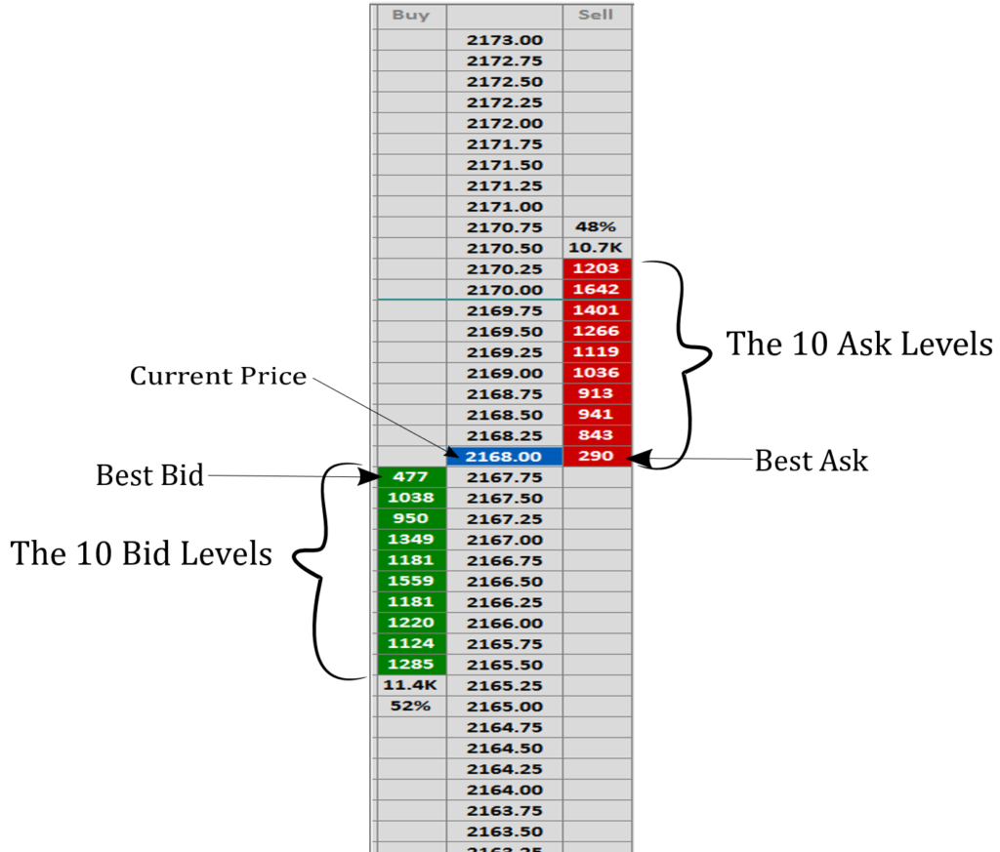

## Table of Contents

## What is an Order Flow Imbalance Indicator?

An Order Flow Imbalance Indicator is a tool used in trading to help understand the balance between buying and selling pressure in the market. It looks at the difference between the number of buy orders and sell orders at any given time. If there are more buy orders than sell orders, it shows a positive imbalance, suggesting that there might be more demand for the asset. On the other hand, if there are more sell orders, it shows a negative imbalance, indicating more supply.

Traders use this indicator to make better decisions about when to buy or sell. For example, if the indicator shows a strong positive imbalance, it might be a good time to buy because the demand is high. Conversely, a strong negative imbalance might suggest it's a good time to sell because the supply is high. By watching these imbalances, traders can get a sense of market direction and potential price movements.

## How does an Order Flow Imbalance Indicator work?

An Order Flow Imbalance Indicator works by comparing the number of buy orders to the number of sell orders at a specific time. It calculates the difference between these two, which tells traders if there is more demand or more supply for a certain asset. If there are more buy orders, the indicator shows a positive imbalance, meaning people want to buy more of the asset. If there are more sell orders, it shows a negative imbalance, meaning people want to sell more of the asset.

Traders use this information to make decisions. For example, if the indicator shows a strong positive imbalance, it might be a good time to buy because many people are trying to buy the asset, which could push the price up. On the other hand, if there's a strong negative imbalance, it might be a good time to sell because many people are trying to sell the asset, which could push the price down. By watching these imbalances, traders can get a sense of where the market might be heading and make their trading decisions accordingly.

## Why are Order Flow Imbalance Indicators important for traders?

Order Flow Imbalance Indicators are important for traders because they show the difference between the number of buy orders and sell orders at any given time. This helps traders understand whether there is more demand or more supply for a certain asset. If there are more buy orders, it means more people want to buy the asset, which could push the price up. If there are more sell orders, it means more people want to sell the asset, which could push the price down. By knowing this, traders can make better decisions about when to buy or sell.

These indicators also help traders see the overall direction of the market. For example, if the indicator keeps showing a positive imbalance, it might mean that the market is trending upwards because more people want to buy. On the other hand, if it keeps showing a negative imbalance, it might mean the market is trending downwards because more people want to sell. By watching these trends, traders can plan their trades more effectively and possibly make more money.

## What are the common types of Order Flow Imbalance Indicators?

Order Flow Imbalance Indicators come in different types, but two common ones are the Volume Imbalance Indicator and the Delta Indicator. The Volume Imbalance Indicator looks at the difference between the volume of buy orders and sell orders. It helps traders see if there is more buying or selling happening at any moment. This can tell them if the market might be going up or down. The Delta Indicator, on the other hand, focuses on the difference between the number of buy and sell orders, not just the volume. It helps traders understand the strength of the buying or selling pressure.

Both types of indicators are useful because they show traders the balance between buyers and sellers. The Volume Imbalance Indicator is good for understanding how much buying or selling is happening, which can be important for big trades. The Delta Indicator is good for seeing how many people want to buy or sell, which can help traders decide when to make a move. By using these indicators, traders can get a clearer picture of what's happening in the market and make better trading decisions.

## How can beginners start using Order Flow Imbalance Indicators?

Beginners can start using Order Flow Imbalance Indicators by first learning what they are and how they work. These indicators show the difference between buy and sell orders, helping traders see if there is more demand or supply for a certain asset. To get started, beginners should pick a trading platform that offers these indicators and learn how to read them. They can practice on a demo account, where they can use the indicators without risking real money. This is a good way to get used to how the indicators work and how to interpret them.

Once beginners feel comfortable with the basics, they can start using these indicators in real trading. They should watch the indicators closely and look for patterns. For example, if the indicator keeps showing a positive imbalance, it might be a good time to buy because many people want to buy the asset. On the other hand, if it shows a negative imbalance, it might be a good time to sell because many people want to sell. By paying attention to these signs, beginners can make better trading decisions and improve their skills over time.

## What are the key components of an Order Flow Imbalance Indicator?

An Order Flow Imbalance Indicator has a few important parts that help traders see the difference between buying and selling. The first part is the number of buy orders, which shows how many people want to buy the asset at a certain time. The second part is the number of sell orders, which shows how many people want to sell the asset at that time. By comparing these two numbers, the indicator can tell if there are more buyers or more sellers, which is called the imbalance.

The third part of the indicator is the calculation of the imbalance itself. This is done by taking the number of buy orders and subtracting the number of sell orders. If the result is positive, it means there are more buyers, showing a positive imbalance. If it's negative, it means there are more sellers, showing a negative imbalance. This information helps traders understand if the market might go up or down, helping them decide when to buy or sell.

## How do Order Flow Imbalance Indicators differ from volume indicators?

Order Flow Imbalance Indicators and volume indicators both give traders information about the market, but they focus on different things. Order Flow Imbalance Indicators look at the difference between the number of buy orders and sell orders. They help traders see if there are more people wanting to buy or more people wanting to sell at any given time. This can show whether there's more demand or more supply for an asset, which can help traders guess where the price might go next.

Volume indicators, on the other hand, just show how much trading is happening. They tell traders the total number of shares or contracts that were traded, without saying if those trades were buys or sells. While volume indicators can show how active the market is, they don't give as much detail about the balance between buying and selling as Order Flow Imbalance Indicators do. By using both types of indicators, traders can get a fuller picture of what's happening in the market.

## What are the best practices for interpreting Order Flow Imbalance Indicators?

When interpreting Order Flow Imbalance Indicators, it's important to look at the overall trend over time, not just one moment. If the indicator keeps showing a positive imbalance, it means more people want to buy, which could push the price up. On the other hand, if it keeps showing a negative imbalance, it means more people want to sell, which could push the price down. Beginners should watch these trends and see if they match up with what's happening in the market. It's also good to use the indicator along with other tools, like volume indicators, to get a better picture of what's going on.

Another good practice is to pay attention to sudden changes in the indicator. If the imbalance suddenly goes from negative to positive, it might mean a lot of people want to buy all at once, which could be a good time to buy too. But remember, the market can be unpredictable, so don't rely on the indicator alone. Always think about other things like news and big events that could affect the market. By combining the Order Flow Imbalance Indicator with other information, traders can make smarter choices and improve their chances of success.

## How can Order Flow Imbalance Indicators be used in different trading strategies?

Order Flow Imbalance Indicators can be used in many different trading strategies. One common strategy is [trend following](/wiki/trend-following), where traders use the indicator to spot trends in the market. If the indicator shows a consistent positive imbalance, it might mean the market is trending up, so traders might buy the asset hoping the price will keep going up. On the other hand, if the indicator shows a consistent negative imbalance, it might mean the market is trending down, so traders might sell the asset, expecting the price to keep going down. By watching these trends, traders can make decisions that follow the market's direction.

Another strategy is [scalping](/wiki/gamma-scalping), where traders make quick trades to take advantage of small price changes. In this case, traders might look for sudden changes in the Order Flow Imbalance Indicator. If the indicator suddenly switches from a negative to a positive imbalance, it might mean a lot of people want to buy all at once, so a scalper might quickly buy the asset and then sell it for a small profit as the price goes up. This strategy requires fast decisions and can be risky, but using the indicator can help traders spot these quick opportunities.

A third strategy is mean reversion, where traders believe that prices will eventually return to their average after big swings. If the Order Flow Imbalance Indicator shows a very strong positive or negative imbalance, it might mean the price has moved too far in one direction. Traders might then bet that the price will come back to a more normal level. For example, if there's a big positive imbalance and the price goes up a lot, a trader might sell the asset, expecting the price to come back down. By using the indicator to spot these extremes, traders can try to profit from the price moving back to the middle.

## What are the limitations and potential pitfalls of using Order Flow Imbalance Indicators?

Order Flow Imbalance Indicators can be really helpful, but they have some limitations that traders should know about. One big problem is that these indicators only show what's happening right now, not what will happen later. The market can change quickly because of news or big events, and the indicator might not catch these changes in time. Also, these indicators can sometimes give false signals. Just because the indicator shows a big imbalance doesn't always mean the price will move that way. Sometimes, the market can do the opposite of what the indicator suggests, which can trick traders into making bad choices.

Another thing to watch out for is that Order Flow Imbalance Indicators don't work well by themselves. They need to be used with other tools and information to be really useful. If traders only look at the imbalance and don't think about other things like volume or what's happening in the world, they might miss important signs. It's also easy to get too focused on the numbers and forget that trading involves a lot of guesswork. So, while these indicators can help, traders should be careful and not rely on them too much.

## How can advanced traders customize Order Flow Imbalance Indicators for specific markets?

Advanced traders can customize Order Flow Imbalance Indicators to fit different markets by adjusting the time frame and sensitivity of the indicator. For example, in a fast-moving market like [forex](/wiki/forex-system), traders might set the indicator to look at very short time frames, like a few minutes, to catch quick changes in buying and selling. In a slower market, like some stocks, they might set it to look at longer time frames, like hours or days, to see bigger trends. By changing the time frame, traders can make the indicator work better for the specific market they are trading in.

Another way to customize the indicator is by adjusting its sensitivity. This means changing how much of a difference in buy and sell orders the indicator needs to show an imbalance. In a market with lots of small trades, like [cryptocurrency](/wiki/cryptocurrency), traders might set the indicator to be more sensitive to catch small but important changes. In a market with fewer but bigger trades, like some commodities, they might set it to be less sensitive to avoid getting too many false signals. By tweaking the sensitivity, advanced traders can make the indicator more useful for their specific trading needs.

## What are the latest research and developments in Order Flow Imbalance Indicators?

The latest research in Order Flow Imbalance Indicators focuses on making them more accurate and useful for traders. Scientists and developers are working on new ways to process data faster so that the indicators can show real-time imbalances more quickly. They are also using machine learning to look at past data and predict future imbalances better. This helps traders make smarter decisions by giving them a clearer picture of what might happen next in the market. Another big development is combining Order Flow Imbalance Indicators with other tools, like sentiment analysis from social media, to get a fuller view of market trends.

These developments are making Order Flow Imbalance Indicators more popular and helpful for traders. For example, some new indicators can now show not just the current imbalance but also how it might change in the near future. This can help traders plan their moves better. Also, researchers are looking into how these indicators work in different markets, like stocks, forex, and cryptocurrencies, to see if they need to be adjusted for each one. By understanding these differences, traders can use the indicators more effectively in their specific trading areas.

## How do you calculate order flow imbalance?

To calculate Order Flow Imbalance (OFI), the process begins with an analysis of changes in the best bid and offer prices, along with corresponding order sizes. OFI quantifies the imbalance between buying and selling activities by identifying the directional flow of trades. 

Mathematically, OFI is determined by observing variations in the bid and ask prices and the sizes of orders over specified time intervals. For each time interval, one may compute the OFI using the difference between [volume](/wiki/volume-trading-strategy) executed at the ask price and the volume executed at the bid price:

$$
\text{OFI} = (\text{Volume}_{\text{ask}} - \text{Volume}_{\text{bid}})
$$

Where:
- $\text{Volume}_{\text{ask}}$ is the total number of shares/contracts traded at the ask price.
- $\text{Volume}_{\text{bid}}$ is the total number of shares/contracts traded at the bid price.

In practical terms, calculating OFI involves summing up the impacts of price fluctuations on both supply and demand. This can be implemented through algorithmic computations using programming languages like Python. Below is a simple Python snippet showcasing how one might begin calculating OFI:

```python
def calculate_ofi(order_data):
    ofi_values = []
    prev_bid = None
    prev_ask = None

    for current_bid, current_ask, vol_bid, vol_ask in order_data:
        if prev_bid is not None and prev_ask is not None:
            delta_bid = current_bid - prev_bid
            delta_ask = current_ask - prev_ask

            ofi = (vol_ask * delta_ask) - (vol_bid * delta_bid)
            ofi_values.append(ofi)

        prev_bid = current_bid
        prev_ask = current_ask

    return ofi_values

# Sample order data (current_bid, current_ask, vol_bid, vol_ask)
order_data = [
    (100, 101, 200, 150),
    (101, 102, 180, 170),
    # More data points...
]

ofi_result = calculate_ofi(order_data)
print(ofi_result)
```

In this example, the calculation involves iterating through data containing bids, asks, and volumes, allowing for the assessment of OFI values over time. 

Typically, OFI is aggregated over high-frequency intervals to yield insights significant enough to inform trading decisions. This aggregation enhances the precision of interpretations drawn from OFI, rendering it a powerful component in high-frequency trading strategies. By regularly updating the OFI at these intervals, traders can gain continuous insights into market dynamics, often leading to more informed and timely decision-making.

## How can OFI be used in Predictive Trading Models?

Order Flow Imbalance (OFI) can be a key component in predictive trading models to forecast market trends. By leveraging OFI values, traders aim to refine market predictions and bolster trading strategies. In the context of linear regression models, OFI acts as an independent variable explaining variations in dependent price movement variables. This relationship can be expressed mathematically as:

$$

P(t+1) = \beta_0 + \beta_1 \cdot \text{OFI}(t) + \epsilon 
$$

Here, $P(t+1)$ is the predicted price at time $t+1$, $\beta_0$ and $\beta_1$ are coefficients, and $\epsilon$ is the error term that accounts for randomness not explained by OFI.

The incorporation of OFI into predictive models introduces both potential benefits and significant challenges. OFI indicators can augment the responsiveness and accuracy of predictions when integrated into models. However, challenges such as overfitting, where the model captures noise rather than the signal, and information leakage, where future data inadvertently influences the model, must be addressed to uphold model validity.

Moreover, OFI's utility is not limited to linear regression models. It can act as a stand-alone predictor in [machine learning](/wiki/machine-learning) algorithms aimed at predicting market trends. These models can range from simple decision trees to sophisticated neural networks, each benefiting from OFI's insights into market pressures resulting from [order book](/wiki/order-book-trading-strategies) activities.

Extensive [backtesting](/wiki/backtesting) using historical market data is a crucial step in verifying OFI's predictive effectiveness. Backtesting involves simulating the predictive model's strategies on past data to evaluate their potential performance. This process helps in identifying the economic viability of trading strategies integrating OFI, ensuring they are robust against variations across different market conditions.

Python, with its robust libraries such as NumPy, pandas, scikit-learn, and TensorFlow, is particularly suitable for developing and testing models incorporating OFI. Here is a simple example of using OFI in a linear regression model with Python:

```python
import numpy as np
import pandas as pd
from sklearn.linear_model import LinearRegression
from sklearn.model_selection import train_test_split

# Sample data loading
data = pd.read_csv('order_flow_data.csv')

# Assume 'OFI' and 'price' are columns in the data
X = data[['OFI']]
y = data['price']

# Splitting data into training and test sets
X_train, X_test, y_train, y_test = train_test_split(X, y, test_size=0.2, random_state=42)

# Building the linear regression model
model = LinearRegression()
model.fit(X_train, y_train)

# Making predictions
predictions = model.predict(X_test)

# Outputting model performance
print(f'Model Coefficient: {model.coef_}')
print(f'Mean Squared Error: {np.mean((predictions - y_test)**2)}')
```

This script illustrates how to prepare data, train a linear regression model with OFI as an input, and assess the model's performance. Overall, by carefully constructing and validating models, traders can utilize OFI to generate actionable insights and enhance [algorithmic trading](/wiki/algorithmic-trading) strategies.

## References & Further Reading

[1]: O'Hara, M. (2015). ["High Frequency Market Microstructure."](https://www.sciencedirect.com/science/article/pii/S0304405X15000045) The Review of Financial Studies, 28(12), 3453-3484.

[2]: Bouchaud, J.P., Bonart, J., Donier, J., & Gould, M. (2018). ["Trades, Quotes, and Prices: Financial Markets Under the Microscope."](https://api.pageplace.de/preview/DT0400.9781108639064_A34411323/preview-9781108639064_A34411323.pdf) Cambridge University Press.

[3]: Aldridge, I. (2013). ["High-Frequency Trading: A Practical Guide to Algorithmic Strategies and Trading Systems."](https://www.wiley.com/en-us/High+Frequency+Trading%3A+A+Practical+Guide+to+Algorithmic+Strategies+and+Trading+Systems%2C+2nd+Edition-p-9781118343500) Wiley.

[4]: Gould, M. D., Porter, M. A., Williams, S., McDonald, M., Fenn, D. J., & Howison, S. D. (2013). ["Limit Order Books."](https://arxiv.org/abs/1012.0349) Physics Reports, 628, 1-120.

[5]: Cartea, À., Jaimungal, S., & Penalva, J. (2015). ["Algorithmic and High-Frequency Trading."](https://assets.cambridge.org/97811070/91146/frontmatter/9781107091146_frontmatter.pdf) Cambridge University Press.