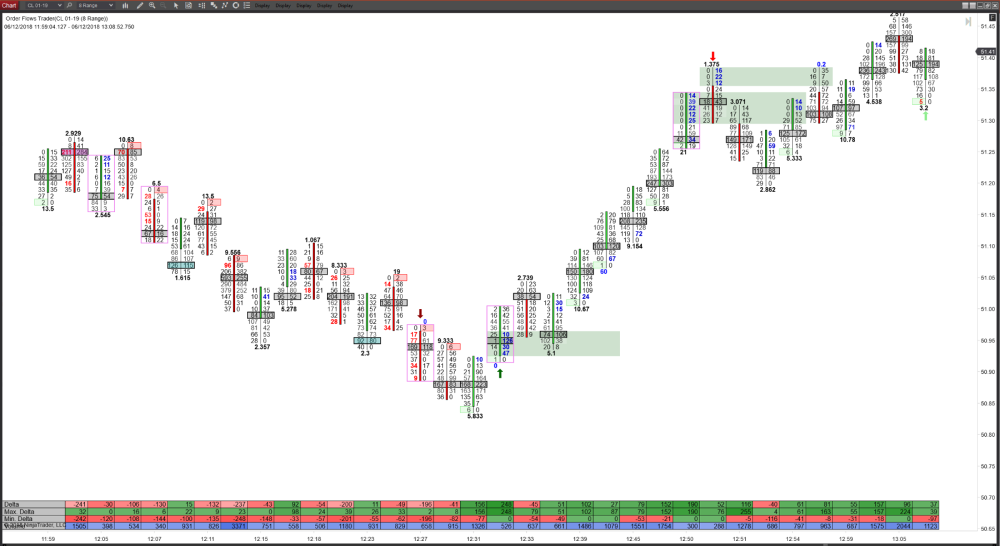

In the constantly evolving world of algorithmic trading, order flow imbalance (OFI) has emerged as a significant concept, particularly in understanding high-frequency trading movements. Order flow imbalance refers to the disparity between buy and sell orders in the market, indicating potential opportunities for traders. This disparity is a measurement of market sentiment and liquidity, providing insights into current and future price movements.

To calculate OFI, traders analyze changes in the limit order book, which records the buy and sell orders for a particular security. This analysis helps in identifying patterns that signify strong buying or selling pressures. As a key component of market microstructure, OFI empowers traders to recognize both short-term trends and potential reversals, enhancing their decision-making process in high-frequency trading environments.



In this article, we'll explore how to calculate OFI, examine its implications in trading, and determine how it can be utilized as a profitable trading signal. By understanding the intricacies of OFI, traders can develop strategies that leverage this metric for optimized performance and better market forecasting. As algorithmic trading continues to advance, mastering techniques such as OFI analysis is becoming increasingly crucial for gaining a competitive edge.

## Table of Contents

## Understanding Order Flow Imbalance

Order flow imbalance is a key concept in financial markets, signifying the difference between the number and volume of buy and sell orders. When this imbalance is significant, it often indicates intensified buying or selling pressure, which can result in notable price movements. For traders, understanding this concept is essential for anticipating market behavior and effectively timing their trades.

The order flow imbalance can be measured by examining the limit order book, a detailed record of all buy and sell orders in the market. This book displays all the outstanding orders and their respective quantities at various price levels. By analyzing these entries, traders can assess relative market sentiment since a predominance of buy orders generally suggests positive sentiment, while dominant sell orders point to negative sentiment.

For example, if the quantity of buy orders at a specific price point considerably exceeds that of sell orders, a trader might infer a strong buying pressure. Conversely, an excess of sell orders relative to buy orders may signal intense selling pressure. These pressures can precede price movements, making order flow imbalance a valuable tool for traders aiming to predict short-term price trends.

To quantify this imbalance, traders often use models that calculate the difference between buy and sell volumes, adjusting for the relative price movements. Basic calculations might involve subtracting the [volume](/wiki/volume-trading-strategy) of sell orders from buy orders over a given timeframe. More refined approaches can include the use of weighted averages or the integration of other market variables to better capture the market's dynamics.

Incorporating order flow imbalance analysis allows traders to not only recognize emerging trends but also to anticipate potential reversals. When market sentiment shifts conspicuously from buy dominance to sell dominance, it may indicate a reversal, providing an opportunity for strategic positioning. As a component of a comprehensive trading strategy, order flow imbalance helps traders make informed decisions, aligning their actions with the underlying market sentiment and [momentum](/wiki/momentum).

## Causes of Order Imbalances

Order flow imbalances arise from several factors that can significantly influence market dynamics. One primary catalyst is market news or events, which include unexpected economic reports, geopolitical developments, or policy changes. These events can drastically alter market sentiment and behavior, leading to a sudden increase in either buying or selling pressure. For example, a positive employment report may trigger a surge in buy orders as traders anticipate economic growth, creating an imbalance favoring the buy side.

Another contributor to order imbalances is the activity of large institutional orders. Institutions such as mutual funds, hedge funds, and pension funds often engage in sizable trades to either enter or [exit](/wiki/exit-strategy) positions. These large transactions can skew the order balance temporarily, as the market adjusts to accommodate these substantial buy or sell orders. Traders often watch for such large order flows, which can signal significant price movements and potential trading opportunities.

Low [liquidity](/wiki/liquidity-risk-premium) periods also play a critical role in exacerbating order imbalances. During times of reduced trading activity, any moderate-sized order can have a disproportionate impact on price dynamics due to the lack of opposing orders to counterbalance the effect. This scenario often occurs during after-hours trading or during holidays when many market participants are inactive.

Finally, market sentiment significantly influences order flow imbalances. Traders' collective expectations and perceptions regarding the future trends of a stock or currency pair can lead to temporary imbalances. For instance, if the market sentiment is overwhelmingly bullish for a particular stock, it is likely that buy orders will outnumber sell orders, creating an imbalance that can drive the stock price higher. Such sentiment-driven imbalances are closely monitored by traders looking to anticipate and capitalize on short-term price trends.

## Calculating Order Flow Imbalance

Order flow imbalance (OFI) is essentially calculated by assessing the changes in the limit [order book](/wiki/order-book-trading-strategies) over a designated time frame. The process involves evaluating the variations in both bid and ask prices as well as the volumes associated with them. This quantitative approach helps in determining whether there is a predominance of buying or selling pressure in the market.

Mathematically, OFI can be calculated using a specific algorithm that tracks the increments and decrements of order volumes at different price levels. The fundamental idea is to compute the net change in the volume of bids and asks over a period. A straightforward formula for OFI might look like this:

$$
\text{OFI} = (\Delta \text{Bid Volume}) - (\Delta \text{Ask Volume})
$$

In this equation, $\Delta \text{Bid Volume}$ represents the change in bid volume, and $\Delta \text{Ask Volume}$ denotes the change in ask volume. This calculation gives a sense of whether buying or selling orders are predominating, hinting at likely future price movements.

To implement these calculations effectively, traders must access detailed order book data that provides a comprehensive picture of both bid and ask sides of the market. This data is typically voluminous and complex, necessitating the use of advanced databases and sophisticated data manipulation tools to manage and analyze it efficiently. Python, with its extensive libraries such as Pandas and NumPy, is commonly used for processing such data. Here's a basic outline of how you might use Python to calculate OFI:

```python
import pandas as pd

# Assume 'order_book_data' is a DataFrame containing columns: 'bid_volume_change' and 'ask_volume_change'

def calculate_ofi(order_book_data):
    # Compute OFI by subtracting ask volume changes from bid volume changes
    order_book_data['OFI'] = order_book_data['bid_volume_change'] - order_book_data['ask_volume_change']
    return order_book_data['OFI']

# Example DataFrame setup
order_book_data = pd.DataFrame({
    'bid_volume_change': [100, 150, -50],  
    'ask_volume_change': [80, 120, 30]
})

ofi_values = calculate_ofi(order_book_data)
print(ofi_values)
```

In this code snippet, the `calculate_ofi` function calculates the OFI by taking the difference between changes in bid volume and ask volume across all provided entries, providing traders with essential signals. This approach underscores the necessity of having detailed, quality data for effective OFI calculation and analysis.

## Utilizing OFI in Trading Strategies

Order Flow Imbalance (OFI) is a powerful tool in [algorithmic trading](/wiki/algorithmic-trading) strategies, particularly for identifying momentum and potential reversal points in the market. Analyzing OFI allows traders to make informed decisions and optimize their entry and exit points more accurately.

OFI can serve as an indicator of momentum within a market. When there is a substantial imbalance, it often suggests a continuation of the prevailing trend. For instance, a dominant buy-side imbalance may signal ongoing upward momentum, as the demand is outpacing the supply significantly. Conversely, a sell-side imbalance can indicate persistent downward pressure. In quantitative terms, if the cumulative order flow imbalance over a certain period consistently leans towards the buy side, traders might anticipate the upward price movement to persist.

Reversal points are equally critical in trading strategies. Sudden shifts from a buy to a sell imbalance, or vice versa, can suggest potential turning points in market sentiment. These abrupt changes often occur around psychological levels or after significant news events, providing traders with a signal to reassess their positions. By monitoring these shifts, traders can identify when a prevailing trend might be losing momentum and prepare for a reversal.

To effectively utilize OFI, traders often supplement it with other analytical tools, such as volume analysis and market depth data. By integrating these methods, traders can cross-verify signals from OFI with real-time trading activity and the overall interest in the market. For instance, a robust buy-side imbalance paired with increasing trading volume can provide a stronger confirmation of an upward trend. 

Implementing OFI into trading strategies typically involves sophisticated computational tools and programming. A simple Python script to compute OFI might involve:

```python
def calculate_ofi(bid_volume, ask_volume, previous_bid, previous_ask):
    ofi = (bid_volume - previous_bid) - (ask_volume - previous_ask)
    return ofi

# Example data
current_bid_volume = 150
current_ask_volume = 120
previous_bid_volume = 100
previous_ask_volume = 100

# Calculate OFI
ofi_value = calculate_ofi(current_bid_volume, current_ask_volume, previous_bid_volume, previous_ask_volume)
print("Order Flow Imbalance:", ofi_value)
```

This simple model calculates the imbalance by evaluating changes in bid and ask volumes relative to their previous values. Advanced strategies may incorporate additional factors and use complex models to predict price movements based on OFI indications.

In conclusion, integrating OFI into trading strategies enables traders to better understand and predict market dynamics. By recognizing momentum and potential reversal points, and by corroborating these findings with other data sets, traders can enhance their strategic decisions, potentially leading to more successful outcomes.

## High-Frequency Trading and OFI

High-frequency trading ([HFT](/wiki/high-frequency-trading-strategies)) integrates order flow imbalance (OFI) as a critical component for interpreting market dynamics at an intricate, micro-level scale. HFT systems utilize OFI metrics to gain a closer understanding of immediate market changes, facilitating the crafting of strategies that can exploit brief and transient price movements effectively.

The use of OFI in HFT signals potential opportunities by providing insights into the volume and price imbalances between bid and ask orders. By closely monitoring these imbalances, HFT algorithms can anticipate shifts in market trends and react within milliseconds. This capability is essential for maximizing returns in an environment where price movements are often fleeting.

A key aspect of implementing OFI in HFT involves the integration of statistical models and [machine learning](/wiki/machine-learning) algorithms. These advanced computational techniques are employed to project future price dynamics by analyzing historical data to discern patterns and anomalies in order flow. For instance, machine learning models might be trained using past market data to identify recurring scenarios where particular OFI metrics lead to specific price changes.

In Python, a simple framework for calculating OFI might utilize libraries such as pandas for data manipulation and scikit-learn for predictive modeling. Consider the following illustrative approach:

```python
import pandas as pd
from sklearn.ensemble import RandomForestRegressor

# Example data representing a simplified order book
data = {
    'time': [1, 2, 3, 4, 5],
    'bid_volume': [100, 120, 110, 130, 120],
    'ask_volume': [90, 110, 100, 110, 105]
}

# Convert to DataFrame
df = pd.DataFrame(data)

# Calculate OFI as the difference between bid and ask volumes
df['OFI'] = df['bid_volume'] - df['ask_volume']

# Example predictive model
X = df[['OFI']]
y = df['bid_volume']  # Assume bid_volume in the future represents the target

model = RandomForestRegressor(n_estimators=100)
model.fit(X, y)

# Predict future bid volumes based on current OFI values
predictions = model.predict(X)
```

This Python snippet demonstrates a basic structure for modeling market data where OFI provides a crucial input for forecasting future bid volumes. By employing machine learning methodologies like Random Forest, traders can derive insights from vast data sets, making their HFT strategies more adaptive and proactive.

In summary, the application of OFI within HFT is a sophisticated process demanding real-time data processing and advanced analytical tools. OFI not only helps in capturing ephemeral trading opportunities but also strengthens the predictive prowess of HFT systems, contributing to more informed and dynamic trading decisions.

## Limitations and Risks

Order Flow Imbalance (OFI) analysis, while a powerful tool for traders, comes with several limitations and risks that must be considered. A key requirement for effective OFI analysis is access to a high-quality data feed and sophisticated infrastructure. Without accurate, real-time data and the computational power to process it, traders may be working with outdated or incomplete information, leading to suboptimal trading decisions.

Strategies based on OFI often overlook transaction costs and slippage, which can significantly impact trading outcomes. Transaction costs include broker fees, as well as the bid-ask spread, which can erode the profitability of trades. Slippage refers to the difference between the expected price of a trade and the actual price at which it is executed. In fast-moving markets, where prices can change rapidly, slippage can dramatically alter the returns on a trade. As such, a profitable signal based on OFI may turn unprofitable once these factors are considered.

The dynamic nature of financial markets adds another layer of complexity. Market conditions are constantly changing due to a variety of factors, including news events, economic data releases, and shifts in trader sentiment. This fluidity means that the factors contributing to order flow imbalance can change rapidly, potentially reducing the reliability of OFI-based strategies. What appears to be a strong purchasing signal based on OFI could quickly reverse if market conditions shift.

Moreover, the interpretation of OFI data can be subjective, as it requires traders to contextualize the imbalance within the broader market environment. Different traders may interpret the same OFI metrics differently, leading to varied trading decisions. This subjectivity adds an element of uncertainty to OFI-based strategies.

Ultimately, while OFI analysis provides insightful indications of market sentiment and potential price movements, it should be integrated with other analytical tools and risk management practices to mitigate these limitations and enhance trading outcomes.

## Conclusion

Understanding and calculating order flow imbalance (OFI) is crucial for traders aiming to enhance their algorithmic trading strategies. OFI provides a window into the mechanics of the market, offering traders insights into the underlying dynamics of buying and selling pressures. By recognizing these imbalances, traders can anticipate potential price movements and strategically optimize their entry and exit points within the market.

However, to effectively leverage OFI, it is imperative to pair its analysis with robust risk management practices. The volatile and unpredictable nature of financial markets can swiftly alter order flow, rendering an OFI-based strategy vulnerable without adequate safeguards. Incorporating comprehensive risk management measures helps mitigate exposure to market fluctuations, ensuring that traders can capitalize on OFI without unintended consequences.

With markets continuously evolving, staying abreast of advancements in computational tools and techniques for analyzing OFI is essential. Sophisticated algorithms and machine learning models enhance the precision and speed with which traders can interpret OFI signals. Consequently, deploying cutting-edge software and maintaining a high-quality data feed are necessary prerequisites for traders intent on sustaining success through OFI analysis.

In summary, order flow imbalance serves as a powerful tool within the arsenal of algorithmic trading. When combined with prudent risk management and ongoing adaptation to technological innovations, OFI analysis can significantly enhance a trader's ability to navigate complex market landscapes effectively.

## References & Further Reading

[1]: Cont, R., & Kukanov, A. (2017). ["Optimal Order Placement in Limit Order Markets."](https://arxiv.org/pdf/1210.1625) Quantitative Finance.

[2]: Bouchaud, J.P., Farmer, J.D., & Lillo, F. (2008). ["How markets slowly digest changes in supply and demand."](https://arxiv.org/abs/0809.0822) Reviews of Modern Physics.

[3]: Cartea, Á., Jaimungal, S., & Penalva, J. (2015). ["Algorithmic and High-Frequency Trading."](https://assets.cambridge.org/97811070/91146/frontmatter/9781107091146_frontmatter.pdf) Cambridge University Press.

[4]: Easley, D., López de Prado, M. M., & O'Hara, M. (2012). ["Flow Toxicity and Liquidity in a High-Frequency World."](https://www.jstor.org/stable/41485533) Financial Analysts Journal, 68(2), 42-53.

[5]: Aldridge, I. (2013). ["High-Frequency Trading: A Practical Guide to Algorithmic Strategies and Trading Systems,"](https://www.ahmetbeyefendi.com/wp-content/uploads/2020/07/High-Frequency-Trading-Irene-Aldridge.pdf) 2nd Edition, Wiley.

[6]: Hasbrouck, J. (1991). ["Measuring the Information Content of Stock Trades."](https://onlinelibrary.wiley.com/doi/abs/10.1111/j.1540-6261.1991.tb03749.x) The Journal of Finance, 46(1), 179-207.

[7]: Chan, E. (2009). ["Quantitative Trading: How to Build Your Own Algorithmic Trading Business."](https://github.com/justinchou/books-quantitative-trading) Wiley.

[8]: Kissell, R. (2013). ["The Science of Algorithmic Trading and Portfolio Management."](https://www.sciencedirect.com/book/9780124016897/the-science-of-algorithmic-trading-and-portfolio-management) Academic Press.

[9]: Tsang, K. P. (2010). ["High Frequency Trading and Price Efficiency."](https://www.semanticscholar.org/paper/Profiling-high-frequency-equity-price-movements-in-Tsang-Tao/b2b4ea2311dfd43a2faa239eb700455f1ab7d2f5) Working Paper, The George Washington University.

[10]: Menkveld, A. J. (2013). ["High Frequency Trading and the New-Market Makers."](https://www.sciencedirect.com/science/article/pii/S1386418113000281) Journal of Financial Markets, 16(4), 712-740.