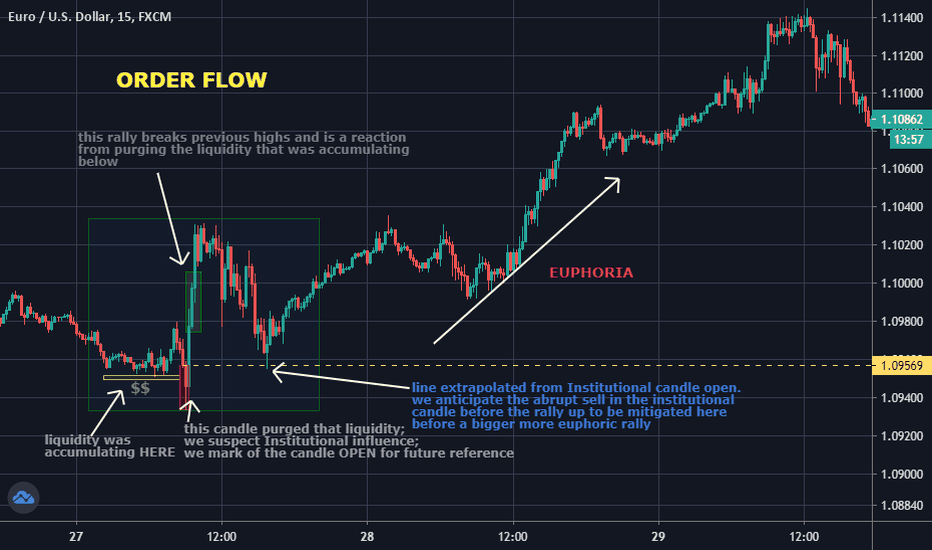

## Table of Contents

## What is order flow in financial markets?

Order flow in financial markets refers to the process of how buy and sell orders are placed and executed. It's like watching a stream of orders coming in and seeing which ones get filled first. Traders and investors use this information to understand the market's direction and strength. For example, if there are more buy orders than sell orders, it might mean that the price of a stock could go up because more people want to buy it.

Understanding order flow can help traders make better decisions. By looking at the order flow, they can see if there is a lot of interest in a particular stock or if the market is quiet. This can help them decide when to buy or sell. For instance, if a trader sees a lot of big buy orders coming in, they might decide to buy the stock too, hoping to profit from the rising price. On the other hand, if they see a lot of sell orders, they might decide to sell their stock before the price drops.

## Why is order flow important for traders and investors?

Order flow is important for traders and investors because it shows them what other people are doing in the market. By watching the order flow, they can see if more people are buying or selling a stock. This helps them understand if the price of a stock might go up or down. For example, if there are a lot of buy orders, it might mean the price will go up because more people want to buy the stock.

Traders and investors use this information to make better decisions about when to buy or sell. If they see a lot of big buy orders, they might decide to buy the stock too, hoping to make money as the price goes up. On the other hand, if they see a lot of sell orders, they might decide to sell their stock before the price drops. This way, order flow helps them stay ahead of market movements and make smarter trades.

## How can order flow be measured and tracked?

Order flow can be measured and tracked using special tools and data feeds that show all the buy and sell orders coming into the market. These tools are often called order flow indicators or order [books](/wiki/algo-trading-books). They show real-time information about the number of orders, the size of the orders, and the prices at which people want to buy or sell. Traders can use this information to see if there is more buying or selling happening, which can help them predict where the price might go next.

To track order flow, traders often use software that connects to the stock exchange or other trading platforms. This software collects data on every order that comes in and shows it in a way that's easy to understand. Some traders also use charts and graphs to see the order flow over time, which can help them spot patterns and trends. By keeping an eye on this data, traders can make better decisions about when to buy or sell, based on what other people in the market are doing.

## What are the basic principles of order flow predictability?

Order flow predictability is based on the idea that by watching the orders coming into the market, you can guess what might happen next. If you see a lot of people wanting to buy a stock, it's likely that the price will go up because more people want to own it. On the other hand, if you see a lot of people wanting to sell, the price might go down because more people want to get rid of it. This is because the balance between buying and selling orders affects the price.

Traders use tools like order books and charts to see this flow of orders. They look for patterns, like if big orders keep coming in at certain times or if there's a sudden rush of buying or selling. By understanding these patterns, traders can make better guesses about where the price might go next. It's not perfect, but it helps them make smarter decisions about when to buy or sell.

## Can you explain the difference between order flow and volume in trading?

Order flow and [volume](/wiki/volume-trading-strategy) are two important things traders look at, but they are different. Order flow is about watching the actual orders coming into the market. It shows you all the buy and sell orders, how big they are, and at what prices people want to buy or sell. This helps traders see if more people are trying to buy or sell a stock, which can give them clues about where the price might go next.

Volume, on the other hand, is just about how many shares of a stock are being traded. It's a number that tells you how active the market is for that stock. If the volume is high, it means a lot of shares are being bought and sold. But volume doesn't tell you if those trades are buys or sells, or at what prices they are happening. So, while volume shows you how much trading is going on, order flow gives you more details about what's happening with those trades.

## What tools and platforms are available for analyzing order flow?

There are several tools and platforms that traders use to analyze order flow. One popular tool is the [order book](/wiki/order-book-trading-strategies), which shows all the buy and sell orders in real-time. This helps traders see the current demand and supply for a stock. Another tool is the time and sales window, which lists every trade that happens, showing the price, size, and whether it was a buy or sell. This can help traders see the flow of orders as they come in.

Some platforms that offer these tools include Bloomberg Terminal, which is widely used by professional traders for its detailed data and analysis features. Another platform is NinjaTrader, which is popular among retail traders because it's user-friendly and offers customizable charts and indicators. These platforms help traders see the order flow and make better decisions about when to buy or sell.

In addition to these, there are specialized software like Bookmap and Jigsaw Trading, which provide visual representations of order flow. Bookmap uses a heatmap to show where orders are being placed, making it easier to spot trends and patterns. Jigsaw Trading offers tools like the Order Flow Dashboard, which helps traders see the balance between buying and selling pressure. These tools and platforms make it easier for traders to understand and predict market movements based on order flow.

## How does market microstructure affect order flow predictability?

Market microstructure is all about how markets are set up and how trading happens. It includes things like the rules of the exchange, how orders are matched, and the costs of trading. All these things can change how orders flow into the market. For example, if it costs a lot to trade, people might put in fewer orders because they don't want to pay the high fees. Or, if the rules make it hard to buy and sell quickly, people might wait longer before they trade, which can make the order flow less predictable.

Because of market microstructure, traders have to think carefully about how their orders will be handled. If they know that the market works in a certain way, they can guess better about what will happen next. For instance, if they see that big orders usually move the price a lot, they might expect the same thing to happen again. But if the market changes its rules or how it works, this can make it harder to predict the order flow. So, understanding the market microstructure helps traders make better guesses about where the price might go based on the orders they see coming in.

## What are some common strategies used to predict order flow?

One common strategy to predict order flow is to watch the order book closely. Traders look at the order book to see where people are putting in their buy and sell orders. If they see a lot of buy orders at a certain price, they might think the price will go up because more people want to buy at that price. On the other hand, if they see a lot of sell orders, they might think the price will go down because more people want to sell. By keeping an eye on these orders, traders can guess what might happen next and make their trading decisions based on that.

Another strategy is to use time and sales data. This shows every trade that happens, including the price, the size of the trade, and whether it was a buy or sell. By watching this data, traders can see if there's more buying or selling happening. For example, if they see a lot of big buy orders coming in, they might decide to buy the stock too, hoping the price will go up. If they see a lot of sell orders, they might sell their stock before the price drops. This helps them stay ahead of the market movements and make better trading choices.

Some traders also use technical analysis to predict order flow. They look at charts and patterns to see if there are any trends or signals that show where the price might go next. For example, if they see a pattern that usually leads to a price increase, they might expect more buy orders to come in. By combining this with the order book and time and sales data, traders can get a better idea of what the order flow might look like and make more informed trading decisions.

## How can one assess the accuracy of order flow prediction models?

To assess the accuracy of order flow prediction models, you can look at how well the model's predictions match what actually happens in the market. One way to do this is by using something called [backtesting](/wiki/backtesting). Backtesting means you take old market data and see how well the model would have predicted the order flow back then. If the model's predictions are close to what really happened, it's a good sign that the model is accurate. You can also use something called a confusion matrix, which shows how often the model gets things right or wrong. This helps you see if the model is good at predicting when there will be more buying or selling.

Another way to check the accuracy is by looking at performance metrics like precision, recall, and the F1 score. Precision tells you how many of the model's predictions were correct, while recall shows how many of the actual events the model caught. The F1 score is a mix of both and gives you a good overall idea of how well the model is doing. It's also important to keep testing the model with new data as the market changes. If the model keeps doing well with new data, it's a sign that it's reliable. But if it starts to do worse, you might need to update or change the model to keep it accurate.

## What role does high-frequency trading play in order flow predictability?

High-frequency trading ([HFT](/wiki/high-frequency-trading-strategies)) is a type of trading where computers make a lot of trades very quickly. These traders use special software to watch the order flow and make trades in just a few seconds. Because HFT traders can see and react to orders so fast, they can affect the order flow a lot. When they see a lot of buy orders coming in, they might buy the stock too, hoping to sell it for a little more money a few moments later. This can make it harder for other traders to predict the order flow because HFT traders can change it so quickly.

Even though HFT can make order flow less predictable, it also gives traders more information to work with. By watching what HFT traders do, other traders can learn more about the market. For example, if HFT traders start buying a lot of a stock, it might mean they think the price will go up soon. So, other traders can use this information to help them predict where the order flow might go next. But it's still tricky because HFT traders can change their minds and their orders very fast, so the order flow can be hard to predict.

## How do regulatory changes impact the predictability of order flow?

Regulatory changes can make it harder or easier to predict order flow. When rules change, it can affect how traders put in their orders and how markets work. For example, if new rules make it more expensive to trade, traders might put in fewer orders, which can make the order flow less predictable. Also, if rules change how quickly orders can be filled, this can change how traders behave and make it harder to guess what they will do next.

On the other hand, some regulatory changes can help make order flow more predictable. If rules make the market more open and fair, traders can see more of what's happening and make better guesses about the order flow. For instance, if new rules require more information to be shared about orders, traders can use this to understand the market better. But it's always important to keep an eye on how rules are changing because they can affect how well you can predict the order flow.

## What are the latest advancements in machine learning and AI for improving order flow predictability?

The latest advancements in [machine learning](/wiki/machine-learning) and AI are helping traders predict order flow better. One big advancement is the use of [deep learning](/wiki/deep-learning) models, like neural networks, which can learn from lots of data to find patterns that humans might miss. These models can look at things like the order book, time and sales data, and even news and social media to guess where the order flow might go next. By using these models, traders can make smarter decisions about when to buy or sell because they have a better idea of what other people in the market might do.

Another advancement is the use of [reinforcement learning](/wiki/reinforcement-learning), where AI systems learn by trying different things and seeing what works best. This can help the AI figure out the best ways to predict order flow by testing different strategies over time. Also, new AI tools can now process data in real-time, which means they can keep up with the fast pace of the market and give traders up-to-date information. These advancements are making it easier for traders to predict order flow and make better trades, even as the market keeps changing.

## References & Further Reading

[1]: López de Prado, M. (2018). ["Advances in Financial Machine Learning."](https://www.amazon.com/Advances-Financial-Machine-Learning-Marcos/dp/1119482089) Wiley.

[2]: Chan, E. (2008). ["Quantitative Trading: How to Build Your Own Algorithmic Trading Business."](https://github.com/ftvision/quant_trading_echan_book) Wiley.

[3]: Jansen, S. (2018). ["Machine Learning for Algorithmic Trading - Second Edition: Predictive models to extract signals from market and alternative data for systematic trading strategies with Python."](https://github.com/stefan-jansen/machine-learning-for-trading) Packt Publishing.

[4]: Hasbrouck, J., & Saar, G. (2008). ["Technology and liquidity provision: The blurring of traditional definitions."](https://www.sciencedirect.com/science/article/pii/S1386418108000220) Journal of Financial Markets, 11(2), 174-206.

[5]: Aldridge, I. (2013). ["High-Frequency Trading: A Practical Guide to Algorithmic Strategies and Trading Systems."](https://onlinelibrary.wiley.com/doi/pdf/10.1002/9781119203803.fmatter) Wiley.

[6]: Ait-Sahalia, Y., & Saglam, M. (2014). ["High-frequency traders: Taking advantage of speed."](https://papers.ssrn.com/sol3/papers.cfm?abstract_id=2342011) National Bureau of Economic Research.