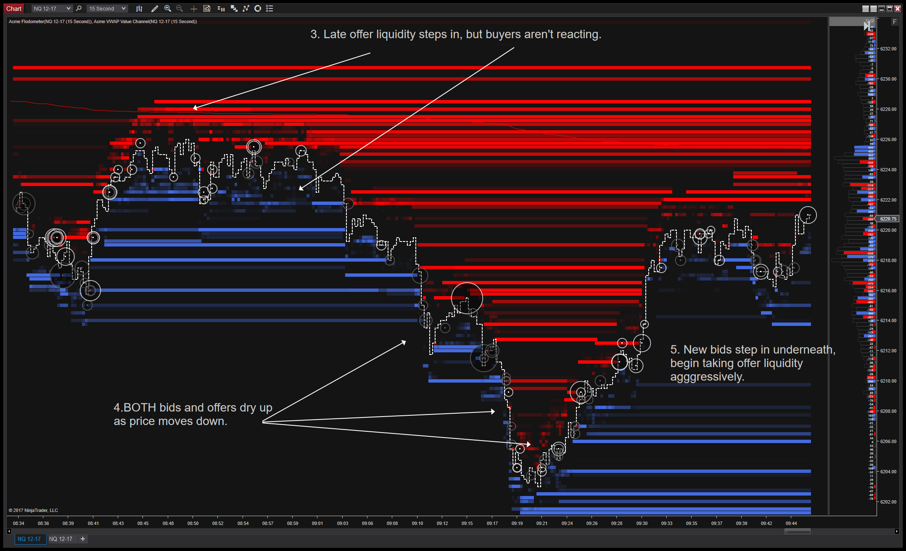

## Table of Contents

## What is order flow in financial markets?

Order flow in financial markets refers to the process of how buy and sell orders are placed and executed. It's like watching a stream of orders coming in and seeing which ones get filled first. Traders and investors use this information to understand the market's direction and strength. For example, if there are more buy orders than sell orders, it might mean that the price of a stock could go up because more people want to buy it.

Understanding order flow can help traders make better decisions. By looking at the order flow, they can see if there is a lot of interest in a particular stock or if the market is quiet. This can help them decide when to buy or sell. For instance, if a trader sees a lot of big buy orders coming in, they might decide to buy the stock too, hoping to profit from the rising price. On the other hand, if they see a lot of sell orders, they might decide to sell their shares before the price drops.

## Why is predicting order flow important for traders and investors?

Predicting order flow is important for traders and investors because it helps them guess what might happen to the price of a stock or other financial assets. If they can see that more people are buying than selling, they might think the price will go up. This can help them decide to buy the stock now, hoping to sell it later at a higher price. On the other hand, if they see more people selling than buying, they might think the price will go down. Then, they might decide to sell their stock before it loses value.

By understanding and predicting order flow, traders and investors can make smarter choices about when to buy or sell. This can lead to better profits and less risk. For example, if a trader predicts a big wave of buy orders coming, they might buy the stock early and make money when the price goes up. Or, if they predict a lot of sell orders, they can sell their stock before it drops in price. This way, they can avoid losing money. Predicting order flow is like having a sneak peek into the future of the market, which can be very helpful in making money.

## What are the basic components of order flow data?

Order flow data includes a few basic parts that help traders and investors understand what's happening in the market. The first part is the buy orders, which show how many people want to buy a stock and at what price. The second part is the sell orders, which show how many people want to sell a stock and at what price. By looking at these, you can see if there are more buyers or sellers, which can give clues about where the price might go next.

Another important part of order flow data is the size of the orders. Big orders can move the market more than small ones, so traders pay attention to how many shares are being bought or sold. The last part is the time the orders come in. Orders that come in quickly one after another can show that the market is moving fast, while slow orders might mean the market is quiet. All these parts together help traders make better guesses about what the market will do next.

## How can one start collecting order flow data?

To start collecting order flow data, you'll need to use special tools called trading platforms or data feeds. These tools connect you to the stock market and show you the orders as they happen. Some popular platforms for this are Bloomberg Terminal, NinjaTrader, and Interactive Brokers. You might need to pay a fee to use these services, but they give you real-time information about buy and sell orders.

Once you have access to a trading platform, you can start watching the order flow. Look at the buy and sell orders to see how many people want to buy or sell a stock and at what price. Also, pay attention to the size of the orders and when they come in. This information can help you understand what's happening in the market and make better trading decisions.

## What are some common methods used to analyze order flow?

One common method to analyze order flow is by using the order book. The order book shows all the current buy and sell orders for a stock. By looking at the order book, traders can see if there are more buyers or sellers and at what prices they want to trade. This helps them guess if the price of the stock might go up or down. For example, if there are a lot of buy orders at a certain price, traders might think the price will go up soon.

Another method is to use volume analysis. This means looking at how many shares are being traded. If there is a big increase in the number of shares being bought or sold, it can show that the market is moving in a certain direction. Traders use this information to decide if it's a good time to buy or sell. For instance, if a lot of shares are being bought quickly, it might mean the price will go up, so traders might want to buy the stock too.

A third method is to use time and sales data, which shows every trade that happens in real-time. By watching this data, traders can see the exact price and size of each trade. This helps them understand the speed and strength of the market movements. If trades are happening fast and at higher prices, it might mean the stock is becoming more popular, and the price could go up.

## Can you explain the concept of market depth and its relation to order flow prediction?

Market depth is like a snapshot of how many people want to buy or sell a stock at different prices. It shows you the order book, which lists all the buy and sell orders waiting to be filled. If you see a lot of buy orders at a certain price, it means there's a lot of interest in buying the stock at that price. On the other hand, if there are many sell orders, it shows that a lot of people want to sell at that price. Market depth helps traders see how strong the demand and supply are for a stock, which can give them clues about where the price might go next.

Market depth is closely related to order flow prediction because it helps traders guess what might happen to the price of a stock. By looking at the order book, traders can see if there are more buyers or sellers and at what prices they want to trade. If there are a lot of buy orders and not many sell orders, traders might predict that the price will go up because more people want to buy than sell. On the other hand, if there are more sell orders, they might think the price will go down. So, understanding market depth can help traders make better predictions about order flow and make smarter trading decisions.

## What role do algorithms play in order flow prediction?

Algorithms play a big role in helping traders predict order flow. They are like smart computer programs that can look at a lot of data very quickly. These programs can find patterns in the buy and sell orders that humans might miss. For example, an algorithm can see if a lot of big buy orders are coming in at the same time, which might mean the price of a stock will go up soon. By using algorithms, traders can make better guesses about where the market is heading and decide when to buy or sell.

Algorithms also help by making trading faster and more automatic. Instead of traders having to watch the market all the time, algorithms can do it for them. If an algorithm sees a good chance to buy or sell based on the order flow, it can do it right away without waiting for a person to make a decision. This can be very helpful in fast-moving markets where prices can change quickly. So, algorithms not only help predict order flow but also make trading easier and quicker.

## How do high-frequency trading strategies utilize order flow prediction?

High-frequency trading (HFT) strategies use order flow prediction to make quick profits in the stock market. HFT traders use special computer programs, called algorithms, to watch the market all the time. These algorithms look at the buy and sell orders coming in and try to guess what will happen to the price of a stock next. If they see a lot of buy orders coming in, they might think the price will go up soon. Then, they can buy the stock quickly before the price goes up and sell it right after to make a small profit. This happens very fast, often in just a few seconds.

These strategies rely on being faster than other traders. HFT traders use powerful computers and fast internet connections to get the order flow data before others do. This gives them a small advantage in predicting where the market is going. By acting on this information quickly, they can make many small trades throughout the day, adding up to big profits. Even though each trade might only make a tiny amount of money, doing it thousands of times can lead to a lot of money over time.

## What are the challenges faced when predicting order flow in volatile markets?

Predicting order flow in volatile markets is hard because the prices can change very quickly. In these markets, a lot of buy and sell orders come in fast, and it's tough to guess what will happen next. Traders need to watch the market all the time and use fast computers to keep up. If they miss even a small change, they might make the wrong decision and lose money.

Another challenge is that in volatile markets, big news or events can suddenly change the order flow. For example, if a company announces bad news, a lot of people might want to sell their stock all at once. This can make the price drop very fast. Traders need to be ready for these surprises and have plans to deal with them. It's like trying to predict the weather during a storm – it's hard to know exactly what will happen, but you can try to be ready for different possibilities.

## How can machine learning models enhance order flow prediction?

Machine learning models can make predicting order flow a lot better by looking at a lot of data and finding patterns that people might miss. These models can learn from past order flow data and use it to guess what might happen next. For example, they can see if certain patterns of buy and sell orders often lead to a price going up or down. By understanding these patterns, machine learning models can help traders make smarter decisions about when to buy or sell a stock.

These models can also keep learning and getting better over time. As they see more data, they can adjust their predictions to be more accurate. This is really helpful in fast-changing markets where what worked yesterday might not work today. By using machine learning, traders can get a better idea of the order flow and make quicker, more informed trades. This can lead to better profits and less risk in trading.

## What are the latest advancements in order flow prediction technology?

The latest advancements in order flow prediction technology include the use of more advanced machine learning models. These models can now handle huge amounts of data very quickly and find patterns that were hard to see before. For example, deep learning, a type of machine learning, can look at lots of different things at once, like the size of orders, the time they come in, and even news events. This helps the models make better guesses about what will happen to the price of a stock next. Traders can use these predictions to buy or sell at the right time, which can lead to more profits.

Another big advancement is the use of real-time data feeds and faster computers. These technologies let traders see the order flow as it happens, which is really important in fast-moving markets. With faster computers, traders can process this data quickly and make decisions in just a few seconds. This is especially helpful for high-frequency trading, where making trades a little bit faster can make a big difference. Overall, these new technologies are making order flow prediction more accurate and helping traders make better choices.

## How can one evaluate the accuracy and reliability of order flow prediction models?

To evaluate the accuracy and reliability of order flow prediction models, you can start by looking at how well the model's predictions match what actually happens in the market. One way to do this is by using a measure called "hit rate," which shows how often the model's predictions are right. If the model says the price will go up and it does, that's a hit. You can also look at the "profitability" of the model's predictions. If following the model's advice leads to making more money than losing, it's a good sign that the model is accurate and reliable.

Another way to check the model is by using something called "backtesting." This means you use old data to see how the model would have done in the past. If the model could have made good predictions with old data, it's more likely to do well with new data. But remember, past performance doesn't always mean future results will be the same. It's also important to see if the model works well in different market conditions, like when the market is calm or when it's very volatile. A good model should be able to handle different situations well.

## References & Further Reading

[1]: Bouchaud, J.-P., Farmer, J. D., & Lillo, F. (2008). ["How Markets Slowly Digest Changes in Supply and Demand."](https://arxiv.org/abs/0809.0822) Quantitative Finance, 8(1), 1-10.

[2]: Cartea, Á., Jaimungal, S., & Penalva, J. (2015). ["Algorithmic and High-Frequency Trading."](https://assets.cambridge.org/97811070/91146/frontmatter/9781107091146_frontmatter.pdf) Cambridge University Press.

[3]: Abernethy, J., & Kale, S. (2013). ["Adaptive Market Making via Online Learning."](https://proceedings.neurips.cc/paper/2013/file/995e1fda4a2b5f55ef0df50868bf2a8f-Paper.pdf) Advances in Neural Information Processing Systems 26.

[4]: Avellaneda, M., & Stoikov, S. (2008). ["High-Frequency Trading in a Limit Order Book."](https://people.orie.cornell.edu/sfs33/LimitOrderBook.pdf) Quantitative Finance, 8(3), 217–224.

[5]: Bacchetti, A., Ranelucci, G., & Scalas, E. (2022). ["Order Book Trading, High Frequency and Institutional Impact."](https://files.eric.ed.gov/fulltext/EJ1459254.pdf) Arxiv preprint arXiv:2203.04252.

[6]: Aldridge, I. (2013). ["High-Frequency Trading: A Practical Guide to Algorithmic Strategies and Trading Systems."](https://www.amazon.com/High-Frequency-Trading-Practical-Algorithmic-Strategies/dp/1118343506) Wiley Trading.

[7]: Zhang, Y. J., & Liu, Y. (2016). ["Statistical Learning in Algorithmic Trading: Is it Worth Attention?"](https://www.sciencedirect.com/science/article/pii/S1359646225000569) Physica A: Statistical Mechanics and its Applications, 457, 339-353.