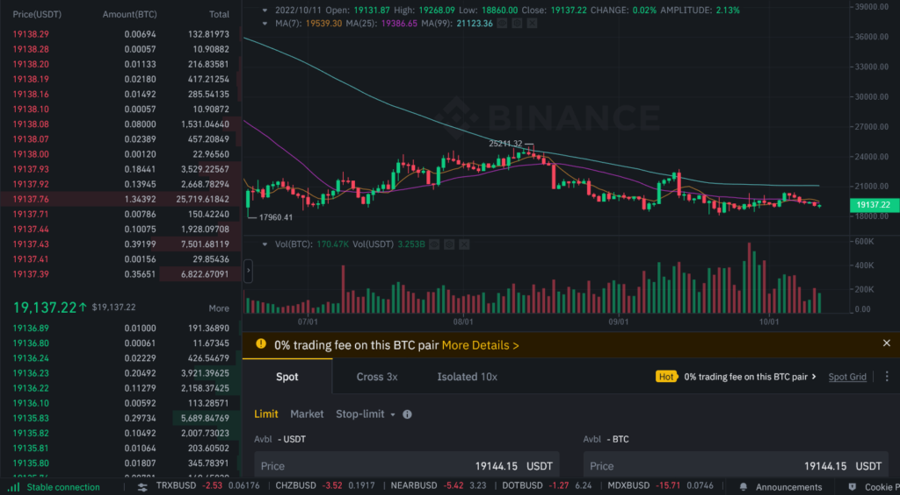

Order flow trading has become an essential technique in algorithmic trading, offering profound insights that surpass traditional technical analysis. This approach focuses on the sequence and size of trades executed in the market, which provides a real-time glimpse into the supply and demand dynamics that dictate price movements. By analyzing the flow of buy and sell orders, traders can predict short-term market movements more accurately, enhancing their overall trading strategies.

This article explores the fundamental principles of order flow trading and examines how it integrates with algorithmic trading. By scrutinizing the interaction of orders within the market, traders can gain a deeper understanding of market sentiment and liquidity. This understanding allows for more informed decision-making relative to conventional chart analysis, which largely relies on historical price patterns and indicators.



Order flow trading offers significant advantages, particularly in its ability to identify the actions of large market participants, often referred to as "smart money." By observing the nuanced movements within order books and the execution of trades, traders can detect shifts in market sentiment that precede major price changes. These observations can then be translated into actionable strategies that leverage the detailed information embedded within the order flow.

Additionally, this article will explore common tools and indicators used by traders to harness order flow data, such as footprint charts and the Volume-Weighted Average Price (VWAP) indicator. We will also provide an analysis of backtesting an order flow trading strategy, demonstrating how historical simulation can help verify and refine trading approaches based on order flow data.

As algorithmic trading continues to evolve, integrating order flow techniques into trading strategies becomes increasingly indispensable for traders seeking to optimize their performance. Understanding the mechanics of order flow trading, along with adeptly using the relevant tools, can significantly improve the accuracy of market predictions and the effectiveness of trading strategies.

## Table of Contents

## Understanding Order Flow in Trading

Order flow refers to the continuous stream of buy and sell orders in the financial markets. It provides traders with a granular view of trading activity at various price levels. This detailed perspective enhances understanding of the underlying supply and demand dynamics, thereby offering a more profound insight into market sentiment than conventional price charts.

A crucial component in understanding order flow is the Depth of Market (DOM), also known as the [order book](/wiki/order-book-trading-strategies). The DOM serves as a visual representation of current buy and sell orders for a financial instrument. It displays the different price levels buyers are willing to pay (bids) and the prices sellers seek (asks), along with their respective volumes. By analyzing this information, traders can gauge the strength or weakness of market participants' positions, thus assessing market sentiment.

Order flow analysis involves identifying potential price movements by examining existing and historical order activities. For instance, an imbalance in the order book, where there are more buy orders than sell orders at a specific price level, might indicate an impending upward price movement due to higher demand. Similarly, a surplus of sell orders could signal a potential price drop.

A key concept in order flow trading is order imbalances, which are critical for short-term price predictions. Order imbalances occur when there is a significant difference between buy and sell orders at a given price level. For instance, if the cumulative bid size significantly surpasses the cumulative ask size, there is a bullish order imbalance, suggesting that upward price pressure is likely.

Mathematically, order imbalances can be expressed as:

$$
\text{Order Imbalance} = \frac{\text{Total Bids} - \text{Total Asks}}{\text{Total Bids} + \text{Total Asks}}
$$

A positive order imbalance value may predict a price increase, while a negative value suggests a potential decrease.

Understanding these dynamics is essential for making informed trading decisions. Traders often employ advanced software tools to capture and analyze order flow data, leveraging this information to anticipate price trends and execute trades strategically.

## Order Flow Indicators and Tools

Order flow analysis utilizes a range of indicators and tools, each providing distinct insights into market dynamics through the lens of buy and sell activity. Among the most popular is the footprint chart, which captures the [volume](/wiki/volume-trading-strategy) of executed buy and sell orders at specific price levels. This visualization aids traders in assessing supply and demand imbalances and spotting trend reversals or continuations based on trading volume distribution. By examining these patterns, traders can refine their strategies to preempt potential price movements.

Another essential tool is the Volume Profile, which maps out traded volume over different price levels, delineating high-volume nodes that signify significant support or resistance zones. Understanding these zones helps traders make informed decisions by identifying potential entry and [exit](/wiki/exit-strategy) points.

The Time and Sales Window, often referred to as the "tape," logs the real-time order executions, detailing transaction times, prices, and volume. Monitoring this data can provide insights into the aggressiveness of buyers or sellers, potentially forecasting imminent market shifts.

The VWAP Indicator (Volume Weighted Average Price) plays a critical role in assessing the average price at which a security trades throughout a specific time period, accounting for both price and volume. Institutional traders frequently use VWAP as it offers a benchmark to measure the quality of order execution, evaluating if trades were executed at an advantageous price.

Integrating these tools into trading strategies can enhance accuracy in predicting market changes. For instance, using Python, traders can automate the analysis of these indicators. Here's a basic example of calculating VWAP using Python:

```python
import pandas as pd

def compute_vwap(data):
    """Compute the Volume Weighted Average Price."""
    q = data['Volume']
    p = data['Price']
    return (p * q).cumsum() / q.cumsum()

# Sample Data
data = pd.DataFrame({
    'Price': [129, 130, 131, 132, 133],
    'Volume': [100, 150, 200, 250, 300]
})

data['VWAP'] = compute_vwap(data)
print(data)
```

Various levels of order flow indicators cater to different trading styles, from [scalping](/wiki/gamma-scalping) to long-term investing. Scalpers, for instance, might prioritize footprint charts and the tape for capturing short-term price movements, whereas day traders could integrate Volume Profile and VWAP for broader market trends over the trading session.

Selecting the appropriate tools and indicators is crucial, as it allows traders to align market analysis with their specific trading objectives and risk tolerances, thereby optimizing their decision-making processes.

## Order Flow Trading Strategies and Backtesting

Order flow trading strategies capitalize on the real-time data of buy and sell orders within a market, making them particularly effective for short-term trading such as scalping or [day trading](/wiki/day-trading-spy). These strategies rely on insights derived from the detailed observation of order flows rather than solely on historical price patterns. By examining the live flow of orders and transactions, traders can discern potential market movements, offering an edge over traditional technical analysis methods.

To formulate an order flow strategy, traders must first identify key market conditions and signals based on order imbalances, [liquidity](/wiki/liquidity-risk-premium) levels, and the intensity of trading activity. Common approaches include observing volume spikes at specific price levels or recognizing patterns in the Depth of Market (DOM) data which indicate either emerging buying or selling pressure.

Backtesting these strategies can pose unique challenges due to the dynamic nature of order flow and the necessity of real-time simulation. Unlike conventional [backtesting](/wiki/backtesting) that relies purely on historical price data, order flow backtests must replicate the nuances of live market orders. The methodology typically involves reconstructing scenarios where market order book conditions prior to the trade's execution are as close as possible to reality. This requires high-frequency historical data with granular details of trades and quotes.

A simplistic example of an order flow strategy could involve monitoring the cumulative volume delta (CVD), which is the net difference between buy and sell volumes over a specific period. The basic hypothesis is that an increasing CVD might indicate strong buying interest, potentially forecasting an upward price movement.

Here is a basic approach to backtest such a strategy in Python:

```python
import pandas as pd

# Assume data is a DataFrame with columns: 'timestamp', 'price', 'buy_volume', 'sell_volume'
data['cumulative_volume_delta'] = (data['buy_volume'] - data['sell_volume']).cumsum()

# Simple strategy: Buy if the CVD is increasing significantly; Sell if it's decreasing significantly
entry_threshold = 1000
exit_threshold = -1000

positions = []
current_position = 0

for i in range(1, len(data)):
    if (data['cumulative_volume_delta'].iloc[i] - data['cumulative_volume_delta'].iloc[i-1]) > entry_threshold:
        if current_position <= 0:  # Avoid buying if already in a buy position
            positions.append((data['timestamp'].iloc[i], 'Buy', data['price'].iloc[i]))
            current_position = 1
    elif (data['cumulative_volume_delta'].iloc[i] - data['cumulative_volume_delta'].iloc[i-1]) < exit_threshold:
        if current_position > 0:  # Close buy position
            positions.append((data['timestamp'].iloc[i], 'Sell', data['price'].iloc[i]))
            current_position = 0

# Printing the resulting trades
print(pd.DataFrame(positions, columns=['timestamp', 'action', 'price']))
```

This example demonstrates a straightforward strategy reacting to changes in CVD, a common order flow indicator. However, it's crucial to acknowledge the limitations of such models. Real-world slippage, transaction costs, and the execution times of buy/sell orders can severely affect performance.

Traders must also consider the impact of high-frequency trading conditions on backtests. Minute deviations in order book data can significantly influence outcomes. Moreover, extensive testing across different market conditions and time frames is essential to validate a strategy's robustness.

By combining advanced analytical tools and comprehensive backtesting methods, traders can develop more sophisticated order flow strategies. This approach equips them with a deeper understanding of market microstructure and the means to leverage real-time data effectively in their trading decisions.

## Order Flow Trading Software

The choice of trading software is crucial for effective order flow trading, as it needs to handle large volumes of data efficiently. The ability to process and analyze order flow data in real-time is what differentiates standard trading platforms from those designed specifically for order flow analysis. This section reviews some of the advanced platforms available, namely MotiveWave, Ninja Trader, and Sierra Chart, discussing their features and how they cater to the needs of order flow traders.

**MotiveWave** is a comprehensive trading platform that supports advanced charting and analysis for order flow trading. One of its significant features is its customizability, allowing traders to modify their strategies and add various indicators to better meet their trading requirements. MotiveWave integrates features such as Volume Imprint and Market Depth, which provide detailed views of order flow and market liquidity, essential for executing informed trades.

**Ninja Trader** is known for its robust order flow analysis capabilities, offering several tools specifically designed for this purpose. These include the Order Flow + suite, which features tools like Volume Profile, Market Depth Map, and Footprint charts. Ninja Trader’s high-performance backtesting and trade simulation capabilities make it a popular choice for traders looking to develop and refine their order flow strategies. Its ecosystem also supports numerous third-party add-ons, further enhancing its analytical capabilities.

**Sierra Chart** stands out due to its efficiency in processing large volumes of data, which is particularly important for order flow analysis. It offers detailed market depth views and advanced charting options, which include Number Bars (also known as Footprint charts) and TPO Profiles to analyze the order flow. Sierra Chart is favored for its cost-effectiveness, flexibility, and the ability for in-depth customization of analytical features.

Selecting the right software depends significantly on a trader’s specific needs and trading style. Traders should consider factors such as the type of data feed they require, the customization options available, and the specific tools offered by the platform for order flow analysis. Additionally, the availability of plugins and third-party add-ons can significantly enhance the capabilities of a trading platform. Tools such as Jigsaw Trading and Bookmap provide additional functionality and can be integrated with platforms like Ninja Trader to offer enhanced visualization and analysis of order flow data.

In summary, choosing the right order flow trading software involves evaluating the features and capabilities of several platforms to find one that best aligns with a trader's personal trading strategy and needs. The integration of appropriate third-party tools can further augment the analysis, providing traders with comprehensive insights into the behavior of market participants through the flow of orders.

## Conclusion

Order flow trading offers a unique edge in understanding market dynamics by focusing on the flow of orders rather than historical price data. Unlike conventional technical analysis, which relies heavily on past price movements, order flow trading reveals real-time order activity, giving traders immediate and actionable insights into supply and demand fluctuations.

As [algorithmic trading](/wiki/algorithmic-trading) continues to gain prominence, integrating order flow techniques can significantly improve trading outcomes. By examining the flow of buy and sell orders, traders can discern undercurrents in the market that might otherwise remain hidden within historical price charts. This real-time data is invaluable for algorithmic systems that aim to capture fleeting opportunities in fast-paced markets.

Adopting order flow strategies requires a solid understanding of market microstructure and careful selection of tools. A trader needs to comprehend the intricacies of how orders are matched and the impact of liquidity and [volatility](/wiki/volatility-trading-strategies) on order fulfillment. Specialized software and indicators are essential for processing and interpreting the large volumes of data inherent in order flow analysis. Choosing these tools wisely aligns with a trader's specific strategy and goals, optimizing the effectiveness of their approach.

The insights gained from order flow analysis provide traders with a more nuanced view of the market, potentially leading to better trading decisions. By understanding not just where the market has been, but where it is actively moving, traders can anticipate changes ahead of traditional indicators. This anticipatory advantage can be the difference between success and missed opportunities, particularly in volatile or rapidly changing markets.

Emphasizing continual learning and adaptation is key for any trader looking to succeed in the modern trading landscape. Markets evolve, and so must trading strategies. Traders who integrate the latest tools, refine their understanding of order flow dynamics, and stay informed about new developments will be well-positioned to maintain a competitive advantage. In the ever-changing financial markets, adaptability is not just beneficial, but essential for long-term success.

## References & Further Reading

[1]: ["Trading and Exchanges: Market Microstructure for Practitioners"](https://www.amazon.com/Trading-Exchanges-Market-Microstructure-Practitioners/dp/0195144708) by Larry Harris

[2]: Bouchaud, J.-P., Farmer, J. D., & Lillo, F. (2008). ["How Markets Slowly Digest Changes in Supply and Demand."](https://arxiv.org/abs/0809.0822) Handbook of Financial Markets: Dynamics and Evolution.

[3]: Hasbrouck, J. (2007). ["Empirical Market Microstructure: The Institutions, Economics, and Econometrics of Securities Trading."](https://academic.oup.com/book/52241) Oxford University Press.

[4]: Biais, B., Glosten, L., & Spatt, C. (2005). ["Market Microstructure: A Survey of Microfoundations, Empirical Results, and Policy Implications."](https://www.sciencedirect.com/science/article/abs/pii/S1386418104000382) Journal of Financial Markets.

[5]: [Narang, R. (2013). "Inside the Black Box: A Simple Guide to Quantitative and High-Frequency Trading."](https://onlinelibrary.wiley.com/doi/book/10.1002/9781118662717) Wiley Trading.