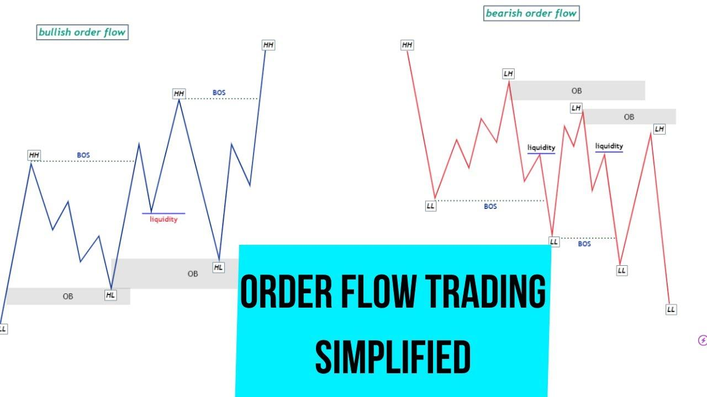

## Table of Contents

## What is order flow trading?

Order flow trading is a way of making decisions about buying and selling stocks by looking at the orders coming into the market. Traders who use this method pay close attention to the number of buy and sell orders, and how they are changing. They try to figure out where the market might be heading next by seeing if there are more people wanting to buy or more people wanting to sell.

This type of trading can be helpful because it gives traders a real-time look at what is happening in the market. By understanding the balance between buyers and sellers, traders can make better guesses about whether the price of a stock will go up or down. It's like trying to predict the direction of a river by watching the flow of water. If more water is coming from one side, it might push the river in that direction.

## How does order flow differ from other trading strategies?

Order flow trading is different from other trading strategies because it focuses on watching the actual orders coming into the market, rather than just looking at charts or using indicators. For example, some traders use technical analysis, where they look at past price movements and patterns on charts to make their decisions. Others might use fundamental analysis, where they study a company's financial health and news to decide if a stock is a good buy. Order flow trading, on the other hand, tries to get a sense of the market's current mood by seeing if there are more buyers or sellers at any given moment.

Another key difference is that order flow trading often involves looking at very short-term movements. Traders using this method might make many trades in a single day, trying to take advantage of quick changes in the market. In contrast, strategies like value investing might involve holding onto stocks for months or even years, based on the belief that the stock's true value will eventually be recognized by the market. So, while order flow trading is all about reacting to the immediate flow of orders, other strategies might be more about long-term planning and patience.

## What are the key components of order flow data?

Order flow data is made up of information about the buy and sell orders that come into the market. This includes how many orders there are, how big they are, and whether they are to buy or sell. Traders look at this data to see if there are more people wanting to buy or more people wanting to sell. This helps them guess where the price might go next.

Another part of order flow data is the order book, which shows all the current buy and sell orders that haven't been filled yet. The order book tells traders at what prices people are willing to buy and sell. By watching how the order book changes, traders can get a sense of the market's direction. For example, if there are a lot of new buy orders coming in, it might push the price up.

## How can a beginner start analyzing order flow?

To start analyzing order flow, a beginner should first understand what order flow is. It's about watching the orders that come into the market, like how many people want to buy or sell a stock at any moment. Beginners can start by looking at the order book, which shows all the current buy and sell orders. By watching the order book, you can see if there are more people wanting to buy or sell, which can give you hints about where the price might go next.

Once you're familiar with the order book, the next step is to use tools that help you see order flow more clearly. There are special software programs and platforms that show order flow data in real-time. These tools can help you see the balance between buyers and sellers and spot trends. It's important to practice using these tools and get comfortable with them. Start by watching the market without making trades, and try to guess where the price might go based on the order flow you see. Over time, as you get better at reading the order flow, you can start making trades based on what you've learned.

## What tools and platforms are essential for order flow trading?

To start with order flow trading, you'll need some special tools and platforms. One key tool is a Level II quote system, which shows you the order book in real time. This lets you see all the current buy and sell orders, so you can tell if there are more people wanting to buy or sell. Another important tool is a time and sales window, which shows every trade as it happens. This can help you see how the market is moving and reacting to new orders.

There are also trading platforms designed specifically for order flow trading, like NinjaTrader, Sierra Chart, and Bookmap. These platforms give you detailed order flow data and let you customize how you see the information. They often have features like heat maps and [volume](/wiki/volume-trading-strategy) profiles that can help you spot trends and patterns in the market. It's a good idea to try out a few different platforms to see which one works best for you and fits your trading style.

## What are the common indicators used in order flow analysis?

In order flow analysis, traders use several common indicators to help them understand the market. One popular indicator is the Volume Profile, which shows how much trading happens at different price levels. By looking at this, traders can see where a lot of buying or selling is happening, which can help them guess where the price might go next. Another useful indicator is the Delta, which measures the difference between the number of buy orders and sell orders. A positive delta means there are more buyers, which might push the price up, while a negative delta means there are more sellers, which might push the price down.

Another important indicator is the Cumulative Delta, which adds up the delta over time. This can help traders see if the market is getting more bullish or bearish over a longer period. The Footprint Chart is also commonly used, showing the volume traded at each price level and time. This helps traders see where the most activity is happening and where the market might be heading. By using these indicators together, traders can get a better picture of the order flow and make more informed trading decisions.

## How does market depth influence order flow trading decisions?

Market depth is all about how many buy and sell orders are waiting in the order book at different prices. It shows you how much interest there is in a stock at different price levels. When you're doing order flow trading, market depth can help you see if there's a lot of support or resistance at certain prices. If there are a lot of buy orders at a certain price, that's called support because it might stop the price from falling further. If there are a lot of sell orders at a certain price, that's called resistance because it might stop the price from going up more.

By looking at market depth, traders can make better guesses about where the price might go next. For example, if you see a lot of buy orders stacked up at a certain price, it might be a good sign to buy the stock because other people are also interested in buying at that price. On the other hand, if you see a lot of sell orders at a certain price, it might be a good time to sell or wait for the price to drop before buying. Market depth gives traders a real-time snapshot of the market's mood, helping them decide when to buy or sell based on the current balance of orders.

## What are the best practices for managing risk in order flow trading?

Managing risk in order flow trading is important because the market can move quickly and unexpectedly. One good way to manage risk is to set stop-loss orders. A stop-loss order automatically sells your stock if the price drops to a certain level. This helps you limit how much money you can lose on a trade. Another way to manage risk is to only use a small part of your money for each trade. If you only risk a small amount, even if you lose, you won't lose too much of your total money.

It's also a good idea to keep an eye on the market and be ready to change your plans if things don't go as expected. Sometimes, the order flow can change suddenly, and you need to be ready to act fast. Always think about how much you could lose before you make a trade, and don't let your feelings make you take too many risks. By being careful and planning ahead, you can protect your money and trade more safely.

## How can advanced traders use order flow to predict market movements?

Advanced traders use order flow to predict market movements by carefully watching the balance between buy and sell orders. They look at the order book to see if there are more people wanting to buy or more people wanting to sell. If they see a lot of buy orders coming in, it might mean the price is going to go up because more people want to buy the stock. On the other hand, if they see a lot of sell orders, it might mean the price is going to go down because more people want to sell. By paying close attention to these changes, advanced traders can spot trends and patterns that help them guess where the market might be heading next.

Another way advanced traders use order flow is by looking at specific indicators like Volume Profile and Delta. Volume Profile shows them how much trading is happening at different price levels, helping them find where the most buying or selling is happening. Delta measures the difference between buy and sell orders, giving them a quick snapshot of whether the market is leaning towards buying or selling. By combining these indicators with their knowledge of the order book, advanced traders can make more accurate predictions about market movements. This helps them make better trading decisions and take advantage of short-term changes in the market.

## What are the psychological challenges faced in order flow trading?

Order flow trading can be tough on your mind because it moves fast and you need to make quick decisions. It's easy to feel stressed when you see the orders coming in and out so quickly. You might worry about missing a good chance to buy or sell, or you might feel bad if a trade doesn't go your way. It's important to stay calm and not let your feelings make you do things you might regret later. If you start feeling too stressed, it's a good idea to take a break and come back when you feel better.

Another challenge is dealing with the ups and downs of the market. Sometimes, the order flow can change suddenly, and it can be hard not to get too excited or too upset about it. You might feel like you need to trade a lot to make up for losses or to take advantage of every little change, but this can lead to more risk and more stress. It's helpful to have a clear plan and stick to it, even when the market is moving a lot. By keeping your emotions in check and following your plan, you can make better decisions and trade more successfully.

## How does order flow trading adapt to different market conditions?

Order flow trading can change how it works depending on what the market is doing. When the market is moving a lot and there are big changes in the orders coming in, traders need to be quick and ready to make fast decisions. They watch the order book closely to see if there are more people wanting to buy or sell. If they see a lot of buy orders, they might buy the stock too, hoping the price will go up. If they see a lot of sell orders, they might sell or wait for the price to drop before buying. This way, they can take advantage of the big moves in the market.

When the market is calm and not moving much, order flow trading can be different. Traders might look for small changes in the order flow that could mean the market is about to move. They might use tools like Volume Profile to see where the most trading is happening and Delta to see if there are more buyers or sellers. By watching these small changes, they can try to guess where the market might go next and make trades based on that. This helps them make money even when the market isn't moving a lot.

## What are the latest trends and innovations in order flow trading strategies?

One of the latest trends in order flow trading is the use of [artificial intelligence](/wiki/ai-artificial-intelligence) (AI) and [machine learning](/wiki/machine-learning). These technologies help traders analyze huge amounts of order flow data quickly. AI can spot patterns and trends that might be hard for a person to see. This means traders can make better guesses about where the market might go next. Some trading platforms now include AI tools that can give traders real-time advice based on the order flow they see. This helps traders make smarter decisions and take advantage of opportunities in the market.

Another innovation is the use of more advanced visualization tools. These tools make it easier for traders to see and understand the order flow data. For example, heat maps show where the most trading is happening at different prices. This helps traders see where the market might be heading. Some platforms also use 3D charts and other new ways to show data. These tools help traders spot trends and patterns faster, so they can make quick decisions. By using these new tools, traders can get a better sense of the market and make trades that are more likely to be successful.

## What is Understanding Order Flow in Trading?

Order flow refers to the continuous stream of buy and sell orders in the financial markets. It provides traders with a granular view of trading activity at various price levels. This detailed perspective enhances understanding of the underlying supply and demand dynamics, thereby offering a more profound insight into market sentiment than conventional price charts.

A crucial component in understanding order flow is the Depth of Market (DOM), also known as the [order book](/wiki/order-book-trading-strategies). The DOM serves as a visual representation of current buy and sell orders for a financial instrument. It displays the different price levels buyers are willing to pay (bids) and the prices sellers seek (asks), along with their respective volumes. By analyzing this information, traders can gauge the strength or weakness of market participants' positions, thus assessing market sentiment.

Order flow analysis involves identifying potential price movements by examining existing and historical order activities. For instance, an imbalance in the order book, where there are more buy orders than sell orders at a specific price level, might indicate an impending upward price movement due to higher demand. Similarly, a surplus of sell orders could signal a potential price drop.

A key concept in order flow trading is order imbalances, which are critical for short-term price predictions. Order imbalances occur when there is a significant difference between buy and sell orders at a given price level. For instance, if the cumulative bid size significantly surpasses the cumulative ask size, there is a bullish order imbalance, suggesting that upward price pressure is likely.

Mathematically, order imbalances can be expressed as:

$$
\text{Order Imbalance} = \frac{\text{Total Bids} - \text{Total Asks}}{\text{Total Bids} + \text{Total Asks}}
$$

A positive order imbalance value may predict a price increase, while a negative value suggests a potential decrease.

Understanding these dynamics is essential for making informed trading decisions. Traders often employ advanced software tools to capture and analyze order flow data, leveraging this information to anticipate price trends and execute trades strategically.

## References & Further Reading

[1]: ["Trading and Exchanges: Market Microstructure for Practitioners"](https://www.amazon.com/Trading-Exchanges-Market-Microstructure-Practitioners/dp/0195144708) by Larry Harris

[2]: Bouchaud, J.-P., Farmer, J. D., & Lillo, F. (2008). ["How Markets Slowly Digest Changes in Supply and Demand."](https://arxiv.org/abs/0809.0822) Handbook of Financial Markets: Dynamics and Evolution.

[3]: Hasbrouck, J. (2007). ["Empirical Market Microstructure: The Institutions, Economics, and Econometrics of Securities Trading."](https://academic.oup.com/book/52241) Oxford University Press.

[4]: Biais, B., Glosten, L., & Spatt, C. (2005). ["Market Microstructure: A Survey of Microfoundations, Empirical Results, and Policy Implications."](https://www.sciencedirect.com/science/article/abs/pii/S1386418104000382) Journal of Financial Markets.

[5]: [Narang, R. (2013). "Inside the Black Box: A Simple Guide to Quantitative and High-Frequency Trading."](https://onlinelibrary.wiley.com/doi/book/10.1002/9781118662717) Wiley Trading.