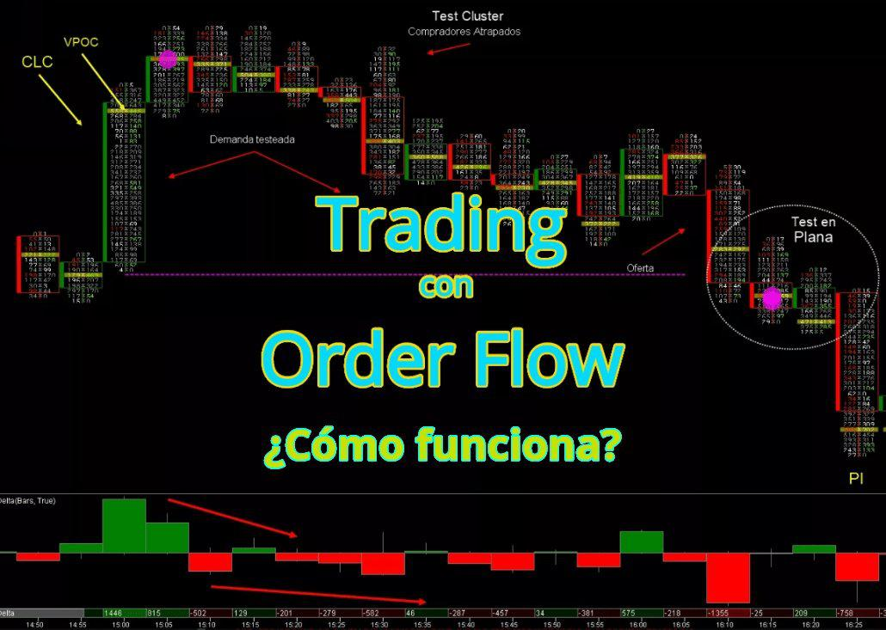

Order flow analysis has emerged as a formidable tool in the arsenal of traders seeking an advantage in competitive markets. This analytical approach deciphers the intricate patterns of buying and selling activities, enabling traders to glean valuable insights that traditional analysis methods might overlook. By integrating order flow analysis with conventional trading techniques, traders can more precisely identify supply and demand zones, critical regions on a price chart where the forces of supply and demand equilibrate. These zones often herald potential reversals or continuations in price movements, making them invaluable for strategic trading decisions.

The essence of efficient trading lies in accurately timing market entry and exit points. Order flow analysis facilitates this precision by providing real-time insights into market dynamics. Traders are equipped to make informed decisions about when to initiate or close positions, thus optimizing their potential returns while mitigating risks. The advanced nature of order flow analytics offers a microcosmic view of market mechanics, highlighting the effect of large trades and revealing the underlying trends that might not be evident through surface-level analysis.

This article delves into the complexities of order flow within the context of algorithmic trading, often referred to as algo trading, particularly in relation to supply and demand trading. By harnessing the power of sophisticated algorithms, order flow analysis not only augments a trader's understanding of the market but also enhances their ability to make calculated, strategic moves. As such, this approach is indispensable for those aiming to achieve superior trading precision and success.

## Table of Contents

## Understanding Order Flow in Algo Trading

Order flow analysis plays a crucial role in algorithmic trading by dissecting the granular movements of buy and sell orders in the financial markets. This process involves translating complex order data into actionable insights that influence market dynamics. Understanding order flow is essential for traders as it provides a clear picture of where liquidity is and how it shifts over time, affecting the supply and demand balance.

### Key Concepts

1. **Supply & Demand Analysis**: At its core, order flow analysis incorporates the principles of supply and demand—fundamental economic concepts explaining how the quantity of an asset available and the desire of buyers for it affects its price. In trading, identifying levels where supply exceeds demand, or vice versa, is crucial for predicting price movements. Algorithmic trades are often executed at these pivotal zones to maximize profitability.

2. **Order Flow Comprehension**: Order flow comprehension involves scrutinizing the orders that occur in the market, including market orders, limit orders, and cancellations, all of which offer insights into traders' intentions. This understanding helps traders discern patterns such as buying pressure, selling pressure, and liquidity pockets, which are integral to making informed trading decisions.

3. **Market Microstructure**: This aspect refers to the mechanisms and processes of trading within financial markets. It encompasses the analysis of order types, execution processes, and how these elements impact price formation and liquidity. A deep understanding of market microstructure enables traders to anticipate the potential reactions of other market participants and adjust their strategies accordingly.

### Real-time Data in Trading Strategies

The integration of real-time data is a game changer for [algorithmic trading](/wiki/algorithmic-trading) strategies, as it allows traders to make timely decisions based on the most current market conditions. Algorithms can analyze streams of live order flow data to detect shifts in supply and demand, thus enabling traders to react swiftly to changing market dynamics. 

For instance, a trading algorithm may use real-time order flow data to identify a sudden increase in buying interest at a specific price level. This data-driven insight can prompt the algorithm to execute a buy order before the price rises. Additionally, real-time data helps mitigate risks by providing ongoing feedback loops, adjusting strategies on-the-fly, and aligning with the fast-paced nature of the markets.

In summary, understanding order flow in algorithmic trading requires a blend of supply and demand analysis, comprehension of order flow mechanics, and knowledge of the market's microstructure. The application of real-time data furthers the robustness of trading strategies, empowering traders to execute with precision and confidence.

## Supply and Demand Zones: The Foundation of Order Flow

Supply and demand zones are fundamental concepts in financial markets, forming the bedrock of price determination and movement. These zones represent price levels where buying or selling pressure is significantly higher, often leading to a reversal or continuation of the existing trend. Identifying these zones accurately allows traders to make informed decisions, improving the efficacy of trading strategies.

Order flow analysis plays a crucial role in pinpointing these supply and demand zones. It involves the examination of the buying and selling orders in the market, which reveals the intentions of various market participants. By analyzing order flow data, traders can identify areas of high buying interest (demand zones) and high selling interest (supply zones). This data provides insight into where price levels may potentially reverse or experience increased [volatility](/wiki/volatility-trading-strategies).

Institutional trades have a substantial impact on supply and demand levels due to the large [volume](/wiki/volume-trading-strategy) of their transactions. When institutions place large buy or sell orders, they create significant supply and demand zones that can alter the market structure. These zones often become reference points for future price movements, as institutional trades typically reflect informed or strategic positioning. Hence, understanding where these large orders are concentrated can provide retail traders with valuable insights into potential market movements.

Incorporating order flow data in identifying supply and demand zones enables more accurate trading strategies by aligning retail trading activities with the flows of larger market participants. This information aids in anticipating where price changes are likely to occur and allows traders to time their entry and [exit](/wiki/exit-strategy) points effectively, maximizing profit potential while minimizing risks.

## Utilizing Orderflows Algo: A Game Changer in Trading

Orderflows Algo represents a significant advancement in trading technology, offering traders critical tools to achieve precision in their trading strategies. This sophisticated algorithmic tool helps traders identify market opportunities with greater accuracy and optimize their entry and exit strategies. By leveraging the advanced capabilities of Orderflows Algo, traders can streamline their decision-making processes and gain a competitive edge in the fast-paced trading environment.

One of the primary benefits of Orderflows Algo is its ability to provide precision identification of market conditions. It employs advanced algorithms to analyze vast amounts of market data, identifying subtle patterns and trends that might otherwise go unnoticed. This allows traders to time their trades with greater accuracy, optimizing their positions to exploit market movements effectively. The precision of Orderflows Algo translates into enhanced trading performance, as traders can make informed decisions based on real-time data.

Orderflows Algo also plays a crucial role in streamlining confirmation, a process critical to successful trading. By providing comprehensive insights into market dynamics, it helps traders confirm their trading hypotheses and reduces the reliance on guesswork. This leads to a more structured and systematic approach to trading, where decisions are based on quantitative analysis rather than intuition. This methodology minimizes risks and enhances the probability of successful trades.

Another significant advantage of Orderflows Algo is its ability to unveil hidden opportunities within market imbalances. Markets frequently exhibit disparities between supply and demand, creating potential trading opportunities. Orderflows Algo excels at detecting these imbalances, allowing traders to capitalize on market inefficiencies. By identifying discrepancies that are not apparent in traditional analysis, traders can uncover opportunities for profit that others might miss.

Overall, Orderflows Algo serves as a transformative tool for modern traders, enhancing their ability to navigate complex market conditions with precision and confidence. It provides a blend of quantitative insights and sophisticated algorithmic processing, which together revolutionize traditional trading approaches. The capability to precisely identify and capitalize on market opportunities makes Orderflows Algo an indispensable asset in the arsenal of any serious trader seeking to improve their performance and profitability.

## Advanced Features of Orderflows Algo

Orderflows Algo provides traders with an array of advanced features aimed at enhancing the precision and accuracy of trading decisions. One of the pivotal features is the ability to customize parameters related to supply and demand strength. This customization allows traders to tailor their analyses according to their individual trading styles and preferences. By adjusting these parameters, traders can fine-tune the sensitivity of their systems to varying market conditions, thereby increasing the effectiveness of their trading strategies.

In addition to customizable parameters, the advanced orderflows analysis within Orderflows Algo offers deeper insights into market sentiment. This feature empowers traders with enhanced capabilities to assess and interpret the nuanced behaviors and implications of market movements. By leveraging sophisticated algorithms, traders can achieve a comprehensive understanding of market sentiment, which is critical for anticipating potential price actions and adjusting trading strategies accordingly.

Supply-Demand minimum (Min) and maximum (Max) levels are integral to achieving clarity in trade execution. Understanding these levels provides traders with a clearer picture of market balance and potential turnpoints. Such insights are crucial for optimizing entry and exit points in trades. The identification of these Min and Max levels serves as a guide that helps traders navigate market volatility effectively and enhances their ability to minimize risk while optimizing profit potential.

Overall, the advanced features of Orderflows Algo augment trading strategies by offering a robust framework for interpreting market data. Through the adjustment of supply and demand parameters, advanced sentiment analysis, and clear comprehension of Supply-Demand Min and Max levels, traders are better equipped to handle the complexities of modern trading environments.

## Implementing Order Flow Strategies in Algorithmic Trading

Implementing order flow strategies in algorithmic trading necessitates an effective integration of real-time alerts, intuitive visualizations, and well-crafted trading strategies to ensure traders can respond promptly to market dynamics. The significance of real-time alerts lies in their ability to provide immediate notifications about market changes, allowing traders to make informed decisions swiftly. These alerts can signal shifts in supply and demand, revealing opportunities or warning of potential risks that may affect trading outcomes.

Interpreting intuitive visualizations is also crucial for enhancing decision-making in trading. Visual representations of order flow data, such as heat maps, volume profiles, and candlestick patterns, offer traders a clearer understanding of market sentiment and [liquidity](/wiki/liquidity-risk-premium). These tools translate complex data into accessible formats, enabling traders to spot trends, identify supply and demand zones, and recognize market imbalances with ease. A well-designed user interface that features these visual aids can significantly boost a trader's ability to make accurate and timely trading choices.

Strategies for incorporating Orderflows Algo into a trading playbook involve leveraging its advanced analytics to optimize entry and exit points. By utilizing Orderflows Algo, traders can customize their parameters for analyzing supply and demand strength, allowing for a tailored approach that aligns with their individual trading styles. Such customization ensures that the analysis is relevant and applicable to the unique conditions of different markets.

Moreover, Orderflows Algo provides advanced analysis capabilities that grant deeper insights into market sentiment, enhancing the trader's ability to pinpoint the best moments for executing trades. For example, calculating supply-demand imbalances can be crucial in anticipating price movements, thus offering a strategic edge. By defining supply-demand minimum and maximum levels with precise metrics, traders are equipped to execute trades with higher clarity and confidence.

Overall, the integration of order flow strategies through Orderflows Algo empowers traders to navigate the complexities of the market with increased precision and confidence. By capitalizing on real-time data, optimized visualizations, and strategic implementation, algorithmic traders can enhance their trading performance and profitability.

## Conclusion

Orderflows Algo has significantly transformed the landscape of trading by enhancing precision in trade execution. By facilitating a sophisticated understanding of market dynamics through order flow analysis, traders can achieve a high level of accuracy when entering and exiting trades. This enhanced precision is not merely about making profitable trades; it also builds a trader's confidence in their decision-making abilities. By accurately identifying market imbalances and potential trading opportunities, Orderflows Algo empowers traders to systematically approach the markets with greater certainty.

The algorithm's capability to process large volumes of real-time data enables traders to stay ahead of market trends and act swiftly on insights derived from supply and demand zones. This predictive power effectively carves a pathway to profitability, allowing traders to strategically position their trades and maximize returns. By capitalizing on the advanced analytics offered by Orderflows Algo, traders can sharpen their focus on key market signals that genuinely impact price movements, thereby reducing noise and improving the overall quality of their trades.

Traders are thus encouraged to leverage these valuable insights into order flow analysis, embracing the tools and methodologies that Orderflows Algo offers. By doing so, they stand to revolutionize their trading approaches, moving towards more quantitative, data-driven strategies that are well-suited to the fast-paced nature of modern markets. In adopting Orderflows Algo, traders not only align themselves with cutting-edge trading practices but also potentially unlock a higher level of trading performance and profitability.

## References & Further Reading

[1]: Bouchaud, J.-P., Farmer, J. D., & Lillo, F. (2009). ["How Markets Slowly Digest Changes in Supply and Demand."](https://arxiv.org/abs/0809.0822) In T. Hens & K. R. Schenk-Hoppe (Eds.), Handbook of Financial Markets: Dynamics and Evolution (pp. 57-157).

[2]: Lopez de Prado, M. (2018). ["Advances in Financial Machine Learning."](https://books.google.com/books/about/Advances_in_Financial_Machine_Learning.html?id=oU9KDwAAQBAJ) Wiley.

[3]: Jansen, S. (2020). ["Machine Learning for Algorithmic Trading."](https://github.com/stefan-jansen/machine-learning-for-trading) Packt Publishing.

[4]: Cartea, Á., Jaimungal, S., & Penalva, J. (2015). ["Algorithmic and High-Frequency Trading."](https://assets.cambridge.org/97811070/91146/frontmatter/9781107091146_frontmatter.pdf) Cambridge University Press.

[5]: Chan, E. P. (2009). ["Quantitative Trading: How to Build Your Own Algorithmic Trading Business."](https://github.com/egorpe/EPChan-QuantitativeTrading/blob/master/example7_6.m) Wiley.

[6]: Easley, D., López de Prado, M., & O'Hara, M. (2012). ["Flow Toxicity and Liquidity in a High-frequency World."](https://www.jstor.org/stable/41485533) Review of Financial Studies, 25(5), 1457–1493.

[7]: Naik, P. (2013). ["Order Flow Analysis - BullBearings."](https://www.empiricalacademy.net/storage/files/files/2/course-pdf/ORDER%20FLOW%20ANALYSIS.pdf) BullBearings Online Magazine.