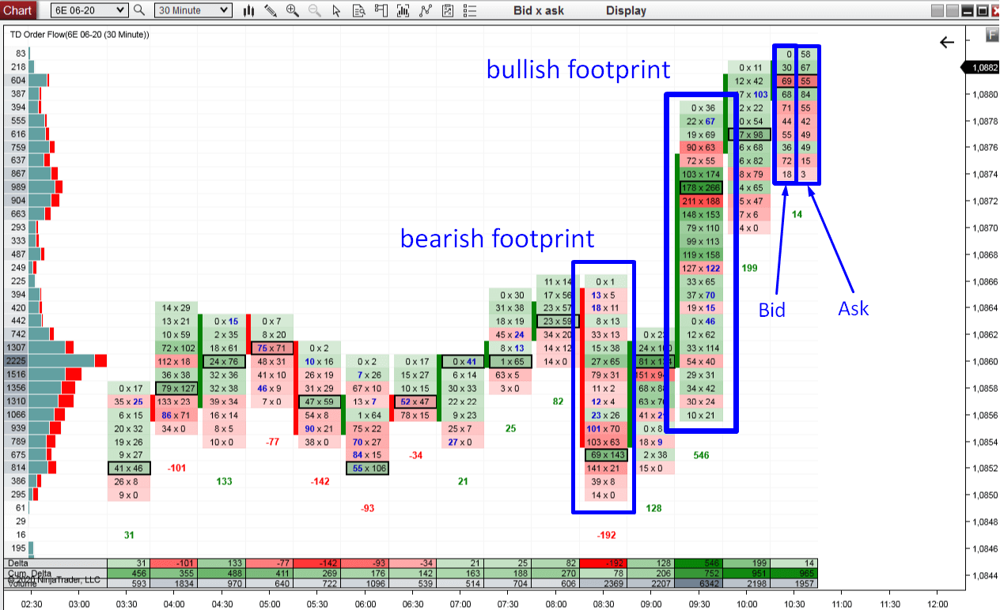

## Table of Contents

## What is order flow in trading?

Order flow in trading refers to the real-time record of buy and sell orders in a market. It shows how many orders are coming in, at what price, and whether they are to buy or sell. Traders use this information to understand the current demand and supply for a particular asset, like a stock or a currency. By watching the order flow, traders can get a sense of where the market might be heading next.

For example, if there are a lot more buy orders than sell orders, it might mean that the price of the asset could go up soon. On the other hand, if there are more sell orders, the price might go down. This information helps traders make better decisions about when to buy or sell. Order flow is especially important in fast-moving markets where prices can change quickly.

## How does order flow impact market prices?

Order flow impacts market prices by showing how many people want to buy or sell an asset at any given time. When there are more buy orders than sell orders, it means more people want to buy the asset. This can push the price up because buyers might have to offer more money to get the asset they want. On the other hand, if there are more sell orders, it means more people want to sell, which can push the price down as sellers might have to lower their prices to find buyers.

Traders watch order flow closely because it can give them clues about where prices might go next. If they see a lot of buy orders coming in quickly, they might think the price will go up soon and decide to buy the asset themselves. If they see a lot of sell orders, they might think the price will go down and decide to sell their own assets before the price drops. This way, order flow helps traders make decisions that can affect the market prices even more.

## What are the different types of orders in order flow?

In trading, there are different types of orders that make up the order flow. The most common types are market orders and limit orders. A market order is an order to buy or sell an asset right away at the best available price. It's like saying, "I want to buy or sell this now, no matter what the price is." A limit order, on the other hand, is an order to buy or sell an asset at a specific price or better. It's like saying, "I want to buy or sell this, but only if the price is right."

There are also other types of orders like stop orders and stop-limit orders. A stop order becomes a market order once a certain price is reached. It's used to limit losses or protect profits. For example, if you own a stock and its price starts to fall, a stop order can help you sell it before it falls too much. A stop-limit order is similar, but it turns into a limit order instead of a market order when the stop price is reached. This gives you more control over the price at which your order is filled, but there's a risk that your order might not be filled if the price moves too quickly.

## How can traders use order flow to predict market movements?

Traders can use order flow to predict market movements by watching the balance between buy and sell orders. If they see more buy orders coming in, it might mean that the price of the asset will go up because more people want to buy it. This can give traders a clue to buy the asset themselves before the price rises. On the other hand, if they see more sell orders, it might mean the price will go down because more people want to sell. This can be a signal for traders to sell their own assets before the price drops.

Another way traders use order flow is by looking at the size and speed of the orders. If they see a lot of big buy orders coming in quickly, it might mean that big investors are getting interested, which can push the price up even more. If they see a lot of big sell orders coming in quickly, it might mean that big investors are trying to get out, which can push the price down. By paying attention to these details, traders can make better guesses about where the market might be heading next.

## What tools are used to analyze order flow?

Traders use special tools to look at order flow and understand what's happening in the market. One common tool is the [order book](/wiki/order-book-trading-strategies), which shows all the buy and sell orders that are waiting to be filled. It's like a list that tells you how many people want to buy or sell an asset at different prices. By looking at the order book, traders can see if there are more people wanting to buy or sell, which can help them guess where the price might go next.

Another tool is the time and sales window, also called the tape. This tool shows every trade that happens in real time, telling you the price, the size of the trade, and whether it was a buy or a sell. Traders use this to see how fast orders are coming in and how big they are. If they see a lot of big trades happening quickly, it can mean that the market is moving fast, and they need to act quickly too. Both the order book and the time and sales window help traders make better decisions by giving them a clear picture of what's happening in the market.

## Can you explain the concept of order flow imbalance?

Order flow imbalance happens when there are more buy orders than sell orders, or more sell orders than buy orders. It's like a seesaw where one side is heavier than the other. If there are more buy orders, it means more people want to buy the asset, and this can push the price up. If there are more sell orders, it means more people want to sell, and this can push the price down. Traders look at order flow imbalance to guess where the price might go next.

By watching the order flow imbalance, traders can see if the market is leaning towards buying or selling. If they see a big imbalance with more buy orders, they might think the price will go up soon and decide to buy the asset themselves. If they see a big imbalance with more sell orders, they might think the price will go down and decide to sell their own assets before the price drops. This helps traders make better decisions about when to buy or sell.

## How does order flow data differ from traditional market data?

Order flow data is different from traditional market data because it shows what's happening right now in the market. Traditional market data usually tells you things like the last price of an asset, how much it went up or down in a day, and how many shares were traded. But order flow data shows you all the buy and sell orders that are coming in, even if they haven't been filled yet. This means you can see if more people want to buy or sell an asset at any moment, which can help you guess where the price might go next.

On the other hand, traditional market data gives you a summary of what has already happened. It's like looking at a report card that tells you the final scores but doesn't show you how the game was played. Order flow data is more like watching the game live, where you can see every move and decision as it happens. This real-time information can be very useful for traders who need to make quick decisions based on what's happening in the market right now.

## What are the common strategies for trading based on order flow?

One common strategy for trading based on order flow is called "order flow imbalance trading." Traders look at the order book to see if there are more buy orders or more sell orders. If they see a lot more buy orders, they might think the price will go up soon and decide to buy the asset themselves. If they see a lot more sell orders, they might think the price will go down and decide to sell their own assets before the price drops. This strategy helps traders make quick decisions based on what's happening in the market right now.

Another strategy is called "[volume](/wiki/volume-trading-strategy) analysis." Traders use the time and sales window to watch how many trades are happening and how big they are. If they see a lot of big trades happening quickly, it can mean that the market is moving fast. Traders might use this information to jump into the market and buy or sell before the price changes too much. By paying attention to the size and speed of trades, traders can get a better sense of where the market might be heading next and make trades that match those movements.

## How does order flow analysis vary across different markets?

Order flow analysis can be different in various markets because each market has its own way of working. In the stock market, traders look at the order book to see how many people want to buy or sell a stock at different prices. They also use the time and sales window to watch every trade that happens in real time. This helps them understand if the market is moving fast or slow and if more people want to buy or sell. In the [forex](/wiki/forex-system) market, where people trade currencies, order flow analysis is a bit different. Traders often use special tools like the "commitment of traders" report to see what big investors are doing. This can give them clues about where the currency prices might go next.

In the futures market, where people trade contracts for things like oil or wheat, order flow analysis can be even more important. Traders watch the order flow to see if there are big imbalances between buy and sell orders, which can signal big price moves. They also pay attention to the volume of trades, which can show how much interest there is in a particular contract. Each market has its own tools and ways of looking at order flow, but the main idea is the same: traders use this information to make better guesses about where prices might go next and make their trading decisions based on that.

## What are the limitations and challenges of using order flow data?

Using order flow data can be tricky because it's all about what's happening right now in the market. This means you have to be quick and make decisions fast. But sometimes, the data can be hard to understand because there's so much of it coming in all the time. It's like trying to drink from a fire hose. Also, order flow data can be affected by things like high-frequency trading, where computers make trades very quickly. This can make the data confusing because it's hard to tell what's really happening in the market.

Another challenge is that order flow data doesn't always tell you the whole story. It shows you what people want to do right now, but it doesn't tell you why they want to do it. There might be big news or events happening that affect the market, but you won't see that in the order flow data. Plus, not all markets have the same kind of order flow data available. Some markets might not give you as much information as others, which can make it harder to use this data to make good trading decisions.

## How can advanced algorithms enhance order flow analysis?

Advanced algorithms can make order flow analysis a lot better by looking at a lot of data very quickly. These algorithms can find patterns and trends that people might miss. For example, they can see if there are a lot of big buy orders coming in at the same time, which might mean the price will go up soon. They can also look at the order book and the time and sales window to see if there are any imbalances between buy and sell orders. By doing this, the algorithms can help traders make better guesses about where the market might be heading next.

Another way advanced algorithms help is by taking out the noise from the data. Sometimes, the order flow data can be confusing because of things like high-frequency trading, where computers make a lot of trades very quickly. Algorithms can filter out this noise and show traders what's really happening in the market. This can make it easier for traders to make good decisions without getting distracted by all the fast-moving data. By using these algorithms, traders can get a clearer picture of the market and make smarter trades.

## What future trends might affect the use of order flow in trading?

In the future, more and more traders might use machines and computers to look at order flow data. These machines can look at a lot of data very quickly and find patterns that people might miss. This could make trading faster and more accurate. Also, as more people start using these machines, the way we trade might change. Traders might rely more on computers to make decisions for them, which could make the market move even faster.

Another thing that might change is how much information we have about order flow. Right now, some markets give us a lot of data, but others don't. In the future, more markets might start sharing more information about buy and sell orders. This could help traders make better decisions because they would have more data to look at. But it could also make things more complicated because there would be even more data to understand.

## References & Further Reading

[1]: Bouchaud, J.-P., Farmer, J. D., & Lillo, F. (2009). ["How Markets Slowly Digest Changes in Supply and Demand."](https://arxiv.org/abs/0809.0822) In T. Hens & K. R. Schenk-Hoppe (Eds.), Handbook of Financial Markets: Dynamics and Evolution (pp. 57-157).

[2]: Lopez de Prado, M. (2018). ["Advances in Financial Machine Learning."](https://books.google.com/books/about/Advances_in_Financial_Machine_Learning.html?id=oU9KDwAAQBAJ) Wiley.

[3]: Jansen, S. (2020). ["Machine Learning for Algorithmic Trading."](https://github.com/stefan-jansen/machine-learning-for-trading) Packt Publishing.

[4]: Cartea, Á., Jaimungal, S., & Penalva, J. (2015). ["Algorithmic and High-Frequency Trading."](https://assets.cambridge.org/97811070/91146/frontmatter/9781107091146_frontmatter.pdf) Cambridge University Press.

[5]: Chan, E. P. (2009). ["Quantitative Trading: How to Build Your Own Algorithmic Trading Business."](https://github.com/egorpe/EPChan-QuantitativeTrading/blob/master/example7_6.m) Wiley.

[6]: Easley, D., López de Prado, M., & O'Hara, M. (2012). ["Flow Toxicity and Liquidity in a High-frequency World."](https://www.jstor.org/stable/41485533) Review of Financial Studies, 25(5), 1457–1493.

[7]: Naik, P. (2013). ["Order Flow Analysis - BullBearings."](https://www.empiricalacademy.net/storage/files/files/2/course-pdf/ORDER%20FLOW%20ANALYSIS.pdf) BullBearings Online Magazine.