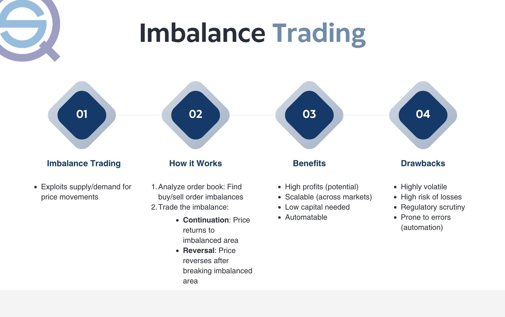

Market orders are fundamental components in the landscape of trading, representing instructions to buy or sell a financial instrument immediately at the best current price. Unlike limit orders, which specify a price threshold, market orders prioritize the speed of execution over price, making them pivotal in fast-moving markets. This immediacy facilitates liquidity provision, as market orders help bridge the gap between buyers and sellers by executing transactions instantaneously. Traders often opt for market orders when the imperative is to enter or exit the market without delay, even though they might face potential slippage – the difference between the expected price and the executed price.

Order imbalance is a crucial concept in trading, defined as the disparity between buy and sell orders in the market at a given time. It is typically measured by the difference in volume between buying and selling orders. Order imbalances can arise due to factors such as large institutional trades, news events, or shifts in market sentiment. These imbalances exert influence on market prices by creating pressure that can either drive prices up (sell imbalance) or down (buy imbalance), depending on which side – buying or selling – predominates. Recognizing order imbalances is essential for traders, as it can signal potential price movements, offering opportunities for strategic positioning.



Understanding order imbalance is paramount in trading strategies because it enables traders to anticipate price changes and exploit momentary inefficiencies in the market. With this knowledge, traders can develop methodologies to optimize their trades, capitalizing on anticipated market moves. In the context of algorithmic trading, the significance of order imbalance magnifies, as algorithms are designed to process vast volumes of market data in real-time, identifying imbalances swiftly and executing trades at optimal moments. Algorithmic trading employs automated systems to execute orders, which increases efficiency and minimizes human error, making it an indispensable tool for modern traders.

Market orders and order imbalance can substantially contribute to profitable trading strategies. By understanding how these components interact, traders can devise strategies that leverage real-time market dynamics to their advantage. A comprehensive grasp of both elements provides a foundation for developing sophisticated trade models capable of delivering consistent returns in diverse market conditions.

## Table of Contents

## Understanding Market Orders

Market orders are a fundamental tool in trading, designed to execute a buy or sell transaction immediately at the current market price. This type of order prioritizes execution speed over price specification, ensuring that the trade is completed as swiftly as possible at the prevailing market conditions. Market orders are crucial in situations where a trader desires to enter or exit a position instantly, capitalizing on the exact state of the market.

In contrast, limit orders specify a particular price at which a trader is willing to buy or sell a security. These orders do not guarantee execution unless the market price reaches or surpasses the set limit. Consequently, while limit orders offer price control, they may result in non-execution if the market does not move favorably.

Market orders play a vital role in providing [liquidity](/wiki/liquidity-risk-premium) to the market. Liquidity refers to the ease with which assets can be bought or sold in the market without causing significant price changes. By contributing to higher trade volumes, market orders enhance market liquidity, allowing other market participants to transact more efficiently.

Traders typically opt for market orders when they prioritize execution certainty over price precision. For instance, in rapidly moving markets or when trading highly volatile assets, securing a position or exiting swiftly is often more critical than obtaining a specific price. 

However, market orders come with inherent risks. These include the possibility of receiving a fill at an unexpected price, particularly in volatile or less-liquid markets, where the spread between bid and ask prices can widen significantly. This [volatility](/wiki/volatility-trading-strategies) can lead to what's known as "slippage," where the execution price deviates from the trader's expected price, potentially resulting in less favorable trading outcomes. 

In conclusion, market orders are essential for traders who need quick execution and play a significant role in maintaining market liquidity. Nevertheless, understanding their potential risks, especially under certain market conditions, is crucial for effective trading.

## The Concept of Order Imbalance

Order imbalance in trading refers to the disproportion between buy and sell orders in the market at a given time. This imbalance occurs when there is either a higher quantity of buy orders than sell orders or vice versa. The imbalance can significantly impact asset prices because it indicates a shift in demand and supply dynamics within the market.

### Defining Order Imbalance and Its Measurement

Order imbalance can be quantified through the difference between buy and sell [volume](/wiki/volume-trading-strategy) over a specified period. It is mathematically expressed as:

$$
\text{Order Imbalance} = \text{Buy Volume} - \text{Sell Volume}
$$

A positive value indicates a buy-side imbalance (more purchase interest), while a negative value reflects a sell-side imbalance (more selling interest). Traders often use [order book](/wiki/order-book-trading-strategies) data to determine these imbalances. More sophisticated measures involve adjusting for the size of the orders or weighting by price impact.

### Causes of Order Imbalance in the Market

Several factors can lead to order imbalances in the financial markets:

1. **News Events**: Sudden economic reports or political news can shift market sentiment, causing traders to favor buying or selling.
2. **Earnings Reports**: Company performance announcements often result in a skewed order flow as investors re-evaluate their stock positions.
3. **Market Sentiment**: General bullish or bearish trends can influence traders' behavior collectively.
4. **Liquidity Events**: Large institutional trades can create temporary imbalances as they execute large buy or sell orders.

### Impacts of Order Imbalance on Market Prices

Order imbalances can lead to price volatility as the market adjusts to the excess demand or supply. A persistent buy-side imbalance can drive prices up as buyers aggressively increase their bids to match available sell orders. Conversely, a sell-side imbalance typically results in price declines as sell orders flood the market and buyers find themselves in a dominant negotiating position. According to the efficient market hypothesis, prices will adjust until the order imbalance is corrected, leading to equilibrium.

### How Traders Can Identify Order Imbalances

Traders can identify order imbalances using several methods:

- **Order Book Analysis**: By examining the quantities at different price levels within the market order book, traders can gauge where imbalances may exist.
- **Volume Analysis**: Monitoring the volume across different time frames can reveal potential imbalances if there are significant surges or downturns relative to the average.
- **Technical Indicators**: Tools like the Money Flow Index (MFI) and On-Balance Volume (OBV) provide insights into order flow dynamics and imbalances.
- **Algorithmic Monitoring**: Utilizing trading algorithms that parse real-time data feeds to highlight large discrepancies in buy and sell volumes can automate imbalance detection.

### Examples of Order Imbalance in Real-World Trading Scenarios

Order imbalances have notable implications in numerous trading scenarios:

- **Flash Crashes**: These are often precipitated by sudden and significant sell-side imbalances that overwhelm the liquidity typically available in an order book.
- **Pre-and Post-Earnings Announcements**: Imbalances frequently develop as traders pre-position for anticipated outcomes or react to earnings surprises.
- **Large Institutional Trades**: When large entities enter the market, their substantial buying or selling actions can create temporary order imbalances, impacting price discovery.

In conclusion, understanding order imbalance is crucial for traders and [algorithmic trading](/wiki/algorithmic-trading) systems. It provides insights into market conditions and trading opportunities while serving as a vital component in assessing market sentiment and potential price movements.

## Order Imbalance and Market Orders in Algorithmic Trading

Algorithmic trading systems have integrated sophisticated mechanisms to utilize market orders efficiently. These systems execute strategies designed to take advantage of small price movements and market inefficiencies, where market orders play a pivotal role. Market orders are instructive in executing trades immediately at the current market price, which is essential for algorithmic strategies seeking quick market entry and [exit](/wiki/exit-strategy) to exploit order imbalances.

Order flow analysis is crucial in identifying imbalances. Analyzing order flow involves monitoring the incoming and outgoing trades and orders within the market to detect periods when buying and selling activities are not matched. This imbalance is a significant indicator of potential price movements. Algorithms are often programmed to analyze historical and real-time order flow data, using statistical methods to spot discrepancies between anticipated and actual order levels. This analysis helps in predicting short-term market movements triggered by imbalances.

The development of algorithms to capitalize on these imbalances often involves [machine learning](/wiki/machine-learning) techniques and statistical models. These algorithms are trained on vast datasets to identify patterns and predict the likelihood of order imbalances. Techniques such as time-series analysis, anomaly detection, and regression models are employed to strengthen the order imbalance detection process. For instance, an algorithm could be developed using Python with libraries like NumPy and Pandas to perform data analysis, while Scikit-learn could serve for machine learning model integration:

```python
import numpy as np
import pandas as pd
from sklearn.ensemble import RandomForestRegressor

# Example of setting up data for order imbalance analysis
data = pd.DataFrame({
    'order_volume': np.random.randn(1000),
    'price_change': np.random.randn(1000),
})

# Train a model to detect order imbalance
model = RandomForestRegressor()
model.fit(data[['order_volume']], data['price_change'])

# Predicting order imbalance
predicted_imbalance = model.predict([[200]])
```

A notable case study demonstrating the successful use of order imbalance in trading involves Renaissance Technologies, a [hedge fund](/wiki/hedge-fund-trading-strategies) known for its Medallion Fund. The Medallion Fund has consistently leveraged complex algorithms focusing on statistical [arbitrage](/wiki/arbitrage), which includes exploiting order imbalances. They utilize proprietary algorithms and high-frequency trading ([HFT](/wiki/high-frequency-trading-strategies)) techniques to manage and execute market orders, capitalizing on the fleeting nature of order imbalances for profitable trades.

Despite the potential for profitability, challenges persist in algorithmically trading order imbalances. One significant hurdle is the latency in executing market orders; algorithmic systems require millisecond-level reaction times to effectively exploit imbalances. Market data changes rapidly, and any delays can lead to missed opportunities or erroneous trades. Furthermore, since multiple algorithmic traders might target order imbalances simultaneously, significant competition exists, often dampening expected profits.

Additionally, regulatory challenges and the ethical implications of high-frequency trading arise, necessitating a balance between rapid execution and market fairness. As high-speed trading strategies evolve, ensuring compliance with regulatory standards while avoiding practices that could constitute market manipulation remains a critical concern for firms venturing into algorithmic order imbalance trading.

## Strategies for Trading Order Imbalances

Trading order imbalances involves strategies aimed at exploiting the differences in buying and selling pressures within financial markets. These strategies can offer lucrative opportunities for traders when executed with precision and a keen understanding of market dynamics.

### Common Strategies for Trading Order Imbalances

**1. Order Flow Analysis**

Order flow analysis involves examining the buy and sell orders in the market to determine the potential direction of asset prices. Traders monitoring order flow look for significant imbalances between buy and sell orders, which may signal impending price movements. Identifying such imbalances early can provide traders with a competitive edge.

**2. Market-Making Strategies**

Market-makers seek to profit from order imbalances by providing liquidity to the market. They do this by placing simultaneous buy and sell orders, aiming to capture the spread between the bid and ask prices. When an imbalance is detected, market-makers adjust their strategies to benefit from the increased volatility and directional price shifts.

**3. Mean Reversion Strategy**

This strategy assumes that prices will revert to a mean or average level after a period of imbalance. Traders using mean reversion look for instances where the imbalance has caused prices to deviate significantly from historical levels, with the expectation that they will eventually return to these levels. Statistical tools and indicators such as Bollinger Bands or Relative Strength Index (RSI) are often employed to identify these opportunities.

### Risk Management in Order Imbalance Trading

Risk management is crucial in strategies exploiting order imbalances due to their inherently volatile nature. Key risk management practices include:

- **Position Sizing:** Traders should determine the appropriate size of their trades based on their risk tolerance and the level of imbalance observed. Small trades may be less risky but also offer smaller returns.

- **Stop-Loss Orders:** Implementing stop-loss orders can help limit potential losses if the market moves against the trader's position due to unanticipated shifts in order flow.

- **Diversification:** Spreading trades across different assets or markets can mitigate the risk associated with relying solely on a single market's order imbalance.

### Integration of Algorithmic Tools

The integration of algorithmic tools enables enhanced precision and efficiency in executing order imbalance strategies. Algorithms can process large volumes of data in real-time, identifying patterns and executing trades much faster than a human trader. These tools help in designing strategies that can adapt quickly to changing market conditions.

For instance, algorithms can utilize machine learning techniques to predict price movements based on historical order flow data. Consider the following simple Python code that demonstrates using logistic regression for predicting the direction of price movements:

```python
from sklearn.model_selection import train_test_split
from sklearn.linear_model import LogisticRegression
from sklearn.metrics import accuracy_score

# Example features and labels based on historical order imbalance data
features = market_data[['imbalance_ratio', 'volume', 'volatility']]
labels = market_data['price_movement']

# Split data into training and testing sets
X_train, X_test, y_train, y_test = train_test_split(features, labels, test_size=0.2, random_state=42)

# Train logistic regression model
model = LogisticRegression()
model.fit(X_train, y_train)

# Predict on the test set
predictions = model.predict(X_test)

# Evaluate model
accuracy = accuracy_score(y_test, predictions)
print(f"Model Accuracy: {accuracy:.2f}")
```

### The Role of Prediction and Data Analysis

Effective prediction and data analysis are at the heart of optimizing order imbalance strategies. Traders utilize historical data to identify patterns and trends that precede significant order imbalances. Advanced analytical techniques, including time-series analysis and machine learning, provide insights that can aid in the development of predictive models.

### Real-World Examples of Strategies Exploiting Order Imbalances

A notable example of a strategy exploiting order imbalances is [statistical arbitrage](/wiki/statistical-arbitrage), which uses sophisticated mathematical models to identify pricing inefficiencies between related financial instruments. Another instance is index arbitrage, where traders capitalize on divergences between the price of a stock index and its constituent stocks.

The successful execution of these strategies requires real-time data feeds and robust computational capabilities. The use of algorithmic trading systems has become essential, allowing traders to rapidly respond to imbalances and capture profit opportunities before they dissipate.

In summary, strategies for trading order imbalances hinge on keen observation of market dynamics, effective risk management, and the integration of cutting-edge technology to optimize prediction and execution processes. These components collectively empower traders to harness the potential of order imbalances for substantial gains.

## Pros and Cons of Order Imbalance Trading

Order imbalance trading presents a compelling opportunity in financial markets by leveraging the differences between buy and sell orders. This strategy's effectiveness hinges on the recognition and exploitation of these disparities, which can indicate [momentum](/wiki/momentum) shifts or the likelihood of price changes.

### Advantages of Leveraging Order Imbalances in Trading Strategies

One major advantage of order imbalance trading is the potential to predict price movements with greater accuracy. Significant imbalances often indicate a strong directional bias in the market, allowing traders to place informed trades. By identifying these patterns, traders can position themselves ahead of significant price shifts, enhancing their chances of profitability.

Another advantage is the increased capacity for traders to understand market sentiment. Large buy imbalances can signal bullish sentiment, while significant sell imbalances may suggest bearish market conditions. By analyzing these imbalances, traders can better gauge the prevailing market mood and adjust their strategies accordingly.

### Risk Factors and Disadvantages to Consider

However, order imbalance trading is not without risks. One primary risk is the reliance on accurate and timely data. Any delays or inaccuracies in market data can lead to incorrect assessments, resulting in losses. Additionally, markets can sometimes exhibit fake imbalances due to strategic maneuvers by large institutional players, potentially misleading traders.

Another disadvantage is the potential for increased transaction costs. Frequent trading based on perceived imbalances can incur substantial fees, particularly in high-frequency trading environments. These expenses can erode potential profits if not managed carefully.

### The Effect of Market Conditions on Order Imbalance Strategies

Market conditions play a significant role in the efficacy of order imbalance strategies. During periods of high volatility, order imbalances could be amplified, making it easier to identify opportunities. However, such volatility can also lead to increased risks. Conversely, in stable or low-volume markets, imbalances might be less pronounced, making these strategies less effective and potentially unprofitable.

### Long-Term Sustainability of Order Imbalance-Based Strategies

The sustainability of order imbalance strategies over the long term is contingent on several factors. As markets evolve, the ability to consistently identify and exploit imbalances may diminish, particularly as more automated systems and traders enter the market. Additionally, changes in market microstructure, such as alterations in trading rules or liquidity provision, can impact the effectiveness of these strategies.

To remain sustainable, traders must continually refine their strategies, incorporating the latest technology and data analysis techniques to maintain a competitive edge.

### Ethical Considerations and Regulatory Concerns

Ethically, exploiting order imbalances raises concerns about fairness and market manipulation. Regulators may scrutinize practices that seem to unfairly advantage certain traders or undermine market integrity. Strategies that rely heavily on exploiting temporary market inefficiencies might attract regulatory attention, particularly if they appear to destabilize markets or harm other traders.

Regulatory developments constantly reshape the landscape of order imbalance trading. Traders must stay informed about these changes to ensure compliance and avoid potential legal or financial repercussions.

In conclusion, while order imbalance trading offers numerous opportunities, it requires careful consideration of risks, market conditions, regulatory frameworks, and ethical standards to ensure both profitability and adherence to fair trading practices.

## Conclusion

Market orders and order imbalances are fundamental concepts in trading, each carrying unique implications and applications within the financial markets. Market orders are designed to execute trades immediately at the current market price, providing liquidity but often with less control over the execution price. On the other hand, order imbalances occur when there is a significant difference between buy and sell orders, which can lead to price fluctuations and trading opportunities.

The potential impact of order imbalance strategies in algorithmic trading is profound. With advancements in technology, algorithmic trading systems can process vast amounts of data to identify and exploit these imbalances more effectively than human traders. Algorithms can analyze order flow data in real-time to detect patterns and predict future imbalances, thereby executing trades with precision and speed that are not achievable manually. This has allowed traders to develop sophisticated strategies that not only identify but also capitalize on short-term market inefficiencies.

As technology continues to advance, the future of order imbalance trading appears promising. Innovations in machine learning and [artificial intelligence](/wiki/ai-artificial-intelligence) are expected to further enhance the capabilities of trading algorithms. These technologies will enable even more accurate predictions of order flow dynamics, allowing traders to refine their strategies continually. Furthermore, the integration of big data analytics will allow traders to process a wider range of market signals, further increasing the robustness of their strategies.

In developing a successful trading strategy based on market orders and order imbalances, traders should consider several critical factors. It is essential to maintain a balance between risk and reward, ensuring that strategies are resilient to changing market conditions. Utilizing algorithmic tools for data analysis and prediction can enhance strategy execution, but close attention must be paid to ethical considerations and regulatory compliance. As these strategies become more prevalent, adapting to evolving market structures and leveraging technological advancements will be crucial in maintaining a competitive edge. Through careful planning, continuous learning, and strategic innovation, traders can harness the power of market orders and order imbalances to optimize their trading performance.

## References & Further Reading

[1]: Bergstra, J., Bardenet, R., Bengio, Y., & Kégl, B. (2011). ["Algorithms for Hyper-Parameter Optimization."](https://dl.acm.org/doi/10.5555/2986459.2986743) Advances in Neural Information Processing Systems 24.

[2]: ["Advances in Financial Machine Learning"](https://www.amazon.com/Advances-Financial-Machine-Learning-Marcos/dp/1119482089) by Marcos Lopez de Prado

[3]: ["Evidence-Based Technical Analysis: Applying the Scientific Method and Statistical Inference to Trading Signals"](https://www.amazon.com/Evidence-Based-Technical-Analysis-Scientific-Statistical/dp/0470008741) by David Aronson

[4]: ["Machine Learning for Algorithmic Trading"](https://github.com/stefan-jansen/machine-learning-for-trading) by Stefan Jansen

[5]: ["Quantitative Trading: How to Build Your Own Algorithmic Trading Business"](https://www.amazon.com/Quantitative-Trading-Build-Algorithmic-Business/dp/1119800064) by Ernest P. Chan