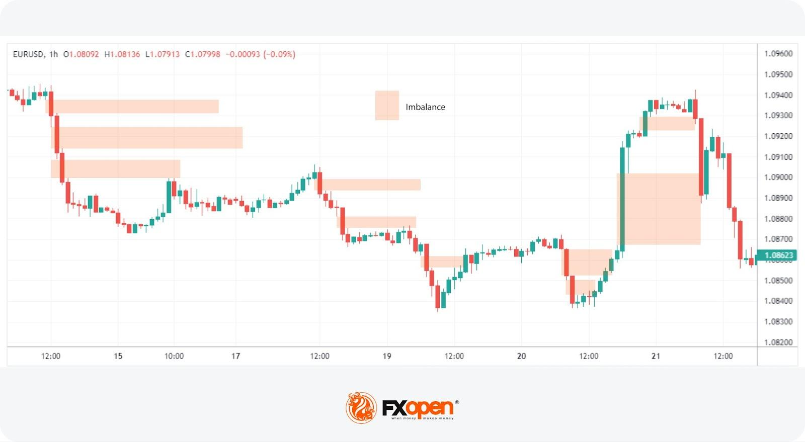

## Table of Contents

## What is order imbalance in trading?

Order imbalance in trading happens when there are more buy orders than sell orders, or more sell orders than buy orders, at a certain price. Imagine you're at a market and more people want to buy apples than there are people selling apples. This situation creates an imbalance because the demand for apples is higher than the supply.

When this happens in trading, it can affect the price of a stock. If there are more buyers than sellers, the price might go up because buyers are willing to pay more to get the stock. On the other hand, if there are more sellers than buyers, the price might go down because sellers might have to lower their price to attract buyers. This imbalance can be a signal to traders about potential price movements.

## How is order imbalance calculated?

Order imbalance is calculated by comparing the number of buy orders to the number of sell orders at a specific price. If you imagine a seesaw, buy orders are on one side and sell orders are on the other. If there are more buy orders, the seesaw tips towards the buy side, showing a buy imbalance. If there are more sell orders, it tips towards the sell side, showing a sell imbalance.

To find the exact number, you subtract the smaller number of orders from the larger number. For example, if there are 100 buy orders and 80 sell orders, the order imbalance is 20 in favor of buying. This simple calculation helps traders see if there's more demand or more supply for a stock at a certain price, which can give them clues about what might happen to the price next.

## What are the basic types of order imbalances?

There are two basic types of order imbalances: buy imbalances and sell imbalances. A buy imbalance happens when there are more people wanting to buy a stock than there are people wanting to sell it at a certain price. Imagine you're at a store and more people want to buy a toy than there are toys available. This means the demand is higher than the supply.

A sell imbalance is the opposite. It occurs when more people want to sell a stock than there are people wanting to buy it at a certain price. Think of it like a yard sale where more people are trying to sell their old clothes than there are people interested in buying them. This means the supply is higher than the demand.

These imbalances can tell traders a lot. If there's a buy imbalance, the price of the stock might go up because buyers might have to offer more money to get the stock. If there's a sell imbalance, the price might go down because sellers might have to lower their price to attract buyers.

## Can order imbalance affect stock prices?

Yes, order imbalance can affect stock prices. When there are more people wanting to buy a stock than sell it, it's called a buy imbalance. This can push the price up because buyers might have to offer more money to get the stock. It's like when a popular toy is hard to find, and people are willing to pay more to get it.

On the other hand, when there are more people wanting to sell a stock than buy it, it's called a sell imbalance. This can make the price go down because sellers might have to lower their price to attract buyers. It's like at a garage sale when lots of people are trying to sell similar items, and they might have to lower their prices to get someone to buy.

Traders watch these imbalances closely because they can give clues about what might happen to the stock price next. If they see a big buy imbalance, they might guess that the price will go up soon, and if they see a big sell imbalance, they might think the price will go down.

## What are common causes of order imbalances?

Order imbalances can happen for many reasons. One common reason is news about a company. If good news comes out, like a company making more money than expected, more people might want to buy the stock. This creates a buy imbalance because there are more buyers than sellers. On the other hand, if bad news comes out, like a company losing money, more people might want to sell the stock, leading to a sell imbalance.

Another reason for order imbalances is when the market opens or closes. At these times, many orders can pile up from overnight or from the end of the trading day. If lots of people placed buy orders overnight, there might be a buy imbalance when the market opens. If lots of people placed sell orders at the end of the day, there might be a sell imbalance when the market closes.

Sometimes, order imbalances can also come from big investors, like hedge funds or mutual funds, making large trades. If a big investor decides to buy a lot of a certain stock, it can create a buy imbalance. If they decide to sell a lot, it can create a sell imbalance. These big trades can move the market because they involve so many shares.

## How do market makers respond to order imbalances?

Market makers are like helpers in the stock market. Their job is to make sure there are always people to buy or sell stocks. When they see an order imbalance, they step in to balance things out. If there are more people wanting to buy a stock than sell it, market makers might sell some of their own stock to meet the demand. This helps keep the price from going up too fast. If there are more people wanting to sell a stock than buy it, market makers might buy some of the stock to keep the price from dropping too fast.

Sometimes, market makers use special rules to handle big imbalances. For example, if there's a huge buy imbalance when the market opens, they might use an opening auction to set the price. This means they wait until all the orders are in and then set a price that balances the buyers and sellers as best as possible. This helps keep the market fair and stops the price from jumping around too much. Market makers play a big role in keeping the stock market smooth and stable, especially when there are lots of orders coming in at once.

## What role does market sentiment play in creating order imbalances?

Market sentiment is like the general mood of people in the stock market. When everyone feels good about a company or the economy, they might want to buy more stocks. This good feeling can lead to more buy orders than sell orders, creating a buy imbalance. It's like when everyone at a party is happy and excited, they all want to join in and buy the popular thing.

On the other hand, if people feel worried or scared about a company or the economy, they might want to sell their stocks. This bad feeling can lead to more sell orders than buy orders, creating a sell imbalance. It's like when people at a party start to feel nervous and want to leave, they all try to sell their tickets to get out. Market sentiment can really move the market because it affects what people decide to do with their money.

## How can traders use order imbalance data to their advantage?

Traders can use order imbalance data to guess what might happen to a stock's price. If they see a lot more buy orders than sell orders, it's like seeing a long line of people waiting to buy a popular toy. This might mean the price will go up because everyone wants to buy. So, traders might decide to buy the stock too, hoping to sell it later for more money. On the other hand, if there are a lot more sell orders than buy orders, it's like seeing a yard sale with too many sellers and not enough buyers. This might mean the price will go down, so traders might decide to sell their stock before the price drops.

Traders can also use order imbalance data to plan their trades better. For example, if they see a big buy imbalance right before the market opens, they might wait to see if the price jumps up at the opening and then decide to buy. Or, if they see a big sell imbalance at the end of the day, they might sell their stock before the market closes to avoid a price drop. By watching these imbalances, traders can make smarter choices about when to buy or sell, helping them make more money in the stock market.

## What are the differences between order imbalances in electronic vs. open outcry markets?

In electronic markets, order imbalances are handled by computers. These markets use systems that automatically match buy and sell orders. When there's an imbalance, like more people wanting to buy than sell, the computer can show this imbalance and might adjust the price to balance things out. Traders can see these imbalances on their screens and use this information to make decisions. Electronic markets are fast and efficient, so imbalances are usually resolved quickly.

In open outcry markets, trading happens face-to-face on a trading floor. Traders shout and use hand signals to buy and sell. Order imbalances here are more visible and can be felt in the energy of the trading floor. If there are more buyers than sellers, you might see a crowd of people trying to buy, which can push the price up. Market makers and other traders on the floor can step in to balance things out, but it's not as instant as in electronic markets. Open outcry markets can be slower and more chaotic, but they allow for more human interaction and negotiation.

## How do regulatory changes impact order imbalances?

Regulatory changes can have a big impact on order imbalances. When rules about trading change, it can affect how many people want to buy or sell a stock. For example, if new rules make it harder to sell a stock, there might be fewer sell orders, leading to a buy imbalance. On the other hand, if new rules make it easier to buy stocks, there might be more buy orders, also leading to a buy imbalance. These changes can shake up the market and cause imbalances as people adjust to the new rules.

Regulators might also introduce rules to handle order imbalances better. For example, they might set up special auctions at the start or end of the trading day to help balance big imbalances. These rules can help keep the market fair and stop prices from moving too wildly. By making these changes, regulators try to make sure that order imbalances don't cause too much trouble in the market.

## What advanced statistical methods are used to analyze order imbalances?

To understand order imbalances better, people use fancy math called advanced statistical methods. One common method is called regression analysis. It helps traders see how order imbalances might affect stock prices. They look at past data to find patterns and use those patterns to guess what might happen next. It's like looking at old weather reports to predict if it will rain tomorrow. Another method is time series analysis, which looks at how order imbalances change over time. This can help traders see if imbalances follow a regular pattern, like happening more at certain times of the day or week.

Another useful tool is [machine learning](/wiki/machine-learning). This is like teaching a computer to learn from past data and make smart guesses about future imbalances. The computer can find tiny details in the data that humans might miss. For example, it might notice that order imbalances are bigger on days when important news comes out. By using machine learning, traders can get better at predicting when and how big imbalances will happen. All these methods help traders make smarter choices about when to buy or sell stocks.

## How can predictive models help in forecasting order imbalances?

Predictive models help traders guess when and how big order imbalances might happen. These models use past data, like how many buy and sell orders there were before, to find patterns. They look at things like news events, the time of day, and even the day of the week to see what might cause imbalances. By finding these patterns, the models can predict if there will be more people wanting to buy or sell a stock in the future. This helps traders get ready for what might happen and make better choices about when to buy or sell.

Using predictive models can make trading easier and smarter. For example, if a model predicts a big buy imbalance at the start of the trading day, traders might decide to buy the stock early to take advantage of the expected price increase. Or, if the model predicts a sell imbalance at the end of the day, traders might sell their stock before the price drops. By using these models, traders can be one step ahead and make more money in the stock market.

## What is Understanding Order Imbalance?

Order imbalance is a fundamental concept in financial trading, referring to situations where there is a disproportionate amount of buy or sell orders for a particular security. This imbalance can arise from various factors, impacting the market's supply-demand dynamics and subsequently influencing price movements and [liquidity](/wiki/liquidity-risk-premium).

Causes of order imbalance are often rooted in market news, economic indicators, and investor sentiment. Market news, such as earnings reports, mergers, or policy changes, can trigger a surge in buy or sell orders. For instance, a positive earnings report may lead to a buying spree, creating an order imbalance favoring buy orders. Conversely, adverse news can prompt selling pressure, leading to an excess of sell orders.

Economic indicators, including unemployment rates, GDP growth figures, and inflation data, also play a critical role. These indicators provide insights into the broader economic environment, influencing investor behavior. For example, a lower-than-expected unemployment rate might indicate a strengthening economy, leading to increased buying interest in equities.

Analyzing order imbalance is crucial for understanding market sentiment and predicting potential price movements. A persistent order imbalance, where buy orders outpace sell orders, often suggests bullish sentiment, potentially driving prices higher. Conversely, a predominance of sell orders indicates bearish sentiment, possibly leading to declining prices.

Mathematically, order imbalance can be quantified using various metrics, such as the Order Imbalance Ratio (OIR). The OIR is calculated as follows:

$$

OIR = \frac{(Buy \, Orders) - (Sell \, Orders)}{(Buy \, Orders) + (Sell \, Orders)}
$$

An OIR value greater than zero indicates a buy-side imbalance, whereas a value less than zero signifies a sell-side imbalance. Traders use such metrics to gauge market trends and tailor their trading strategies accordingly.

In summary, understanding the causes and implications of order imbalance is essential for interpreting market dynamics. It offers valuable insights into prevailing market sentiments and potential future price trajectories, assisting traders in making informed decisions.

## What are Order Imbalance Indicators and Tools?

Order imbalance indicators and tools are crucial for traders seeking to decipher market sentiments and predict price movements. These tools facilitate the analysis of imbalances between buy and sell orders, offering a way to interpret market pressures and potential shifts. Key indicators include tick imbalance, [volume](/wiki/volume-trading-strategy) imbalance, and the order imbalance ratio, each providing unique insights into order flow dynamics.

**Tick Imbalance**

Tick imbalance measures the difference between the number of buyer-initiated transactions (upticks) and seller-initiated transactions (downticks) over a given period. This indicator can reveal short-term market sentiment shifts, indicating whether buying or selling pressure predominates. Tick imbalance is calculated as:

$$
\text{Tick Imbalance} = \text{Number of Upticks} - \text{Number of Downticks}
$$

A positive tick imbalance suggests bullish sentiment, while a negative tick indicates bearish sentiment. Traders often utilize this measure to make quick adjustments to their strategies in volatile markets.

**Volume Imbalance**

Volume imbalance focuses on the disparity in trade volume between buy and sell orders. It provides a more comprehensive view of market depth than tick imbalance, taking into account the size of the transactions rather than just the count. Volume imbalance is expressed as:

$$
\text{Volume Imbalance} = \text{Volume of Buy Orders} - \text{Volume of Sell Orders}
$$

This metric is particularly useful in identifying large-scale buying or selling that could lead to significant price changes, providing traders with an early warning sign of potential market movements.

**Order Imbalance Ratio**

The order imbalance ratio (OIR) further refines understanding by comparing the size of the imbalance to the overall volume traded, giving a proportional view of order flow. It is calculated as:

$$
\text{Order Imbalance Ratio} = \frac{\text{Volume Imbalance}}{\text{Total Volume}}
$$

By placing the imbalance in context with total volume, OIR allows traders to assess the strength of market sentiment with greater accuracy. A high ratio suggests that the imbalance is significant relative to overall market activity, which could prompt price adjustments.

**Advantages of Utilizing Order Flow Tools**

Real-time order flow tools that incorporate these indicators offer substantial advantages. They provide immediate insights into market dynamics, enabling traders to respond swiftly to emerging trends. The ability to capture and analyze data in real time is pivotal for making informed trading decisions, particularly in fast-paced markets where conditions can shift rapidly.

Moreover, these tools can be integrated with [algorithmic trading](/wiki/algorithmic-trading) systems, enhancing their efficacy by automating responses to detected imbalances. This integration allows for seamless execution of trades based on real-time data, optimizing trading strategies for better profitability and reduced risk.

By leveraging tick imbalance, volume imbalance, and order imbalance ratio alongside advanced order flow tools, traders gain the capability to monitor market conditions closely and act decisively, improving their chances of success in the financial markets.

## References & Further Reading

[1]: Bergstra, J., Bardenet, R., Bengio, Y., & Kégl, B. (2011). ["Algorithms for Hyper-Parameter Optimization."](https://dl.acm.org/doi/10.5555/2986459.2986743) Advances in Neural Information Processing Systems 24.

[2]: ["Advances in Financial Machine Learning"](https://www.amazon.com/Advances-Financial-Machine-Learning-Marcos/dp/1119482089) by Marcos Lopez de Prado

[3]: Aldridge, I. (2013). ["High-Frequency Trading: A Practical Guide to Algorithmic Strategies and Trading Systems."](https://www.amazon.com/High-Frequency-Trading-Practical-Algorithmic-Strategies/dp/1118343506) John Wiley & Sons.

[4]: Cartea, Á., Jaimungal, S., & Penalva, J. (2015). ["Algorithmic and High-Frequency Trading."](https://assets.cambridge.org/97811070/91146/frontmatter/9781107091146_frontmatter.pdf) Cambridge University Press.

[5]: Sokolov, I. Y., & Zumbach, G. (2016). ["Understanding the Dynamics of Order Flow in Trading—A Study on Order Imbalances."](https://www.researchgate.net/publication/326046999_The_impact_of_digital_technology_and_Industry_40_on_the_ripple_effect_and_supply_chain_risk_analytics) Journal of Financial Markets.

[6]: Chan, E. P. (2009). ["Quantitative Trading: How to Build Your Own Algorithmic Trading Business."](https://github.com/ftvision/quant_trading_echan_book) John Wiley & Sons.