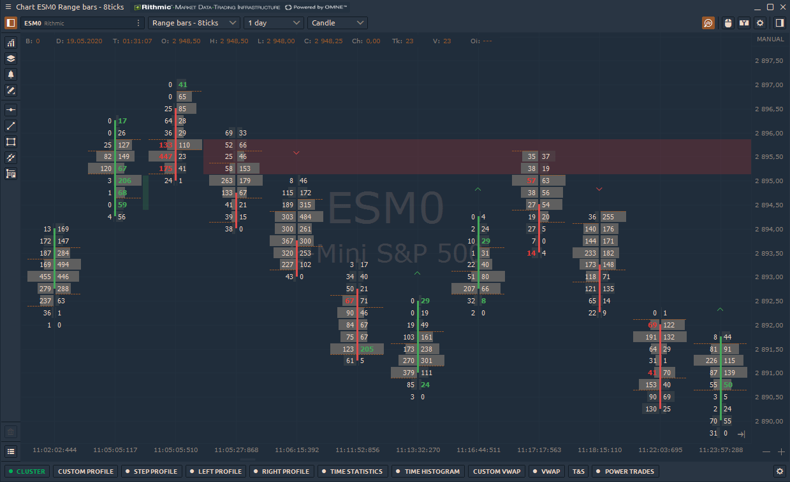

Order imbalance trading strategies play a pivotal role in financial markets, influencing price movements and market liquidity. A comprehensive understanding of market dynamics and the integration of algorithmic trading have become essential for traders seeking to gain a competitive edge. This article will explore the concept of order imbalance, its effects on market dynamics, and effective trading strategies that leverage these principles.

Order imbalance arises when there is a disproportionate number of buy or sell orders for a particular security. This phenomenon can provide key insights into market sentiment and potential price movements, making it an important consideration in trading strategies. For traders who can interpret these signals correctly, order imbalance can offer opportunities to adjust positions or predict near-term market trends.

Algorithmic trading, which has seen significant growth in recent years, emphasizes the importance of understanding order imbalances. Algorithms can quickly analyze large volumes of data and execute trades at speeds beyond human capacity. This evolution underscores the necessity for both seasoned and novice traders to grasp the intricacies of order imbalance and algorithmic strategies. Leveraging these insights helps traders adapt to rapidly changing market conditions.

In addition to exploring order imbalance strategies, the article will provide an overview of tools and indicators that are available to traders. These include sophisticated software and platforms capable of analyzing order flow in real time. Understanding and utilizing these tools can significantly enhance a trader’s ability to capture market insights and execute trades effectively.

Overall, recognizing the impact of order imbalances and incorporating algorithmic tools into trading practices are crucial steps for traders aiming to succeed in today’s fast-paced markets.

## Table of Contents

## Understanding Order Imbalance

Order imbalance is a fundamental concept in financial trading, referring to situations where there is a disproportionate amount of buy or sell orders for a particular security. This imbalance can arise from various factors, impacting the market's supply-demand dynamics and subsequently influencing price movements and liquidity.

Causes of order imbalance are often rooted in market news, economic indicators, and investor sentiment. Market news, such as earnings reports, mergers, or policy changes, can trigger a surge in buy or sell orders. For instance, a positive earnings report may lead to a buying spree, creating an order imbalance favoring buy orders. Conversely, adverse news can prompt selling pressure, leading to an excess of sell orders.

Economic indicators, including unemployment rates, GDP growth figures, and inflation data, also play a critical role. These indicators provide insights into the broader economic environment, influencing investor behavior. For example, a lower-than-expected unemployment rate might indicate a strengthening economy, leading to increased buying interest in equities.

Analyzing order imbalance is crucial for understanding market sentiment and predicting potential price movements. A persistent order imbalance, where buy orders outpace sell orders, often suggests bullish sentiment, potentially driving prices higher. Conversely, a predominance of sell orders indicates bearish sentiment, possibly leading to declining prices.

Mathematically, order imbalance can be quantified using various metrics, such as the Order Imbalance Ratio (OIR). The OIR is calculated as follows:

$$

OIR = \frac{(Buy \, Orders) - (Sell \, Orders)}{(Buy \, Orders) + (Sell \, Orders)}
$$

An OIR value greater than zero indicates a buy-side imbalance, whereas a value less than zero signifies a sell-side imbalance. Traders use such metrics to gauge market trends and tailor their trading strategies accordingly.

In summary, understanding the causes and implications of order imbalance is essential for interpreting market dynamics. It offers valuable insights into prevailing market sentiments and potential future price trajectories, assisting traders in making informed decisions.

## Impact of Order Imbalance on Market Dynamics

Order imbalances are a critical [factor](/wiki/factor-investing) influencing market dynamics, directly affecting [liquidity](/wiki/liquidity-risk-premium), execution quality, and overall market efficiency. A pronounced order imbalance occurs when the [volume](/wiki/volume-trading-strategy) of orders to buy or sell a security far exceeds the opposing side. This discrepancy often results in significant price adjustments, impacting both liquidity and market stability.

**Market Liquidity and Execution Quality**

Market liquidity refers to the ability to execute trades quickly without causing substantial price changes. When order imbalances occur, they can cause a temporary reduction in liquidity. For example, if there is a significant excess of sell orders, the scarcity of buyers may lead to sellers having to accept lower prices to complete transactions, thereby widening bid-ask spreads. This not only affects the price at which orders are executed but also compromises execution quality, as traders receive less favorable prices than anticipated.

**Volatile Price Changes and Market Opportunities**

Order imbalances can lead to increased [volatility](/wiki/volatility-trading-strategies), as the market seeks to find equilibrium between supply and demand. For instance, an imbalance skewed towards buying may drive prices upward as buyers compete for limited sell orders. Conversely, an abundance of sell orders compared to buys can push prices down. The resultant volatility from these shifts can create opportunities for traders to capitalize on short-term price movements, employing strategies such as [arbitrage](/wiki/arbitrage) or spread trading to benefit from rapid price changes.

**Informed Decision-Making for Traders**

Understanding and anticipating the influence of order imbalances allows traders to make informed decisions. Recognizing patterns of imbalance can help predict potential price movements, offering traders an advantage. For instance, observing a consistent pattern of buying imbalance could suggest a bullish market sentiment, while persistent selling imbalance may indicate bearish tendencies. Traders adept at recognizing these signals can better align their strategies, enhancing decision-making and optimizing trade execution.

In summary, order imbalances play a significant role in shaping market liquidity, causing volatile price fluctuations, and creating trading opportunities. Traders who understand these dynamics and incorporate them into their strategies are better positioned to navigate market complexities and improve the outcomes of their trading activities.

## Bullish and Bearish Order Imbalance

Order imbalances, whether bullish or bearish, are pivotal in influencing order flow dynamics within financial markets. In bullish scenarios, order imbalances occur when there is increased buying pressure, leading to an excess of buy orders over sell orders. This typically results in upward price movement as the demand for a security surges compared to its supply.

The implications of such imbalances in a bullish environment are manifold. A sustained increase in buying pressure can lead to a rapid rise in asset prices, often creating a feedback loop where rising prices attract further buying interest. This can eventually lead to overvaluation if not properly managed. Traders must be aware of these dynamics, as they can offer lucrative opportunities but also [carry](/wiki/carry-trading) risks of abrupt reversals when the buying [momentum](/wiki/momentum) wanes.

Bearish order imbalances, on the other hand, are characterized by heightened selling pressure, creating an excess of sell orders over buy orders. This scenario typically leads to declining asset prices due to an oversupply relative to demand. The increased selling pressure can often be a result of negative market news, economic downturns, or investors seeking to cash in profits. The key implication here is the potential for accelerated price depreciation, which can occasionally spiral into panic selling, exacerbating price declines.

To effectively manage order imbalances in both market conditions, traders employ various strategies. One common approach in bullish markets is **momentum trading**, where traders seek to capitalize on the upward momentum by entering positions in the direction of the dominant trend. The goal is to ride the wave of buying pressure while implementing stop-loss orders to protect against sudden reversals.

In bearish conditions, traders might use **short selling** strategies, aiming to profit from expected declines in asset prices. This involves borrowing securities to sell them high and subsequently buy them back at lower prices. Another strategy is **hedging**, where traders offset potential losses in their portfolio through derivative contracts like options or futures.

Regardless of the market environment, it is essential for traders to align these strategies with their risk tolerance and the overall market conditions. Proper use of technical indicators and market analysis tools can aid in identifying emerging order imbalances, enabling traders to act swiftly and decisively.

## Trading Strategies for Order Imbalance

Order imbalance trading strategies exploit the dynamics of excess buy or sell orders, allowing traders to capitalize on potential price movements. These strategies, including imbalance reversal, momentum trading, and [scalping](/wiki/gamma-scalping), are designed to harness the insights that order flow provides, and are critical for informed decision-making.

**Imbalance Reversal**: This strategy is based on the assumption that significant imbalances will not sustain over the long term, causing prices to revert to a mean or equilibrium level. Traders identify an order imbalance and predict a correction, positioning themselves accordingly. For instance, if an excessive number of buy orders creates upward pressure on a stock, a reversal strategy would involve short selling in anticipation of a price correction. This approach requires precise timing and a keen understanding of market sentiment to avoid premature trades that could lead to losses.

**Momentum Trading**: Momentum trading involves capitalizing on the continuation of established market trends. In the context of order imbalances, this strategy assumes that an imbalance signifies a strong trend, which will persist. Traders looking for momentum signals might enter a trade in the direction of the imbalance, riding the trend until signs of reversal appear. Identifying appropriate entry and exit points requires a sophisticated analysis of market data, and often employs technical indicators such as moving averages or the relative strength index (RSI) to gauge momentum strength.

**Scalping**: A high-frequency trading strategy, scalping involves making numerous trades over short time frames to exploit small price movements. Scalpers leverage the temporary inefficiencies created by order imbalances, profiting from bid-ask spreads and slight price changes. This method requires advanced algorithms to execute trades rapidly, often within seconds, and demands a robust infrastructure to manage latency and ensure execution speed.

Aligning these strategies with individual risk tolerance is crucial. Imbalance reversal can be risky due to the unpredictable nature of market corrections, requiring careful risk management practices. Momentum trading demands an acceptance of potential drawdowns when trends falter, whereas scalping involves high transaction costs and the need for extreme precision to avoid losses that compound quickly.

Market conditions significantly impact strategy effectiveness. During volatile markets, the likelihood of imbalances increases, offering more opportunities for reversal and scalping strategies, though they also pose heightened risks. Conversely, stable markets may benefit momentum trading, as trends can be more predictable and sustained.

In summary, successful order imbalance trading strategies require continuous analysis and adaptation to the market environment, enabling traders to exploit opportunities inherent in the dynamics of buy and sell orders.

## Role of Algorithmic and High-Frequency Trading

High-frequency trading ([HFT](/wiki/high-frequency-trading-strategies)) plays a pivotal role in shaping order flow dynamics and market efficiency. HFT employs powerful computers to execute a large number of orders within fractions of a second, utilizing complex algorithms to analyze multiple markets and execute trades based on market conditions. This practice impacts order flow by significantly increasing the speed and volume of trades, which in turn affects market dynamics in several ways.

HFT enhances market liquidity by providing constant buy and sell offers, which can reduce bid-ask spreads and enable smoother trade execution for other market participants. The liquidity provided by HFT firms aids in mitigating price fluctuations caused by large order volumes, potentially stabilizing prices. However, the rapid execution of trades also has the potential to increase market volatility. HFT can magnify price movements in already volatile markets, as the algorithms may react to price changes in microseconds, potentially leading to flash crashes or other market anomalies.

The dual nature of HFT highlights the need for effective market regulations. While it contributes to market liquidity, the potential for increased volatility and market disruptions presents challenges for maintaining market stability. Regulators aim to balance the benefits and risks associated with HFT by implementing rules to ensure fair trading practices and prevent market manipulation. Measures such as circuit breakers and minimum resting times for orders are designed to curb excessive volatility and promote more orderly trading behaviors.

In summary, while HFT can improve market efficiency by narrowing spreads and increasing liquidity, it also necessitates robust regulatory measures to address the accompanying risks of heightened volatility and ensure market integrity. Traders and regulators alike must remain vigilant and adaptive to the evolving landscape of [algorithmic trading](/wiki/algorithmic-trading) to maintain a stable and efficient market environment.

## Order Imbalance Indicators and Tools

Order imbalance indicators and tools are crucial for traders seeking to decipher market sentiments and predict price movements. These tools facilitate the analysis of imbalances between buy and sell orders, offering a way to interpret market pressures and potential shifts. Key indicators include tick imbalance, volume imbalance, and the order imbalance ratio, each providing unique insights into order flow dynamics.

**Tick Imbalance**

Tick imbalance measures the difference between the number of buyer-initiated transactions (upticks) and seller-initiated transactions (downticks) over a given period. This indicator can reveal short-term market sentiment shifts, indicating whether buying or selling pressure predominates. Tick imbalance is calculated as:

$$
\text{Tick Imbalance} = \text{Number of Upticks} - \text{Number of Downticks}
$$

A positive tick imbalance suggests bullish sentiment, while a negative tick indicates bearish sentiment. Traders often utilize this measure to make quick adjustments to their strategies in volatile markets.

**Volume Imbalance**

Volume imbalance focuses on the disparity in trade volume between buy and sell orders. It provides a more comprehensive view of market depth than tick imbalance, taking into account the size of the transactions rather than just the count. Volume imbalance is expressed as:

$$
\text{Volume Imbalance} = \text{Volume of Buy Orders} - \text{Volume of Sell Orders}
$$

This metric is particularly useful in identifying large-scale buying or selling that could lead to significant price changes, providing traders with an early warning sign of potential market movements.

**Order Imbalance Ratio**

The order imbalance ratio (OIR) further refines understanding by comparing the size of the imbalance to the overall volume traded, giving a proportional view of order flow. It is calculated as:

$$
\text{Order Imbalance Ratio} = \frac{\text{Volume Imbalance}}{\text{Total Volume}}
$$

By placing the imbalance in context with total volume, OIR allows traders to assess the strength of market sentiment with greater accuracy. A high ratio suggests that the imbalance is significant relative to overall market activity, which could prompt price adjustments.

**Advantages of Utilizing Order Flow Tools**

Real-time order flow tools that incorporate these indicators offer substantial advantages. They provide immediate insights into market dynamics, enabling traders to respond swiftly to emerging trends. The ability to capture and analyze data in real time is pivotal for making informed trading decisions, particularly in fast-paced markets where conditions can shift rapidly.

Moreover, these tools can be integrated with algorithmic trading systems, enhancing their efficacy by automating responses to detected imbalances. This integration allows for seamless execution of trades based on real-time data, optimizing trading strategies for better profitability and reduced risk.

By leveraging tick imbalance, volume imbalance, and order imbalance ratio alongside advanced order flow tools, traders gain the capability to monitor market conditions closely and act decisively, improving their chances of success in the financial markets.

## Conclusion

Order imbalance is a fundamental concept in financial markets, influencing market dynamics significantly. It highlights the disparity in buy and sell orders, which can result in substantial price movements and affect market liquidity. As discussed, evaluating order imbalances can provide traders with insights into the underlying market sentiment, thus enhancing decision-making capabilities. Recognizing the patterns and trends that order imbalances reveal allows traders to adjust their strategies and positions more effectively.

It is crucial for traders to stay informed and continuously refine their understanding of market developments, especially as algorithmic trading and high-frequency trading grow in complexity and influence. Staying aware of these changes helps traders leverage opportunities and mitigate risks. Equipping oneself with the necessary tools, such as tick imbalance and volume imbalance indicators, provides a real-time perspective on market conditions, enabling traders to act decisively.

By integrating these insights and tools into their trading strategies, market participants can develop a more nuanced understanding of order flow dynamics. This understanding facilitates the crafting of strategies that are agile and responsive to market fluctuations. Thus, traders are encouraged to embrace the evolving landscape of financial markets, consistently updating their knowledge base to maintain a competitive edge.

## References & Further Reading

[1]: Bergstra, J., Bardenet, R., Bengio, Y., & Kégl, B. (2011). ["Algorithms for Hyper-Parameter Optimization."](https://dl.acm.org/doi/10.5555/2986459.2986743) Advances in Neural Information Processing Systems 24.

[2]: ["Advances in Financial Machine Learning"](https://www.amazon.com/Advances-Financial-Machine-Learning-Marcos/dp/1119482089) by Marcos Lopez de Prado

[3]: Aldridge, I. (2013). ["High-Frequency Trading: A Practical Guide to Algorithmic Strategies and Trading Systems."](https://www.amazon.com/High-Frequency-Trading-Practical-Algorithmic-Strategies/dp/1118343506) John Wiley & Sons.

[4]: Cartea, Á., Jaimungal, S., & Penalva, J. (2015). ["Algorithmic and High-Frequency Trading."](https://assets.cambridge.org/97811070/91146/frontmatter/9781107091146_frontmatter.pdf) Cambridge University Press.

[5]: Sokolov, I. Y., & Zumbach, G. (2016). ["Understanding the Dynamics of Order Flow in Trading—A Study on Order Imbalances."](https://www.researchgate.net/publication/326046999_The_impact_of_digital_technology_and_Industry_40_on_the_ripple_effect_and_supply_chain_risk_analytics) Journal of Financial Markets.

[6]: Chan, E. P. (2009). ["Quantitative Trading: How to Build Your Own Algorithmic Trading Business."](https://github.com/ftvision/quant_trading_echan_book) John Wiley & Sons.