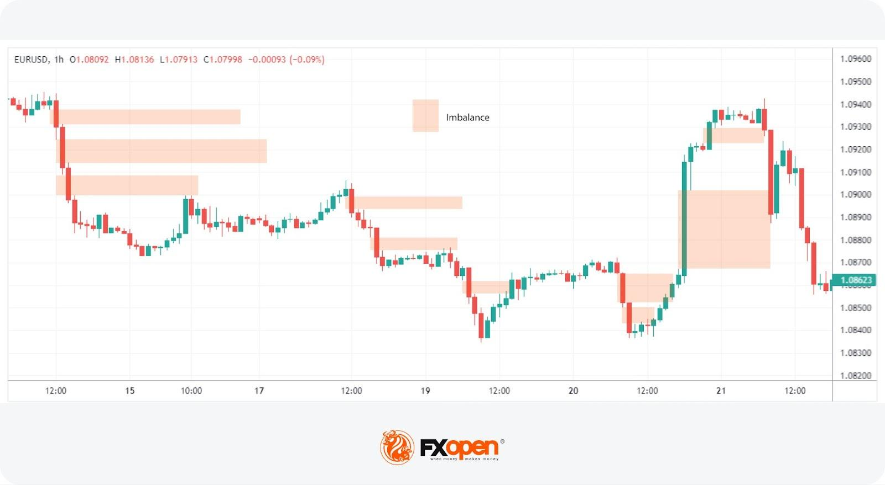

## Table of Contents

## What is order imbalance in financial markets?

Order imbalance in financial markets happens when there are more buy orders than sell orders, or more sell orders than buy orders, for a certain stock or asset at a specific time. Imagine you're at a store where lots of people want to buy a popular toy, but only a few people want to sell it. This situation creates an order imbalance because the demand (buy orders) is much higher than the supply (sell orders).

When there's an order imbalance, it can affect the price of the stock or asset. If there are more buy orders, the price might go up because people are willing to pay more to get the stock. On the other hand, if there are more sell orders, the price might go down because there are more sellers than buyers. Understanding order imbalances can help traders and investors make better decisions about when to buy or sell.

## How is order imbalance calculated?

Order imbalance is calculated by looking at the difference between the number of buy orders and sell orders for a stock at a certain time. If there are 100 buy orders and 50 sell orders, the order imbalance would be 50 more buy orders than sell orders. This number helps show whether more people want to buy or sell the stock at that moment.

To make it easier to compare across different stocks, the order imbalance can also be shown as a percentage. For example, if there are 100 buy orders and 50 sell orders, the total number of orders is 150. The order imbalance percentage would be calculated as the difference (50) divided by the total (150), which equals about 33%. This percentage tells you the size of the imbalance relative to all the orders, making it easier to understand how big the difference is.

## Why is order imbalance important for traders and investors?

Order imbalance is important for traders and investors because it can give them clues about where the price of a stock might be heading next. When there are more buy orders than sell orders, it usually means that more people want to buy the stock, which can push the price up. On the other hand, if there are more sell orders, it might mean that more people want to sell, which can push the price down. By watching order imbalances, traders and investors can try to predict these price movements and make better decisions about when to buy or sell.

Understanding order imbalances can also help traders and investors see what other people in the market are thinking. If there's a big order imbalance, it might mean that something important is happening with the stock, like good or bad news. This can help them decide if they should change their own plans. By paying attention to these imbalances, they can get a better feel for the overall mood of the market and adjust their strategies accordingly.

## Can order imbalance affect stock prices?

Yes, order imbalance can affect stock prices. When there are more people wanting to buy a stock than sell it, this creates a situation where the demand is higher than the supply. Because of this, the price of the stock can go up as buyers compete to get the stock, willing to pay more to secure it. On the other hand, if there are more people wanting to sell a stock than buy it, the supply is higher than the demand. This can make the price go down because sellers might have to lower their price to find someone willing to buy.

Order imbalances give traders and investors important information about what might happen to a stock's price next. If they see a big imbalance, it can signal that something important is happening with the stock, like new news or events. By understanding these imbalances, they can make better decisions about when to buy or sell, trying to predict where the price might go based on the current demand and supply.

## What are the common causes of order imbalance?

Order imbalance often happens because of news or events that make more people want to buy or sell a stock. For example, if a company announces great earnings or a new product, more people might want to buy the stock, causing a buy-side order imbalance. On the other hand, if there's bad news like a company losing a big lawsuit, more people might want to sell, leading to a sell-side order imbalance.

Another common cause is changes in the market as a whole. If the stock market is doing really well, more people might want to buy stocks in general, leading to more buy orders across many stocks. If the market is doing badly, more people might want to sell, causing more sell orders. These big trends can create order imbalances for individual stocks even if there's no specific news about them.

Lastly, trading strategies and actions by big investors can also cause order imbalances. For example, if a big investor decides to buy a lot of a certain stock, this can create a buy-side imbalance because their orders are so large. Similarly, if many traders use the same strategy at the same time, like buying or selling at certain times of the day, this can also lead to imbalances.

## How do different market structures handle order imbalances?

Different market structures handle order imbalances in their own ways. In auction markets, like the New York Stock Exchange, there are special people called market makers or specialists who help balance the orders. When there are more buy orders than sell orders, they might sell from their own stock to meet the demand and keep the price stable. If there are more sell orders, they might buy the extra stock to keep the price from dropping too much. This way, they help make sure that the market stays balanced even when there are a lot more buyers or sellers than usual.

In electronic markets, like NASDAQ, computers do a lot of the work to handle order imbalances. These markets use algorithms to match buy and sell orders as quickly as possible. If there are more buy orders, the price might go up a little bit at a time until enough sellers are happy with the new price. If there are more sell orders, the price might go down until enough buyers step in. This automatic adjustment helps keep the market moving smoothly, even when there's a big difference between buyers and sellers.

Both types of markets aim to manage order imbalances to keep trading fair and efficient. Auction markets rely on people to step in and make adjustments, while electronic markets use technology to automatically find the right balance. Understanding these differences can help traders and investors know what to expect in different market conditions.

## What tools or indicators can be used to measure order imbalance?

To measure order imbalance, traders often use tools like the Order Imbalance Indicator, which shows the difference between buy and sell orders at any given time. This indicator is usually shown as a number or a percentage, helping traders see if there are more people wanting to buy or sell a stock. Another tool is the Market Depth Indicator, which shows all the current buy and sell orders at different price levels. By looking at this, traders can see where the big imbalances are and how they might affect the stock price.

Another useful indicator is the Volume Imbalance, which compares the trading [volume](/wiki/volume-trading-strategy) of buy orders to sell orders over a certain time period. This can help traders understand if the recent trading activity is leaning more towards buying or selling. Some trading platforms also offer real-time data and charts that highlight order imbalances, making it easier for traders to spot trends and make decisions. By using these tools, traders can get a better sense of the market's direction and adjust their strategies accordingly.

## How can order imbalance be used in trading strategies?

Order imbalance can be used in trading strategies to help traders decide when to buy or sell a stock. If a trader sees a big order imbalance with more buy orders than sell orders, it might mean that the stock's price could go up soon. In this case, the trader might decide to buy the stock, hoping to sell it later at a higher price. On the other hand, if there are more sell orders than buy orders, the trader might think the price will go down. They could then sell the stock or even short sell it, hoping to buy it back later at a lower price.

Traders also use order imbalance to understand the market's mood. For example, if there's a sudden big imbalance, it might mean that something important just happened, like good or bad news about the company. By watching these imbalances, traders can get early signals about where the market might be heading. This can help them adjust their trading plans quickly, taking advantage of the price movements caused by the imbalance.

## What are the limitations of using order imbalance data?

Using order imbalance data has some limitations that traders and investors should know about. One big problem is that this data is often just a snapshot of what's happening right now. It can change quickly, so what you see one minute might not be true the next. This means that traders need to be careful and not depend only on order imbalance when making decisions. They should also look at other things like the overall market mood and news about the company.

Another limitation is that order imbalance data doesn't always tell the whole story. Sometimes, big orders can come from just one big trader or investor, not from lots of people. This can make it look like there's a big imbalance when really, it's just one person's actions. Also, some traders use tricks to hide their real orders, which can make the data confusing. So, while order imbalance can be helpful, it's important to use it along with other tools and information to get a better picture of what's going on in the market.

## How does order imbalance relate to market liquidity?

Order imbalance is closely tied to market [liquidity](/wiki/liquidity-risk-premium), which is how easily you can buy or sell a stock without affecting its price too much. When there's a big order imbalance, it means there are a lot more people wanting to buy or sell a stock than the other way around. This can make the market less liquid because it's harder to find someone to take the other side of your trade. If there are too many buy orders, sellers might not want to sell at the current price, so the stock becomes harder to buy. If there are too many sell orders, buyers might not want to buy at the current price, making it harder to sell.

Even though order imbalances can make the market less liquid in the short term, they can also help bring more liquidity in the long run. When there's a big imbalance, it can attract more traders and investors to the market. They might see the imbalance as a chance to make money, so they jump in to buy or sell the stock. This extra activity can make the market more liquid over time. So, while order imbalances can make things tricky for a while, they can also help keep the market moving and balanced in the end.

## Can order imbalance predict market trends or reversals?

Order imbalance can sometimes help predict market trends or reversals. When there are a lot more buy orders than sell orders, it might mean that the price of the stock will go up because more people want to buy it. On the other hand, if there are a lot more sell orders, it might mean the price will go down because more people want to sell. By looking at these imbalances, traders can get clues about where the market might be heading next and make their trading decisions based on that.

However, using order imbalance to predict trends or reversals isn't always easy. The data can change quickly, so what looks like a big imbalance one minute might not be there the next. Also, sometimes big imbalances can come from just one big trader or investor, which doesn't always mean the whole market will follow. So, while order imbalance can give some hints about future market movements, it's best to use it along with other information to get a fuller picture of what might happen.

## What advanced statistical models are used to analyze order imbalance?

Advanced statistical models like regression analysis and machine learning algorithms are often used to analyze order imbalance. Regression analysis helps traders understand how order imbalances might affect stock prices by looking at past data. For example, it can show if a big imbalance usually leads to a price change, and how big that change might be. This can help traders make better guesses about what might happen next. Machine learning algorithms, on the other hand, can find patterns in large amounts of data that might be hard for people to see. They can learn from past imbalances and predict how future imbalances might affect the market.

These models can also use other data along with order imbalance to make better predictions. For example, they might look at trading volume, market trends, and even news about the company to see how these things together might affect the stock price. By combining order imbalance data with other information, these advanced models can give traders a more complete view of what's happening in the market. This helps them make smarter decisions about when to buy or sell, trying to stay one step ahead of the market's movements.

## How do you calculate order flow imbalance?

Order flow imbalance is a key metric in trading, quantified by analyzing the dynamics between the best bid and ask prices along with their respective quantities over time. This analysis provides insights into shifts in market supply and demand, which are crucial for making informed trading decisions. 

To calculate order flow imbalance, one typically monitors the changes at the bid and ask levels. Specifically, the imbalance is determined by the formula:

$$
\text{Order Flow Imbalance} = \frac{\text{Buy Volume} - \text{Sell Volume}}{\text{Buy Volume} + \text{Sell Volume}}
$$

Here, the buy and sell volumes represent the total quantities of buy and sell orders at the bid and ask prices, observed over a specific period. This formula yields a value between -1 and 1, where a positive imbalance suggests more buy activity relative to sell activity, and a negative imbalance indicates the opposite.

In high-frequency trading ([HFT](/wiki/high-frequency-trading-strategies)), the calculation of order flow imbalance needs to be performed in real-time to minimize latencies that could affect strategy performance. Such calculations require robust algorithms capable of handling large volumes of data swiftly. Algorithms may use statistical methods like moving averages or more complex models to identify patterns and trends in the order flow data.

Moreover, programming languages like Python offer powerful libraries (e.g., NumPy, pandas) for handling such computations efficiently. Below is a basic example using Python to compute order flow imbalance:

```python
import numpy as np

def calculate_order_flow_imbalance(buy_volume, sell_volume):
    if buy_volume + sell_volume == 0:
        return 0  # Avoid division by zero
    return (buy_volume - sell_volume) / (buy_volume + sell_volume)

# Example data
buy_volumes = np.array([100, 150, 120])
sell_volumes = np.array([80, 130, 110])

imbalances = calculate_order_flow_imbalance(buy_volumes, sell_volumes)
print("Order Flow Imbalances:", imbalances)
```

In high-frequency trading, the calculation of order flow imbalance helps in generating market signals that guide trading decisions. These signals allow traders and algorithms to anticipate potential price movements, enhancing the precision and effectiveness of their strategies.

## How can one implement algorithmic strategies?

Algorithmic trading strategies extensively utilize order flow imbalance as a critical [factor](/wiki/factor-investing) in predicting future returns. The inherent capability of these strategies to process large volumes of data quickly makes them highly effective in discovering patterns indicative of potential market movements. A range of models, notably neural networks and linear regression, are employed to analyze historical data and backtest these strategies.

Neural networks, with their ability to recognize complex patterns, are particularly useful in model development. They consist of layers of nodes, or neurons, each performing computations to transform input into output. The process effectively mimics human brain operations, allowing the network to learn and improve over time. For example, a basic architecture for leveraging order flow imbalance can involve feeding historical imbalance data into a network to predict price movements, thus informing buy or sell decisions.

Linear regression, on the other hand, provides a simpler but robust approach by estimating the relationships among variables. In this context, a regression model could relate order flow imbalance to price changes, facilitating trend prediction with a straightforward equation:

$$
P_t = \beta_0 + \beta_1 \times \text{Imbalance}_t + \epsilon_t
$$

Here, $P_t$ is the predicted price change at time $t$, $\text{Imbalance}_t$ represents the order flow imbalance, $\beta_0$ and $\beta_1$ are model coefficients, and $\epsilon_t$ denotes the error term.

The integration of [machine learning](/wiki/machine-learning) methodologies further enhances the refinement of predictive algorithms. By continuously adapting to new data, these algorithms can adjust to evolving market conditions more effectively. This adaptability is crucial, as it allows the trading strategies to remain applicable and profitable over time, providing an edge in dynamic market environments.

Challenges arise primarily in maintaining data accuracy and ensuring minimal latency in data processing. Algorithmic strategies are only as good as the data they rely on; hence, significant efforts are directed towards data validation and cleansing processes. Furthermore, reducing latency, the delay between data generation and its processing can drastically improve the efficacy of these strategies, as timely execution of trades based on order imbalance signals is imperative for capturing optimal market opportunities.

Overall, the success of these trading strategies is reliant on the accurate and timely interpretation of order flow imbalance signals. Efficient data analysis methods and robust machine learning algorithms are crucial for deciphering these signals, directly influencing the financial outcome of trading activities. The continuous development of these technologies is vital for enhancing strategy effectiveness in the competitive landscape of [algorithmic trading](/wiki/algorithmic-trading).

## References & Further Reading

[1]: Aitken, M., & Frino, A. (1996). "The determinants of market bid-ask spreads on the Australian Stock Exchange: Cross-sectional analysis." Journal of Banking & Finance, 20(10), 1531-1550.

[2]: Easley, D., Lopez de Prado, M. M., & O'Hara, M. (2012). "Flow toxicity and liquidity in a high-frequency world." Review of Financial Studies, 25(5), 1457-1493.

[3]: "Algorithmic Trading: Winning Strategies and Their Rationale" by Ernest P. Chan.

[4]: "Trading and Exchanges: Market Microstructure for Practitioners" by Larry Harris.

[5]: Chaboud, A. P., Chiquoine, B., Hjalmarsson, E., & Vega, C. (2014). "Rise of the machines: Algorithmic trading in the foreign exchange market." The Journal of Finance, 69(5), 2045-2084.

[6]: "Advances in Financial Machine Learning" by Marcos Lopez de Prado.

[7]: Cont, R., & Kukanov, A. (2017). "Optimal order placement in limit order markets." Journal of Financial Markets, 34, 8-33.