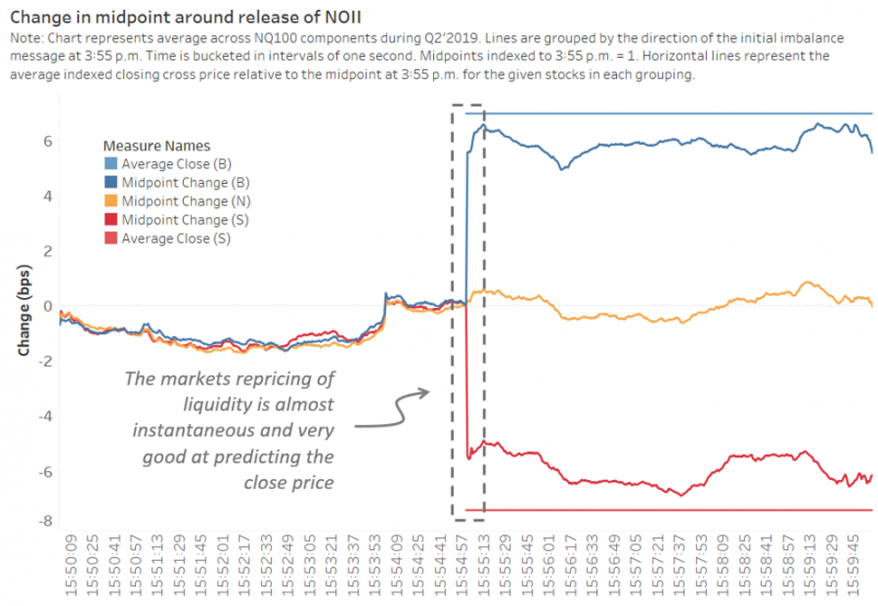

Order imbalance in trading refers to the disparity in buy and sell orders in the market at any given point in time. This imbalance can signal potential price changes and is a critical factor in understanding market dynamics, particularly within algorithmic and high-frequency trading. By analyzing order flow imbalance, traders can gain insights into the underlying forces driving market behavior.

In algorithmic trading, recognizing shifts in order balance allows for the development of predictive models tailored to exploit these market fluctuations. These strategies are designed to capitalize on anticipated movements, with order flow imbalance serving as a key indicator. Calculating this imbalance typically involves monitoring changes in the best bid and ask prices and tracking the volume at these levels.



Understanding the nuances of order flow imbalance not only aids in predicting possible market trends but also provides a deeper comprehension of trader behavior. Recognizing patterns in how orders accumulate or diminish over time can offer a competitive advantage, informing strategic decision-making and enhancing the effectiveness of trading algorithms. This article explores the methodologies used to measure order flow imbalance and how these measurements can be integrated into sophisticated trading strategies, ultimately impacting market trends and behaviors.

## Table of Contents

## Understanding Order Imbalance

Order imbalance occurs when there is a discrepancy between the number of buy and sell orders within a certain timeframe. This phenomenon is a critical indicator in financial markets, as it highlights shifts in supply and demand dynamics that can potentially predict future price movements. In practice, a significant order imbalance may suggest that the current price level is not sustainable, prompting either upward or downward price adjustments.

In algorithmic trading, order imbalance data plays a vital role in constructing predictive models for trading strategies. Algorithms can systematically analyze this data to forecast market movements, thus providing traders with actionable insights. For example, a sudden increase in buy orders over sell orders may imply bullish sentiment, potentially leading to a price increase. Conversely, a predominance of sell orders might signal a bearish outlook.

Traders and algorithms leverage order imbalance data to enhance decision-making processes. By interpreting these imbalances, market participants can better anticipate market trends and execute trades more effectively. In the context of high-frequency trading, the ability to quickly interpret order flow is particularly important, as these trades are executed at exceptionally high speeds and in large volumes.

The significance of understanding order flow imbalance extends beyond simple buy and sell discrepancies. It encompasses an examination of market behavior, [liquidity](/wiki/liquidity-risk-premium), and the intensity of market participants' conviction. Recognizing patterns of order imbalance allows traders to refine their strategies and potentially gain a competitive edge in fast-paced markets. This aspect of trading underscores the importance of continuously monitoring and analyzing real-time market data to make more informed and strategic trading decisions.

## Calculating Order Flow Imbalance

Order flow imbalance is a key metric in trading, quantified by analyzing the dynamics between the best bid and ask prices along with their respective quantities over time. This analysis provides insights into shifts in market supply and demand, which are crucial for making informed trading decisions. 

To calculate order flow imbalance, one typically monitors the changes at the bid and ask levels. Specifically, the imbalance is determined by the formula:

$$
\text{Order Flow Imbalance} = \frac{\text{Buy Volume} - \text{Sell Volume}}{\text{Buy Volume} + \text{Sell Volume}}
$$

Here, the buy and sell volumes represent the total quantities of buy and sell orders at the bid and ask prices, observed over a specific period. This formula yields a value between -1 and 1, where a positive imbalance suggests more buy activity relative to sell activity, and a negative imbalance indicates the opposite.

In high-frequency trading ([HFT](/wiki/high-frequency-trading-strategies)), the calculation of order flow imbalance needs to be performed in real-time to minimize latencies that could affect strategy performance. Such calculations require robust algorithms capable of handling large volumes of data swiftly. Algorithms may use statistical methods like moving averages or more complex models to identify patterns and trends in the order flow data.

Moreover, programming languages like Python offer powerful libraries (e.g., NumPy, pandas) for handling such computations efficiently. Below is a basic example using Python to compute order flow imbalance:

```python
import numpy as np

def calculate_order_flow_imbalance(buy_volume, sell_volume):
    if buy_volume + sell_volume == 0:
        return 0  # Avoid division by zero
    return (buy_volume - sell_volume) / (buy_volume + sell_volume)

# Example data
buy_volumes = np.array([100, 150, 120])
sell_volumes = np.array([80, 130, 110])

imbalances = calculate_order_flow_imbalance(buy_volumes, sell_volumes)
print("Order Flow Imbalances:", imbalances)
```

In high-frequency trading, the calculation of order flow imbalance helps in generating market signals that guide trading decisions. These signals allow traders and algorithms to anticipate potential price movements, enhancing the precision and effectiveness of their strategies.

## Implementing Algorithmic Strategies

Algorithmic trading strategies extensively utilize order flow imbalance as a critical [factor](/wiki/factor-investing) in predicting future returns. The inherent capability of these strategies to process large volumes of data quickly makes them highly effective in discovering patterns indicative of potential market movements. A range of models, notably neural networks and linear regression, are employed to analyze historical data and backtest these strategies.

Neural networks, with their ability to recognize complex patterns, are particularly useful in model development. They consist of layers of nodes, or neurons, each performing computations to transform input into output. The process effectively mimics human brain operations, allowing the network to learn and improve over time. For example, a basic architecture for leveraging order flow imbalance can involve feeding historical imbalance data into a network to predict price movements, thus informing buy or sell decisions.

Linear regression, on the other hand, provides a simpler but robust approach by estimating the relationships among variables. In this context, a regression model could relate order flow imbalance to price changes, facilitating trend prediction with a straightforward equation:

$$
P_t = \beta_0 + \beta_1 \times \text{Imbalance}_t + \epsilon_t
$$

Here, $P_t$ is the predicted price change at time $t$, $\text{Imbalance}_t$ represents the order flow imbalance, $\beta_0$ and $\beta_1$ are model coefficients, and $\epsilon_t$ denotes the error term.

The integration of [machine learning](/wiki/machine-learning) methodologies further enhances the refinement of predictive algorithms. By continuously adapting to new data, these algorithms can adjust to evolving market conditions more effectively. This adaptability is crucial, as it allows the trading strategies to remain applicable and profitable over time, providing an edge in dynamic market environments.

Challenges arise primarily in maintaining data accuracy and ensuring minimal latency in data processing. Algorithmic strategies are only as good as the data they rely on; hence, significant efforts are directed towards data validation and cleansing processes. Furthermore, reducing latency, the delay between data generation and its processing can drastically improve the efficacy of these strategies, as timely execution of trades based on order imbalance signals is imperative for capturing optimal market opportunities.

Overall, the success of these trading strategies is reliant on the accurate and timely interpretation of order flow imbalance signals. Efficient data analysis methods and robust machine learning algorithms are crucial for deciphering these signals, directly influencing the financial outcome of trading activities. The continuous development of these technologies is vital for enhancing strategy effectiveness in the competitive landscape of [algorithmic trading](/wiki/algorithmic-trading).

## Market Impact of Order Imbalance

Order imbalance significantly influences market dynamics, primarily manifesting as price fluctuations and increased [volatility](/wiki/volatility-trading-strategies). When there is a pronounced disparity between the [volume](/wiki/volume-trading-strategy) of buy and sell orders, it often leads to noticeable movements in price. This occurs because excess demand or supply pressures force adjustments in order to achieve market equilibrium. Consequently, large imbalances can act as harbingers of substantial market shifts, drawing the attention of seasoned traders and investors seeking to capitalize on these opportunities.

Recognizing and understanding order imbalance is pivotal for risk management and exploiting market conditions favorably. When traders accurately interpret these imbalances, they can make more informed decisions, mitigating potential risks associated with sudden market movements. This is particularly beneficial during periods of heightened volatility, where swift decision-making is crucial to capitalize on transient market opportunities.

The influence of order imbalance is particularly pronounced in fast-paced markets, where liquidity plays a crucial role. Traders must remain vigilant about market conditions and liquidity levels, as these factors directly impact the effectiveness of leveraging order imbalances. In liquid markets, significant imbalances might be swiftly resolved with minimal impact on price, whereas in less liquid markets, the same imbalance could lead to considerable price swings.

Effective utilization of order flow information enhances decision-making processes. By monitoring these imbalances, traders can develop strategic insights, allowing them to anticipate potential market movements before they occur. This capability is invaluable for executing timely trades and optimizing returns, especially in high-frequency trading environments where speed and precision are imperative. 

Overall, the market impact of order imbalance underscores its significance as a tool for traders aiming to navigate volatile markets efficiently. By harnessing the information embedded in order flow, traders not only improve their strategic foresight but also enhance their ability to react adeptly to ever-changing market conditions.

## Conclusion

Order imbalance serves as a vital signal in algorithmic trading, offering insights into market conditions by highlighting discrepancies in buyer and seller activities. Accurately calculating and interpreting order flow imbalance enables traders to refine their trading strategies, making them more responsive to market dynamics. The nuanced analysis of order flow data is crucial, given that it indicates potential shifts in market trends and helps traders anticipate price movements.

Data analysis and machine learning play pivotal roles in leveraging the predictive power of order imbalance. By harnessing vast datasets and employing sophisticated algorithms, traders can extract actionable insights that inform decision-making processes. Machine learning models, such as neural networks and regression analysis, are particularly valuable for identifying patterns and correlations within historical trade data, thus enhancing the precision of predictions regarding future price behavior.

A significant challenge in effectively utilizing order imbalance is dealing with data latency and market unpredictability. High-frequency trading systems must process large volumes of order data in real-time, managing both the speed and accuracy required to respond to rapidly changing market conditions. Minimizing latency and ensuring data integrity are therefore critical components of a successful trading strategy. Techniques such as optimized data handling, parallel processing, and advanced network infrastructure can aid in addressing these challenges.

Continual enhancement of algorithms and data processing techniques holds the key to optimizing trading outcomes. As market conditions evolve and technology advances, trading algorithms must be iteratively improved to adapt to new patterns and anomalies. This proactive approach involves not only upgrading computational frameworks but also revisiting algorithmic assumptions and updating predictive models to better align with current market behaviors. Ultimately, the ongoing refinement of strategies based on order imbalance insights enhances competitive advantage and trading performance.

## References & Further Reading

[1]: Aitken, M., & Frino, A. (1996). "The determinants of market bid-ask spreads on the Australian Stock Exchange: Cross-sectional analysis." Journal of Banking & Finance, 20(10), 1531-1550.

[2]: Easley, D., Lopez de Prado, M. M., & O'Hara, M. (2012). "Flow toxicity and liquidity in a high-frequency world." Review of Financial Studies, 25(5), 1457-1493.

[3]: "Algorithmic Trading: Winning Strategies and Their Rationale" by Ernest P. Chan.

[4]: "Trading and Exchanges: Market Microstructure for Practitioners" by Larry Harris.

[5]: Chaboud, A. P., Chiquoine, B., Hjalmarsson, E., & Vega, C. (2014). "Rise of the machines: Algorithmic trading in the foreign exchange market." The Journal of Finance, 69(5), 2045-2084.

[6]: "Advances in Financial Machine Learning" by Marcos Lopez de Prado.

[7]: Cont, R., & Kukanov, A. (2017). "Optimal order placement in limit order markets." Journal of Financial Markets, 34, 8-33.