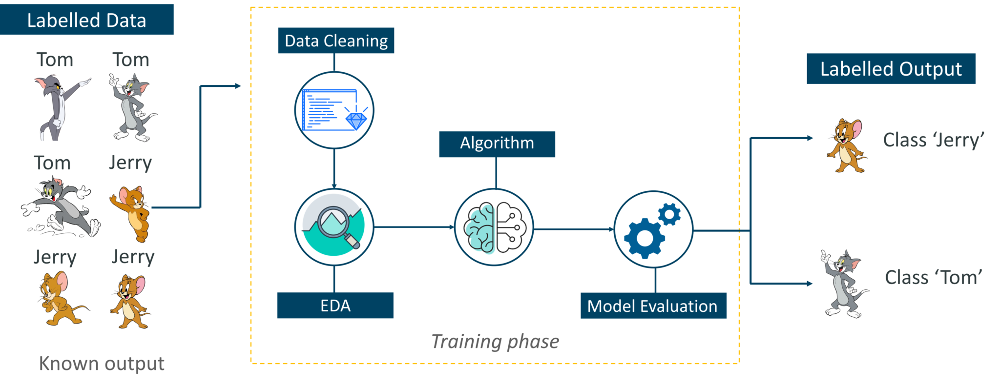

## Table of Contents

## What is The Order Machine (TOM)?

The Order Machine (TOM) is a system used by the United States Postal Service (USPS) to sort and process mail and packages. It helps postal workers handle a large amount of mail quickly and efficiently. TOM uses special machines and computers to read addresses and sort items into the right bins or containers. This makes sure that letters and packages get to where they need to go faster.

TOM is important because it helps the USPS manage the huge volume of mail that people send every day. Without TOM, it would take a lot longer to sort and deliver mail. The system also helps reduce errors, so fewer items get lost or sent to the wrong place. By using TOM, the USPS can keep up with the demands of delivering mail across the country.

## Who developed The Order Machine (TOM)?

The Order Machine (TOM) was developed by the United States Postal Service (USPS) with help from different technology companies. The USPS worked with these companies to create machines and computer systems that could read addresses and sort mail quickly. They wanted to make sure that TOM could handle a lot of mail every day without making mistakes.

Over time, the USPS kept improving TOM to make it even better. They added new technology and updated the software to keep up with more mail and new types of packages. This teamwork between the USPS and technology companies helped make TOM a very important part of how mail gets sorted and delivered in the United States.

## What are the basic functions of TOM?

The Order Machine (TOM) helps the United States Postal Service sort and process mail and packages. It reads the addresses on letters and packages and then sorts them into the right bins or containers. This makes sure that each item goes to the correct place. TOM can handle a lot of mail at once, which helps the postal workers work faster and not get tired.

TOM also helps reduce mistakes. By using special machines and computers, it can read addresses very accurately. This means fewer items get lost or sent to the wrong place. The system is important because it helps the USPS keep up with the huge amount of mail that people send every day. Without TOM, it would take a lot longer to sort and deliver everything.

## How does TOM integrate with existing business systems?

The Order Machine (TOM) works well with the systems that businesses already use. It can connect with the computers and software that businesses have to keep track of their mail and packages. This means that when a business sends something, TOM can read the address and sort it quickly. It then sends information back to the business's system to let them know where their mail is and when it will get to its destination.

This connection helps businesses save time and make fewer mistakes. They can see where their mail is at any time and plan better for when things will arrive. By working together with TOM, businesses can make sure their mail gets to the right place faster and more accurately. This makes their work easier and helps them serve their customers better.

## What are the key features that distinguish TOM from other order management systems?

The Order Machine (TOM) stands out from other order management systems because it is specifically designed for the United States Postal Service. It can handle a huge amount of mail and packages every day. TOM uses special machines and computers to read addresses very accurately, which helps reduce mistakes. This means fewer items get lost or sent to the wrong place. Other systems might not be able to process as much mail as quickly or as accurately as TOM.

Another key feature of TOM is how well it works with existing business systems. It can connect with the computers and software that businesses use to keep track of their mail. This connection helps businesses see where their mail is and when it will arrive. Other order management systems might not connect as easily with different business systems. By working together with TOM, businesses can save time and make sure their mail gets to the right place faster and more accurately.

## Can you explain the user interface of TOM and its usability?

The user interface of The Order Machine (TOM) is made to be easy to use for postal workers. It has a clear screen where workers can see important information about the mail and packages they are sorting. The screen shows the addresses and where each item needs to go. There are also buttons and touchscreens that workers can use to tell TOM what to do. This makes it simple for them to sort mail quickly without making mistakes.

TOM's interface is designed to be user-friendly, so even new workers can learn how to use it fast. The system uses colors and sounds to help guide workers through their tasks. For example, if a package needs special handling, the screen might turn a different color to let the worker know. This helps keep things running smoothly and makes the job easier for everyone. Overall, TOM's user interface is simple and efficient, which is important for handling a lot of mail every day.

## What kind of businesses can benefit from using TOM?

Many kinds of businesses can benefit from using The Order Machine (TOM). It's especially helpful for businesses that send a lot of mail and packages, like online stores. When they use TOM, their mail gets sorted quickly and accurately. This means their customers get their orders faster, which makes them happy. It also helps the business save time and money because they don't have to worry about lost or delayed mail.

Even small businesses can find TOM useful. For example, a local bakery that sends out special orders can use TOM to track where their packages are and when they will arrive. This helps them plan better and keep their customers informed. By using TOM, these businesses can work more efficiently and focus on growing their business instead of worrying about mail.

## How does TOM handle scalability and large volumes of orders?

The Order Machine (TOM) is really good at handling a lot of mail and packages. It can sort thousands of items every day without getting slow. This is because TOM uses special machines and computers that work together to read addresses and sort mail quickly. When there are more orders, TOM can keep up because it is designed to handle big changes in how much mail needs to be sorted. This means that even during busy times, like holidays, TOM can still work well and not get overwhelmed.

TOM also helps businesses that send a lot of mail. If a business grows and starts sending more packages, TOM can handle that growth easily. It keeps track of where all the mail is and makes sure it gets to the right place on time. This helps businesses not have to worry about their mail getting lost or delayed, even when they are sending a lot more than before. By using TOM, businesses can focus on growing without worrying about their mail system.

## What are the security features implemented in TOM?

The Order Machine (TOM) has strong security features to keep mail and packages safe. It uses special codes and checks to make sure that only the right people can see or change information about the mail. This helps stop people from stealing or messing with packages. TOM also keeps track of where each item is all the time, so if something goes missing, it's easier to find out what happened.

Another important security feature of TOM is that it can tell if someone tries to do something they shouldn't. If someone tries to change the mail's information in a bad way, TOM will notice and stop it. This helps keep the mail safe and makes sure that it gets to the right place. By using these security features, TOM helps make sure that the mail stays safe and secure.

## How does TOM support multi-channel order processing?

The Order Machine (TOM) helps businesses handle orders from different places like websites, phone calls, or in-store purchases. It connects with all these different ways of ordering so that all the information comes together in one place. This makes it easier for businesses to keep track of everything and make sure orders are processed correctly, no matter where they come from.

TOM can sort and process mail and packages quickly, even if they come from different channels. It reads the addresses and sorts the items into the right bins or containers. This means that whether a customer orders something online or over the phone, TOM can handle it efficiently and make sure it gets to the right place on time.

## What customization options are available in TOM for specific business needs?

The Order Machine (TOM) offers different ways for businesses to make it work just right for them. Businesses can set up TOM to match how they like to handle their mail and packages. For example, they can choose special labels or codes that help them keep track of their items better. TOM can also be set up to work with the computers and software that a business already uses, so everything fits together smoothly.

Another way TOM can be customized is by setting up special rules for sorting mail. If a business has certain types of packages that need to go to different places, TOM can be told how to handle those. This means that even if a business has unique needs, TOM can be adjusted to make sure their mail gets sorted and delivered the way they want it to. By letting businesses customize it, TOM helps them work better and keep their customers happy.

## What are the advanced analytics and reporting capabilities of TOM?

The Order Machine (TOM) has special tools that help businesses understand their mail and packages better. It can make reports that show how fast mail is being sorted and delivered. This helps businesses see if they are doing a good job and where they can do better. TOM can also show how many packages are being sent and where they are going. This information helps businesses plan for busy times and make sure they have enough workers and machines to handle the mail.

TOM also keeps track of any problems that happen with the mail. If packages get lost or delayed, TOM can make reports about these issues. This helps businesses find out why these problems are happening and fix them. By using these reports, businesses can make their mail service better and keep their customers happy.

## References & Further Reading

[1]: ["Advances in Financial Machine Learning"](https://www.amazon.com/Advances-Financial-Machine-Learning-Marcos/dp/1119482089) by Marcos Lopez de Prado

[2]: Hendershott, T., Jones, C. M., & Menkveld, A. J. (2011). ["Does Algorithmic Trading Improve Liquidity?"](https://onlinelibrary.wiley.com/doi/full/10.1111/j.1540-6261.2010.01624.x) The Review of Financial Studies, 24(8), 2824-2851.

[3]: Hasbrouck, J., & Saar, G. (2013). ["Low-latency trading."](https://www.sciencedirect.com/science/article/abs/pii/S1386418113000165) The Review of Financial Studies, 26(9), 2096-2139.

[4]: Riordan, R., & Storkenmaier, A. (2012). ["Latency, Liquidity and Price Discovery."](https://www.sciencedirect.com/science/article/pii/S1386418112000237) Journal of Financial Markets, 15(4), 416-437.

[5]: ["Quantitative Trading: How to Build Your Own Algorithmic Trading Business"](https://www.amazon.com/Quantitative-Trading-Build-Algorithmic-Business/dp/1119800064) by Ernest P. Chan

[6]: Gomber, P., Arndt, B., Lutat, M., & Uhle, T. (2011). ["High-Frequency Trading."](https://papers.ssrn.com/sol3/papers.cfm?abstract_id=1858626) Journal of Information Technology, 52(2), 85-97.

[7]: Europe Economics. (2010). ["The Future of Computer Trading in Financial Markets."](https://assets.publishing.service.gov.uk/government/uploads/system/uploads/attachment_data/file/289058/11-1276-the-future-of-computer-trading-in-financial-markets.pdf) UK Government Office for Science.