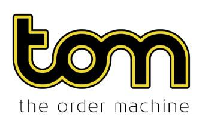

The financial markets have undergone a significant transformation due to algorithmic trading, a method that utilizes complex algorithms to make high-speed trading decisions. At the forefront of this innovation was The Order Machine (TOM), a pioneering entity that played a vital role in reshaping the trading landscape. Established in 2009, TOM quickly emerged as a formidable player in Amsterdam's trading circles, directly challenging established entities like NYSE Euronext. By leveraging alternative trading mechanics and cutting-edge technologies, TOM sought to enhance market efficiency and provide competitive trading opportunities.

This article explores the evolution of TOM, highlighting its journey from inception to significant market influence. It examines the various impacts TOM had on trading dynamics and the broader market environment. Furthermore, the discussion investigates into the lessons learned from TOM's operations, providing valuable insights into both the potential benefits and challenges inherent in algorithmic trading systems.



## Table of Contents

## The Order Machine (TOM): Origins and Structure

The Order Machine (TOM) was inaugurated in 2009 as an innovative joint venture between Optiver, a renowned market maker, and BinckBank, a leading online brokerage firm. This strategic collaboration aimed to revolutionize trading by employing alternative trading mechanics to enhance market opportunities. This synergy leveraged Optiver’s expertise in market making and BinckBank's stronghold in online brokerage, creating a robust platform for efficient trading.

Headquartered in Amsterdam, TOM operated as a multilateral trading facility (MTF), a market infrastructure designed to facilitate trading with transparency and efficiency. The platform was equipped not only to offer a wide range of trading products but also to provide brokerage services that appealed to professional and retail investors alike. The multilateral setup allowed TOM to function as an alternative to traditional exchanges, enabling competitive pricing and liquidity enhancements.

In its quest for expansion and increased credibility, TOM welcomed significant partnerships. ABN AMRO, one of the Netherlands' largest banks, and IMC Group, a leading proprietary trading firm, joined TOM. These collaborations reinforced TOM’s operational capacity and market visibility. By integrating these partners, TOM bolstered its standing in the Dutch and broader European markets, offering a compelling alternative to established trading venues such as NYSE Euronext. These strategic alliances enabled TOM to harness a wider range of market participants and foster a more dynamic trading environment, accentuating its role as a pioneer in the algorithmic trading domain.

## Achievements and Market Impact

The Order Machine (TOM) demonstrated remarkable progress and influence during its operational years, despite its relatively brief existence in the market. One of its critical achievements was reaching the milestone of one million traded options within just ten months after its launch. This rapid achievement underscored the effectiveness and appeal of its trading algorithms and platforms, effectively capturing market interest and participation in a short time.

By 2012, TOM had secured a 20% market share in Dutch options, showcasing its competitive edge over other trading entities. This impressive figure was a testament to TOM's sophisticated trading strategies and its ability to provide market participants with efficient and cost-effective trading solutions. By 2013, TOM's market share had further expanded, indicating continued acceptance and trust from traders using its platform.

A significant [factor](/wiki/factor-investing) contributing to TOM's success was its implementation of Smart Order Routing (SOR) technology. This system enabled TOM to optimize order execution across various trading venues, ensuring the best possible prices for its clients. The SOR mechanism worked by intelligently directing orders to markets with the most favorable prices and [liquidity](/wiki/liquidity-risk-premium), thus minimizing transaction costs and improving execution quality. This capability was particularly attractive to retail brokers and institutional traders alike, as it enhanced trading efficiency and effectiveness.

Algorithmic trading was at the core of TOM's operations, allowing it to not only streamline processes but also to handle a large [volume](/wiki/volume-trading-strategy) of trades with precision and speed. The use of algorithms facilitated various trading strategies, from [market making](/wiki/market-making) to statistical [arbitrage](/wiki/arbitrage), ensuring that TOM could adapt to rapidly changing market conditions and client needs.

Overall, TOM's achievements and its impact on the market were significant. They illustrated how technology-driven strategies could successfully compete with established entities and enhance market dynamics. TOM's innovations and market performance highlighted the transformative potential of [algorithmic trading](/wiki/algorithmic-trading) systems in improving market efficiency and liquidity.

## Challenges Faced by TOM

The Order Machine (TOM) encountered several notable challenges during its operational years, which ultimately influenced its trajectory in the algorithmic trading landscape. One of the primary challenges was a lawsuit filed by NYSE Euronext, which revolved around intellectual property rights concerning the AEX Index. This legal battle highlighted the complexities of operating within a highly competitive market where proprietary indices and trading methodologies are critical assets. The lawsuit underscored the intense rivalry between trading platforms and the importance of intellectual property in maintaining a competitive edge.

In addition to legal challenges, TOM faced financial constraints that played a significant role in its eventual wind-down. By 2017, TOM started to experience financial difficulties, which impeded its ability to sustain operations at the level required to compete effectively with larger and more established exchanges. This financial strain led TOM to initiate a strategic withdrawal, transferring its conducted trades to other platforms, including Euronext. The need to transfer trades and pivot operations was indicative of the challenging economic environment for smaller trading facilities in maintaining market share against larger incumbents.

These challenges highlight the intricate balance required between innovation, intellectual property management, and financial stability within the trading industry. The case of TOM illustrates how external pressures, whether through competitive legal actions or financial sustainability issues, can significantly impact the viability of a trading platform.

## TOM’s Trading Strategies and Mechanisms

The Order Machine (TOM) employed a variety of trading strategies that were instrumental in distinguishing its role within the financial markets. These strategies included market making, [statistical arbitrage](/wiki/statistical-arbitrage), and [trend following](/wiki/trend-following), each contributing to its ability to offer competitive trading solutions.

Market making was a core component of TOM's strategy, providing liquidity and tighter spreads for traders. By consistently quoting buy and sell prices, TOM facilitated increased market participation, reducing the cost for traders to enter and [exit](/wiki/exit-strategy) positions efficiently. This capability was crucial in capturing a significant market share early in its operations.

Statistical arbitrage was another strategy used by TOM, which involves the exploitation of price inefficiencies between related financial instruments. By utilizing complex algorithms, TOM identified and executed trades that capitalized on these inefficiencies, ensuring profitability even in low-[volatility](/wiki/volatility-trading-strategies) environments. The mathematical models used in statistical arbitrage focus on mean reversion by examining statistical properties like time series analysis. Python’s libraries such as NumPy and pandas could have been used in implementing these strategies as follows:

```python
import numpy as np
import pandas as pd

# Example of a simple mean reversion strategy
def calculate_moving_average(prices, window_size):
    return prices.rolling(window=window_size).mean()

def signal_generation(prices, moving_avg):
    return np.where(prices < moving_avg, "Buy", "Sell")

# Stock price data
prices = pd.Series([....])  # hypothetical price series

moving_avg = calculate_moving_average(prices, window_size=20)
signals = signal_generation(prices, moving_avg)
```

Trend following, another of TOM's strategies, involved tracking price movements and capitalizing on systemic market movements. This strategy was predicated on the assumption that markets tend to trend, and by positioning accordingly, TOM could realize profits over sustained periods.

Moreover, the introduction of Smart Order Routing (SOR) underscored TOM's innovative approach to trading environments. SOR automatically selected the best available market for executing orders, ensuring optimal pricing and execution efficiency. This mechanism was particularly advantageous for retail partners like ABN Amro, allowing them to achieve better execution prices and reduced trading costs, thus enhancing their overall trading performance.

The synergy of these strategies and mechanisms enabled TOM to not only compete against larger established exchanges but also to provide exceptional value to its trading participants, setting an exemplary model within the algorithmic trading ecosystem.

## Impact of Regulatory and Market Changes

The trading industry is subject to continuous regulatory and market changes that shape its operational landscape. For entities like The Order Machine (TOM), these dynamics necessitated constant adaptation to remain competitive and compliant. The European financial markets, during TOM's active years, were influenced by various regulations including the Markets in Financial Instruments Directive (MiFID), which aimed to increase competition and transparency across EU financial markets. This regulatory environment required trading platforms to innovate continuously, ensuring that trading technologies could effectively meet new compliance and operational standards.

Another significant challenge faced by TOM was market saturation. As more trading platforms emerged and existing ones expanded their offerings, the competitive landscape intensified. This saturation made it difficult for TOM to maintain its initial growth trajectory and market share. In a crowded market, standing out required not only compliance with regulations but also the ability to offer unique value propositions in terms of pricing, speed, and service quality.

Funding constraints compounded these challenges. Innovating in the face of rigorous regulations and a saturated market is resource-intensive. Trading platforms require substantial investment in technology and human resources to develop and maintain advanced trading systems that comply with shifting regulations. For TOM, insufficient funding restricted its ability to scale operations and invest in the necessary technological upgrades and innovations. This situation underscored the importance of securing adequate financial backing to support sustainable growth and regulatory compliance in the evolving world of trading.

In summary, the regulatory environment and market conditions critically influenced TOM’s operational decisions and trajectory. The necessity to adapt to changing regulations, compete in a saturated market, and manage funding constraints were significant factors in TOM’s journey, providing essential lessons for future trading entities aiming to thrive in a dynamic financial landscape.

## The Future of Algorithmic Trading: Lessons from TOM

The story of The Order Machine underscores crucial lessons for those involved in algorithmic trading, emphasizing the importance of understanding market dynamics, securing adequate funding, and proficiently navigating regulatory landscapes. This multifaceted approach is essential for the resilience and success of trading platforms in the competitive and ever-evolving financial sector.

Market dynamics require traders and platform operators to develop sophisticated algorithms that can rapidly adapt to changes in market conditions, such as price fluctuations and liquidity shifts. This capability relies on leveraging historical data, predictive analytics, and real-time monitoring to devise strategies that maximize returns while minimizing risks. For instance, algorithmic traders can utilize [machine learning](/wiki/machine-learning) techniques to refine prediction models continuously. Python, a favored language among traders, facilitates this process with libraries such as NumPy, pandas, and scikit-learn, which aid in data analysis and model training. A simple Python code snippet to illustrate basic linear regression, a common technique used to predict asset prices, includes:

```python
import numpy as np
from sklearn.linear_model import LinearRegression

# Sample data: historical prices
X = np.array([[1], [2], [3], [4], [5]])
y = np.array([2, 4, 5, 4, 5])

# Create and fit the model
model = LinearRegression().fit(X, y)

# Predict future prices
future_X = np.array([[6], [7]])
predicted_y = model.predict(future_X)
```

Securing adequate funding is also a critical element. Financial stability ensures the sustainability of innovation and expansion capabilities. TOM's journey illustrates that a lack of financial resources can hinder progress and even lead to the cessation of operations. Trading platforms must therefore prioritize robust financial management, seek diverse revenue streams, and maintain strong relationships with institutional partners and investors.

Navigating regulatory landscapes is equally vital. As financial markets are heavily regulated, staying compliant with evolving regulations is essential to prevent legal challenges and maintain operational legitimacy. This compliance involves adhering to regulations regarding transparency, data handling, and trade execution. Establishing a dedicated compliance team that monitors legislative changes and adapts strategies accordingly can help in achieving this.

TOM’s legacy sheds light on both the potential and the inherent challenges of algorithmic systems. As the trading environment continues to grow and become more technologically advanced, the integration of TOM's strategies—such as Smart Order Routing—and its collaborative approach with stakeholders remain instructive. These insights can guide future entrants in creating robust algorithmic trading platforms that not only survive but thrive in the competitive landscape of global finance.

## Conclusion

The Order Machine (TOM) played a pivotal role in reshaping financial market operations through its pioneering implementation of algorithmic trading techniques. TOM successfully demonstrated that algorithmic systems could increase trading efficiency, improve market liquidity, and offer competitive pricing, thereby fulfilling the promise of technology in transforming the trading landscape.

Despite TOM's eventual closure, it established essential benchmarks for future platforms seeking to leverage similar technological advances. TOM's journey underscores the need for continual innovation and adaptation in a rapidly changing financial environment, setting a standard for how trading platforms can redefine market dynamics through strategic innovations.

Key takeaways from TOM's integrated strategies include the importance of smart order routing and the consideration of diverse trading strategies such as market making and statistical arbitrage, which collectively improved market operations. These innovations exemplify how technology can optimize trade executions, significantly reduce transaction costs, and enhance market participant satisfaction.

The challenges encountered by TOM, including regulatory hurdles and competitive pressures, provide valuable lessons for navigating the complexities of modern trading systems. Effective management of intellectual property rights and securing sustainable financial resources are critical factors for longevity and success in the competitive world of algorithmic trading.

As technology continues to advance, there remains an abundance of insights to be drawn from TOM's innovative strategies and operational challenges. These lessons highlight the delicate balance between pioneering financial technologies and maintaining the flexibility to adapt to evolving market and regulatory conditions, ensuring the sustainable growth and evolution of algorithmic trading systems.

## References & Further Reading

[1]: ["Advances in Financial Machine Learning"](https://www.amazon.com/Advances-Financial-Machine-Learning-Marcos/dp/1119482089) by Marcos Lopez de Prado

[2]: Hendershott, T., Jones, C. M., & Menkveld, A. J. (2011). ["Does Algorithmic Trading Improve Liquidity?"](https://onlinelibrary.wiley.com/doi/full/10.1111/j.1540-6261.2010.01624.x) The Review of Financial Studies, 24(8), 2824-2851.

[3]: Hasbrouck, J., & Saar, G. (2013). ["Low-latency trading."](https://www.sciencedirect.com/science/article/abs/pii/S1386418113000165) The Review of Financial Studies, 26(9), 2096-2139.

[4]: Riordan, R., & Storkenmaier, A. (2012). ["Latency, Liquidity and Price Discovery."](https://www.sciencedirect.com/science/article/pii/S1386418112000237) Journal of Financial Markets, 15(4), 416-437.

[5]: ["Quantitative Trading: How to Build Your Own Algorithmic Trading Business"](https://www.amazon.com/Quantitative-Trading-Build-Algorithmic-Business/dp/1119800064) by Ernest P. Chan

[6]: Gomber, P., Arndt, B., Lutat, M., & Uhle, T. (2011). ["High-Frequency Trading."](https://papers.ssrn.com/sol3/papers.cfm?abstract_id=1858626) Journal of Information Technology, 52(2), 85-97.

[7]: Europe Economics. (2010). ["The Future of Computer Trading in Financial Markets."](https://assets.publishing.service.gov.uk/government/uploads/system/uploads/attachment_data/file/289058/11-1276-the-future-of-computer-trading-in-financial-markets.pdf) UK Government Office for Science.