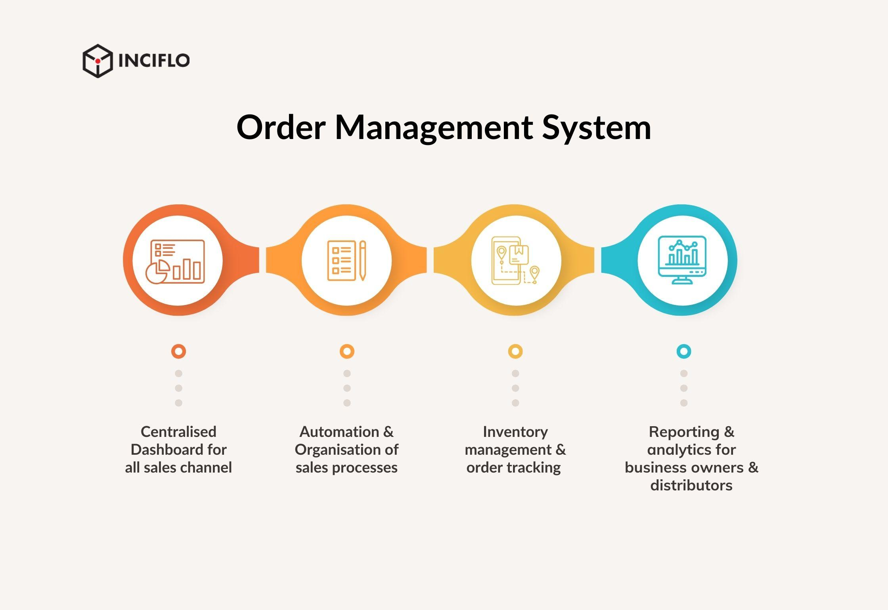

## Table of Contents

## What is an order management system (OMS)?

An order management system (OMS) is a software tool that helps businesses keep track of orders from customers. It starts when a customer places an order and follows it all the way until the order is complete. The OMS makes sure that every step, like checking if the product is available, packing it, and sending it out, goes smoothly. This helps businesses make sure their customers get what they want on time.

Using an OMS can make things easier for a business. It can save time and reduce mistakes because everything is organized in one place. For example, if a customer wants to change or cancel an order, the OMS can handle that quickly. This makes customers happier and helps the business run more smoothly.

## What are the basic functions of an OMS?

An order management system (OMS) has several basic functions that help businesses manage orders from start to finish. One key function is order processing, which involves receiving and recording customer orders. The OMS checks if the products are available in stock. If they are, it moves the order to the next step. If not, it might suggest alternatives or notify the customer about delays. This helps keep everything organized and makes sure orders are handled quickly.

Another important function of an OMS is inventory management. It keeps track of what products are in stock and updates this information in real time. This helps prevent selling items that are out of stock and ensures that the business can fulfill orders accurately. The OMS also helps with order fulfillment, which includes [picking](/wiki/asset-class-picking), packing, and shipping the products. It makes sure that orders are sent out on time and that customers receive their items as expected.

Lastly, an OMS often includes features for handling returns and exchanges. If a customer needs to return or exchange an item, the system can process these requests efficiently. It updates the inventory and manages any refunds or credits. This function is crucial for maintaining good customer service and keeping customers happy. By automating these processes, an OMS helps businesses save time and reduce errors, making the whole order management process smoother and more reliable.

## How does an OMS integrate with other business systems?

An order management system (OMS) works well with other business systems to make things run smoothly. It connects with the inventory system to keep track of what products are in stock. When an order comes in, the OMS checks the inventory system to see if the items are available. If they are, it tells the warehouse management system to pick and pack the items. This helps make sure that orders are filled correctly and on time.

The OMS also talks to the customer relationship management (CRM) system. This helps keep customer information up to date and makes it easier to handle any special requests or changes to orders. For example, if a customer wants to change their order, the OMS can update the CRM system so everyone knows about the change. This makes customers happier because their needs are met quickly.

Lastly, the OMS can connect with the accounting and financial systems. When an order is complete, the OMS sends the information to the accounting system to handle payments and invoices. This helps keep the business's money matters organized and makes sure that everything is recorded correctly. By working together with these other systems, the OMS helps the whole business run more smoothly and efficiently.

## What are the key components of an OMS?

An order management system (OMS) has several key parts that help it work well. One main part is the order processing module. This part takes in orders from customers and checks if the products are available. If they are, it moves the order along to be packed and shipped. If not, it might suggest other products or let the customer know about delays. Another important part is the inventory management module. This keeps track of what products are in stock and updates this information all the time. It helps make sure that the business can fill orders correctly and on time.

Another key part of an OMS is the order fulfillment module. This part deals with getting the products ready to be sent out. It tells the warehouse workers which items to pick and pack, and it makes sure the orders are shipped on time. The OMS also has a returns and exchanges module. This part helps handle any returns or exchanges from customers quickly and easily. It updates the inventory and deals with any refunds or credits, which helps keep customers happy.

The last important part is the integration module. This part helps the OMS work with other business systems like the customer relationship management (CRM) system and the accounting system. It shares information with these systems to keep everything organized and up to date. For example, it can send order details to the accounting system for payment processing, or update the CRM system with any changes to a customer's order. By working together with these other systems, the OMS helps the whole business run more smoothly.

## What are the benefits of implementing an OMS for a business?

Implementing an order management system (OMS) can help a business in many ways. It makes the whole process of handling orders easier and faster. When a customer places an order, the OMS checks if the product is in stock and moves the order along to be packed and shipped. This means fewer mistakes and quicker service for customers. The OMS also keeps track of inventory, so the business always knows what they have and can avoid selling things they don't have. This saves time and helps the business run more smoothly.

Another big benefit of an OMS is that it can work well with other business systems. For example, it can share information with the customer relationship management (CRM) system to keep customer details up to date. This helps handle any special requests or changes to orders quickly, making customers happier. The OMS can also connect with the accounting system to handle payments and invoices correctly. By working together with these other systems, the OMS helps the whole business run more efficiently and keeps everything organized.

## How does an OMS handle order processing and fulfillment?

An order management system (OMS) handles order processing by taking in orders from customers and checking if the products are available. When a customer places an order, the OMS looks at the inventory to see if the items are in stock. If they are, it moves the order forward to the next step. If not, the OMS might suggest other products or let the customer know about any delays. This helps keep everything organized and makes sure orders are handled quickly and correctly.

The OMS also manages order fulfillment, which means getting the products ready to be sent out. It tells the warehouse workers which items to pick and pack, and it makes sure the orders are shipped on time. The system keeps track of everything from the moment the order is placed until it is delivered to the customer. This helps the business make sure that customers get their items as expected, which makes them happier and keeps the business running smoothly.

## What are the common challenges faced when implementing an OMS?

Implementing an order management system (OMS) can be tricky because it involves changing how a business works. One big challenge is getting the OMS to work well with other systems the business already uses, like the inventory system or the accounting system. If these systems don't talk to each other properly, it can cause mistakes and slow things down. Another challenge is training the staff to use the new system. People might be used to doing things the old way, and it can take time for them to learn how to use the OMS correctly.

Another common issue is making sure the OMS can handle the business's specific needs. Every business is different, and the OMS might need to be set up in a special way to fit those needs. This can be hard and might need help from experts. Also, there can be problems with the data. When switching to a new system, all the old order information needs to be moved over correctly. If this isn't done right, it can lead to mistakes and confusion. Despite these challenges, with careful planning and support, businesses can successfully implement an OMS and see big improvements in how they handle orders.

## How can an OMS improve customer satisfaction and experience?

An order management system (OMS) can make customers happier by making the ordering process faster and easier. When a customer places an order, the OMS checks if the items are in stock and quickly moves the order along to be packed and shipped. This means customers get their orders faster and with fewer mistakes. If a customer needs to change or cancel an order, the OMS can handle that quickly too. This makes customers feel like their needs are being met, which makes them more satisfied with the service.

The OMS also helps by keeping customers updated on their orders. It can send them messages about when their order will be shipped or if there are any delays. This keeps customers in the loop and makes them feel more secure about their purchase. Plus, if a customer needs to return or exchange something, the OMS makes that process easy and smooth. By making the whole experience from ordering to receiving and even returning items better, the OMS helps improve customer satisfaction and keeps them coming back.

## What are the latest trends in order management systems?

One of the latest trends in order management systems is the use of [artificial intelligence](/wiki/ai-artificial-intelligence) (AI) and [machine learning](/wiki/machine-learning). These technologies help the OMS predict what customers might want to buy next and manage inventory better. For example, AI can look at past orders and suggest when to restock certain items. This makes the whole process smoother and helps businesses save money by not having too much or too little stock. Another trend is the focus on making the OMS work well on mobile devices. More and more people use their phones to shop, so having an OMS that works well on mobile helps businesses meet their customers' needs better.

Another trend is the integration of OMS with other business systems in real-time. This means the OMS can share information with systems like customer relationship management (CRM) and accounting systems instantly. This helps keep everything up to date and makes the business run more efficiently. For example, if a customer changes their order, the OMS can quickly update the CRM system so everyone knows about the change. This real-time integration helps businesses respond to customer needs faster and improves the overall customer experience.

## How do you choose the right OMS for your business?

Choosing the right order management system (OMS) for your business starts with understanding what your business needs. Think about how many orders you get, what kind of products you sell, and how you want to handle things like returns and exchanges. Some businesses might need an OMS that works well with a lot of orders, while others might need one that can handle special orders or custom products. It's also important to think about how the OMS will work with other systems you use, like your inventory or accounting software. Make sure the OMS can share information with these systems easily to keep everything running smoothly.

Once you know what you need, look at different OMS options and see which one fits best. Some OMS are made for small businesses and are easy to use, while others are more complex and better for bigger companies. It's a good idea to try out a few different systems to see which one works best for you. Also, think about the cost and if the OMS company offers good support and training. A good OMS should make your business run better, save you time, and make your customers happier, so take your time to choose the right one.

## What are the security considerations when using an OMS?

When using an order management system (OMS), it's important to think about security. You need to make sure that customer information, like their names, addresses, and payment details, is kept safe. The OMS should have strong security measures, like encryption, to protect this data from hackers. It's also important to have good passwords and to update them often. This helps keep the system safe and makes sure that only the right people can access the information.

Another thing to consider is how the OMS connects with other systems. When the OMS shares information with other business systems, like the inventory or accounting software, it's important that these connections are secure. The OMS should use secure methods to send and receive data, so no one can steal or change the information. Regular checks and updates are also important to fix any security problems quickly and keep the system safe.

## How can an OMS be optimized for scalability and performance?

To make an order management system (OMS) work better and handle more orders, you need to think about how it can grow. One way to do this is by using cloud technology. The cloud can give the OMS more space and power when it needs it, so it can handle more orders without slowing down. Another way is to make sure the OMS can work with other systems easily. This means it can share information quickly and keep everything running smoothly, even when there are a lot of orders.

It's also important to keep the OMS running fast and smoothly. You can do this by checking the system often and fixing any problems quickly. Using smart technology like AI can help too. AI can look at how the OMS is working and suggest ways to make it better. This can help the OMS handle more orders faster and keep customers happy, even as the business grows.

## References & Further Reading

[1]: Harris, L. (2003). ["Trading and Exchanges: Market Microstructure for Practitioners."](https://www.amazon.com/Trading-Exchanges-Market-Microstructure-Practitioners/dp/0195144708) Oxford University Press.

[2]: Mehrling, P. (2011). ["The New Lombard Street: How the Fed Became the Dealer of Last Resort."](https://www.jstor.org/stable/j.ctt7sgxz) Princeton University Press.

[3]: Aldridge, I. (2013). ["High-Frequency Trading: A Practical Guide to Algorithmic Strategies and Trading Systems."](https://www.amazon.com/High-Frequency-Trading-Practical-Algorithmic-Strategies/dp/1118343506) Wiley.

[4]: Kissell, R. (2013). ["The Science of Algorithmic Trading and Portfolio Management."](https://www.sciencedirect.com/book/9780124016897/the-science-of-algorithmic-trading-and-portfolio-management) Academic Press.

[5]: Dealing with Data-Related Regulatory Issues in Algorithmic Trading, Journal of Trading. 

[6]: Hasbrouck, J. (2007). ["Empirical Market Microstructure: The Institutions, Economics, and Econometrics of Securities Trading."](https://academic.oup.com/book/52241) Oxford University Press.

[7]: Gomber, P., Arndt, B., Lutat, M., & Uhle, T. (2011). ["High-Frequency Trading."](https://papers.ssrn.com/sol3/papers.cfm?abstract_id=1858626) In: Stock Exchanges and Stock Index Futures. Springer.