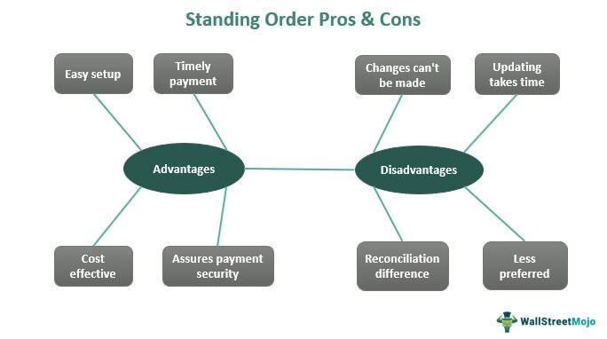

In today's fast-paced financial markets, efficiency and accuracy in trade execution are paramount. These markets demand robust infrastructures capable of processing high volumes of transactions with minimal latency. An Order Management System (OMS) plays a pivotal role in this context by ensuring seamless business operations, finance management, and technology integration. It acts as an essential tool for managing trade orders, optimizing execution, and providing transparent oversight across various stages of trading.

An OMS is designed to support the complex requirements of modern trading environments by efficiently handling the entire order lifecycle, from order creation to execution and settlement. Its functionalities are particularly significant in algorithmic trading where quick decision-making is driven by predefined algorithms. The scalability and adaptability of an OMS make it invaluable in handling the intricacies of algorithmic trading where the speed of execution and accuracy can greatly influence profitability.



Moreover, the integration of OMS with other technological systems enhances its utility in algorithmic trading. By connecting with electronic communication networks (ECNs), trading desks, and risk management systems, an OMS ensures that trades are executed at optimal prices while minimizing risk. This integration also facilitates comprehensive data analysis, allowing traders to refine their strategies based on real-time market information.

This article will explore the importance and functionalities of an OMS, focusing on its impact on algorithmic trading and broader business operations. It aims to illuminate how OMS technology not only underpins trading efficiency but also supports overall business objectives in the financial sector.

## Table of Contents

## What is an Order Management System (OMS)?

An Order Management System (OMS) is a comprehensive software application designed to manage and facilitate the efficient execution of trade orders within financial markets. Fundamentally, an OMS serves as the bridge between buyers and sellers, ensuring smooth and accurate transaction processing. The primary functions of an OMS include order placement, routing, execution, and the subsequent post-trade processes. By consolidating these multifaceted tasks, an OMS optimizes the workflow, minimizes the risk of errors, and enhances overall trading efficiency. 

The significance of an OMS in securities trading cannot be understated. In today's volatile markets, where speed and precision are critical, an OMS streamlines the complex process of executing trades, ensuring that trades are executed at optimal times and prices. This system efficiently handles a vast array of securities, including stocks, bonds, futures, and derivatives, with the capability to process multiple transactions simultaneously, thus facilitating high-frequency trading. By integrating various trading functions, an OMS reduces latency and ensures accurate order matching and execution, which is crucial in avoiding slippage—a scenario where the executed price differs from the expected price.

Various types of OMS exist to cater to the specific needs of different financial markets and business operations. In equities markets, traditional OMSs handle the intricacies of stock trading by coordinating with exchanges, [liquidity](/wiki/liquidity-risk-premium) providers, and counterparties. Fixed income markets often require OMSs with specialized functionalities due to the diverse nature of bonds and [interest rate](/wiki/interest-rate-trading-strategies) products. For asset managers, OMSs are essential for managing client portfolios and ensuring compliance with investment mandates. In contrast, retail operations use order management systems to coordinate sales, inventory, logistics, and more, often integrating with point-of-sale (POS) systems and e-commerce platforms to streamline the ordering and fulfillment process.

Additionally, there are OMSs that cater explicitly to [algorithmic trading](/wiki/algorithmic-trading) environments, providing sophisticated tools for strategy development, testing, and deployment. These systems offer seamless integration with trading algorithms, allowing for automated and extremely rapid order execution based on predefined criteria. The adaptability and robustness of an OMS make it an indispensable tool in both traditional financial markets and complex business operations, underscoring its pivotal role in reducing transaction costs and enhancing operational efficiencies.

## OMS in Business Operations

Order Management Systems (OMS) play a pivotal role in optimizing business operations across various industries, particularly in e-commerce and sales. These systems streamline the entire sales process from point of sale to delivery, ensuring efficiency and accuracy in order processing. By automating key tasks and providing a centralized platform for managing orders, inventory, and customer information, OMS solutions enable businesses to reduce errors, accelerate order fulfillment, and enhance customer satisfaction.

### Support for E-commerce and Sales Processes

An OMS provides comprehensive support for e-commerce and sales processes. It handles order entry, routing, and fulfillment, allowing businesses to manage high volumes of sales efficiently. The system automates inventory updates, ensuring that stock levels are accurately reflected in real-time. This significantly reduces the risk of stockouts or overselling, which can negatively impact customer satisfaction and the company's reputation.

Additionally, OMS platforms often integrate with various sales channels, such as online marketplaces, physical stores, and mobile platforms. This integration ensures that orders from different sources are consolidated into a single system, simplifying the management process. The seamless flow of information between sales channels and the OMS improves operational efficiency and enables businesses to respond quickly to market changes and customer demands.

### Case Studies of Operational Efficiency

Numerous businesses have successfully leveraged OMS to enhance their operational efficiency. For instance, a global retail company implemented an advanced OMS to unify its multi-channel sales and inventory management. This integration reduced order processing times by 50% and decreased purchase errors by 30%, significantly improving the customer experience.

Another example is an online fashion retailer that adopted an OMS to streamline its order fulfillment process. By automating various tasks, such as order allocation and shipping label generation, the company cut down its order processing time from two days to just a few hours, leading to a 20% increase in customer retention.

### Key Features and Benefits of Business-Focused OMS Solutions

Business-focused OMS solutions offer a range of features that cater to the specific needs of enterprises:

1. **Inventory Management**: Real-time tracking of inventory levels across multiple locations helps prevent stock discrepancies and backorders.

2. **Order Processing Automation**: By automating routine tasks, businesses reduce manual errors and free up staff to focus on higher-value activities.

3. **Customer Relationship Management (CRM)**: Integrating CRM within OMS helps maintain up-to-date customer profiles, enabling personalized marketing and improved service.

4. **Analytics and Reporting**: OMS platforms often feature sophisticated analytics tools that provide insights into sales trends, customer behavior, and supply chain performance, aiding in strategic decision-making.

5. **Scalability**: As businesses grow, OMS solutions can scale to accommodate increased sales volumes and expanded operations without compromising performance.

The adoption of OMS in business operations not only boosts efficiency and productivity but also enhances the overall customer experience by ensuring timely and accurate delivery of products. Its ability to integrate with existing software systems and provide real-time data insights makes it an indispensable tool for modern businesses striving for competitiveness and growth in today's fast-paced market landscape.

## Financial Advantages of OMS

Order Management Systems (OMS) play a pivotal role in refining financial management and enhancing decision-making processes in financial markets. The real-time monitoring and reporting capabilities of OMS offer several advantages in managing risk, reducing transaction costs, and ensuring regulatory compliance. These benefits collectively contribute to more informed financial decisions and streamlined operations.

One of the primary financial advantages of an OMS is its capacity for real-time monitoring and reporting. This functionality allows market participants to keep a close watch on their positions, exposures, and market changes as they happen. Real-time data helps in identifying potential risks quickly, enabling traders and financial managers to respond promptly. The availability of accurate, up-to-the-minute data reduces the window for error and enhances the ability of organizations to maintain desired risk levels.

With risk management being a critical aspect of financial operations, OMS provides tools and analytics to evaluate risks effectively. By dynamically assessing trade exposure and employing risk metrics—such as Value at Risk (VaR) and stress testing—the system supports better risk mitigation strategies. Thus, real-time reporting not only aids in immediate corrective action but also fosters a proactive approach in anticipating and alleviating potential financial risks.

Additionally, OMS significantly impacts transaction cost efficiency and regulatory compliance. The automation brought by OMS reduces manual intervention, minimizing human errors and resulting in cost savings. Automated processes decrease the operational load and speed up transactions, leading to lower transactional costs over time. Moreover, OMS can be configured to execute trades at optimal times and prices, further reducing costs associated with trading.

Regulatory compliance is another critical area where OMS excels. The financial industry is heavily regulated, with firms required to adhere to complex reporting standards and maintain comprehensive audit trails. An OMS simplifies these requirements by providing detailed and accurate records of all transactions and system-generated reports that comply with regulatory demands. Automated compliance checks and alerts within an OMS ensure that trades conform to regulations and policy guidelines, significantly lowering the risk of non-compliance penalties.

In conclusion, an Order Management System enhances financial decision-making through its advanced real-time monitoring capabilities and risk management tools. By automating essential processes, OMS reduces transaction costs, and by ensuring precise adherence to regulations, it bolsters financial operational efficiency. These advantages make OMS an indispensable tool for effective management and decision-making in financial markets.

## OMS and Algorithmic Trading

An Order Management System (OMS) plays a significant role in enhancing the capabilities of algorithmic trading. Algorithmic trading, the process of executing orders using automated and pre-programmed trading instructions, relies heavily on speed, precision, and adaptability—qualities that an OMS can effectively provide.

### Enhancement of Algorithmic Trading Capabilities

At its core, an OMS serves as the infrastructure that brings together various elements crucial for algorithmic trading, such as real-time data analysis, order routing, and execution management. By streamlining these processes, an OMS enables algorithmic strategies to function efficiently, maximizing the accuracy and speed of trade execution. It facilitates the rapid ingestion and processing of data from multiple market sources, which is essential for making informed decisions at lightning speed. Through optimized order execution paths, an OMS reduces latency—a critical [factor](/wiki/factor-investing) in high-frequency trading environments.

### Integration with Trading Technologies and Algo Providers

The integration of an OMS with trading technologies and algorithmic service providers adds further enhancement to its efficacy. Such integration enables seamless connectivity between various trading venues and systems, ensuring that all orders are synchronized across platforms. This interconnectivity reduces discrepancies that may arise when orders are managed separately on different systems. Moreover, the use of advanced APIs (Application Programming Interfaces) allows for efficient data exchange and functionality expansion between the OMS and external technology providers. APIs enable the inclusion of custom algorithms tailored to specific trading strategies, therefore broadening the range of executable strategies through the OMS.

```python
# Example of a simple API call to integrate trading algorithms with OMS
import requests

# Define the API endpoint and parameters
api_url = "https://api.tradingplatform.com/execute"
payload = {
    "algorithm": "MeanReversion",
    "symbol": "AAPL",
    "quantity": 100,
    "order_type": "market",
}

# Execute the API call
response = requests.post(api_url, json=payload)

# Check if the order was successful
if response.status_code == 200:
    print("Order successfully executed.")
else:
    print("Order execution failed.")
```

### Benefits and Challenges of Implementation

The benefits of implementing an OMS in algorithmic trading strategies are numerous. First, it affords traders reduced transaction costs by optimizing the execution process. Efficient order handling reduces price slippage and market impact costs, thereby enhancing profitability. Additionally, real-time monitoring and data reporting capabilities allow traders to respond swiftly to market changes, providing a competitive edge.

However, the implementation of an OMS is not without challenges. Integration complexity can arise due to the diverse range of technologies and trading venues involved. Ensuring that an OMS is compatible with existing IT infrastructures while maintaining the highest security standards requires considerable investment in development and maintenance. Furthermore, algorithmic strategies must be rigorously tested within the OMS framework to ensure they operate as intended under various market conditions, a process that demands time and computational resources.

In summary, while OMS provides significant enhancements to algorithmic trading by ensuring swift and precise order execution, achieving seamless integration and consistent performance remains a complex challenge that requires continuous technological innovation and strategic planning.

## Technology Integration and Innovation

Technology plays a pivotal role in enhancing the capabilities and functionalities of Order Management Systems (OMS). The integration of cutting-edge technology has revolutionized how OMS operates, offering unprecedented efficiency and streamlined processes across various industries.

One of the foremost technological trends impacting OMS is cloud computing. By leveraging cloud-based solutions, OMS platforms can offer scalability, flexibility, and cost-effectiveness that on-premises systems struggle to match. Cloud computing enables OMS to handle large volumes of data efficiently while maintaining high levels of security and compliance. Additionally, cloud-based OMS platforms facilitate continuous updates and upgrades, ensuring that businesses always have access to the latest features and functionalities without the need for significant infrastructure investments.

API integrations stand as another vital technological advancement in OMS. Application Programming Interfaces (APIs) allow OMS to seamlessly integrate with other software systems, such as Customer Relationship Management (CRM) and Enterprise Resource Planning (ERP) systems. This interconnectedness enables real-time data sharing and synchronization, providing businesses with a holistic view of their operations. APIs also empower companies to customize their OMS to meet specific organizational needs, leading to increased operational efficiency.

In recent years, [machine learning](/wiki/machine-learning) and [artificial intelligence](/wiki/ai-artificial-intelligence) have begun to make their mark on OMS, aiding in the automation of complex decision-making processes and predictive analytics. These technologies can analyze historical data, identify trends, and provide insights that enhance trading strategies, inventory management, and customer service operations.

Several industries have demonstrated innovative uses of OMS through technology integration. In the retail sector, for instance, advanced OMS platforms can predict stock levels and automate reordering processes based on sales trends and consumer demand forecasts. In the financial industry, OMS integrated with algorithmic trading platforms can swiftly process large numbers of transactions, adapting to market changes in real time and optimizing trade execution outcomes.

Overall, the advancements in OMS technology through cloud computing, API integrations, and artificial intelligence are ushering in new possibilities for businesses and financial institutions. These innovations continue to enhance operational capabilities, improve decision-making processes, and provide comprehensive solutions tailored to specific industry needs.

## Conclusion

In today's financial and business environments, the strategic implementation of an Order Management System (OMS) has emerged as a vital component for enhancing operational efficiency and optimizing trade execution. Throughout the article, we have explored the core functionalities of OMS and its multifaceted role across various sectors, particularly in the domain of algorithmic trading. An OMS not only streamlines order processing but also serves as a backbone for better financial management through real-time monitoring and advanced reporting features. Moreover, this technology contributes to lowering transaction costs and strengthening regulatory compliance, underscoring its indispensable value to modern-[day trading](/wiki/day-trading-spy) operations.

Looking towards the future, the advancement of OMS technology promises continued benefits to both finance and business landscapes. With the assimilation of cutting-edge technologies such as cloud computing, artificial intelligence, and API integrations, OMS systems are set to become even more robust and versatile. These innovations will likely lead to further enhancements in automation, scalability, and interoperability, making OMS an even more integral tool for organizations aiming at maximizing efficiency and profitability.

Finally, selecting the right OMS is crucial for any entity seeking to improve their business and trading activities. A well-chosen OMS not only aligns with the specific operational demands and strategic goals of an organization but also facilitates seamless integration with existing systems and technologies. Thus, investing in a suitable OMS can offer significant competitive advantages and drive sustained growth in an increasingly dynamic market environment.

## References & Further Reading

[1]: ["Order Management Systems: An overview for securities trading"](https://www.investopedia.com/terms/o/oms.asp) by Finextra

[2]: ["Algorithmic Trading and DMA: An introduction to direct access trading strategies"](https://www.semanticscholar.org/paper/Algorithmic-trading-%26-DMA-%3A-an-introduction-to-Johnson/aa5de1ab883d5e23b6651faa7c1807586d688e4b) by Barry Johnson

[3]: Soni, A. (2020). ["The Role of Order Management Systems in the Digital Age."](https://www.sciencedirect.com/science/article/pii/S1877050920307389) JournalDev.

[4]: ["Order Management System (OMS): Key Features & Benefits"](https://www.netsuite.com/portal/resource/articles/erp/what-is-oms.shtml) by Software Advice

[5]: ["The Use of Algorithmic Trading Systems in Securities Markets"](https://www.investopedia.com/articles/active-trading/101014/basics-algorithmic-trading-concepts-and-examples.asp) by Fox, R. (2013), Journal of Trading.