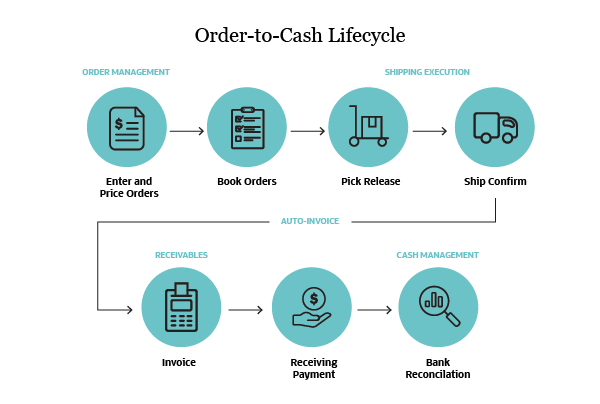

## Table of Contents

## What is an Order Management System (OMS)?

An Order Management System (OMS) is a software tool that helps businesses keep track of orders from customers. It manages the whole process, starting from when a customer places an order until the order is complete. This system makes sure that orders are handled correctly and on time, which makes customers happy.

The OMS also helps businesses work more smoothly by connecting with other systems like inventory management and customer relationship management. This connection helps the business see what products they have, where they are, and how to get them to customers quickly. By using an OMS, businesses can make their work easier and serve their customers better.

## Why are Order Management Systems important in finance and business?

Order Management Systems are very important in finance and business because they help keep everything organized. When a customer places an order, the OMS makes sure it is recorded correctly and follows the order from start to finish. This helps businesses know exactly what is happening with each order, so they can make sure customers get what they want on time. Without an OMS, it would be hard to keep track of all the orders, and mistakes could happen more often.

In finance, an OMS is crucial because it helps manage trades and investments. It keeps track of buy and sell orders, making sure they are executed at the right time and price. This is important for making smart financial decisions and avoiding losses. By using an OMS, financial businesses can work more efficiently and make better choices for their clients, which helps them grow and succeed.

## What are the basic components of an OMS?

The basic components of an Order Management System include an order entry module, which is where customers place their orders. This part of the system makes sure that all the details of the order are recorded correctly. It also has an order processing module, which takes care of the order after it's been placed. This part checks if the products are available, and if they are, it moves the order forward to be fulfilled.

Another important component is the inventory management module, which keeps track of what products are in stock and where they are located. This helps the OMS know if it can fulfill an order or if it needs to order more products. The system also has a customer relationship management (CRM) module, which keeps information about customers and their orders. This helps businesses provide better service and keep customers happy.

Lastly, the OMS includes a reporting and analytics module, which collects data about orders and how the business is doing. This part helps businesses see patterns and make better decisions. All these components work together to make sure orders are handled smoothly and efficiently, from the moment they are placed until they are delivered to the customer.

## How does an OMS integrate with other systems like CRM and ERP?

An Order Management System (OMS) works well with other systems like Customer Relationship Management (CRM) and Enterprise Resource Planning (ERP) to make business operations smoother. When an OMS connects with a CRM, it can use customer information to handle orders better. For example, the OMS can see a customer's past orders and preferences, which helps in giving them a better service. This connection makes sure that the business knows who its customers are and can meet their needs more effectively.

The OMS also integrates with an ERP system, which manages a company's resources and operations. By working together, the OMS can check the ERP for information about inventory and production. This helps the OMS know if it can fulfill an order right away or if it needs to wait for more products to be made or bought. This integration helps the business run more efficiently, as it can plan better and avoid delays in delivering orders to customers.

## What are the key features to look for in an OMS?

When choosing an Order Management System, it's important to look for features that make managing orders easier and more efficient. A good OMS should have a user-friendly interface that makes it simple to enter and track orders. It should also have strong inventory management tools that keep track of what products are in stock and where they are located. This helps the business know if it can fulfill an order right away or if it needs to order more products. Another key feature is real-time reporting and analytics, which provide valuable data about order trends and business performance, helping the business make better decisions.

Integration capabilities are also crucial in an OMS. The system should be able to connect smoothly with other important business systems like Customer Relationship Management (CRM) and Enterprise Resource Planning (ERP). This integration helps the OMS use customer data to provide better service and check the ERP for inventory and production information, making the whole process of handling orders more efficient. Additionally, a good OMS should offer automation features that can handle routine tasks, reducing the chance of errors and freeing up time for the business to focus on other important activities.

## How does an OMS improve operational efficiency?

An Order Management System helps businesses work better by making the process of handling orders smoother and faster. When a customer places an order, the OMS records it and keeps track of it until it's complete. This means the business knows exactly what's happening with each order, which helps them get products to customers on time. The OMS also connects with other systems like inventory management, so it can check if products are in stock and where they are. This helps avoid delays and makes sure orders are filled correctly and quickly.

The OMS also automates a lot of the work that used to be done by people, like entering orders and checking stock levels. This automation reduces mistakes and saves time, letting employees focus on other important tasks. Plus, the OMS gives businesses real-time data and reports about orders and how the business is doing. This information helps them make smart decisions and find ways to work even better. By using an OMS, a business can serve its customers better and run more smoothly overall.

## What are the common challenges faced when implementing an OMS?

One of the main challenges when putting in an Order Management System is making sure it works well with the other systems a business already uses. For example, the OMS needs to connect smoothly with inventory and customer systems. If it doesn't, it can cause delays and mistakes in handling orders. Another challenge is training employees to use the new system. It can take time for them to learn how to use it properly, and during this time, there might be more errors and slower work.

Another issue is the cost of setting up and maintaining an OMS. It can be expensive to buy the software and the hardware needed to run it. Plus, the business might need to hire experts to help with the setup and to fix any problems that come up. Finally, making sure the data is correct when moving it from old systems to the new OMS can be tricky. If the data is wrong, it can mess up orders and make customers unhappy. These challenges need careful planning and support to make sure the OMS helps the business run better.

## Can you explain the role of an OMS in compliance and risk management?

An Order Management System plays a key role in helping businesses follow rules and manage risks. When a business uses an OMS, it can keep track of all orders and make sure they meet the rules set by different authorities. For example, the OMS can check if the products being ordered follow safety and quality standards. This helps the business avoid fines and other problems that can come from not following the rules.

The OMS also helps with risk management by keeping a close eye on orders and how they are handled. If there's a problem, like a delay or a mistake in an order, the OMS can spot it quickly. This allows the business to fix the problem before it gets worse. By using the OMS to manage risks, the business can protect itself from losses and keep its customers happy.

## How do Order Management Systems support multi-asset trading?

An Order Management System helps businesses that trade different types of assets, like stocks, bonds, and commodities, by keeping track of all their orders in one place. When a trader wants to buy or sell different assets, the OMS makes sure each order is handled correctly. It checks if the trader has enough money or assets to make the trade and then sends the order to the right market or exchange. This makes it easier for the trader to manage multiple types of investments without getting confused or making mistakes.

The OMS also helps by giving traders real-time information about their orders and the markets. This means they can see how their trades are doing and make quick decisions if they need to change anything. For example, if the price of a stock changes suddenly, the trader can use the OMS to adjust their order right away. By supporting multi-asset trading, the OMS helps businesses work more efficiently and make smarter trading decisions.

## What advanced analytics and reporting capabilities should an OMS have?

An Order Management System should have advanced analytics and reporting features that help businesses understand their orders better. These features should be able to show real-time data about how many orders are coming in, how quickly they are being processed, and how well the business is doing overall. The OMS should also be able to create detailed reports that show trends over time, like which products are selling the most or which times of the year are busiest. This information helps the business make smart decisions about what to sell and when to sell it.

Another important part of an OMS's analytics is the ability to predict future orders. By looking at past data, the system can guess how many orders might come in the future and help the business plan for them. This can include predicting when they might need more stock or when they should hire more staff. The OMS should also have easy-to-use dashboards that show all this information in a clear way, so anyone in the business can understand it and use it to make their work better.

## How can an OMS be customized for specific business needs?

An Order Management System can be customized to fit the specific needs of a business. This means the business can change the OMS to work in a way that matches how they do things. For example, if a business has special steps for handling orders, they can set up the OMS to follow those steps exactly. They can also add or remove features to make sure the system does what they need it to do. This customization makes the OMS more useful because it works the way the business wants it to.

Customizing an OMS can also mean setting up special reports and dashboards that show the information the business cares about most. If a business wants to keep track of certain things, like how fast orders are processed or how much stock they have, they can set up the OMS to show these details clearly. This helps the business see what's important to them quickly and easily. By making these changes, the OMS becomes a powerful tool that helps the business work better and meet their specific goals.

## What are the future trends and developments expected in OMS technology?

In the future, Order Management Systems are expected to become even smarter and more connected. One big trend is the use of [artificial intelligence](/wiki/ai-artificial-intelligence) (AI) and [machine learning](/wiki/machine-learning). These technologies can help the OMS predict what customers will order next and manage inventory better. This means businesses can have the right products ready at the right time, making customers happier and saving money. Another trend is better integration with other systems, like those for managing customers and resources. This will make everything work together more smoothly, helping businesses run more efficiently.

Another important development is the move towards cloud-based OMS. This means the system will be stored on the internet instead of on a company's own computers. Cloud-based systems are easier to update and can be accessed from anywhere, which is great for businesses that work in different places. They also tend to be more secure and can grow as the business grows. As technology keeps improving, OMS will keep getting better at helping businesses manage orders and serve their customers.

## References & Further Reading

[1]: ["Order Management Systems: An overview for securities trading"](https://www.investopedia.com/terms/o/oms.asp) by Finextra

[2]: ["Algorithmic Trading and DMA: An introduction to direct access trading strategies"](https://www.semanticscholar.org/paper/Algorithmic-trading-%26-DMA-%3A-an-introduction-to-Johnson/aa5de1ab883d5e23b6651faa7c1807586d688e4b) by Barry Johnson

[3]: Soni, A. (2020). ["The Role of Order Management Systems in the Digital Age."](https://www.sciencedirect.com/science/article/pii/S1877050920307389) JournalDev.

[4]: ["Order Management System (OMS): Key Features & Benefits"](https://www.netsuite.com/portal/resource/articles/erp/what-is-oms.shtml) by Software Advice

[5]: ["The Use of Algorithmic Trading Systems in Securities Markets"](https://www.investopedia.com/articles/active-trading/101014/basics-algorithmic-trading-concepts-and-examples.asp) by Fox, R. (2013), Journal of Trading.