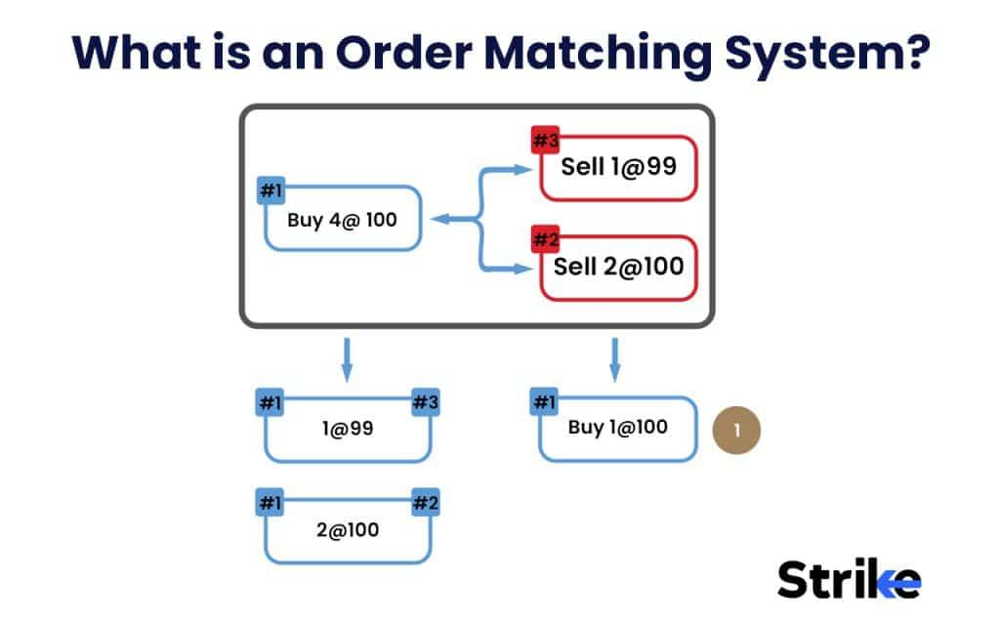

## Table of Contents

## What is an order matching system?

An order matching system is a computer program used by stock exchanges to buy and sell things like stocks and bonds. It works by matching people who want to sell something with people who want to buy the same thing. The system looks at the prices that buyers and sellers are willing to accept and tries to make a deal that makes both sides happy.

These systems are important because they help make trading fair and fast. They follow certain rules to decide which orders get filled first, usually based on the price and the time the order was placed. This helps keep the market organized and makes sure that everyone has a fair chance to trade.

## How does an order matching system work?

An order matching system is like a matchmaker for buying and selling stocks or other financial things. When someone wants to buy or sell something, they put in an order with their price. The system then looks at all the orders from buyers and sellers and tries to find matches where the buyer's highest price and the seller's lowest price meet. If the prices match, the system makes a trade happen.

The system follows some simple rules to decide which orders get matched first. Usually, it looks at the price first. If two orders have the same price, it then looks at the time the order was placed. Orders that came in earlier get matched before newer ones. This way, the system keeps things fair and makes sure that everyone gets a chance to trade.

## What are the key components of an order matching system?

The main parts of an order matching system are the [order book](/wiki/order-book-trading-strategies), the matching engine, and the trade execution system. The order book keeps track of all the buy and sell orders that people put in. It shows what everyone wants to buy or sell and at what price. The matching engine is like the brain of the system. It looks at all the orders in the order book and tries to find matches where the price that someone wants to buy at is the same or better than what someone else wants to sell at.

Once the matching engine finds a match, it sends the information to the trade execution system. This part of the system makes sure the trade happens correctly. It checks that everything is right, like the price and the number of shares, and then it completes the trade. All these parts work together to make sure that buying and selling happens quickly and fairly.

## What types of orders can be processed by an order matching system?

An order matching system can handle different types of orders. The most common type is a market order, where someone wants to buy or sell right away at the best available price. Another type is a limit order, where a person sets a specific price they are willing to buy or sell at. If the market reaches that price, the order will be filled.

There are also stop orders, which are used to limit losses or protect gains. A stop order becomes a market order once the stock reaches a certain price. For example, if you own a stock and want to sell it if the price drops to a certain level, you can use a stop order. Lastly, there are more complex orders like fill-or-kill orders, which must be filled completely right away or not at all, and all-or-nothing orders, which must be filled in their entirety or not at all. These different types of orders help people trade in ways that fit their needs.

## What are the benefits of using an order matching system in trading?

Using an order matching system in trading makes things faster and fairer. When you want to buy or sell something, the system quickly looks at all the orders from other people and finds the best match for you. This means you don't have to wait long to make a trade. It also makes sure that everyone gets a fair chance to trade because the system follows clear rules about which orders get filled first, usually based on price and time.

Another big benefit is that it helps keep the market organized. With so many people wanting to buy and sell at different prices, it can get confusing. The order matching system keeps track of all these orders in an order book and matches them in a way that makes sense. This helps keep the market running smoothly and makes it easier for everyone to trade.

## How does an order matching system handle different types of order priorities?

An order matching system handles different types of order priorities by following a set of rules that decide which orders get filled first. The most common rule is price priority, where orders with the best price get matched first. For example, if you want to buy a stock, your order will be filled before someone else's if your price is higher. If two orders have the same price, the system then looks at time priority. This means that the order that was placed first gets filled before a newer order at the same price. This way, the system makes sure that everyone gets a fair chance to trade.

Another type of priority is called display priority, which is used in some markets where orders can be hidden or displayed. Displayed orders might get priority over hidden ones because they help make the market more transparent. Some systems also use size priority, where larger orders might get filled before smaller ones at the same price. All these rules work together to make sure the trading process is fair and efficient, helping the market run smoothly.

## What are the common algorithms used in order matching systems?

Order matching systems use different algorithms to make sure trading is fair and fast. One common algorithm is the price-time priority algorithm. This one looks at the price of orders first. If two orders have the same price, it then looks at the time the order was placed. Orders that came in earlier get matched before newer ones. This helps keep things fair because everyone knows that the best price and earliest time will get filled first.

Another algorithm is the pro-rata algorithm. This one is used when there are a lot of orders at the same price. Instead of filling one order completely before moving to the next, it splits the available shares among all the orders at that price. This way, everyone gets a piece of the trade, which can be good for big orders. Both of these algorithms help make sure that the market works smoothly and everyone gets a fair chance to trade.

## How do order matching systems ensure fairness and transparency?

Order matching systems make sure trading is fair by following clear rules about which orders get filled first. The most important rule is price priority, where the best price gets matched first. If two orders have the same price, the system then looks at the time the order was placed. Orders that came in earlier get filled before newer ones. This way, everyone knows that if they offer the best price and place their order early, they will get a fair chance to trade. It's like a line where everyone waits their turn based on clear rules.

Transparency is also important in order matching systems. The system keeps an order book that everyone can see, showing all the buy and sell orders at different prices. This helps people know what is happening in the market and make better trading decisions. Some systems also use display priority, where orders that are shown to everyone get filled before hidden ones. This makes the market more open and helps everyone trust that the trading process is fair and honest.

## What challenges are faced in designing and implementing an order matching system?

Designing and implementing an order matching system can be tricky because it needs to handle a lot of orders very quickly. Imagine thousands of people wanting to buy and sell at the same time. The system has to match these orders in a fair way, following rules like price and time priority. If the system is too slow, people might miss out on good trades, and if it makes mistakes, it could cause big problems in the market. So, the system needs to be fast and accurate, which can be hard to achieve.

Another challenge is making sure the system is fair and transparent. Everyone needs to trust that the system is doing its job right. This means the system has to keep an order book that everyone can see and follow clear rules about which orders get filled first. But, with so many different types of orders and trading strategies, it can be tough to make sure everyone is treated fairly. Also, the system has to be safe from hackers and other bad actors who might try to mess with it. Keeping everything fair, transparent, and secure is a big job.

## How do order matching systems integrate with other financial systems?

Order matching systems work with other financial systems to make trading smooth and easy. They connect with systems that keep track of how much money people have in their accounts. This way, when someone wants to buy or sell something, the order matching system can check if they have enough money or shares to do the trade. It also talks to systems that handle the actual moving of money and shares after a trade is made. This makes sure that everything happens correctly and on time.

Another way order matching systems work with other systems is by sharing information. They send data to systems that watch the market and make sure everything is fair. They also give information to systems that help people see what is happening in the market, like price charts and news feeds. This helps traders make smart choices and keeps the market open and honest. By working together, all these systems make trading easier and more reliable for everyone.

## What are the latest advancements in order matching system technology?

The latest advancements in order matching system technology focus on making trading faster and more efficient. One big change is the use of high-speed algorithms and better computer hardware. These improvements help the system process a lot of orders very quickly, which is important in busy markets where every second counts. Another advancement is the use of [machine learning](/wiki/machine-learning). This helps the system learn from past trades and make better matches in the future, making the whole process smoother and more accurate.

Another important development is the integration of blockchain technology. Blockchain can make trading more secure and transparent by keeping a clear record of all trades that everyone can see. This helps build trust in the system. Also, cloud computing is becoming more common in order matching systems. It allows the system to handle more orders and grow easily as more people start trading. These new technologies are making order matching systems better at handling the fast and complex world of trading.

## How can one evaluate the performance of an order matching system?

To evaluate the performance of an order matching system, you need to look at how fast and accurate it is. Speed is really important because the system has to handle a lot of orders quickly. If it's too slow, people might miss good trades. You can measure this by seeing how long it takes for an order to be matched and filled. Accuracy is also key. The system needs to match orders correctly and follow the rules about which orders get filled first. You can check this by looking at how often the system makes mistakes and how well it sticks to the rules like price and time priority.

Another way to evaluate the system is by checking its reliability and how well it works with other systems. The system should be able to handle a lot of orders without crashing or slowing down. This means it needs to be strong and dependable. You can test this by putting a lot of orders into the system and seeing how it handles them. Also, the system should work well with other financial systems, like those that handle money and shares. If it connects smoothly with these systems, it makes trading easier and more reliable for everyone.

## References & Further Reading

[1]: Aldridge, I. (2013). ["High-Frequency Trading: A Practical Guide to Algorithmic Strategies and Trading Systems"](https://www.amazon.com/High-Frequency-Trading-Practical-Algorithmic-Strategies/dp/1118343506). Wiley.

[2]: Harris, L. (2003). ["Trading and Exchanges: Market Microstructure for Practitioners"](https://academic.oup.com/book/52292). Oxford University Press.

[3]: Lopez de Prado, M. (2018). ["Advances in Financial Machine Learning"](https://www.amazon.com/Advances-Financial-Machine-Learning-Marcos/dp/1119482089). Wiley.

[4]: Hasbrouck, J. (2007). ["Empirical Market Microstructure: The Institutions, Economics, and Econometrics of Securities Trading"](https://academic.oup.com/book/52241). Oxford University Press.

[5]: Treleaven, P., Galas, M., & Lalchand, V. (2013). ["Algorithmic Trading Review"](https://www.researchgate.net/publication/262239006_Algorithmic_Trading_Review). Communications of the ACM, 56(11), 76-85.

[6]: Hendershott, T., & Riordan, R. (2013). ["Algorithmic Trading and the Market for Liquidity"](https://www.jstor.org/stable/43303831). Review of Financial Studies, 26(3), 2221-2254.

[7]: Chan, E. (2009). ["Quantitative Trading: How to Build Your Own Algorithmic Trading Business"](https://github.com/ftvision/quant_trading_echan_book). Wiley.