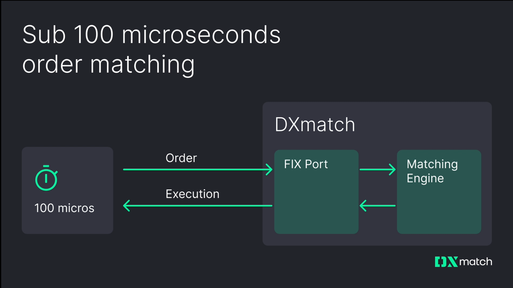

## Table of Contents

## What is order matching?

Order matching is a process used in stock markets and other trading platforms where buyers and sellers are brought together to complete a trade. When someone wants to buy a stock, they place a buy order, and when someone wants to sell a stock, they place a sell order. The system then looks at all the orders and tries to find a match where the price the buyer is willing to pay is the same as the price the seller is willing to accept.

This matching process happens very quickly, often in a matter of seconds. The goal is to make sure that trades happen smoothly and fairly. If there are many buy and sell orders at different prices, the system will usually match the highest buy order with the lowest sell order first. This helps to keep the market efficient and ensures that people can buy and sell stocks easily.

## Why is order matching important in trading?

Order matching is important in trading because it helps make sure that buying and selling happens smoothly. When someone wants to buy a stock, the system looks for someone who wants to sell that stock at the same price. This way, both the buyer and the seller are happy with the trade. If there was no order matching, it would be hard for people to find each other and agree on a price, which would make trading slow and difficult.

Also, order matching helps keep the market fair. It makes sure that everyone gets a chance to buy or sell at the best available price. The system matches the highest buy order with the lowest sell order first, which helps keep prices stable and prevents one person from getting a much better deal than others. This fairness is important for keeping trust in the market, so people feel confident about trading.

## How does the basic order matching process work?

When someone wants to buy or sell a stock, they place an order on a trading platform. The order includes how many stocks they want to buy or sell and the price they are willing to pay or accept. The trading system looks at all the orders that have been placed. It tries to find a buy order and a sell order that match, meaning the price the buyer is willing to pay is the same as the price the seller is willing to accept.

If the system finds a match, it will complete the trade right away. For example, if someone wants to buy 100 stocks at $10 each, and someone else wants to sell 100 stocks at $10 each, the system will match these orders and the trade will happen. If there are many orders at different prices, the system will usually match the highest buy order with the lowest sell order first. This helps make sure that trades happen quickly and fairly.

## What are the different types of orders that can be matched?

There are different types of orders that can be matched in a trading system. The most common type is a market order, where a buyer or seller wants to trade right away at the best available price. For example, if someone places a market order to buy a stock, the system will match it with the lowest sell order available. Another type is a limit order, where a buyer or seller sets a specific price they are willing to trade at. If someone places a limit order to buy a stock at $10, the system will only match it with a sell order that is willing to sell at $10 or less.

Another type of order is a stop order, which is used to buy or sell a stock when it reaches a certain price. For example, if someone places a stop order to sell a stock at $20, the system will turn it into a market order and try to match it when the stock price reaches $20. There are also stop-limit orders, which combine the features of stop orders and limit orders. If someone places a stop-limit order to sell at $20 with a limit of $19, the system will try to match it with a buy order at $19 or higher when the stock price reaches $20. These different types of orders help traders control when and at what price their trades happen.

## What is a limit order and how does it affect order matching?

A limit order is a type of order where a buyer or seller sets a specific price they are willing to trade at. For example, if someone wants to buy a stock, they can place a limit order to buy it at $10. This means the system will only match their order with a sell order that is willing to sell at $10 or less. If the stock is currently trading at $12, the limit order will not be matched until the price drops to $10 or lower.

Using limit orders can affect order matching because they add more conditions to the trade. When someone places a limit order, it might take longer for the system to find a matching order because it has to wait for the price to reach the specified limit. This can be good for buyers and sellers who want to control the price they trade at, but it can also mean that their order might not be matched as quickly as a market order, which trades at the best available price right away.

## What is a market order and how does it interact with the order matching system?

A market order is a type of order where someone wants to buy or sell a stock right away at the best available price. When someone places a market order to buy a stock, the trading system will look for the lowest sell order available and match it. If someone places a market order to sell a stock, the system will look for the highest buy order available and match it. This means that market orders are usually matched very quickly because they don't have a specific price limit.

Market orders are important because they help keep the market moving smoothly. Since they trade at the best available price, they can help fill orders that have been waiting for a match. For example, if someone placed a limit order to sell a stock at $10 and the stock is currently trading at $12, a market order to buy at the current price of $12 would not match with that limit order. But if the stock price drops to $10, a market order to buy would match with the limit order to sell at $10, completing the trade.

## How do trading platforms prioritize orders during the matching process?

Trading platforms prioritize orders during the matching process by following certain rules. The main rule is to match the highest buy order with the lowest sell order first. This means if someone wants to buy a stock at a high price and someone else wants to sell it at a low price, their orders will be matched before others. This helps keep the market fair and efficient because it makes sure that trades happen at the best possible prices.

Sometimes, there are other factors that can affect how orders are prioritized. For example, some platforms might give priority to orders that were placed first, so if two people want to buy a stock at the same price, the one who placed their order earlier will be matched first. Also, some platforms might have special rules for certain types of orders, like limit orders or market orders, to make sure that everyone gets a fair chance to trade.

## What role does time priority play in order matching?

Time priority is a rule that some trading platforms use to decide which orders get matched first. If two people want to buy or sell a stock at the same price, the person who placed their order first will get matched before the person who placed their order later. This helps make sure that everyone has a fair chance to trade, because if you place your order early, you won't have to wait as long for it to be matched.

This rule is important because it helps keep the market organized. If there were no time priority, it might be hard to know which order should be matched first when there are many orders at the same price. By giving priority to the orders that were placed first, the system can match orders in a clear and fair way, which helps keep trading smooth and efficient.

## Can you explain the concept of price-time priority in order matching?

Price-time priority is a rule that trading platforms use to decide which orders get matched first. It means that the system looks at the price of the orders first. If someone wants to buy a stock at a higher price than someone else, their order will be matched before the other person's order. If two people want to buy or sell at the same price, then the system looks at the time the orders were placed. The person who placed their order first will get matched before the person who placed their order later.

This rule helps keep the market fair and organized. It makes sure that people who are willing to pay more for a stock get their orders filled first, which helps keep the market moving. It also makes sure that if you place your order early, you won't have to wait as long for it to be matched. This way, everyone has a fair chance to trade, and the system can match orders in a clear and efficient way.

## How do order matching algorithms handle large volumes of orders?

Order matching algorithms are designed to handle large volumes of orders quickly and efficiently. When there are many orders coming in at the same time, the system uses powerful computers to look at all the orders and find matches as fast as possible. The main rule the system follows is price-time priority, which means it matches the highest buy orders with the lowest sell orders first. If there are many orders at the same price, the system will match the ones that were placed first before the ones that came in later. This helps keep the market fair and makes sure that trades happen smoothly, even when there are a lot of orders.

To handle large volumes, the algorithms are also designed to be very fast. They can process thousands of orders in just a few seconds. This speed is important because it helps prevent delays and keeps the market moving. The system keeps track of all the orders and updates them in real-time, so if a new order comes in that matches an existing order, the trade can happen right away. This way, even with a lot of orders, the system can still match them quickly and make sure that everyone gets a fair chance to trade.

## What are some advanced strategies traders use to optimize order matching?

Traders use different strategies to get the best results from order matching. One common strategy is to use limit orders instead of market orders. With a limit order, a trader can set a specific price they want to buy or sell at. This can help them get a better price, but it might take longer for their order to be matched. Traders might also use stop orders, which turn into market orders when the stock reaches a certain price. This can help them buy or sell at the right time, but it means they might not get the exact price they want.

Another strategy is to use algorithms for trading, which are computer programs that can place orders automatically. These algorithms can look at a lot of information very quickly and make decisions based on that information. For example, an algorithm might place a lot of small orders instead of one big order to get a better average price. This can be useful when there are a lot of orders in the market, because it helps the trader's orders get matched more easily. By using these strategies, traders can try to get the best possible results from the order matching process.

## How do regulatory requirements impact the design and operation of order matching systems?

Regulatory requirements are rules that trading platforms have to follow. These rules can affect how order matching systems are designed and work. For example, regulators want to make sure that the market is fair and that everyone has a chance to trade at the best prices. So, order matching systems have to follow rules like price-time priority, which means matching the highest buy orders with the lowest sell orders first. This helps keep the market fair and makes sure that trades happen in a way that everyone can trust.

Regulators also want to make sure that trading platforms can handle a lot of orders without slowing down. This means that order matching systems have to be very fast and able to process many orders at the same time. They also have to keep good records of all the trades that happen, so regulators can check that everything is being done correctly. By following these rules, trading platforms can help make sure that the market works well and that people feel confident about trading.

## References & Further Reading

[1]: Hasbrouck, J. (2007). ["Empirical Market Microstructure: The Institutions, Economics, and Econometrics of Securities Trading"](https://academic.oup.com/book/52241). Oxford University Press.

[2]: Gomber, P., Arndt, B., Lutat, M., & Uhle, T. (2011). ["High-frequency trading"](https://papers.ssrn.com/sol3/papers.cfm?abstract_id=1858626). 

[3]: Harris, L. (2003). ["Trading and Exchanges: Market Microstructure for Practitioners"](https://www.amazon.com/Trading-Exchanges-Market-Microstructure-Practitioners/dp/0195144708). Oxford University Press.

[4]: Aldridge, I. (2013). ["High-Frequency Trading: A Practical Guide to Algorithmic Strategies and Trading Systems"](https://www.amazon.com/High-Frequency-Trading-Practical-Algorithmic-Strategies/dp/1118343506). Wiley.

[5]: O'Hara, M. (1995). ["Market Microstructure Theory"](https://openlibrary.org/books/OL1103097M/Market_microstructure_theory). Blackwell Publishers.

[6]: Biais, B., Foucault, T., & Moinas, S. (2015). ["Equilibrium High-Frequency Trading"](https://papers.ssrn.com/sol3/papers.cfm?abstract_id=2024360). The Review of Financial Studies, 28(11), 2893–2933.

[7]: Cartea, A., Jaimungal, S., & Penalva, J. (2015). ["Algorithmic and High-Frequency Trading"](https://assets.cambridge.org/97811070/91146/frontmatter/9781107091146_frontmatter.pdf). Cambridge University Press.