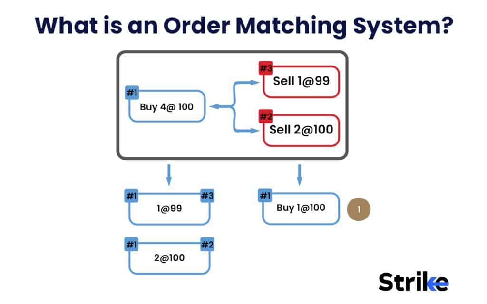

Order matching in algorithmic trading is a crucial process that ensures the efficient execution of trades within financial markets. As a cornerstone of electronic trading platforms, it pairs buy and sell orders, facilitating seamless transactions. This article examines the concept of order matching, shedding light on its significance in algorithmic trading and the intricate mechanisms that drive it. 

Trading platforms employ sophisticated algorithms to identify optimal matches between orders in real-time, significantly enhancing trade execution and contributing to overall market efficiency. Various types of orders, such as limit, market, and stop orders, are utilized within this framework, each serving distinct strategic purposes. By leveraging these algorithms and order types, traders can refine their strategies to achieve more favorable outcomes.

The discussion extends to the key players and platforms involved in the order matching process, highlighting their roles and contributions to maintaining a fair and competitive trading environment. Understanding order matching algorithms is not only essential for optimizing trade execution but also for ensuring the stability and efficiency of the financial markets they operate within.

This comprehensive exploration aims to equip traders, from individual retail participants to large institutional investors, with a robust understanding of the order matching landscape, enabling them to navigate the complexities of modern financial markets effectively.

## Table of Contents

## Understanding Order Matching in Algorithmic Trading

Order matching in algorithmic trading represents a fundamental process where buy and sell orders are paired on a trading platform to execute trades effectively. This system ensures that transactions occur at fair and competitive prices, enhancing market efficiency. Sophisticated algorithms are pivotal in ensuring the optimal real-time matching of orders in algorithmic trading. These algorithms consider various factors such as price, volume, and timing to achieve the best execution.

A key concept in order matching is the idea of matched orders. These are buy and sell orders that align perfectly in terms of price and volume, allowing for immediate trade execution. This alignment contributes significantly to market efficiency by ensuring that trades are executed at the most favorable prices available at any given time.

Liquidity is another critical [factor](/wiki/factor-investing) influencing order matching. It refers to the ease with which an asset can be bought or sold in the market without affecting its price. High [liquidity](/wiki/liquidity-risk-premium) implies a greater number of buy and sell orders at different price levels, which facilitates efficient order matching. Conversely, low liquidity can lead to delays and potential slippage in trade execution.

Market efficiency is the degree to which asset prices reflect all available information. Efficient markets are characterized by prices that adjust quickly to new information, thus providing a conducive environment for effective order matching. This efficiency is vital for maintaining the integrity of financial markets and ensuring that participants can transact at fair prices.

By leveraging advanced technology and sophisticated algorithms, trading platforms can match orders in a manner that maximizes efficiency and minimizes transaction costs. These algorithms must integrate various market variables, including order flow and market depth, to ascertain the best order matches in real-time and enhance trading performance.

## Mechanisms of Order Matching

Central Limit Order Books (CLOBs) are foundational components of electronic trading platforms that systematically organize buy and sell orders based on price levels. In a CLOB, orders are displayed in a structured format, with the highest bid prices and lowest ask prices prioritized, facilitating an efficient mechanism for trade execution. This prioritization ensures that trades are executed fairly and transparently, with the best possible prices achieved for both buyers and sellers. The use of CLOBs is particularly prevalent in major exchanges like NASDAQ and NYSE, where the aggregation of buy and sell interests contributes significantly to market liquidity and efficiency.

Electronic Communication Networks (ECNs) are automated systems designed to match orders between buyers and sellers without intermediaries. These networks prioritize speed and anonymity, allowing for rapid and efficient transaction processing. ECNs play a critical role in the contemporary trading environment, accommodating a wide range of order types and enabling traders to interact within a global marketplace seamlessly. The anonymity provided by ECNs helps in minimizing information leakage, thus protecting traders’ strategies.

Dark pools represent private financial forums or exchanges where trading of securities occurs away from the public eye. These venues allow institutional investors to execute large block trades with minimal impact on the market. Dark pools provide liquidity and pricing advantages by reducing the risk of price fluctuation that might result from large trades being visible in the open market. By limiting market impact, dark pools help in achieving more favorable prices for sizeable transactions.

Matching algorithms are pivotal to the operation of order matching systems, applying specific criteria to determine trade allocations. One common method is the price-time priority, where orders are prioritized first by price and then by the time they were entered. Pro-rata matching allocates trades based on the proportion of shares available relative to the total order size, ensuring equitable distribution across multiple participants. Random matching can also be applied for certain trades, reducing predictability and potential manipulative strategies. These algorithms collectively enhance the precision and fairness of trade executions across platforms.

Order matching systems are integral to exchanges such as NASDAQ and NYSE, powered by advanced technology to ensure efficient trade processing. These systems manage vast volumes of orders, executing them according to the best available criteria while maintaining high-speed execution and processing capabilities. The technology underpinning these systems evolves continuously to accommodate new trading instruments, regulatory requirements, and innovations in trading strategies, ensuring that the exchanges remain competitive and efficient in the global market landscape.

## Types of Orders and Matching Algorithms

Limit orders constitute a fundamental order type, enabling traders to specify the maximum price they are willing to pay when buying, or the minimum price they are willing to accept when selling. This order type is predominantly employed when market participants aim to control price exposure and are not in urgent need of immediate execution. When a limit order is placed, it remains in the [order book](/wiki/order-book-trading-strategies) of the trading platform until it is either matched with a suitable counter-order at the specified price or canceled by the trader. Consequently, limit orders contribute significantly to market liquidity and depth.

Conversely, market orders prioritize the speed and immediacy of execution over price constraints. Traders who utilize market orders accept that trades will be executed at the best available price in the market at that moment. This order type is generally favored by those wishing to enter or [exit](/wiki/exit-strategy) a position quickly, minimizing the risk of unfilled orders in fast-moving markets. Given their nature, market orders are typically executed more swiftly than limit orders but may be subject to greater price uncertainty, especially in less liquid markets.

Stop orders function as contingent instructions, activating either a market or limit order when a pre-determined stop price is reached. For instance, a stop-loss order is a common application, enabling traders to mitigate potential losses by selling a security when its price falls to the stop level. Upon reaching the stop price, the stop order transforms into a market or limit order, aligning with the trader's strategy for risk management or profit protection.

Order matching algorithms, such as Volume Weighted Average Price (VWAP) and Time Weighted Average Price (TWAP), are pivotal for minimizing market impact and optimizing trade execution. VWAP calculates the average price of a security based on [volume](/wiki/volume-trading-strategy) traded over a specific period, serving as a benchmark for assessing trade quality. TWAP, on the other hand, aims to distribute a large order evenly over a specified time, reducing the likelihood of drastic price movements. Both algorithms are integral to strategic trading, balancing order execution efficiency against the need to minimize market influence.

Exchanges employ unique and sophisticated matching algorithms to support diverse trading strategies and meet varied participant needs. These algorithms selectively prioritize factors such as price-time priority, where orders are matched based on price, then by the time they were received, and pro-rata matching, which allocates available shares proportionally among orders at the best price. As trading dynamics evolve, exchanges continuously refine these algorithms to enhance performance, accommodate high-frequency trading operations, and ensure fairness and transparency in trade executions.

## Strategies Involving Order Matching

Market making strategies serve a pivotal role in financial markets by providing liquidity, which facilitates smoother and more efficient trading operations. These strategies involve continuously placing buy and sell orders around the current market price, thereby enabling market participants to execute trades swiftly. Market makers profit from the bid-ask spread, which is the difference between the buying and selling prices. This continuous presence in the market helps stabilize prices and reduces [volatility](/wiki/volatility-trading-strategies).

Arbitrage strategies capitalize on price discrepancies across different exchanges or related instruments, allowing traders to secure risk-free profits. This process involves buying an asset in one market at a lower price and simultaneously selling it in another market at a higher price. The efficiency of [arbitrage](/wiki/arbitrage) depends on the speed of execution and the ability to leverage minimal price differences effectively.

Statistical arbitrage employs advanced mathematical models and algorithms to discern trading opportunities based on statistical correlations or patterns between different financial instruments. Models often use historical data to predict future price movements, allowing traders to establish positions that exploit these patterns. Python's library, `pandas`, is frequently used in such strategies for data manipulation and analysis, while the `numpy` library assists in numerical computations.

High-frequency trading ([HFT](/wiki/high-frequency-trading-strategies)) necessitates ultra-fast execution times, often measured in microseconds, leveraging advanced technology and infrastructure. HFT strategies aim to execute a large number of orders at lightning speed, capturing minute price fluctuations that occur within fractions of a second. The success of HFT relies heavily on the efficiency of order matching algorithms that prioritize optimal and rapid trade execution.

Smart order routing systems are designed to enhance the quality of trade execution by intelligently directing orders to the best available trading venues. These systems evaluate multiple factors, including price, liquidity, and latency, to determine the most advantageous execution venue. Implementing low-latency networks and sophisticated algorithms helps in achieving efficient order execution, thereby optimizing trading outcomes.

These strategies highlight the dynamic environment of [algorithmic trading](/wiki/algorithmic-trading), where order matching plays a crucial role in executing various trading strategies effectively. Each strategy depends on the precision and speed of order matching mechanisms to capitalize on market opportunities and optimize trade performance.

## Risks and Considerations in Order Matching

Latency, a critical factor in algorithmic trading, refers to the delay in processing buy and sell orders. In high-frequency trading (HFT), where execution speed is paramount, even microseconds can translate into significant financial impacts. Delayed order execution can result in missed trading opportunities, leading to suboptimal trade prices and reduced profitability. Traders implement strategies and employ advanced technological solutions to minimize latency and maximize efficiency in order execution.

Price manipulation strategies, such as spoofing, present another significant risk within order matching. Spoofing involves placing large orders with the intent to cancel them before execution. This deceptive practice creates false impressions of supply and demand, influencing market prices and eroding the integrity of the order matching process. Regulatory bodies continuously develop and enforce measures to mitigate such activities and ensure market fairness.

The depth of the order book, which reflects the number and size of buy and sell orders at various price levels, is crucial for efficient order matching. Insufficient order book depth can lead to price volatility and inefficient trade execution, as large orders might significantly impact market prices. Market participants must strive for a healthy balance of liquidity to maintain market stability and ensure the smooth functioning of the order matching process.

Regulatory compliance plays a vital role in maintaining the transparency and fairness of order matching systems. Regulatory bodies impose rules and guidelines to safeguard market participants and uphold the integrity of financial markets. Compliance with these regulations ensures that trading practices are equitable and transparent, protecting investors and preserving market confidence.

Traders must stay informed about emerging technologies and evolving regulations that affect order matching systems. Advances in technology, such as [machine learning](/wiki/machine-learning) and quantum computing, have the potential to revolutionize trading strategies and execution methodologies. Simultaneously, regulatory frameworks continue to adapt, addressing new challenges and ensuring that technological advancements align with market integrity objectives. Awareness and adaptability are crucial for traders navigating the dynamic landscape of order matching systems.

## Conclusion

Order matching plays a pivotal role in ensuring the smooth operation of modern financial markets, especially in the context of algorithmic trading. The efficiency and effectiveness of market transactions are significantly enhanced when traders comprehensively understand the mechanisms and strategies involved in order matching. This knowledge enables market participants to optimize their execution outcomes, ensuring that trades occur at competitive prices and with minimal friction.

Current innovations within trading platforms and exchanges are continuously advancing the processes that facilitate seamless order matching. These innovations are crucial as they adapt to the evolving demands of financial markets, incorporating cutting-edge technologies to maintain efficiency. Looking ahead, the future landscape of order matching is poised to be transformed by significant advancements in machine learning and quantum computing. These technologies promise to bolster the accuracy and speed of order matching algorithms, paving the way for more sophisticated and responsive trading environments.

Moreover, regulatory frameworks are expected to evolve, reflecting the need for increased transparency and fairness in the order matching process. This evolution is critical for safeguarding market integrity and protecting the interests of both retail traders and institutional investors.

As the financial markets continue to grow and adapt, a robust understanding of order matching remains essential for all market participants. Whether one is a retail trader or an institutional investor, proficiency in the principles and innovations of order matching will be indispensable in navigating and succeeding in the dynamic world of algorithmic trading.

## References & Further Reading

[1]: Hasbrouck, J. (2007). ["Empirical Market Microstructure: The Institutions, Economics, and Econometrics of Securities Trading"](https://academic.oup.com/book/52241). Oxford University Press.

[2]: Gomber, P., Arndt, B., Lutat, M., & Uhle, T. (2011). ["High-frequency trading"](https://papers.ssrn.com/sol3/papers.cfm?abstract_id=1858626). 

[3]: Harris, L. (2003). ["Trading and Exchanges: Market Microstructure for Practitioners"](https://www.amazon.com/Trading-Exchanges-Market-Microstructure-Practitioners/dp/0195144708). Oxford University Press.

[4]: Aldridge, I. (2013). ["High-Frequency Trading: A Practical Guide to Algorithmic Strategies and Trading Systems"](https://www.amazon.com/High-Frequency-Trading-Practical-Algorithmic-Strategies/dp/1118343506). Wiley.

[5]: O'Hara, M. (1995). ["Market Microstructure Theory"](https://openlibrary.org/books/OL1103097M/Market_microstructure_theory). Blackwell Publishers.

[6]: Biais, B., Foucault, T., & Moinas, S. (2015). ["Equilibrium High-Frequency Trading"](https://papers.ssrn.com/sol3/papers.cfm?abstract_id=2024360). The Review of Financial Studies, 28(11), 2893–2933.

[7]: Cartea, A., Jaimungal, S., & Penalva, J. (2015). ["Algorithmic and High-Frequency Trading"](https://assets.cambridge.org/97811070/91146/frontmatter/9781107091146_frontmatter.pdf). Cambridge University Press.