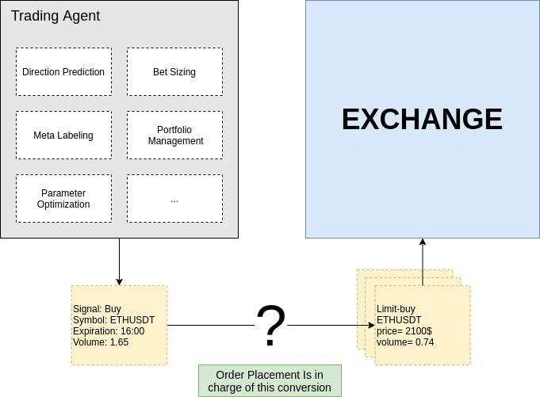

## Table of Contents

## What is order placement optimization?

Order placement optimization is about finding the best way to place orders for products or services to save money and time. It involves looking at things like how much you need, how quickly you need it, and how much it costs to order and store the items. By doing this, businesses can make sure they have enough stock without spending too much or running out of products.

This process often uses special computer programs that look at past orders and predict future needs. These programs help decide the best time to order, how much to order, and from where to order. By using these tools, companies can reduce waste, lower costs, and make sure they always have what they need when they need it.

## Why is order placement optimization important for businesses?

Order placement optimization is really important for businesses because it helps them save money. By figuring out the best times and amounts to order, businesses can avoid spending too much on things they don't need right away. This means they don't have to pay for storage of extra stuff, and they can also get better deals by buying at the right time.

It also helps businesses make sure they always have what they need. If a business runs out of a product, they might lose customers who go somewhere else to find it. By using order placement optimization, a business can keep the right amount of stock, so they never run out and can keep their customers happy. This way, they can keep making money and growing.

## What are the basic principles of order placement optimization?

The basic idea of order placement optimization is to make sure a business orders the right amount of products at the right time. This helps save money by not ordering too much, which can lead to extra costs for storing things you don't need yet. It also means not ordering too little, so you don't run out of products and lose customers. The key is to find a balance where you have enough stock to meet demand without spending too much.

Another important principle is understanding the timing of orders. This means knowing how long it takes to get the products after you order them, and planning your orders so they arrive just when you need them. This can help you avoid rush orders, which are usually more expensive. By using data and computer programs, businesses can predict when they will need more stock and order it in advance, making sure they always have what they need without spending extra money.

Lastly, it's important to consider the cost of ordering. This includes not just the price of the products, but also any fees for placing orders, shipping costs, and discounts for buying in bulk. By looking at all these costs, a business can decide the best way to order, whether it's ordering a lot at once to get a discount, or ordering smaller amounts more often to save on storage costs. This careful planning helps businesses keep their costs down and their customers happy.

## How does order placement optimization affect supply chain management?

Order placement optimization plays a big role in supply chain management by helping businesses manage their inventory better. When a business knows exactly when and how much to order, it can keep the right amount of products on hand. This means they don't have too much stuff sitting around, which can be expensive to store. It also means they won't run out of products, which can make customers unhappy and lead to lost sales. By optimizing order placement, businesses can make sure their supply chain runs smoothly, with products moving from suppliers to customers without any big problems.

Another way order placement optimization affects supply chain management is by helping businesses save money. When a business orders at the best times and in the best amounts, they can get better deals from suppliers and avoid rush orders, which are usually more expensive. This can lower the overall costs of running the supply chain. Plus, by planning orders carefully, businesses can make their supply chain more predictable and easier to manage. This means fewer surprises and less need for emergency fixes, which can save time and money in the long run.

## What are the common challenges faced in optimizing order placement?

One big challenge in optimizing order placement is getting the right data. Businesses need to know things like how much they sell, how long it takes to get new stock, and how much it costs to order and store things. If the data is wrong or not up to date, the business might order too much or too little, which can lead to problems. Also, sometimes the data can be hard to understand or use, especially if it comes from different places or systems.

Another challenge is dealing with changes in demand. What customers want can change quickly because of things like new trends, seasons, or even the weather. If a business can't predict these changes well, they might end up with too much stock that they can't sell, or not enough stock when customers want it. This makes it hard to plan orders in advance and can lead to more costs and unhappy customers.

Lastly, working with suppliers can be tricky. Sometimes suppliers can't deliver on time, or they might change their prices or terms. This can mess up the best-laid plans for order placement. Businesses need to have good relationships with their suppliers and be ready to change their plans if something unexpected happens. This means they need to be flexible and always ready to adjust their orders to keep everything running smoothly.

## What technologies are typically used to enhance order placement optimization?

To make order placement better, businesses often use special computer programs called inventory management systems. These systems help keep track of how much stock is in the warehouse and how much is being sold. They use this information to figure out the best time and amount to order new stock. By doing this, businesses can make sure they always have enough products without spending too much money on storage or rush orders.

Another technology that helps is data analytics. This involves using computers to look at past sales and other information to predict what customers will want in the future. With these predictions, businesses can plan their orders better and avoid running out of stock or having too much. Data analytics can also help find the best prices and suppliers, which can save money and make the supply chain work better.

Some businesses also use automation tools, like robots or software that can place orders automatically. These tools follow rules set by the business to order the right amount of products at the right time. This can save a lot of time and reduce mistakes that people might make. By using these technologies together, businesses can make their order placement much more efficient and save both time and money.

## How can data analytics be applied to improve order placement strategies?

Data analytics can help businesses predict what customers will want in the future by looking at past sales and other information. This means businesses can plan their orders better and make sure they have enough stock without ordering too much. By using data analytics, a business can see patterns in what customers buy and when they buy it. This helps them know the right time to order new stock so it arrives just when they need it. This way, they can avoid running out of products and keep their customers happy.

Another way data analytics helps is by finding the best prices and suppliers. By looking at lots of data, businesses can see which suppliers offer the best deals and how much it costs to order from them. This can help businesses save money by choosing the right suppliers and getting better prices. Data analytics can also help figure out how much it costs to store extra stock, so businesses can make sure they are not spending too much on storage. By using data analytics to make smart decisions, businesses can keep their costs down and their supply chain running smoothly.

## What are the key performance indicators (KPIs) to measure the success of order placement optimization?

Key performance indicators (KPIs) for measuring the success of order placement optimization include inventory turnover rate, which shows how often a business sells and replaces its stock. A higher turnover rate means the business is doing a good job of ordering just the right amount of stock, so it doesn't sit around too long. Another important KPI is the fill rate, which measures how often a business can meet customer demand without running out of stock. A high fill rate means the business is ordering enough stock to keep customers happy.

Another KPI to look at is the cost of goods sold (COGS), which includes the cost of ordering and storing products. By optimizing order placement, businesses can lower these costs and save money. The order accuracy rate is also key, as it shows how often orders are placed correctly without mistakes. A high order accuracy rate means the business is using good data and systems to place orders. These KPIs help businesses see if their order placement strategies are working well and where they can make improvements.

## Can you explain the role of machine learning in advanced order placement optimization?

Machine learning can really help businesses get better at placing orders. It's like a smart computer program that learns from past data to make better decisions. For example, it can look at what customers have bought before and guess what they might want in the future. This helps businesses order the right amount of products at the right time, so they don't run out of stock or have too much sitting around. Machine learning can also figure out the best times to order to get the best deals from suppliers and save money.

Another way [machine learning](/wiki/machine-learning) helps is by making the whole process of placing orders easier and faster. It can automatically place orders based on what it has learned, which means less work for people and fewer mistakes. Machine learning can also keep an eye on things like how long it takes for orders to arrive and if there are any changes in demand. By doing this, it can quickly adjust orders to make sure everything runs smoothly. This makes the supply chain more efficient and helps businesses save time and money.

## How do different industries implement order placement optimization differently?

Different industries use order placement optimization in ways that fit their specific needs. In retail, for example, stores need to make sure they have enough products on the shelves without overstocking. They use data from sales to predict what customers will buy and order just enough to meet demand. This helps them save money on storage and keep customers happy by always having what they want. In contrast, the manufacturing industry focuses on having the right parts and materials ready for production. They use order placement optimization to plan orders so they have what they need when they need it, avoiding delays in making their products.

In the food and beverage industry, order placement optimization is crucial because products can spoil quickly. Restaurants and grocery stores use it to order fresh ingredients and products, making sure they don't waste food or run out of popular items. They need to be very accurate with their orders to balance freshness and cost. On the other hand, in the healthcare industry, hospitals and pharmacies use order placement optimization to manage supplies like medicines and equipment. They need to make sure they always have critical items in stock, but also avoid overstocking expensive products. Each industry adapts the principles of order placement optimization to meet its unique challenges and goals.

## What are some case studies of successful order placement optimization implementations?

A big retail company, Walmart, used order placement optimization to make their supply chain better. They used a computer program to look at what customers were buying and when. This helped them order the right amount of products at the right time. By doing this, Walmart saved a lot of money on storage and made sure they always had what customers wanted. They also worked closely with their suppliers to get the best deals, which helped them keep prices low for customers.

In the manufacturing world, Toyota is known for using order placement optimization in their "Just-In-Time" system. This means they order parts and materials just when they need them for production, not before. By doing this, Toyota avoids having too much stock sitting around and saves money on storage. They also make their supply chain more efficient because they don't have to wait for parts to start making cars. This system has helped Toyota stay competitive and produce cars faster and cheaper.

In the healthcare industry, a hospital in the United States used order placement optimization to manage their medical supplies better. They used a special computer program to keep track of what they were using and what they needed to order. This helped them make sure they always had critical items like medicines and equipment without overstocking. By doing this, the hospital saved money and made sure they could take care of patients without running out of important supplies.

## What future trends are expected in the field of order placement optimization?

In the future, we can expect more use of [artificial intelligence](/wiki/ai-artificial-intelligence) (AI) and machine learning in order placement optimization. These technologies will get even better at predicting what customers want and when they want it. This means businesses will be able to order products more accurately, saving money and reducing waste. AI will also help businesses work better with their suppliers by finding the best deals and making sure orders are placed at the best times. This will make the whole supply chain run more smoothly and efficiently.

Another trend we might see is the use of more real-time data. Businesses will use information that is updated all the time to make quick decisions about what to order. This will help them react faster to changes in what customers want or if there are problems with suppliers. Using real-time data will make order placement more flexible and responsive, so businesses can keep up with fast-changing markets. This will help them stay competitive and meet customer needs more effectively.

## What are the challenges in order placement optimization?

Order placement optimization in [algorithmic trading](/wiki/algorithmic-trading) is critical, yet it faces several challenges that can impede its effectiveness. Key challenges include overfitting, lack of [liquidity](/wiki/liquidity-risk-premium), and significant technological and computational demands. Addressing these challenges is essential for traders looking to maintain an edge in competitive financial markets.

Overfitting is a major concern in order placement optimization. It occurs when a trading algorithm is excessively tailored to historical data, capturing noise rather than genuine market patterns. This can lead to poor performance in real-time trading. Overfitting can be identified by evaluating the model's performance on unseen data, often through a process called cross-validation. A potential solution is to incorporate regularization techniques, such as L1 (Lasso) or L2 (Ridge) regularization, which penalize overly complex models:

$$
\text{Lasso: } \min ||y - X\beta||_2^2 + \lambda ||\beta||_1
$$

where $y$ is the outcome variable, $X$ is the matrix of predictors, $\beta$ is the coefficient vector, and $\lambda$ is the regularization parameter.

A lack of liquidity presents another obstacle, particularly in less frequently traded securities or during volatile market conditions. Insufficient liquidity can result in higher transaction costs due to slippage and wider bid-ask spreads. Traders can mitigate liquidity risks by incorporating liquidity measures into their algorithms, such as the average daily [volume](/wiki/volume-trading-strategy) or implementing a Volume Weighted Average Price (VWAP) strategy. Furthermore, using dark pools—private trading venues that allow for large transactions without significant price impact—can also help manage liquidity issues.

The technological and computational demands of optimizing order placement are substantial. High-frequency trading ([HFT](/wiki/high-frequency-trading-strategies)) and low-latency requirements necessitate robust technological infrastructure and sophisticated software solutions. Latency, the delay before a transfer of data begins, can be minimized through optimized network layouts and co-location strategies, where trading systems are placed in close proximity to exchange servers.

Python libraries such as NumPy and pandas can be employed to handle large datasets needed for [backtesting](/wiki/backtesting) and simulations, allowing for effective model evaluation and parameter tuning. Parallel computing frameworks, like Dask or Apache Spark, can also be utilized to distribute computations and enhance processing speed:

```python
import dask.dataframe as dd

# Example Dask code to handle computations over large datasets
df = dd.read_csv('trading_data.csv')
df = df[df['volume'] > threshold]  # Filter high-volume trades
result = df.groupby('symbol').price.mean().compute()  # Calculate mean price per symbol
```

Finally, traders can leverage existing algorithmic platforms, which provide comprehensive toolsets to design, test, and implement trading strategies efficiently. Platforms like MetaTrader and QuantConnect offer integrated environments for algorithm development and provide access to historical and real-time market data, thus tackling many technological and implementation barriers.

In conclusion, while challenges in order placement optimization are significant, they are not insurmountable. By implementing strategic solutions such as regularization techniques, leveraging dark pools, employing sophisticated computing tools, and utilizing purpose-built algorithmic trading platforms, traders can enhance the efficacy of their order placement systems and achieve a competitive advantage in the financial markets.

## References & Further Reading

[1]: Rishi K. Narang. ["Inside the Black Box: A Simple Guide to Quantitative and High-Frequency Trading."](https://www.amazon.com/Inside-Black-Box-Quantitative-Frequency/dp/1118362411) Wiley Finance.

[2]: Marcos Lopez de Prado. ["Advances in Financial Machine Learning."](https://www.amazon.com/Advances-Financial-Machine-Learning-Marcos/dp/1119482089) Wiley.

[3]: Ernest P. Chan. ["Algorithmic Trading: Winning Strategies and Their Rationale."](https://www.wiley.com/en-us/Algorithmic+Trading%3A+Winning+Strategies+and+Their+Rationale-p-9781118460146) Wiley.

[4]: Perry J. Kaufman. ["Trading Systems and Methods."](https://www.amazon.com/Trading-Systems-Methods-Wiley/dp/1119605350) Wiley.

[5]: ["High-Frequency Trading and Dark Pools"](https://www.dummies.com/article/dark-pools-and-high-frequency-trading-for-dummies-cheat-sheet-207527) by William Troyaux.

[6]: John F. Ehlers. ["Cybernetic Analysis for Stocks and Futures: Cutting-Edge DSP Technology to Improve Your Trading"](https://archive.org/details/cyberneticanalys0000ehle) Wiley.

[7]: ["Markets, Mobs, and Mayhem: Understanding the Patterns of Market Activity"](https://openlibrary.org/books/OL7613801M/Markets_Mobs_and_Mayhem) by Robert Menschel.