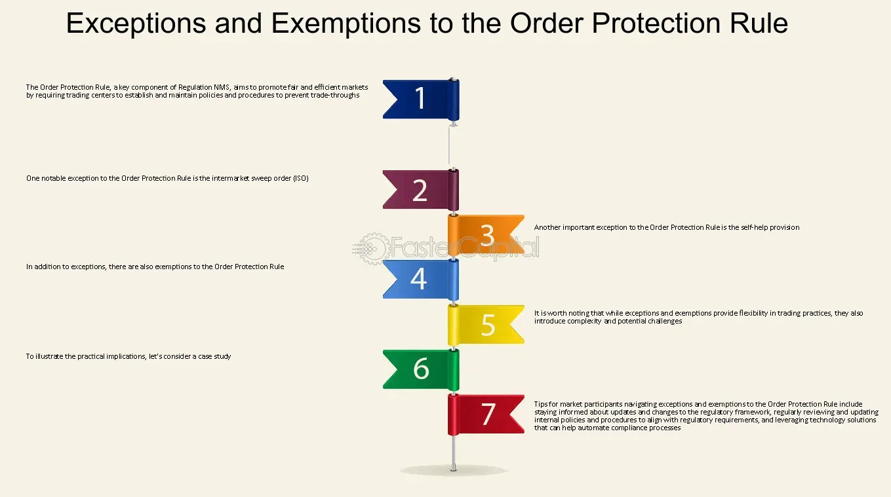

## Table of Contents

## What is the Order Protection Rule?

The Order Protection Rule is a regulation in the United States that helps make sure stock trades are fair. It says that stock exchanges must have rules to stop trades from happening at prices that are worse than the best available price at that moment. This rule helps protect investors by making sure they get the best possible price when they buy or sell stocks.

This rule is part of something called Regulation NMS, which stands for National Market System. The goal of Regulation NMS is to improve how stocks are traded across different markets. By making sure that all trades happen at the best price, the Order Protection Rule helps create a more fair and efficient market for everyone who buys and sells stocks.

## Why was the Order Protection Rule implemented?

The Order Protection Rule was put in place to make sure that when people buy or sell stocks, they get the best price available at that time. Before this rule, there was a chance that someone could buy or sell a stock at a worse price than what was available on another exchange. This wasn't fair to investors. So, the rule was created to stop this from happening and to make the stock market more fair for everyone.

The rule is part of a bigger set of rules called Regulation NMS, which aims to make the stock market work better across different exchanges. By making sure that all trades happen at the best price, the Order Protection Rule helps to create a more efficient and fair market. This is important because it helps build trust in the stock market, encouraging more people to invest and trade, which is good for the economy.

## Who does the Order Protection Rule apply to?

The Order Protection Rule applies to stock exchanges and other trading places in the United States. It makes sure that these places follow rules to protect people who buy and sell stocks. This means that when someone wants to trade a stock, the exchange has to make sure they get the best price available at that moment.

The rule helps everyone who trades stocks, from big investors to regular people. It stops trades from happening at bad prices and makes the stock market fair for everyone. By making sure all trades happen at the best price, the rule helps keep the market honest and trustworthy.

## How does the Order Protection Rule affect stock trading?

The Order Protection Rule makes stock trading fairer by making sure that when someone buys or sells a stock, they get the best price available at that time. Before this rule, people could end up trading at a worse price than what was available on another exchange. This wasn't fair, so the rule was made to stop this from happening. Now, stock exchanges have to check the best prices across all markets before a trade goes through, which helps everyone get a better deal.

This rule is part of something called Regulation NMS, which is all about making the stock market work better. By making sure trades happen at the best price, the Order Protection Rule helps make the market more efficient and trustworthy. When people know they will get the best price, they feel more confident about trading, which is good for the whole economy.

## What are the key components of the Order Protection Rule?

The Order Protection Rule is a part of Regulation NMS, which is a set of rules that makes the stock market more fair and efficient. The main idea of the Order Protection Rule is to make sure that when someone buys or sells a stock, they get the best price available at that moment. This means that stock exchanges have to check the best prices across all markets before a trade happens. If a better price is available somewhere else, the trade has to happen at that better price.

This rule helps protect investors by stopping trades from happening at bad prices. It makes the stock market more fair for everyone, from big investors to regular people. By making sure all trades happen at the best price, the Order Protection Rule helps build trust in the stock market. When people know they will get the best price, they feel more confident about trading, which is good for the economy.

## Can you explain the difference between protected and unprotected orders under this rule?

Under the Order Protection Rule, a protected order is a buy or sell order that is shown on a stock exchange and has the best price at that moment. This means that if someone wants to buy or sell a stock, they have to do it at the price of the protected order if it's the best price available. This rule makes sure that everyone gets the best deal when they trade stocks.

An unprotected order, on the other hand, is an order that doesn't have the best price at that moment. This means that if there's a better price available somewhere else, the trade doesn't have to happen at the price of the unprotected order. The Order Protection Rule helps make the stock market fair by making sure that protected orders, which have the best prices, are the ones that get traded first.

## How does the Order Protection Rule interact with other trading regulations?

The Order Protection Rule is part of a bigger set of rules called Regulation NMS, which is all about making the stock market work better. This rule works together with other parts of Regulation NMS, like the Access Rule and the Sub-Penny Rule. The Access Rule makes sure that stock exchanges can connect with each other easily, so they can check the best prices across all markets. The Sub-Penny Rule stops people from trading stocks at prices that are too small, which can make the market unfair. By working together, these rules help make sure that when someone buys or sells a stock, they get the best price available.

The Order Protection Rule also fits in with other trading rules that aim to keep the market fair and honest. For example, the rule works with the rules about market transparency, which make sure that everyone can see the prices and trades happening in the market. This helps people make better choices when they trade. Also, the Order Protection Rule helps support rules about preventing fraud and manipulation, because it makes it harder for people to trade at bad prices on purpose. By working together, all these rules help make the stock market a fair place for everyone to trade.

## What are the potential benefits of the Order Protection Rule for investors?

The Order Protection Rule helps investors by making sure they get the best price when they buy or sell stocks. Before this rule, people could end up trading at a worse price than what was available on another exchange. This wasn't fair, so the rule was made to stop this from happening. Now, stock exchanges have to check the best prices across all markets before a trade goes through, which means investors always get a better deal.

This rule also makes the stock market more trustworthy. When people know they will get the best price, they feel more confident about trading. This is good for the whole economy because more people will want to invest and trade. By making sure all trades happen at the best price, the Order Protection Rule helps build trust in the stock market and makes it a fair place for everyone.

## What challenges or criticisms have been associated with the Order Protection Rule?

Some people think the Order Protection Rule can make trading slower and more complicated. They say that because exchanges have to check the best prices across all markets before a trade happens, it can take longer to buy or sell stocks. This can be frustrating for people who want to trade quickly. Also, the rule can make it harder for new trading places to start up, because they have to connect with all the other exchanges to make sure they are following the rule. This can make the market less competitive.

Another criticism is that the Order Protection Rule might not always work the way it's supposed to. Sometimes, the best price shown on one exchange might not be real, and this can trick people into thinking they are getting a good deal when they're not. This is called "latency [arbitrage](/wiki/arbitrage)," where fast traders can take advantage of small delays in the system. Critics say that this can make the market less fair, even with the rule in place. Overall, while the rule aims to protect investors, some say it can also create new problems that need to be fixed.

## How is compliance with the Order Protection Rule monitored and enforced?

The Securities and Exchange Commission (SEC) is in charge of making sure that stock exchanges follow the Order Protection Rule. They watch the exchanges to see if they are checking the best prices across all markets before trades happen. If an exchange isn't doing this, the SEC can take action to make them follow the rule. This might mean giving them a warning, making them pay a fine, or even taking away their right to operate as an exchange.

The Financial Industry Regulatory Authority (FINRA) also helps make sure that the rule is followed. They look at the trades that happen on the exchanges to see if they are happening at the best prices. If they find any problems, they can work with the SEC to fix them. By working together, the SEC and FINRA help make sure that the stock market is fair for everyone who buys and sells stocks.

## What changes have been proposed or implemented to improve the Order Protection Rule?

Some people have suggested changes to make the Order Protection Rule work better. One idea is to make the rule simpler so that it's easier for stock exchanges to follow. This could help make trading faster and less complicated. Another suggestion is to make sure that the best prices shown on exchanges are real and not fake. This would stop fast traders from taking advantage of small delays in the system, which is called "latency arbitrage."

The SEC has been looking at these ideas and others to see how they can make the rule better. They want to keep the market fair and efficient for everyone. Some changes have already been made to help with this. For example, the SEC has worked to make sure that the prices shown on exchanges are more accurate and that trades happen more quickly. These changes help make sure that the Order Protection Rule does a better job of protecting investors.

## How does the Order Protection Rule compare to similar regulations in other countries?

The Order Protection Rule in the United States is part of Regulation NMS and is designed to make sure that stock trades happen at the best price available at the time. Other countries have similar rules, but they can be different in how they work. For example, in Canada, there's a rule called the "Order Protection Rule" too, but it's a bit different. Canadian exchanges have to make sure they trade at the best price across all markets, just like in the U.S., but they also have to follow some extra rules about how quickly they need to do this.

In Europe, the Markets in Financial Instruments Directive (MiFID II) has rules that are similar to the Order Protection Rule. MiFID II aims to make sure that trades happen at the best price across different markets in Europe. It also has rules about how transparent the market should be and how to stop people from taking advantage of the system. While the goals are similar to the U.S. rule, the way they are enforced and the details of the rules can be different. Overall, many countries want to make sure their stock markets are fair and efficient, but they might use different ways to do this.

## References & Further Reading

[1]: Securities and Exchange Commission. (2005). ["Regulation NMS."](https://www.sec.gov/rules-regulations/2005/06/regulation-nms) U.S. Securities and Exchange Commission.

[2]: Aldridge, I. (2013). ["High-Frequency Trading: A Practical Guide to Algorithmic Strategies and Trading Systems."](https://www.amazon.com/High-Frequency-Trading-Practical-Algorithmic-Strategies/dp/1118343506) Wiley.

[3]: Haldane, A. G. (2011). ["The Race to Zero."](https://www.bankofengland.co.uk/speech/2011/the-race-to-zero-speech-by-andy-haldane) Bank of England.

[4]: Securities and Exchange Commission. (2010). ["Concept Release on Equity Market Structure."](https://www.sec.gov/rules-regulations/2010/01/concept-release-equity-market-structure) U.S. Securities and Exchange Commission.

[5]: Patterson, S. (2013). ["Dark Pools: High-Speed Traders, A.I. Bandits, and the Threat to the Global Financial System."](https://dl.acm.org/doi/10.5555/2385786) Crown Business.

[6]: Commodities Futures Trading Commission. (2016). ["Regulation Automated Trading (Reg AT)."](https://www.cftc.gov/LawRegulation/FederalRegister/finalrules/2016-297.html) CFTC.