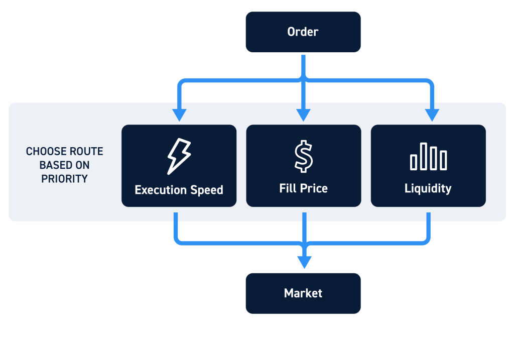

In today's rapidly evolving financial markets, technology plays a crucial role in achieving optimal trade execution. The advent of digital platforms has revolutionized how financial transactions are executed, leading to increased efficiency and precision. Key technological components such as order routing, trading systems, and algorithmic trading have brought about significant transformations.

Order routing is fundamental in ensuring that buy and sell orders reach their intended destinations, whether they are processed directly or through intermediaries like brokers. This involves not just connecting to the appropriate exchange but also navigating complex market structures for optimal outcomes. Smart order routing (SOR) is a sophisticated approach that seeks the best execution by strategically exploring fragmented markets, discovering hidden liquidity, and identifying opportunities in dark pools.



Trading systems form the backbone of the trading mechanism by providing the necessary infrastructure to process trades. These systems integrate critical functions like data collection, analysis, and execution, enabling real-time decision-making and rapid transaction processing. Continuous advancements in technology have made these systems increasingly adept at handling substantial volumes of data, enhancing the speed and efficiency of trade execution.

Algorithmic trading has emerged as a key player in modern trading strategies, employing computer algorithms to autonomously execute trades based on predefined parameters such as price, timing, and volume. This approach allows traders to capitalize on market movements with greater precision and efficiency, facilitating advanced trading strategies.

The integration of these components has reshaped the financial landscape, underscoring the importance of staying current with technological developments. As financial markets continue to evolve, leveraging these tools is essential for traders and investors seeking to optimize their trading activities and maintain a competitive edge.

## Table of Contents

## Understanding Order Routing

Order routing is a fundamental process in financial markets, involving the transmission of trade orders from the end user to an exchange for execution. This transmission can occur directly or through intermediaries such as brokers. The goal is to ensure that orders are executed under the best possible conditions, factoring in price, speed, and cost.

Smart order routing (SOR) has emerged as a sophisticated method for achieving optimal trade execution. It operates by navigating through fragmented markets composed of multiple exchanges and trading venues. SOR systems employ complex algorithms to identify and leverage hidden [liquidity](/wiki/liquidity-risk-premium), often found in dark pools—venues that do not display the [order book](/wiki/order-book-trading-strategies) to the public. This enables traders to execute large orders without significantly impacting market prices.

The efficiency of SOR is enhanced by its ability to evaluate and choose between various execution realities across different platforms. It assesses multiple factors such as transaction costs, available liquidity, and potential market impact, ultimately directing the order to the venue that offers the most favorable execution conditions.

An additional concept closely related to order routing is Payment for Order Flow (PFOF). PFOF involves market makers—entities that provide liquidity by being ready to buy and sell securities—with rebates paid to brokerage firms in exchange for routing customer orders through them. While this practice helps lower transaction costs for retail brokers and potentially for their clients, it has also been subject to scrutiny. Critics argue that it could introduce conflicts of interest where brokers might prioritize rebate incentives over securing the best possible trades for their clients.

Despite such concerns, PFOF remains a prevalent practice among retail brokerages, partly due to its role in enabling commission-free trading models, which have become increasingly popular. The ramifications of PFOF are complex and intertwined with market microstructure as it affects order prioritization, execution quality, and market transparency.

In summary, order routing and smart order routing are central to modern trading infrastructures, ensuring that trades are executed efficiently and under favorable conditions. Meanwhile, the practice of payment for order flow continues to evolve within the regulatory and market landscapes, illustrating the need for ongoing scrutiny to balance benefits with potential conflicts.

## The Role of Trading Systems

Trading systems are the backbone of modern financial markets, facilitating the execution of trades by integrating essential functions such as data collection, analysis, and execution. These systems are designed to operate in real-time, continually assessing market conditions to ensure they deliver optimal trading outcomes.

At the core of trading systems is the ability to handle vast streams of data. They collect information from various sources, including financial news, market indices, and historical data, to provide traders with a comprehensive view of the market. This data is then analyzed using sophisticated algorithms that can identify potential trading opportunities, assess risks, and make informed decisions on execution strategies.

The primary goal of a trading system is to execute trades with maximum efficiency and minimum cost. This is achieved through automation, which eliminates the lag time associated with manual trading and reduces the potential for human error. Automated trading systems can process orders with precision, even in highly volatile markets.

Technological advancements have significantly increased the efficiency and capability of trading systems. High-frequency trading ([HFT](/wiki/high-frequency-trading-strategies)) is a prime example of this evolution, where systems can execute millions of orders per second. This requires robust infrastructure capable of processing high volumes of data with minimal latency. Advances in programming languages and computational power enable these systems to perform complex calculations and implement strategies with unprecedented speed and accuracy.

Moreover, the implementation of [machine learning](/wiki/machine-learning) algorithms has revolutionized the way trading systems operate. These algorithms can learn from historical data patterns, adapt to changing market conditions, and continuously optimize trading strategies. For instance, Python code using machine learning libraries like TensorFlow or PyTorch can be deployed to improve predictive analytics within trading systems, thereby enhancing decision-making processes.

```python
import numpy as np
from sklearn.model_selection import train_test_split
from sklearn.ensemble import RandomForestRegressor

# Sample code to demonstrate a simple predictive model using historical trade data
# Assuming `features` is a NumPy array with historical trading data and `target` is the trading outcome

# Split the data into training and test sets
X_train, X_test, y_train, y_test = train_test_split(features, target, test_size=0.2, random_state=42)

# Initialize and train a Random Forest Regressor
model = RandomForestRegressor(n_estimators=100, random_state=42)
model.fit(X_train, y_train)

# Make predictions
predictions = model.predict(X_test)

# Evaluate predictions
accuracy = model.score(X_test, y_test)
print(f"Model Accuracy: {accuracy * 100:.2f}%")
```

In conclusion, trading systems are crucial for the smooth operation of financial markets, offering enhanced data processing capabilities and automated trade execution. As technology continues to advance, these systems will become even more sophisticated, incorporating more complex algorithms and machine learning techniques to maintain a competitive edge in the dynamic world of trading.

 to Algorithmic Trading

Algorithmic trading, often referred to as algo trading, revolutionizes the traditional approach to buying and selling assets in financial markets by leveraging computer algorithms. These algorithms follow pre-set rules and criteria related to aspects like price, timing, and [volume](/wiki/volume-trading-strategy). This automation allows for faster and more accurate execution of trades as opposed to manual operations.

At its core, [algorithmic trading](/wiki/algorithmic-trading) seeks to optimize the trading process by enabling decisions to be made and executed much more rapidly than could be done by human traders alone. The cornerstone of these algorithms involves utilizing mathematical models and vast datasets. For example, an algorithm might be designed to identify profitable trading opportunities based on historical price patterns or to execute trades only within a specific threshold of market conditions.

An essential strategy in algorithmic trading is [arbitrage](/wiki/arbitrage). Arbitrage involves exploiting the price differences of the same asset across different markets or in various forms. For instance, with technology today, if an asset is trading at a lower price on one exchange compared to another, algorithms can instantly buy the asset on the cheaper exchange and sell it simultaneously on the more expensive one, thus locking in a profit.

Algorithmic trading also includes strategies like [market making](/wiki/market-making) and [trend following](/wiki/trend-following). Market making aims to provide liquidity to the financial system by making simultaneous buy and sell offers for a security and profiting from the bid-ask spread. Conversely, trend following strategies focus on identifying the direction of market movement and making trades aligned with that trend.

Consider the following simple Python example implementing a moving average crossover, a popular algorithmic trading strategy. This strategy involves using moving averages of different lengths to generate buy and sell signals:

```python
import pandas as pd

# Load your historical market data into a pandas DataFrame
data = pd.read_csv('market_data.csv')

# Calculate short-term and long-term moving averages
short_window = 40
long_window = 100
data['Short_MA'] = data['Close'].rolling(window=short_window, min_periods=1).mean()
data['Long_MA'] = data['Close'].rolling(window=long_window, min_periods=1).mean()

# Generate buy and sell signals
data['Signal'] = 0.0
data['Signal'][short_window:] = np.where(data['Short_MA'][short_window:] 
                                         > data['Long_MA'][short_window:], 1.0, 0.0)

# Create trading orders
data['Position'] = data['Signal'].diff()

# Display the DataFrame with signals
print(data.tail())
```

In this script, the `Short_MA` and `Long_MA` columns represent the short-term and long-term moving averages, respectively, calculated over specified window periods. The `Signal` column determines when the short-term average crosses above the long-term average, suggesting a buy, whereas a cross below suggests a sell. The `Position` column detects the changes in signals to indicate when to enter or [exit](/wiki/exit-strategy) trades.

The prominence of algorithmic trading lies not just in its ability to execute trades rapidly but also in its capacity to minimize transaction costs and mitigate human emotional biases. High-frequency trading, a subset of algorithmic trading, further exemplifies this by executing numerous trades per second, capitalizing on minute price discrepancies.

Despite its efficiency, algorithmic trading does face challenges such as ensuring reliability and avoiding potential market disruption, as evidenced by the 2010 Flash Crash. Furthermore, developing robust algorithms necessitates access to high-quality data and significant technical expertise, which can be barriers to entry for smaller traders. Nonetheless, as technology continues to progress and markets grow increasingly complex, the reliance on algorithmic trading is poised to expand.

## Smart Order Routing (SOR) Technologies

Smart Order Routing (SOR) technologies play a critical role in modern trading by leveraging advanced algorithms to optimize the execution of financial transactions across a fragmented marketplace. These technologies assess multiple variables, including price, liquidity, and execution speed, in real-time, enabling market participants to achieve what's known as the "best execution" of orders. Best execution refers to the optimal result for a given trade, often measured in terms of transaction costs, speed, and likelihood of execution.

SOR systems are designed to navigate various trading venues by dynamically directing orders to the platform that offers the best trading conditions. This is increasingly important as financial markets have become more fragmented, with liquidity spread across multiple exchanges, dark pools, and alternative trading systems (ATS). Dark pools are private financial forums or exchanges for trading securities that allow investors to trade without exposure until after the trade has been executed.

One of the core features of SOR is its ability to scan multiple trading venues simultaneously to identify hidden liquidity and favorable pricing options that are not readily visible to market participants. This can involve complex algorithms that integrate continuous data feeds across different platforms, enabling the identification of patterns or anomalies that may signify favorable trading conditions.

Leading edge SOR technologies, such as those offered by providers like LIST FastTrade and Bloomberg, continue to evolve to support a wide variety of asset classes. These systems incorporate machine learning algorithms and real-time data analytics to enhance their decision-making processes, ensuring that buy and sell orders are executed at optimal prices and with minimal delay. Bloomberg's SOR solutions, for example, utilize comprehensive market data and analytics tools to process high volumes of transactions with precision.

The technological sophistication of SOR platforms contributes significantly to minimizing transaction costs by reducing market impact costs—the change in asset prices caused by the execution of large orders—and opportunity costs associated with delayed order execution. By ensuring swift and intelligent routing of orders, SOR systems not only increase the efficiency of trade execution but also improve cost-effectiveness for traders and investors. 

Moreover, ongoing innovation in SOR technologies addresses challenges related to latency—the delay before a transfer of data begins—and complex regulatory environments. As providers continue to refine these technologies, emphasis is placed on achieving ultra-low latency and high data integrity, ensuring compliance with evolving regulatory requirements in a globalized trading environment. This continuous evolution contributes to the robustness and adaptability of SOR solutions, making them integral to the financial trading ecosystem.

## Benefits and Challenges of Smart Order Routing

Smart Order Routing (SOR) technologies are instrumental in optimizing trade execution in contemporary financial markets. They enhance trade efficiency by systematically analyzing and utilizing multiple trading venues to achieve several distinct benefits. One of the primary advantages is the potential to obtain the best execution for trades. By evaluating factors including price, liquidity, and market conditions across various platforms, SOR algorithms ensure that orders are filled at optimal rates, often exceeding the capabilities of manual trading systems.

Additionally, SOR helps minimize market impact by breaking down large orders into smaller parts and executing them across different venues. This strategy reduces the likelihood of market distortion, thus maintaining more stable prices. Furthermore, SOR technologies maximize liquidity by seeking out hidden liquidity pools, including dark pools, which are non-public trading venues, thus ensuring that trades can be executed swiftly without substantial price fluctuations.

Regulatory compliance is another significant benefit of SOR. By automating the execution process, SOR helps trading entities adhere to complex regulatory frameworks that govern financial markets. This is particularly crucial in environments where trading regulations are becoming increasingly stringent. Compliance is achieved through rigorous record-keeping and execution algorithm transparency, which provide verifiable auditable trails for all executed trades.

However, the implementation and operation of SOR systems are not without challenges. Latency sensitivity is a critical issue; in high-frequency trading, even microsecond delays can impact profitability, making the need for low-latency systems paramount. Furthermore, the effectiveness of SOR largely depends on the quality of data input. Any discrepancy or degradation in data quality can lead to suboptimal execution decisions and potentially significant financial losses.

Managing regulatory compliance in cross-border trading adds another layer of complexity. Different jurisdictions have varying financial regulations, and SOR systems must be capable of navigating this regulatory minefield to ensure compliance with all applicable laws. This necessitates advanced legal and technical strategies to align with multinational trading standards.

In sum, while Smart Order Routing offers compelling advantages in optimizing trade execution, it requires sophisticated technological infrastructures and thoughtful strategic implementation to address its inherent challenges effectively.

## Real-World Applications of Algorithmic Trading

Algorithmic trading plays a significant role in modern financial markets, permeating various asset classes such as equities, foreign exchange (Forex), and cryptocurrencies. Its widespread adoption is particularly prominent in high-frequency trading (HFT) and institutional trading, where the speed and precision of executing trades are crucial.

In equities markets, algorithmic trading is used to manage large orders effectively without significantly impacting the market price. By breaking down large orders into smaller, timed segments, traders can minimize market impact while optimizing the trade execution price. For instance, volume-weighted average price (VWAP) algorithms are commonly employed to execute trades at an average market price over a specific time period, maintaining discretion in the process.

In Forex markets, algorithms aid in trading strategies that capitalize on minute price discrepancies across different currency pairs or exchanges. These strategies often rely on arbitrage to exploit short-lived price differentials while ensuring rapid execution across multiple trading venues. The highly liquid nature of Forex markets renders them ideal for algorithmic strategies that require fast execution and minimal risk exposure.

The [cryptocurrency](/wiki/cryptocurrency) market, characterized by its 24/7 trading and high [volatility](/wiki/volatility-trading-strategies), is another domain where algorithmic trading has become essential. Traders utilize algorithms to execute trades based on technical indicators, thereby maximizing the gains from rapid price swings. The ability to automate trades ensures that strategies can be executed with precision and speed, which is critical given the market's volatility.

Algorithmic trading enables the implementation of sophisticated strategies that adapt to real-time market conditions. These include [statistical arbitrage](/wiki/statistical-arbitrage), market making, and trend-following strategies. Statistical arbitrage strategies rely on quantitative models to identify pricing inefficiencies among correlated securities, aiming to profit from the convergence of prices. Market making algorithms provide liquidity to the market by continuously quoting buy and sell prices, profiting from the bid-ask spread. Trend-following algorithms analyze historical price movements and execute trades aligned with prevailing market trends, optimizing the capture of long-term trends.

The use of algorithmic trading is supported by robust technologies, such as machine learning and [artificial intelligence](/wiki/ai-artificial-intelligence), which enhance the accuracy and efficiency of trade execution. These technologies allow algorithms to learn from historical data, improve decision-making in dynamic market environments, and adjust strategies in response to new information.

In conclusion, algorithmic trading's ability to execute complex strategies with precision and adaptability makes it indispensable in both high-frequency trading and institutional trading. Its application across equities, Forex, and cryptocurrency markets demonstrates its versatility and efficacy in achieving optimal trading outcomes.

## Conclusion

The integration of order routing, trading systems, and algorithmic trading is crucial in contemporary financial markets. These components collectively enhance the capability to execute trades efficiently and at reduced costs. As financial markets grow increasingly complex and interconnected, the importance of technology in enhancing trade execution capabilities cannot be overstated. Technological innovation enables participants to navigate these markets with greater precision and leverage opportunities that were not previously accessible.

Traders benefit significantly from the rapid advancements in smart order routing (SOR) and algorithmic trading strategies. These technologies enable market participants to manage large volumes of data in real-time and execute trades with a level of accuracy and speed that manual trading cannot match. The ability to adapt to market conditions automatically and execute trades based on sophisticated algorithms gives traders an undeniable edge.

However, as technology advances, the regulatory landscape surrounding these activities is also evolving. Traders and investors must remain informed about these changes to maintain compliance and maximize the potential benefits of technological integration in trading activities. Failure to keep up with regulatory changes can lead to significant risks, including fines and reputational damage.

In conclusion, while technology plays a pivotal role in modern trading, it is imperative for traders and investors to stay informed about the continuous advancements and regulatory requirements in order to effectively utilize available tools. Embracing technology while ensuring compliance will be key to thriving in today’s fast-paced financial markets.

## References & Further Reading

[1]: Hasbrouck, J. (2007). ["Empirical Market Microstructure: The Institutions, Economics, and Econometrics of Securities Trading."](https://academic.oup.com/book/52241) Oxford University Press.

[2]: Harris, L. (2003). ["Trading and Exchanges: Market Microstructure for Practitioners."](https://academic.oup.com/book/52292) Oxford University Press.

[3]: Lopez de Prado, M. (2018). ["Advances in Financial Machine Learning."](https://www.amazon.com/Advances-Financial-Machine-Learning-Marcos/dp/1119482089) Wiley.

[4]: Chan, E. (2009). ["Quantitative Trading: How to Build Your Own Algorithmic Trading Business."](https://github.com/justinchou/books-quantitative-trading) Wiley.

[5]: Jansen, S. (2020). ["Machine Learning for Algorithmic Trading - Second Edition: Predictive models to extract signals from market and alternative data for systematic trading strategies with Python."](https://thuvienso.hoasen.edu.vn/bitstream/handle/123456789/12260/Contents.pdf?sequence=1) Packt Publishing.

[6]: Hult, H., Lindskog, F., Hammarlid, O., & Rehn, C. (2012). ["Risk and Portfolio Analysis: Principles and Methods."](https://link.springer.com/book/10.1007/978-1-4614-4103-8) Springer.