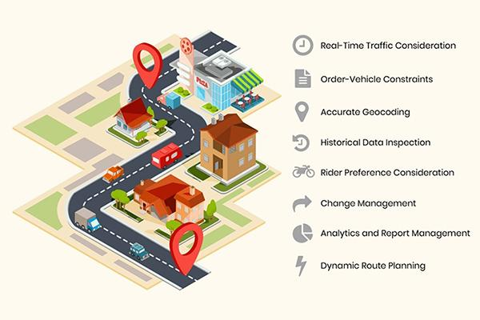

## Table of Contents

## What is order routing optimization?

Order routing optimization is about finding the best way to send orders from where they start to where they need to go. It's like planning the quickest and cheapest route for a delivery truck. Companies use special computer programs to figure out the best paths. These programs look at things like traffic, how long it takes to get somewhere, and how much it costs. By doing this, businesses can save money and time, and make sure customers get their orders faster.

The main goal of order routing optimization is to make the whole process of moving orders as smooth as possible. It helps avoid problems like traffic jams or delays at delivery points. For example, if a truck has to deliver to several places, the program will plan the stops in an order that saves time and fuel. This not only helps the company save money but also makes customers happier because their orders arrive on time. In the end, everyone benefits from better planning and fewer mistakes.

## Why is order routing optimization important for businesses?

Order routing optimization is really important for businesses because it helps them save money and time. When a company can figure out the best way to send orders, it doesn't waste money on things like extra fuel or longer delivery times. For example, if a delivery truck can take a shorter route, the company spends less on gas and the driver doesn't have to work as long. This means the business can use that saved money for other important things, like improving their products or services.

It also makes customers happier. When orders are delivered quickly and on time, customers are more likely to come back and buy more things. Nobody likes waiting a long time for their stuff to arrive. By using order routing optimization, businesses can make sure that customers get their orders faster, which can lead to more sales and a better reputation. In the end, both the business and the customers benefit from this smart way of planning deliveries.

## What are the basic components of an order routing system?

An order routing system has a few main parts that work together to make sure orders get to the right place on time. The first part is the order management system. This is like a big list where all the orders are kept track of. It knows what each customer ordered and where it needs to go. The second part is the route planning software. This is what figures out the best way to send the orders. It looks at things like traffic, how far away the delivery spot is, and how much it costs to get there.

The third part is the tracking and monitoring system. This part keeps an eye on where the orders are while they're on their way. It can tell if there's a problem, like a delay, so the company can fix it quickly. The last part is the communication system. This is how the company talks to the drivers and customers. It lets drivers know where to go and keeps customers updated on when their order will arrive. All these parts work together to make the whole process smooth and efficient.

## How does order routing optimization impact customer satisfaction?

Order routing optimization helps make customers happier by getting their orders to them faster. When a company uses smart planning to find the quickest way to deliver orders, customers don't have to wait as long. This means they get their stuff sooner, which makes them feel good about the company. Happy customers are more likely to come back and buy more things, which is good for the business.

It also makes customers feel more confident in the company. When orders arrive on time and without any problems, customers trust the business more. They know that the company cares about their needs and works hard to meet them. This trust can lead to more sales and a better reputation for the company, which is important for long-term success.

## What are the common challenges faced in order routing optimization?

One big challenge in order routing optimization is dealing with traffic and road changes. Traffic can be unpredictable, and road construction or accidents can mess up the best plans. Even the smartest computer programs can have a hard time figuring out the best route when things change quickly. This can lead to delays, which can make customers unhappy and cost the company more money.

Another challenge is managing a lot of orders at the same time. When a business has many orders to deliver, it can be tough to find the best route for each one. The system has to juggle different delivery times, places, and the size of the orders. If the system gets it wrong, some orders might be late, or the delivery trucks might have to drive longer routes, which wastes time and money.

Lastly, keeping everyone in the loop is a challenge. Good communication is key to making sure orders get where they need to go on time. The drivers need to know where to go, and the customers want to know when their stuff will arrive. If the communication system fails, it can lead to confusion and delays. Keeping everything running smoothly takes a lot of work and the right technology.

## What are some basic strategies for improving order routing?

One basic strategy for improving order routing is to use real-time traffic data. This means the system can see what the traffic is like right now and change the routes to avoid jams. This can help make deliveries faster and save on fuel costs. Another simple way is to group orders that are going to the same area together. By doing this, the delivery truck doesn't have to drive all over the place, which saves time and money.

Another strategy is to keep the routes as short as possible. This means planning the stops in a way that the truck doesn't have to backtrack or go out of its way. Using computer programs that can figure out the best order of stops can really help with this. Also, it's important to keep the drivers in the loop. If they know about any changes or problems, they can adjust their routes on the go, which can help keep everything running smoothly.

## How can data analytics be used to enhance order routing optimization?

Data analytics can help make order routing better by looking at a lot of information to find the best ways to deliver orders. It can study past delivery data to see what routes worked well and which ones didn't. By doing this, the system can learn from past mistakes and plan better routes in the future. For example, if data shows that a certain road always has traffic at a certain time, the system can plan to avoid that road during those times. This helps make deliveries faster and saves money on fuel.

Also, data analytics can help predict what might happen in the future. By looking at things like weather forecasts, traffic patterns, and even customer behavior, the system can plan routes that are less likely to have problems. If it knows that a big storm is coming, it can change the delivery schedule to avoid delays. This kind of smart planning makes customers happier because their orders arrive on time, even when things are unpredictable.

## What role does machine learning play in advanced order routing systems?

Machine learning helps make order routing systems smarter by learning from past data. It can look at all the old delivery information to figure out what worked well and what didn't. For example, if a certain route always gets stuck in traffic, [machine learning](/wiki/machine-learning) can spot this pattern and suggest a different path. This means that over time, the system gets better at planning routes that are faster and cheaper. It's like having a brain that gets smarter with every delivery it helps with.

In advanced systems, machine learning can also predict future problems. It uses data like weather forecasts, traffic patterns, and even how customers behave to plan ahead. If it knows a big storm is coming, it can change the delivery schedule to avoid delays. This kind of smart planning makes customers happier because their orders arrive on time, even when things are unpredictable. By using machine learning, businesses can save money and make their customers happier at the same time.

## Can you explain the concept of dynamic routing and its benefits?

Dynamic routing is when a delivery system changes the route of a truck while it's on the way to make the delivery faster. It's like having a smart helper that keeps an eye on things like traffic and road problems. If there's a traffic jam or a road is closed, the system can tell the driver to take a different path. This means the delivery can still get to the customer on time, even if something unexpected happens.

The big benefit of dynamic routing is that it helps save time and money. When the system can change the route quickly, the truck doesn't have to sit in traffic or go the long way around. This means less fuel is used and the driver doesn't have to work as long. Customers are also happier because their orders arrive faster, which can make them want to buy from the company again. In the end, dynamic routing makes everything run smoother and helps the business do better.

## What are the latest technological trends affecting order routing optimization?

One big trend in order routing optimization is the use of [artificial intelligence](/wiki/ai-artificial-intelligence) (AI) and machine learning. These technologies help systems learn from past deliveries to plan better routes in the future. They can look at a lot of data, like traffic patterns and weather forecasts, to predict what might happen and change the routes to avoid problems. This means deliveries can be faster and more reliable, which makes customers happier and saves companies money.

Another trend is the use of real-time data and dynamic routing. With real-time data, the system can see what's happening on the roads right now and change the routes to avoid traffic jams or road closures. This is really helpful because it means the delivery trucks can take the quickest path, even if something unexpected happens. This helps make sure that orders get to customers on time, which is good for both the business and the customers.

## How do regulatory and compliance issues influence order routing strategies?

Regulatory and compliance issues can really change how a company plans its delivery routes. For example, some places have rules about how long drivers can work or what roads they can use. If a company doesn't follow these rules, they could get in big trouble. So, when planning routes, the company has to make sure they're following all the laws. This might mean taking longer routes or changing the delivery times, which can make things more complicated and sometimes more expensive.

Even though it can be tricky, following the rules is really important. It helps keep everyone safe and makes sure the company stays out of trouble. By using smart computer programs, companies can plan routes that follow the rules but still get the orders to customers as fast as possible. This way, they can keep their customers happy while also making sure they're doing everything the right way.

## What case studies or examples illustrate successful order routing optimization implementations?

One good example of successful order routing optimization is how Amazon uses its technology to make deliveries faster. Amazon has a system that looks at a lot of information, like where people live and what they order, to plan the best routes for their delivery trucks. They also use real-time data to change the routes if there's traffic or other problems. This means that customers get their orders quicker, and Amazon saves money on fuel and time. It's a big reason why Amazon can deliver things so fast and keep their customers happy.

Another example is UPS, which uses a system called ORION (On-Road Integrated Optimization and Navigation). ORION looks at things like traffic, weather, and where the deliveries need to go to plan the best routes for their trucks. They found that by using this system, they could save millions of miles of driving each year. This not only saves UPS a lot of money but also helps the environment by using less fuel. Customers are happy because their packages arrive on time, and UPS can keep their delivery costs down.

## How can we measure and evaluate order routing performance?

Performance evaluation in order routing involves multiple dimensions to ensure effective execution and optimal trading outcomes. Key metrics such as latency, fill rates, price improvement, and execution quality are crucial in assessing the performance of order routing systems.

Latency and speed metrics are particularly important for high-frequency trading strategies, where execution speed is critical. Latency refers to the time delay between when an order is placed and when it is executed. In high-frequency trading, even microsecond delays can impact profitability, making the evaluation of these metrics essential. Modern trading systems often employ time synchronization protocols and low-latency communication networks to minimize this delay, ensuring that traders can react swiftly to market changes.

Fill rates are another critical measure of order routing performance. A high fill rate indicates efficient matchmaking between buy and sell orders, reflecting the system's ability to execute trades effectively. The fill rate can be calculated as:

$$
\text{Fill Rate} = \frac{\text{Number of Executed Orders}}{\text{Total Number of Orders}}
$$

This metric helps in assessing how often orders are completed as opposed to being only partially filled or canceled, which could result from inefficient routing or lack of market [liquidity](/wiki/liquidity-risk-premium).

Price improvement metrics assess the system's proficiency in achieving execution prices better than the order's original terms. This metric evaluates whether the system can secure trades at prices favorable to the trader beyond initial expectations, which can substantially lower transaction costs. Price improvement is frequently expressed as the difference between the execution price and the price at which the order was placed, often relative to the market price or the national best bid and offer (NBBO).

Comprehensive reporting and transparency are essential for traders to evaluate system performance effectively and ensure compliance with regulatory standards. Transparent reporting involves detailed logs and reports that track each stage of the order execution process, including timestamps, venues, and execution outcomes. This level of detail facilitates audit trails, enabling traders to analyze the performance and integrity of their order routing strategies.

Overall, measuring and evaluating order routing performance involves a combination of real-time monitoring and retrospective analysis, allowing traders to optimize their strategies continuously.

## References & Further Reading

[1]: Laruelle, S., & Lehalle, C.-A. (2013). ["Market Microstructure in Practice."](https://www.semanticscholar.org/paper/Market-Microstructure-in-Practice-Lehalle-Laruelle/2df52569ee044db799cc9ae865de4689847d6f83) World Scientific Publishing Company.

[2]: Hendershott, T., & Riordan, R. (2013). ["Algorithmic Trading and the Market for Liquidity."](https://www.cambridge.org/core/journals/journal-of-financial-and-quantitative-analysis/article/abs/algorithmic-trading-and-the-market-for-liquidity/C1A34D3767436529EA4F23DB1780273C) Journal of Financial and Quantitative Analysis, 31(1), 235-264.

[3]: Madhavan, A. (2000). ["Market Microstructure: A Survey."](https://www.sciencedirect.com/science/article/pii/S1386418100000070) Journal of Financial Markets, 3(3), 205-258.

[4]: O'Hara, M. (1997). ["Market Microstructure Theory."](https://books.google.com/books/about/Market_Microstructure_Theory.html?id=D-PGBwAAQBAJ) Blackwell Publishers.

[5]: McInish, T. H. (2000). ["Capital Markets: A Global Perspective."](https://archive.org/details/capitalmarketsgl0000mcin) Blackwell Publishing.

[6]: Aldridge, I. (2013). ["High-Frequency Trading: A Practical Guide to Algorithmic Strategies and Trading Systems."](https://onlinelibrary.wiley.com/doi/pdf/10.1002/9781119203803.fmatter) John Wiley & Sons.

[7]: De Prado, M. L. (2018). ["Advances in Financial Machine Learning."](https://books.google.com/books/about/Advances_in_Financial_Machine_Learning.html?id=oU9KDwAAQBAJ) Wiley.

[8]: Fabozzi, F. J., Focardi, S. M., & Kolm, P. N. (2010). ["Quantitative Equity Investing: Techniques and Strategies."](https://www.semanticscholar.org/paper/Quantitative-Equity-Investing%3A-Techniques-and-Fabozzi-Focardi/1c49a2a53919f7e65cb96f16691b8ff726fd3cd7) John Wiley & Sons.