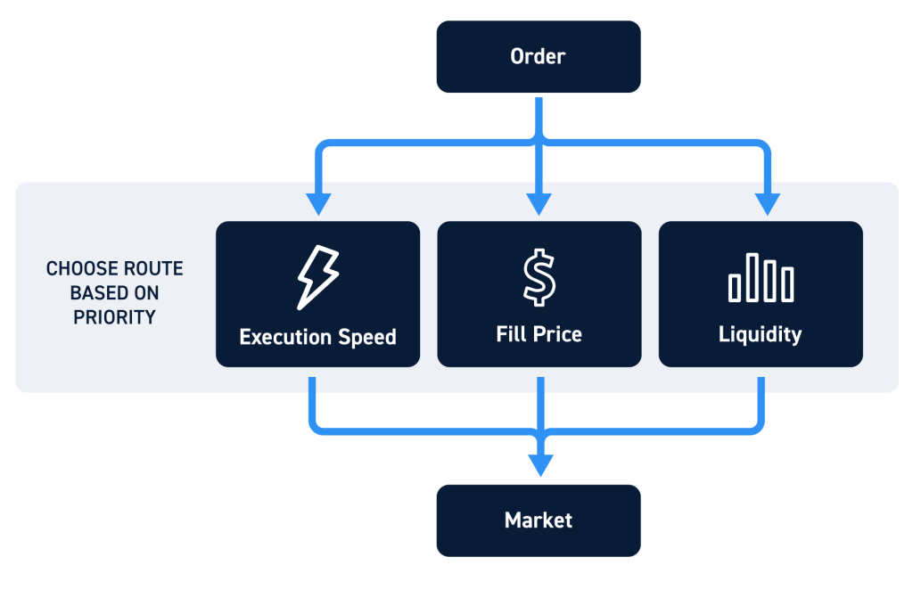

In algorithmic trading, order routing optimization is crucial for increasing trading efficiency and maximizing profits. This article examines the intricacies of optimizing order routing within alternative trading systems (ATSs) and its vital role in contemporary trading. Order routing refers to the mechanism through which trade orders are directed to the most suitable venues to ensure optimal execution. It is central to the trading process as it influences transaction costs, execution speed, and market liquidity.

Alternative trading systems, including electronic communication networks (ECNs) and dark pools, present unique advantages over traditional exchanges by providing diversified routing options and enhanced operational flexibility. These platforms represent an evolving landscape necessitating traders' proficiency in implementing intelligent order routing strategies to achieve superior execution outcomes. Enhanced understanding of routing mechanisms empowers traders to improve trading performance in response to the complexities and volatility of financial markets.

The competitive nature of modern trading mandates that traders cultivate expertise in order routing to maintain a strategic edge. As the complexity of trading environments escalates, mastering routing optimization becomes essential for gaining a competitive advantage, enabling traders to navigate markets adeptly and secure favorable terms. This article endeavors to offer an exhaustive overview of order routing optimization, shedding light on its associated challenges and emerging trends that promise to shape the future of trading practices.

## Table of Contents

## What is Order Routing and Its Importance

Order routing is the process wherein trade orders are systematically directed to the most suitable trading venues. The primary objective is to ensure optimal execution, considering various factors like price, speed, and liquidity. In algorithmic trading, the importance of order routing is amplified due to its direct impact on transaction costs, execution speed, and the overall liquidity available in the market.

A primary consideration in order routing is the distinction between traditional exchanges and alternative trading systems (ATS). Traditional exchanges operate with a centralized order matching system, often resulting in higher visibility and transparency but also leading to potential limitations in terms of efficiency for certain types of trades. On the other hand, ATS platforms—including electronic communication networks (ECNs) and dark pools—offer traders significantly more flexibility. These venues allow for trades to be executed with lower market impact, offering anonymity and potentially more favorable pricing conditions. For instance, ECNs facilitate electronic execution of orders by connecting buyers and sellers directly, often at improved price points compared to traditional exchanges. Dark pools, while offering further confidentiality, enable large block trades without substantial impact on public market prices.

The dynamics of order routing are continuously evolving, necessitating an in-depth understanding of the various mechanisms involved. As new trading venues emerge and market conditions fluctuate, traders must adapt their routing strategies to maintain a competitive edge. Effective order routing takes into account real-time data and algorithmic decision-making to adjust routes dynamically, ensuring that orders are executed in the most advantageous manner.

Traders utilize diversified routing options provided by ATS platforms to cater to specific trading strategies and goals. For instance, some may prioritize cost reduction, while others focus on minimizing time delays in execution. By comprehending the intricacies of how different venues function, traders can enhance their trading performance, optimize execution quality, and ultimately achieve superior outcomes. 

In conclusion, the importance of order routing in modern trading cannot be overstated. As markets grow in complexity, a thorough grasp of order routing mechanisms becomes vital for traders aspiring to maximize their performance and make informed trading decisions.

## Factors Influencing Order Routing in ATS

Order routing in Alternative Trading Systems (ATS) involves complex decision-making impacted by various interrelated factors. These factors significantly shape the efficiency and effectiveness of order execution, making them critical considerations for traders. Among these factors, market design, broker affiliation, order characteristics, and prevailing market conditions stand out.

Market design variations across ATSs can profoundly affect transparency, execution quality, and pricing structures. Each ATS comes with its unique set of rules and functionalities that influence how orders are processed and executed. For example, some ATSs are more transparent, providing detailed post-trade information, while others may focus more on anonymity through dark pools, impacting how [liquidity](/wiki/liquidity-risk-premium) is perceived and accessed. As a result, understanding these variations can guide traders in choosing the most suitable platform for their trading strategies.

Broker affiliations introduce another layer of complexity by potentially creating conflicts of interest. Brokers may have incentives to route orders in specific directions, often influenced by payment for order flow arrangements or proprietary interests. Consequently, traders must scrutinize brokerage policies and the incentives that might influence routing decisions to ensure that their interests align with those of the broker, thereby minimizing any negative impact on execution quality or cost efficiency.

Order characteristics such as size, type, and urgency demand customized routing strategies to meet specific trading objectives. Large orders might benefit from being split across different venues to minimize market impact, a process that can be informed by strategies like Volume-Weighted Average Price (VWAP) or Time-Weighted Average Price (TWAP). Similarly, urgent orders might prioritize speed over other factors, necessitating the use of algorithms designed for rapid execution.

Finally, prevailing market conditions significantly affect order routing decisions. In volatile or illiquid markets, trading strategies need to be adapted to ensure optimal execution. For instance, during periods of high [volatility](/wiki/volatility-trading-strategies), traders may employ opportunistic routing strategies to capitalize on short-term price movements. Conversely, in illiquid markets, seeking out dark pools might offer the advantage of reduced market impact.

In summary, navigating the complexities of order routing in ATS necessitates a comprehensive understanding of these influencing factors. Traders who adeptly analyze market design, broker affiliations, order characteristics, and market conditions can significantly enhance their execution performance and maintain a competitive edge.

## Common Order Routing Strategies

Smart Order Routing (SOR) systems are pivotal in the automation of decision-making processes, strategically directing trade orders across multiple trading venues based on predefined parameters. These systems dynamically evaluate various market conditions to optimize trade execution effectively. 

Volume-weighted average price (VWAP) and time-weighted average price (TWAP) strategies are critical in mitigating market impact by distributing large orders over a specified time frame. VWAP aims to execute trades at or better than the average market price weighted by [volume](/wiki/volume-trading-strategy) within a trading period. This approach helps in aligning with market trends and achieving cost efficiency. Conversely, TWAP focuses on trading at regular intervals, irrespective of volume, offering a balanced approach by mitigating short-term price fluctuations. Both strategies seek to reduce the market footprint of large trades, thereby minimizing execution risks.

Dark pool routing provides traders with the advantage of executing trades in venues that minimize market visibility, thus lowering transaction costs. These discrete environments, often characterized by limited transparency, allow execution without substantial market price disturbances, making them suitable for large block trades.

Opportunistic routing takes advantage of transient market conditions, positioning itself to exploit short-term volatility or liquidity situations to improve execution quality. By leveraging advanced algorithms that can predict favorable conditions, traders can execute orders in environments that might offer a temporary pricing advantage.

Exploring these strategies highlights their complexities and benefits. Each strategy is designed to cater to specific trading objectives and market conditions, showcasing the adaptability required in modern trading systems. They collectively enhance the efficacy of order execution by leveraging technology and innovative methods to manage the multifaceted aspects of trading in diverse market environments.

## Optimizing Order Routing in ATS: Goals and Methods

Order routing optimization within Alternative Trading Systems (ATS) aims to ensure optimal trade execution by focusing on three primary objectives: minimizing costs, enhancing speed, and ensuring an optimal market impact. Achieving these goals requires a multifaceted approach employing various methodologies and leveraging advanced technologies.

One of the core methods in optimizing order execution is price improvement. This involves obtaining a better price for an order compared to the prevailing market price at the time the order is routed. Price improvement can be achieved through sophisticated algorithms that dynamically adjust routing decisions based on market conditions and available liquidity. By continuously analyzing [order book](/wiki/order-book-trading-strategies) data, these algorithms identify opportunities for price improvement, thus reducing overall transaction costs.

Liquity seeking is another crucial strategy aimed at enhancing the probability of order fulfillment by directing orders to venues with the highest available liquidity. This method minimizes the risk of an order not being executed promptly. Sophisticated Smart Order Routing (SOR) algorithms play a pivotal role in this process, as they are designed to assess multiple trading venues in real-time, selecting the ones offering the best combination of price and liquidity.

Cost minimization involves devising strategies to reduce direct and indirect transaction costs. Direct costs include explicit fees charged by exchanges and brokers, while indirect costs may consist of market impact and opportunity costs. Advanced SOR systems integrate these cost components into their decision-making processes, ensuring that each trade is executed in the most cost-effective manner possible.

The adaptability and robustness of routing algorithms are essential in achieving successful order routing optimization. These algorithms must be capable of responding swiftly to changing market conditions and evolving trading requirements. A robust algorithm efficiently processes high-frequency data streams, implementing complex logic to adjust routing paths based on the latest market information.

Furthermore, the use of real-time data and advanced analytics underpins the decision-making capabilities of routing algorithms. By processing vast amounts of data, these systems can identify trends and patterns that inform routing decisions. For instance, [machine learning](/wiki/machine-learning) techniques can be employed to predict the likelihood of market direction changes, enabling the algorithms to adjust their strategies proactively.

In summary, optimizing order routing within ATS frameworks requires a combination of technological sophistication and strategic methodology. By focusing on price improvement, liquidity seeking, and cost minimization, traders can achieve superior trade execution outcomes. The success of these endeavors is heavily reliant on the capabilities of SOR algorithms, which must be adaptable and robust to navigate the complexities of modern financial markets.

## Measuring and Evaluating Order Routing Performance

Performance evaluation in order routing involves multiple dimensions to ensure effective execution and optimal trading outcomes. Key metrics such as latency, fill rates, price improvement, and execution quality are crucial in assessing the performance of order routing systems.

Latency and speed metrics are particularly important for high-frequency trading strategies, where execution speed is critical. Latency refers to the time delay between when an order is placed and when it is executed. In high-frequency trading, even microsecond delays can impact profitability, making the evaluation of these metrics essential. Modern trading systems often employ time synchronization protocols and low-latency communication networks to minimize this delay, ensuring that traders can react swiftly to market changes.

Fill rates are another critical measure of order routing performance. A high fill rate indicates efficient matchmaking between buy and sell orders, reflecting the system's ability to execute trades effectively. The fill rate can be calculated as:

$$
\text{Fill Rate} = \frac{\text{Number of Executed Orders}}{\text{Total Number of Orders}}
$$

This metric helps in assessing how often orders are completed as opposed to being only partially filled or canceled, which could result from inefficient routing or lack of market liquidity.

Price improvement metrics assess the system's proficiency in achieving execution prices better than the order's original terms. This metric evaluates whether the system can secure trades at prices favorable to the trader beyond initial expectations, which can substantially lower transaction costs. Price improvement is frequently expressed as the difference between the execution price and the price at which the order was placed, often relative to the market price or the national best bid and offer (NBBO).

Comprehensive reporting and transparency are essential for traders to evaluate system performance effectively and ensure compliance with regulatory standards. Transparent reporting involves detailed logs and reports that track each stage of the order execution process, including timestamps, venues, and execution outcomes. This level of detail facilitates audit trails, enabling traders to analyze the performance and integrity of their order routing strategies.

Overall, measuring and evaluating order routing performance involves a combination of real-time monitoring and retrospective analysis, allowing traders to optimize their strategies continuously.

## Challenges and Risks in Optimizing Order Routing

Optimizing order routing in [algorithmic trading](/wiki/algorithmic-trading) systems enhances execution quality and cost efficiency, yet presents several challenges and risks. A primary concern is the substantial technology cost associated with maintaining and upgrading sophisticated routing systems. The expenses involved in developing algorithms, acquiring data feeds, and ensuring low-latency connectivity can be prohibitive, particularly for smaller trading firms. 

Market fragmentation further complicates optimal order routing. With numerous trading venues, including exchanges and alternative trading systems (ATSs), identifying the best-price opportunities becomes increasingly difficult. This environment demands advanced routing technologies capable of scanning multiple venues in real-time to determine optimal execution paths. Fragmentation can lead to inefficiencies, as liquidity is spread across various platforms, which complicates best execution practices.

Conflicts of interest in broker-dealer operations pose another significant challenge. Brokers may prioritize venues that offer rebates or where they have affiliations, potentially compromising the impartiality of order routing decisions. Such conflicts necessitate rigorous oversight and transparency to ensure fair trading outcomes.

Regulatory disparities between exchanges and ATSs also influence routing strategies and execution quality. Different jurisdictions might impose divergent regulations, affecting transparency, reporting, and operational requirements. These inconsistencies necessitate that traders understand and adapt to various regulatory environments to maintain compliance and execution quality.

System failures and cybersecurity threats underscore the need for robust risk management frameworks. The integrity and reliability of order routing systems are paramount, as technical failures can lead to significant financial losses and market disruptions. Moreover, as trading systems become increasingly digital, they become susceptible to cybersecurity attacks, necessitating comprehensive security protocols to protect data and transaction integrity.

In conclusion, while order routing optimization is crucial for successful trading, navigating its inherent challenges requires substantial investment in technology, an understanding of market structure, and vigilant risk management practices.

## Main Takeaways and Future Directions

Order routing optimization is integral to effective algorithmic trading, combining advanced technology and strategic methodologies to achieve superior execution outcomes. The dynamic nature of financial markets dictates a constant evolution in order routing practices. A key component to future developments in this field is the integration of [artificial intelligence](/wiki/ai-artificial-intelligence) (AI) and machine learning (ML). These technologies are poised to revolutionize prediction and decision-making processes within order routing systems. AI and ML algorithms can analyze vast amounts of market data to identify patterns and trends, enhancing the ability to forecast market movements and adjust routing strategies accordingly. This capability is crucial for reducing latency and improving execution quality.

In addition to AI and ML, blockchain technology is emerging as a significant [factor](/wiki/factor-investing) promising enhanced transparency and security in trading operations. Blockchain's decentralized and immutable ledger system ensures that every transaction is recorded and verifiable, thus reducing the risks associated with fraudulent activities and providing a comprehensive audit trail. This increased transparency can foster greater trust among market participants, potentially leading to higher volumes of trading activity and liquidity.

The establishment of standard practices through collaborations between industry practitioners, academics, and regulators is critical for enhancing market robustness. Such collaborative efforts ensure that innovations in trading technologies align with regulatory standards and best practices, minimizing risks and fostering a stable market environment. By establishing common protocols and guidelines, stakeholders can mitigate the fragmentation of markets and streamline operations across different trading platforms.

The trajectory of trading technology innovation suggests that future developments will continue to reshape the landscape of financial markets. The ongoing refinement of order routing optimization strategies will remain at the forefront of achieving competitive advantage in trading. As technological advancements continue to unfold, order routing systems will need to adapt to harness these innovations effectively, thereby underscoring their strategic importance in algorithmic trading. In conclusion, the synergy between cutting-edge technology and strategic order routing remains pivotal for navigating and succeeding in the evolving global financial markets.

## References & Further Reading

[1]: Laruelle, S., & Lehalle, C.-A. (2013). ["Market Microstructure in Practice."](https://www.semanticscholar.org/paper/Market-Microstructure-in-Practice-Lehalle-Laruelle/2df52569ee044db799cc9ae865de4689847d6f83) World Scientific Publishing Company.

[2]: Hendershott, T., & Riordan, R. (2013). ["Algorithmic Trading and the Market for Liquidity."](https://www.cambridge.org/core/journals/journal-of-financial-and-quantitative-analysis/article/abs/algorithmic-trading-and-the-market-for-liquidity/C1A34D3767436529EA4F23DB1780273C) Journal of Financial and Quantitative Analysis, 31(1), 235-264.

[3]: Madhavan, A. (2000). ["Market Microstructure: A Survey."](https://www.sciencedirect.com/science/article/pii/S1386418100000070) Journal of Financial Markets, 3(3), 205-258.

[4]: O'Hara, M. (1997). ["Market Microstructure Theory."](https://books.google.com/books/about/Market_Microstructure_Theory.html?id=D-PGBwAAQBAJ) Blackwell Publishers.

[5]: McInish, T. H. (2000). ["Capital Markets: A Global Perspective."](https://archive.org/details/capitalmarketsgl0000mcin) Blackwell Publishing.

[6]: Aldridge, I. (2013). ["High-Frequency Trading: A Practical Guide to Algorithmic Strategies and Trading Systems."](https://onlinelibrary.wiley.com/doi/pdf/10.1002/9781119203803.fmatter) John Wiley & Sons.

[7]: De Prado, M. L. (2018). ["Advances in Financial Machine Learning."](https://books.google.com/books/about/Advances_in_Financial_Machine_Learning.html?id=oU9KDwAAQBAJ) Wiley.

[8]: Fabozzi, F. J., Focardi, S. M., & Kolm, P. N. (2010). ["Quantitative Equity Investing: Techniques and Strategies."](https://www.semanticscholar.org/paper/Quantitative-Equity-Investing%3A-Techniques-and-Fabozzi-Focardi/1c49a2a53919f7e65cb96f16691b8ff726fd3cd7) John Wiley & Sons.