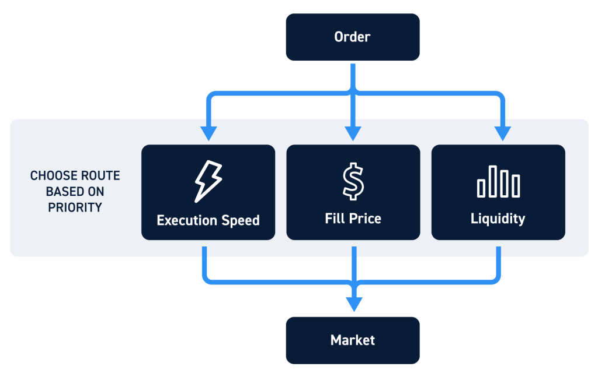

Order routing in algorithmic trading is a crucial component that facilitates the efficient execution of trades in the financial markets. At its core, order routing is the process by which trading orders are directed to different venues or exchanges for execution. This function has gained significant importance with the rise of algorithmic trading systems, which have revolutionized the way trading is conducted in modern financial markets.

Algorithmic trading systems rely on pre-programmed instructions and mathematical models to execute trades at speeds and frequencies that are impossible for human traders. The adoption of these systems has been driven by their ability to process large volumes of data, identify market trends, and execute orders with precision and speed. As these systems have become increasingly sophisticated, the role of order routing has evolved from a simple transactional function to a strategic component aimed at optimizing order execution.



The advancement of technology has enabled the development of complex algorithms designed to enhance the efficiency of order routing. These advanced technologies focus on identifying the most favorable conditions for trade execution, considering factors like price, liquidity, and market volatility. A major area of focus has been optimizing the execution process to achieve lower transaction costs and improved trading outcomes.

The growing complexity and fragmentation of financial markets have necessitated sophisticated order routing techniques. These techniques are vital for ensuring that trades are executed at the best possible price and in the most efficient manner. The emergence of Smart Order Routing (SOR) is a testament to the ongoing innovation in this field. SOR systems are designed to intelligently analyze market data and direct orders to venues where they are most likely to achieve optimal execution results.

This article will explore the intricacies of order routing within the context of algorithmic trading, examining the strategies, benefits, and challenges associated with this critical function. As financial markets continue to evolve with rapid technological advancements, understanding the mechanisms behind order routing will be essential for market participants seeking to leverage the full potential of algorithmic trading.

## Table of Contents

## Understanding Order Routing in Algorithmic Trading

Order routing in algorithmic trading involves the processes by which trade orders are directed to various trading venues for execution. The goal of order routing is to fulfill orders in a manner that optimizes metrics such as price, execution speed, and liquidity access. In financial markets, especially with the proliferation of numerous trading platforms, effective order routing is crucial to achieving favorable trading outcomes.

Algorithmic trading systems enhance order routing by utilizing automated strategies programmed to analyze market conditions and direct orders dynamically across multiple exchanges. These systems assess and react to live market data, leveraging mathematical models and decision-making algorithms to determine how and where to execute trades. By continuously scanning market environments, [algorithmic trading](/wiki/algorithmic-trading) integrates with order routing to optimize factors such as transaction costs and speed of execution.

A significant advancement in this domain is the emergence of Smart Order Routing (SOR) systems. SOR represents an advanced algorithmic approach capable of determining the best possible venue for executing a trade based on a multitude of variables. Factors considered by SOR include the current bid-ask spread, depth of available [liquidity](/wiki/liquidity-risk-premium), and historical performance of specific venues. 

SOR systems apply complex algorithms to efficiently manage trade orders by dynamically selecting routes that ensure optimal compliance with predetermined criteria such as the best possible price or fastest execution time. This strategic decision-making process involves evaluating real-time data from multiple trading venues, thereby enabling traders to capitalize on fleeting market opportunities.

In summary, order routing within algorithmic trading serves as a foundational element for ensuring that trade executions are performed under favorable conditions. Through integration with sophisticated algorithmic systems, order routing capabilities are significantly enhanced, with Smart Order Routing standing out as a key technological advancement that empowers traders with precise and intelligent execution strategies.

## How Smart Order Routing Works

Smart Order Routing (SOR) is a sophisticated mechanism used in algorithmic trading to optimize the execution of orders by intelligently routing them across various trading venues. At its core, SOR analyzes a multitude of factors such as price, liquidity, and timing, to make informed decisions on how and where to execute trades to achieve the best possible outcome.

The mechanism of SOR involves continuous monitoring and analysis of market data. This includes tracking bid-ask spreads, [order book](/wiki/order-book-trading-strategies) depth, and execution speed across multiple exchanges. The goal is to identify the most advantageous venues and times for order execution. SOR uses complex algorithms that can rapidly process this data, often in real-time, to determine the optimal path for an order.

In determining how to route an order, SOR evaluates criteria such as:

1. **Price Improvement**: SOR seeks to execute trades at the best possible price. This involves identifying venues offering prices better than the current National Best Bid and Offer (NBBO).

2. **Liquidity Access**: By analyzing order book data, SOR determines which venues have sufficient liquidity to fulfill large orders without impacting the market price significantly.

3. **Order Timing**: Timeliness is crucial in volatile markets. SOR algorithms decide whether to execute an order immediately or delay it for a potentially better price or more liquidity.

The decision-making process in SOR relies heavily on predictive analytics and historical market data. Machine learning models can be employed to forecast price movements and liquidity conditions, thus refining the routing strategy over time. Here's a simplified Python code snippet illustrating a basic decision-making process based on price and liquidity:

```python
def smart_order_routing(order, venues):
    best_venue = None
    best_price = float('inf')

    for venue in venues:
        current_price = venue.get_current_price(order)
        available_liquidity = venue.get_liquidity(order)

        # Prioritizing best price and sufficient liquidity
        if current_price < best_price and available_liquidity >= order.quantity:
            best_price = current_price
            best_venue = venue

    return best_venue.execute_order(order)
```

In this code, `venues` is a list of trading platforms, each with methods to get price (`get_current_price`) and available liquidity (`get_liquidity`). The algorithm selects the venue offering the best price while ensuring adequate liquidity.

Furthermore, SOR must consider execution costs, such as fees and potential slippage, and adjust its strategies accordingly to minimize them. This involves complex cost-benefit analyses that optimize the net value of executed trades.

Overall, Smart Order Routing plays a critical role in contemporary trading strategies by enhancing the efficiency and success rate of order executions through precise and dynamic decision-making processes.

## Key Strategies and Types of Order Routing

In the field of algorithmic trading, various order routing strategies are employed to optimize trade execution by focusing on different key aspects such as price, speed, and cost. Among the many strategies, some of the most prominent include Best Price, Time-Weighted Average Price (TWAP), Volume-Weighted Average Price (VWAP), and Implementation Shortfall.

**Best Price Strategy** aims to execute orders at the most favorable price available in the market. This strategy prioritizes minimizing the cost of the trade and often involves analyzing multiple quotes from various exchanges to ensure that the order is filled at the lowest possible price. The efficiency of the Best Price strategy is highly dependent on the availability and accuracy of real-time data.

**TWAP (Time-Weighted Average Price)** strategy spreads the execution of an order evenly over a specified period. This approach aims to reduce the market impact of large orders, which could affect the price if executed all at once. By dividing the order into smaller parts and executing them at regular intervals, TWAP ensures an average execution price that is as close as possible to the market's time-weighted price over the given period. The following Python script simulates a basic TWAP execution:

```python
def execute_twap(order_size, duration, market_data):
    interval = duration / order_size
    executed_orders = []
    for i in range(order_size):
        price = market_data.get_current_price()  # hypothetical function to get current price
        executed_orders.append((price, interval))
        market_data.wait(interval)  # wait for the next interval
    return executed_orders
```

**VWAP (Volume-Weighted Average Price)** strategy seeks to execute orders in proportion to the market's prevailing volumes over a specified period. This aims to approximate the execution price to the market's natural price trend, mitigating the risk of sudden price movements impacting the execution cost. VWAP is commonly used when liquidity is variable, and maintaining price stability during execution is critical. The strategy calculates the average price by weighing each transaction price by its respective traded volume.

**Implementation Shortfall**, also known as Arrival Price strategy, focuses on minimizing the difference between the decision price (the price at the time when the decision to trade is made) and the final execution price. This strategy seeks to optimize the trade-off between market impact and delay costs by dynamically adjusting the order execution according to market conditions.

These order routing strategies are selected based on factors such as the size of the order, the market’s liquidity, and the trader's risk preference, ensuring that the trade objectives are achieved efficiently and cost-effectively. Each strategy offers unique advantages and is chosen based on the trader's priorities concerning price accuracy, execution speed, and transaction costs.

## Benefits and Advantages of Effective Order Routing

Efficient order routing in algorithmic trading significantly enhances trade execution by ensuring that orders are filled at optimal prices and within the desired timeframes, thus reducing transaction costs and potentially increasing profit margins. Improved execution quality is one of the foremost benefits of effective order routing. By leveraging intelligent systems, order routing strategies are capable of determining the best destination for trades across multiple markets, ensuring that trades are executed at the most favorable prices while considering factors such as speed and liquidity.

A key advantage of effective order routing is cost reduction. By minimizing the distance and latency between the trader and the market, these systems help lower the overall transaction cost. This can be achieved through minimizing bid-ask spreads and reducing the market impact cost during the execution of large trades. Algorithmic systems achieve this by breaking down large orders into smaller sizes that are less likely to move market prices.

Compliance with regulations is another critical aspect enhanced by effective order routing. Regulatory frameworks, such as MiFID II in Europe and the SEC regulations in the United States, require financial institutions to ensure that they are executing trades in alignment with 'best execution' obligations. Smart Order Routing (SOR) systems are designed to navigate these regulatory landscapes by ensuring that trades are executed in a manner that complies with these requirements, thus reducing the risk of regulatory penalties and ensuring integrity in financial markets.

Incorporating advanced technologies like [machine learning](/wiki/machine-learning) and big data analytics further amplifies the effectiveness of order routing systems. These technologies enable the analysis of vast amounts of market data in real-time, allowing them to adapt to market conditions dynamically and make informed decisions on the fly. The result is a significant reduction in latency and an improvement in execution accuracy.

Overall, the benefits of effective order routing extend beyond mere transaction execution by providing strategic advantages such as cost efficiency, regulatory compliance, and enhanced market competitiveness, making it an indispensable component in the high-speed world of algorithmic trading.

## Challenges and Limitations

Smart Order Routing (SOR) systems are crucial tools in modern algorithmic trading, yet they come with their own set of challenges and limitations. These challenges primarily stem from technological, operational, and regulatory aspects.

One of the primary technological challenges is latency. Latency refers to the time delay between when an order is placed and when it is executed. In the fast-paced trading environment, even microseconds can significantly impact trading outcomes and profitability. The need for high-speed networks and advanced computing systems is paramount to minimize latency, but achieving this often involves considerable investment in infrastructure and technology.

Data quality is another critical issue in implementing SOR. Accurate, timely, and comprehensive market data is essential for the efficient functioning of SOR systems. Poor data quality can lead to suboptimal routing decisions, impacting the execution quality of trades. Ensuring data integrity and dealing with fragmented market data across multiple exchanges requires robust data management systems.

Market [volatility](/wiki/volatility-trading-strategies) poses an additional challenge. During periods of high volatility, market conditions can change rapidly, making it difficult for SOR systems to consistently achieve optimal execution. Volatility can exacerbate issues related to latency and data quality, complicating the decision-making process within SOR systems.

Regulatory hurdles also present significant challenges. The financial markets are subject to stringent regulations aimed at ensuring transparency and fairness. These regulations can vary significantly across different jurisdictions, complicating the deployment of SOR systems that must comply with a diverse set of rules. Adapting to changing regulatory landscapes involves continuous updates to SOR algorithms and compliance procedures.

Lastly, adaptability is a crucial concern. As financial markets and trading technologies evolve, SOR systems must continuously adapt to new conditions and advancements. This requires ongoing development and innovation, which can be resource-intensive and may pose scalability challenges for some firms.

In summary, while Smart Order Routing is a powerful tool for optimizing trade execution, its implementation is fraught with challenges. Addressing issues related to latency, data quality, market volatility, regulatory compliance, and adaptability are crucial for enhancing the efficacy and reliability of SOR systems.

## Technologies Empowering Smart Order Routing

Smart Order Routing (SOR) systems are fundamentally empowered by a suite of advanced technologies, each contributing to enhanced trading efficiency and decision-making capabilities. The integration of algorithmic engines, low-latency networks, machine learning, big data analytics, and cloud computing shapes the backbone of modern SOR solutions.

Algorithmic engines are central to SOR systems, enabling the automatic execution of trading strategies that respond to market conditions in real-time. These engines are equipped with complex algorithms designed to analyze a myriad of market variables to make optimal decisions. For example, they can be programmed to execute a trade only when certain market conditions, such as price thresholds or liquidity levels, are met. By using precise mathematical models, algorithmic engines are capable of minimizing market impact and transaction costs.

Low-latency networks provide the critical infrastructure needed for executing trades at unprecedented speeds. In financial markets, even microsecond delays can lead to significant financial consequences. Low-latency networks reduce the time it takes for information to travel between trading platforms and execution venues, thereby increasing the likelihood of achieving the best possible price. The deployment of fiber optic cables and the strategic placement of servers near exchanges are typical approaches to minimizing latency.

Machine learning (ML) introduces a layer of adaptability and intelligence in SOR systems. ML algorithms can process vast amounts of historical and real-time data to identify patterns and predict market movements. This predictive capability allows SOR systems to enhance their decision-making processes, adapting to market changes dynamically. For instance, [reinforcement learning](/wiki/reinforcement-learning), a type of ML, can be employed to continuously improve the performance of trading strategies based on feedback from past trades.

Big data analytics plays a crucial role in managing and extracting insights from the enormous volumes of data generated by financial markets. In SOR systems, big data technologies facilitate the analysis of structured and unstructured data, offering deeper insights into market behavior. These insights enable more precise strategy adjustments and improve the accuracy of algorithmic predictions.

Cloud computing provides scalable computational resources and storage, which are essential for processing and storing large datasets and running complex algorithms in SOR systems. The elasticity of cloud platforms allows financial institutions to adjust their computational needs based on market activity, ensuring cost-effectiveness and operational efficiency. Cloud computing also supports the collaboration between different trading systems and the integration of diverse data sources, enhancing the overall functionality of smart order routing.

Together, these technologies form a synergistic framework that enhances the sophistication and effectiveness of Smart Order Routing. The continuous evolution and integration of these technologies promise to drive even more advanced SOR capabilities in the future, enabling traders to optimize order execution in increasingly dynamic and fragmented markets.

## Real-World Implementations and Case Studies

Smart Order Routing (SOR) plays a critical role in optimizing trade execution, reducing transaction costs, and improving profitability for financial institutions. Various successful implementations of SOR have been recorded, demonstrating its effectiveness in real-world scenarios.

One notable implementation is by a global investment bank that integrated SOR systems across its trading platforms to enhance trade execution efficiency. The bank employed a multi-asset SOR that was capable of processing equities, derivatives, and fixed income products. The SOR system utilized advanced algorithms to analyze real-time market data and select the optimal venue for order execution based on predefined criteria like price, liquidity, and speed. This platform was instrumental in reducing market impact and slippage costs, leading to significant savings over time.

For another case, a European asset management firm integrated machine learning-enhanced SOR. The system dynamically adjusted routing strategies by learning from historical and real-time trading data. This adaptive approach improved the firm's ability to respond to market changes quickly, optimizing execution strategies to meet specific goals such as minimizing execution costs or achieving specific time-weighted average prices (TWAP). The firm reported a 15% improvement in execution quality and a substantial reduction in trading costs, validating the effectiveness of technology-driven SOR.

Moreover, a major brokerage firm utilized an SOR framework focusing on cost management and meeting regulatory requirements. By implementing a rule-based SOR system, the firm ensured compliance with best execution obligations while strategically managing transaction costs. The framework evaluated available alternate trading systems (ATS) and other dark pools to secure advantageous trade opportunities, thus improving overall client satisfaction and retention.

Collectively, these implementations illustrate the diversity and adaptability of SOR systems in different contexts of financial trading. By leveraging technologies such as algorithmic engines, machine learning, and complex data analytics, financial institutions optimize not only their execution strategies but also manage to enhance their economic efficiencies significantly. As such, Smart Order Routing is an indispensable tool for institutions seeking to maintain a competitive edge in the highly dynamic trading environment.

## Future Trends in Order Routing and Algo Trading

Algorithmic trading and order routing continue to evolve with technological advancements, notably in [artificial intelligence](/wiki/ai-artificial-intelligence) (AI) and blockchain, shaping future dynamics. As AI technologies mature, they increasingly influence predictive analytics and decision-making processes in trading systems. AI's application in order routing enhances the ability to analyze complex market data patterns, improve predictive accuracy, and adapt strategies in real-time. Machine learning models, such as reinforcement learning, are likely to play a central role by continuously learning from market dynamics to optimize trading algorithms autonomously.

Blockchain technology introduces potential shifts in transparency and security within trading operations. The decentralized nature of blockchain may lead to more robust systems for trade verification and settlement, reducing the risk of manipulation and enhancing trust between parties. Smart contracts, a blockchain derivative, might automate execution once specific conditions are met, potentially streamlining operations and lowering costs by eliminating intermediaries.

Regulatory developments are expected to influence Smart Order Routing (SOR) significantly. As regulations evolve to address emerging technologies, they may impose new standards for transparency, data protection, and financial compliance. Regulatory bodies are likely to focus on ensuring that SOR systems incorporate robust risk management and ethical considerations in their algorithms. These changes necessitate adaptability within financial institutions to maintain compliance while leveraging technological advancements.

Market fragmentation is anticipated to increase, driven by the proliferation of alternative trading systems and exchanges offering niche capabilities. Fragmentation presents opportunities and challenges, demanding sophisticated SOR mechanisms to navigate diverse liquidity pools effectively. Innovations in trading technology, such as faster networking infrastructures and enhanced data processing capabilities, will be crucial in managing this complexity. The integration of big data analytics will further empower traders to harness vast amounts of information, refining strategies and execution precision.

In conclusion, the future of order routing and algorithmic trading is poised for significant transformation, propelled by AI and blockchain technology. As these changes unfold, the need for agile, compliant, and technologically adept trading systems will become more pronounced, shaping the competitive landscape of financial markets.

## Conclusion

The conclusion of this exploration into order routing within algorithmic trading underlines its pivotal role in modern financial markets. Order routing, leveraging smart technologies, has become integral to optimizing trade execution, thereby enhancing performance and profitability of trading strategies. Smart Order Routing (SOR) stands out as a crucial advancement, continually adapting to improve decision-making through sophisticated algorithms that analyze market factors such as price, liquidity, and timing.

The strategic importance of SOR cannot be overstated, given how it reduces trading costs and elevates execution quality, aligning with regulatory standards and ensuring competitive advantage. As markets grow more complex with fragmentation, the need for efficient order routing technologies will only intensify, highlighting the necessity for continuous innovation.

Looking forward, sustained attention is indispensable on technological advancements such as artificial intelligence, machine learning, and blockchain technologies. These innovations are poised to further revolutionize order routing systems, enhancing their capability to process massive datasets with reduced latency and increased precision. Regulatory developments will also shape the landscape, emphasizing transparency and ethical trading practices.

In summary, order routing in algorithmic trading is on a trajectory of constant evolution, adapting to modern challenges and opportunities. This trajectory underscores the need for financial institutions to not only adopt advanced technological solutions but also to invest in their continuous refinement, ensuring that they remain at the forefront of trading efficiency and effectiveness.

## References & Further Reading

[1]: Harris, L. (2003). ["Trading and Exchanges: Market Microstructure for Practitioners"](https://www.amazon.com/Trading-Exchanges-Market-Microstructure-Practitioners/dp/0195144708). Oxford University Press.

[2]: Lopez de Prado, M. (2018). ["Advances in Financial Machine Learning"](https://books.google.com/books/about/Advances_in_Financial_Machine_Learning.html?id=oU9KDwAAQBAJ). Wiley.

[3]: Chan, E. P. (2008). ["Quantitative Trading: How to Build Your Own Algorithmic Trading Business"](https://github.com/ftvision/quant_trading_echan_book). Wiley.

[4]: Jansen, S. (2020). ["Machine Learning for Algorithmic Trading: Predictive models to extract signals from market and alternative data for systematic trading strategies with Python"](https://github.com/stefan-jansen/machine-learning-for-trading). Packt Publishing.

[5]: Kissell, R. (2013). ["The Science of Algorithmic Trading and Portfolio Management"](https://www.sciencedirect.com/book/9780124016897/the-science-of-algorithmic-trading-and-portfolio-management). Academic Press.

[6]: Zug, S., Tremblay, T., & Gottschlich, J. (2019). ["Smart Order Routing: Design, Testing, and Application of a Novel SOR System"](https://pubmed.ncbi.nlm.nih.gov/28555522/). IEEE Access.

[7]: Hasbrouck, J. (2007). ["Empirical Market Microstructure: The Institutions, Economics, and Econometrics of Securities Trading"](https://academic.oup.com/book/52241). Oxford University Press.