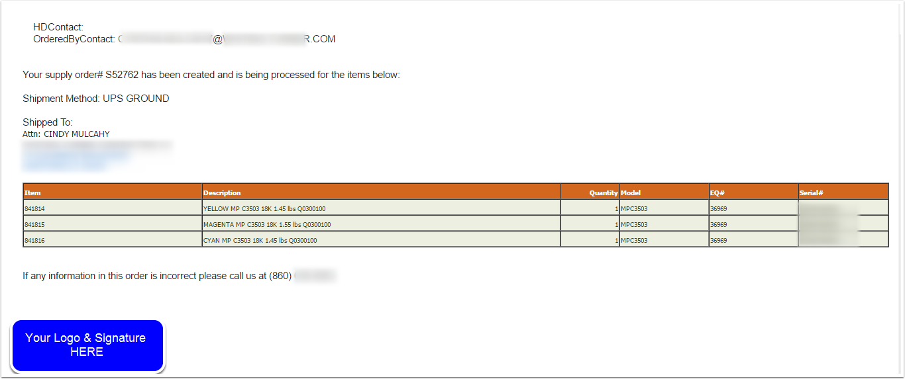

## Table of Contents

## What is the 'Order-Sends-Order' pattern?

The 'Order-Sends-Order' pattern is a way to organize how messages are sent between different parts of a computer program. Imagine you have a big system where different parts need to talk to each other. In this pattern, when one part of the system wants to send a message, it doesn't send it directly. Instead, it sends an order or a request to another part, which then sends the actual message. This helps keep things organized and makes it easier to manage how messages move around.

Using this pattern can make a system more flexible and easier to change. If you need to update how messages are sent, you only need to change the part that actually sends the message, not every part that wants to send a message. This can save time and reduce mistakes. It's like having a mailroom in an office; instead of everyone going to the post office, they give their letters to the mailroom, which then takes care of sending them out.

## How does the 'Order-Sends-Order' pattern differ from other design patterns?

The 'Order-Sends-Order' pattern is unique because it focuses on organizing how messages are sent within a system. Unlike other patterns that might deal directly with how data is processed or stored, this pattern is all about managing communication. It uses an intermediary to handle the sending of messages, which means the parts of the system that need to communicate don't have to know the details of how the messages are actually sent. This is different from patterns like the Observer pattern, where objects directly notify each other of changes, or the Command pattern, which encapsulates a request as an object.

In comparison to other patterns, the 'Order-Sends-Order' pattern adds an extra layer of abstraction specifically for communication. For example, in the Mediator pattern, a central object coordinates communication between other objects, but it's more about controlling interactions than just sending messages. The 'Order-Sends-Order' pattern, on the other hand, is simpler and more focused on the act of sending messages, making it easier to change how messages are sent without affecting the rest of the system. This makes it particularly useful in systems where the communication method might need to change frequently or where you want to keep the message-sending logic separate from other parts of the system.

## Can you provide a simple example of the 'Order-Sends-Order' pattern in action?

Imagine you have a school where teachers need to send homework assignments to students. Instead of each teacher figuring out how to send the assignments themselves, they use a school secretary. When a teacher wants to send homework, they give it to the secretary and say, "Please send this to the students." The secretary then takes care of sending the homework, maybe by email, text, or even by handing out papers. This way, the teachers don't need to know how the homework gets to the students; they just need to give it to the secretary.

In this example, the teacher is like the part of the system that wants to send a message, the homework is the message itself, and the secretary is the part that actually sends the message. If the school decides to change how homework is sent, like switching from email to a new app, only the secretary needs to learn the new way. The teachers can keep doing what they're doing, which makes things easier for everyone. This is how the 'Order-Sends-Order' pattern works: it keeps the message-sending logic separate and makes the system more flexible.

## What are the key components involved in the 'Order-Sends-Order' pattern?

The 'Order-Sends-Order' pattern involves two main parts: the sender and the intermediary. The sender is the part of the system that wants to send a message. Instead of sending it directly, the sender gives the message to the intermediary with instructions on what to do with it. The intermediary is like a middleman that takes care of actually sending the message. This setup helps keep things organized because the sender doesn't need to know how the message gets sent; it just needs to pass it along to the intermediary.

Using this pattern makes it easier to change how messages are sent without messing up the rest of the system. If you want to change the way messages are sent, you only need to update the intermediary. The senders can keep working the same way, which saves time and reduces mistakes. This makes the system more flexible and easier to manage, especially in big systems where lots of parts need to talk to each other.

## What are the benefits of using the 'Order-Sends-Order' pattern in software development?

Using the 'Order-Sends-Order' pattern in software development makes things easier to manage. When different parts of a program need to send messages, this pattern helps keep everything organized. Instead of each part figuring out how to send its messages, they all give their messages to a special part called the intermediary. This intermediary takes care of sending the messages. This way, if you need to change how messages are sent, like switching from emails to texts, you only need to update the intermediary. The rest of the program can keep working the same way, which saves time and reduces mistakes.

The 'Order-Sends-Order' pattern also makes software more flexible. Since the parts that want to send messages don't need to know the details of how the messages are sent, you can change the communication method without affecting the rest of the system. This is really helpful in big systems where lots of parts need to talk to each other. It's like having a mailroom in an office; instead of everyone going to the post office, they give their letters to the mailroom, which then takes care of sending them out. This makes the whole system easier to update and maintain.

## What are the potential drawbacks or challenges when implementing the 'Order-Sends-Order' pattern?

One challenge of using the 'Order-Sends-Order' pattern is that it can make things a bit more complicated at first. You have to set up an extra part of the system, the intermediary, which means more work to get everything running. This can take more time and might be confusing for people who are new to the system. Also, if the intermediary has a problem, it can stop messages from getting through, which could be a big issue if the system depends a lot on those messages.

Another potential drawback is that adding this extra step can slow things down a bit. Every message has to go through the intermediary, which might add a little delay. In systems where speed is really important, this could be a problem. But if you plan carefully and make sure the intermediary is fast and reliable, you can keep these issues under control. Overall, while the 'Order-Sends-Order' pattern can make a system more flexible and easier to change, it does come with some challenges that need to be managed.

## How can the 'Order-Sends-Order' pattern be applied in different programming languages?

The 'Order-Sends-Order' pattern can be used in many programming languages like Python, Java, or JavaScript. In these languages, you would create a class or function that acts as the intermediary. This intermediary would have a method that takes in a message and the instructions on where to send it. For example, in Python, you could make a class called `MessageSender` with a method `send_message` that takes in a message and a destination. When another part of the program wants to send a message, it would call `MessageSender.send_message(my_message, "students")`, and the `MessageSender` would handle the actual sending.

The key thing in all these languages is to keep the code that sends the message separate from the code that wants to send it. This makes it easier to change how messages are sent later on. If you decide to switch from sending messages by email to sending them by text, you would only need to change the `MessageSender` class or function. The rest of your program can keep working the same way, which makes updating the system simpler and less likely to cause problems.

## What are some real-world applications or case studies where the 'Order-Sends-Order' pattern has been successfully implemented?

In a large e-commerce platform, the 'Order-Sends-Order' pattern was used to manage communications between different parts of the system. When a customer places an order, the order processing module doesn't send notifications directly to the customer. Instead, it sends the notification request to a notification service, which then decides whether to send the notification via email, SMS, or push notification. This approach allowed the platform to easily switch between different notification methods without changing the core order processing logic. As a result, the platform could adapt quickly to new communication technologies and customer preferences, improving customer satisfaction and reducing the complexity of system updates.

Another example is in a healthcare system where patient records need to be shared among various departments. Instead of each department figuring out how to send records to others, they use a central communication hub. When a doctor needs to send a patient's record to another department, they send a request to the hub, which then handles the actual transmission. This made it easier to update the system when new departments were added or when the method of sending records changed, like moving from fax to secure email. The 'Order-Sends-Order' pattern helped keep the system flexible and efficient, ensuring that patient care was not disrupted by technical changes.

## How does the 'Order-Sends-Order' pattern contribute to scalability in large systems?

The 'Order-Sends-Order' pattern helps make large systems more scalable by keeping the way messages are sent separate from the rest of the system. When a part of the system wants to send a message, it just gives the message to an intermediary, which then takes care of sending it. This means that if you need to handle more messages as the system grows, you only need to change how the intermediary works, not every part that wants to send messages. This makes it easier to add more parts to the system or handle more users without messing up the whole thing.

This pattern also makes it simpler to update the system as it gets bigger. If you decide to change how messages are sent, like switching from emails to texts, you just need to update the intermediary. The rest of the system can keep working the same way. This saves time and reduces the chance of mistakes when you're trying to make the system bigger. So, the 'Order-Sends-Order' pattern helps large systems grow smoothly and handle more work without getting too complicated.

## What are the best practices for testing systems that utilize the 'Order-Sends-Order' pattern?

When testing systems that use the 'Order-Sends-Order' pattern, it's important to focus on the intermediary part of the system. You should test the intermediary to make sure it can send messages correctly. Try sending different types of messages and check if they get to the right place. Also, test what happens if the intermediary has a problem or if it gets a lot of messages at once. This will help you find and fix any issues before they cause problems in the real system.

Another good practice is to test how the rest of the system works with the intermediary. Make sure that when a part of the system wants to send a message, it can do so easily and correctly. You should also test what happens if the intermediary changes how it sends messages, like switching from emails to texts. This will help you see if the rest of the system can keep working without any trouble. By testing both the intermediary and how it works with the rest of the system, you can make sure the whole thing runs smoothly and can handle changes well.

## How can the 'Order-Sends-Order' pattern be optimized for performance?

To make the 'Order-Sends-Order' pattern work faster, you can start by making the intermediary part of the system as quick as possible. This means using fast code and maybe even special tools that help send messages quickly. If the intermediary can handle a lot of messages at once without slowing down, the whole system will run better. You might also want to use something called caching, which means keeping some messages ready to go so they can be sent out faster when needed.

Another way to speed things up is to make sure the intermediary doesn't get too busy. If it has to do too much at once, it can slow down. You can fix this by adding more intermediaries to share the work or by making the system smarter about when and how it sends messages. By keeping the intermediary quick and not too busy, the 'Order-Sends-Order' pattern can help the whole system run faster and handle more work without problems.

## What advanced techniques can be used to extend the functionality of the 'Order-Sends-Order' pattern?

To make the 'Order-Sends-Order' pattern do more, you can add something called a "queue" to the intermediary. A queue is like a line where messages wait their turn to be sent. This helps the system handle lots of messages without getting overwhelmed. You can also make the intermediary smarter by letting it decide which messages are more important and send those first. This is called "priority queuing," and it can make sure important messages get through quickly, even when the system is busy.

Another way to extend the pattern is by using "message transformation." This means the intermediary can change the message before sending it, like translating it into another language or changing its format to fit different systems. This makes the system more flexible because it can work with all kinds of messages and send them to different places without needing to change the rest of the system. By adding these advanced techniques, the 'Order-Sends-Order' pattern can handle more types of messages and work better in different situations.

## What are the Key Components of OSO Trading Algorithms?

Order-Sends-Order (OSO) trading algorithms are designed to enhance order execution by automating sequence-based trading actions. These algorithms leverage mathematical models to ensure optimal order placements and executions.

### Algorithms and Mathematical Models

OSO trading strategies primarily rely on decision-making algorithms that can efficiently manage conditional orders. These algorithms often incorporate statistical models, such as regression analysis or Machine Learning (ML) models, to predict price movements based on historical data. For instance, a simple regression model predicting the next price can be represented as:

$$

\hat{Y} = \beta_0 + \beta_1 X_1 + \beta_2 X_2 + \ldots + \beta_n X_n 
$$

where $\hat{Y}$ is the predicted price, $X_1, X_2, \ldots, X_n$ are explanatory variables such as historical prices, volume, market indicators, etc., and $\beta_0, \beta_1, \ldots, \beta_n$ are coefficients determined through model training.

### Technological Requirements

Implementing an effective OSO strategy requires robust technological infrastructure. High-performance computing systems, equipped with low-latency connectivity to financial markets, are essential. Traders often use servers with significant processing power, high-speed network interfaces, and SSD storage for swift data retrieval and computational efficiency.

On the software side, programming languages like Python, C++, and R are commonly used due to their extensive libraries for data analysis and algorithm development. Trading platforms may require custom interfaces (APIs) for order management and execution, which necessitate reliable software frameworks and architectures for real-time market data handling.

### Data Sources and Inputs

The backbone of any OSO trading strategy is the quality and variety of data inputs. Historical price data, real-time market feeds, economic indicators, and sentiment analysis from news and social media are commonly used data sources. Additionally, access to trading volumes, [order book](/wiki/order-book-trading-strategies) depth, and transaction costs are crucial for estimating market dynamics and [liquidity](/wiki/liquidity-risk-premium).

One of the key data processing tasks is feature extraction, where raw data is transformed into useful signals for the trading algorithm. For example, moving averages and Bollinger Bands can be calculated from historical price data to inform trading decisions.

```python
# Basic example in Python to compute a simple moving average
import pandas as pd

def calculate_sma(data, window_size):
    return data['close'].rolling(window=window_size).mean()

data = pd.DataFrame({'close': [146.92, 147.45, 148.05, 149.12]})
window_size = 3
sma = calculate_sma(data, window_size)
```

### Backtesting Importance

Backtesting is a critical process in OSO trading strategy development. It involves running algorithms against historical data to assess their performance and viability. By simulating trades using past data, developers can identify the strengths and weaknesses of their strategies, enabling refinement and optimization before deploying in live markets. Backtesting helps in understanding how the strategy might react to different market conditions and can significantly reduce the risk of unexpected outcomes in live trading.

### Platforms and Tools

Several platforms facilitate the development and testing of OSO trading strategies. Quantitative analysis tools such as QuantConnect, MetaTrader, and NinjaTrader offer comprehensive solutions for [backtesting](/wiki/backtesting) and executing automated trading strategies. These platforms provide integrated development environments, simulation capabilities, and access to vast historical and real-time data sources, simplifying the overall process of strategy development.

In summary, the success of OSO trading algorithms relies heavily on sophisticated mathematical models, state-of-the-art technology, comprehensive data inputs, and rigorous backtesting practices, supported by advanced platforms that streamline development and execution.

## References & Further Reading

[1]: Bergstra, J., Bardenet, R., Bengio, Y., & Kégl, B. (2011). ["Algorithms for Hyper-Parameter Optimization."](https://papers.nips.cc/paper/4443-algorithms-for-hyper-parameter-optimization) Advances in Neural Information Processing Systems 24.

[2]: ["Advances in Financial Machine Learning"](https://www.amazon.com/Advances-Financial-Machine-Learning-Marcos/dp/1119482089) by Marcos Lopez de Prado

[3]: ["Evidence-Based Technical Analysis: Applying the Scientific Method and Statistical Inference to Trading Signals"](https://www.amazon.com/Evidence-Based-Technical-Analysis-Scientific-Statistical/dp/0470008741) by David Aronson

[4]: ["Machine Learning for Algorithmic Trading"](https://github.com/stefan-jansen/machine-learning-for-trading) by Stefan Jansen

[5]: ["Quantitative Trading: How to Build Your Own Algorithmic Trading Business"](https://www.amazon.com/Quantitative-Trading-Build-Algorithmic-Business/dp/1119800064) by Ernest P. Chan