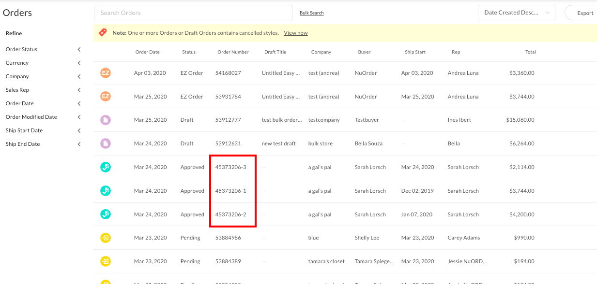

## Table of Contents

## What is order splitting?

Order splitting is when a big order is divided into smaller parts. This can happen for many reasons. For example, a store might not have enough of one item in stock, so they send what they have now and the rest later. Or, a company might split an order to send different parts from different places, which can be faster or cheaper.

Splitting orders can be good because it helps get things to customers faster, even if not everything can be sent at once. But it can also be bad because it might confuse customers or make them unhappy if they don't know why their order came in pieces. Companies need to tell customers clearly when and why they are splitting orders to keep everyone happy.

## Why do businesses use order splitting?

Businesses use order splitting to make sure customers get their items as quickly as possible. If a store doesn't have all the items a customer ordered in stock, they can send what they have right away and the rest later. This way, customers don't have to wait for everything to be ready before getting anything. It's like getting a part of your birthday present early instead of waiting for the whole thing.

Another reason businesses split orders is to save money and time. Sometimes, it's cheaper or faster to send different parts of an order from different places. For example, if a customer orders items that are stored in different warehouses, the business can send each item from the closest warehouse. This can reduce shipping costs and speed up delivery. However, businesses need to communicate clearly with customers about why their order is being split to avoid confusion or dissatisfaction.

## What are the basic steps involved in order splitting?

When a business decides to split an order, the first step is to check what items are available right away. If some items are in stock and others are not, the business will send out the items that are ready. This means they will pack and ship the available items to the customer as soon as possible. At the same time, they will keep track of the items that are not yet available, so they can send them later when they are ready.

The next step is to communicate with the customer. The business needs to let the customer know that their order is being split and why. They will explain that some items will arrive sooner than others. This helps to manage the customer's expectations and avoid any confusion or disappointment. Clear communication is key to making sure the customer understands and is happy with the process.

Finally, the business will continue to monitor the rest of the order. Once the remaining items are in stock, they will pack and ship them to the customer. The business will keep the customer updated on the status of their order, so they know when to expect the rest of their items. This way, even though the order is split, the customer gets everything they ordered, just at different times.

## Can you provide a simple example of order splitting?

Imagine you ordered a new backpack and a water bottle from an online store. The store has the backpack in stock but they are waiting for more water bottles to arrive. Instead of making you wait for both items, the store decides to split your order. They pack and send the backpack to you right away. A few days later, once the water bottles are back in stock, they send the water bottle to you separately.

The store sends you an email to let you know that your order is being split. They explain that you will get the backpack soon, but the water bottle will come a bit later. This way, you know what to expect and you're happy because you get to use your new backpack without waiting for the water bottle.

## What are the benefits of order splitting for small businesses?

Order splitting can help small businesses by letting them send out items to customers faster. If a small business doesn't have all the items a customer ordered, they can still send what they have right away. This makes customers happy because they don't have to wait for everything to be ready. For example, if a customer orders a shirt and a hat, but the hat is out of stock, the business can send the shirt now and the hat later when it's back in stock. This way, the customer gets to enjoy the shirt without waiting longer for both items.

Another benefit is that order splitting can save small businesses money. Sometimes, it's cheaper to send items from different places. If a small business has items stored in different locations, they can send each item from the closest place to the customer. This can lower shipping costs and make the delivery faster. By telling customers clearly about the split order, small businesses can keep their customers happy while also saving money and time.

## How does order splitting affect inventory management?

Order splitting affects inventory management by requiring businesses to keep a closer eye on what items they have and what they don't. When a business decides to split an order, they need to check their inventory to see which items are in stock and can be sent right away. This means they need to update their inventory records more often to make sure they know exactly what is available at any time. If they don't keep good track of their inventory, they might accidentally send out items that they thought were in stock but weren't, which can lead to delays and unhappy customers.

Also, order splitting can make inventory management more complicated because businesses have to manage multiple shipments for the same order. They need to keep track of which parts of an order have been sent and which parts are still waiting to be shipped. This can be challenging, especially for small businesses that might not have advanced inventory management systems. However, if done correctly, it can help businesses use their inventory more efficiently by sending out available items quickly and holding onto items that are out of stock until they can be replenished.

## What are the potential challenges or risks associated with order splitting?

Order splitting can be tricky for businesses because it makes things more complicated. When a business splits an order, they have to keep track of which parts have been sent and which are still waiting. This can be hard, especially if they don't have good systems to manage their inventory. If they make a mistake, like sending out an item that's not in stock, it can cause delays and make customers unhappy. Also, splitting orders means more work because the business has to pack and ship items multiple times for the same order, which can take more time and cost more money.

Another challenge is that order splitting can confuse or upset customers if it's not explained well. If customers don't know why their order is coming in pieces, they might think the business made a mistake or is not reliable. This can damage the business's reputation. Clear communication is really important to make sure customers understand what's happening and why. But even with good communication, some customers might still be unhappy because they have to wait longer for some items or because they get multiple deliveries instead of one.

## How can technology facilitate order splitting?

Technology can help businesses split orders more easily by using special software. This software keeps track of what items are in stock and what items are not. When a customer places an order, the software can automatically decide which items to send right away and which to send later. It can also update the business's inventory records in real-time, so they always know what they have. This makes it easier for businesses to manage their inventory and make sure they send out the right items at the right time.

Another way technology helps is by making it easier to talk to customers. When an order is split, businesses can use email or text messages to let customers know what's happening. They can send automatic updates to keep customers informed about when different parts of their order will arrive. This helps customers understand why their order is coming in pieces and makes them feel more comfortable with the process. Using technology like this can make order splitting smoother and keep everyone happy.

## What advanced strategies can be used to optimize order splitting?

To make order splitting work better, businesses can use smart strategies to plan how they send out orders. One good idea is to use data to predict what items will be in stock and when. By looking at past orders and how quickly items sell, businesses can guess when they will need to restock certain items. This helps them decide which parts of an order to send first and which to hold back until everything is ready. Another strategy is to group items that are often bought together. If a customer orders items that are usually bought as a set, the business can try to send them all at once, even if it means waiting a bit longer. This can make the customer happier because they get their items the way they expected.

Another way to improve order splitting is by using technology to make things run smoother. Businesses can use special software that automatically decides how to split orders based on what's in stock and where items are stored. This software can also help plan the best way to ship items, like choosing the closest warehouse to send from, which can save time and money. It's also important to keep customers in the loop. By sending them regular updates about their order, businesses can make sure customers know what's happening and why their order is coming in pieces. Clear communication can make a big difference in keeping customers happy, even when orders are split.

## How does order splitting integrate with supply chain management?

Order splitting is a big part of supply chain management because it helps businesses send out orders faster and use their resources better. When a business gets an order, they look at their inventory to see what items they have right away. If some items are out of stock, they can still send the items they do have to the customer without waiting for everything to be ready. This means they need to keep close track of what's in their warehouses and where items are coming from. By splitting orders, businesses can make sure customers get at least part of their order quickly, which is good for keeping customers happy.

To make order splitting work well with supply chain management, businesses use special software and data to plan their shipments. This software helps them decide which parts of an order to send first and how to get items from different places to the customer as fast as possible. It also helps them predict when items will be back in stock so they can plan when to send the rest of the order. Good communication is also important. Businesses need to tell customers clearly about the split order and keep them updated on when they will get the rest of their items. This way, even though the order is split, the whole supply chain works together to make sure customers get everything they ordered in the best way possible.

## Can you discuss a case study where order splitting significantly impacted a business?

A good example of how order splitting helped a business is the case of a small online clothing store called "Fashion Forward." They noticed that many customers were ordering multiple items, but sometimes not all items were in stock. Instead of making customers wait for everything, Fashion Forward started splitting orders. They would send out the items they had right away and let customers know that the rest would come later. This made customers happier because they didn't have to wait as long to get at least some of their order. As a result, Fashion Forward saw an increase in customer satisfaction and repeat business.

However, order splitting also brought some challenges. At first, Fashion Forward struggled with keeping track of which parts of orders had been sent and which were still waiting. They had to work hard to make sure their inventory records were always up to date. They also had to be very clear with customers about why their orders were coming in pieces. To solve these problems, Fashion Forward invested in better inventory management software. This software helped them keep better track of their stock and plan their shipments more efficiently. Over time, they got better at managing split orders, and it became a key part of their success.

## What future trends might influence the practice of order splitting?

In the future, more businesses might use smart technology to make order splitting easier and faster. They could use artificial intelligence to predict what items will be in stock and when. This would help them decide which parts of an order to send first and how to send them in the best way. Also, as more people shop online, businesses will need to find ways to make sure customers get their orders quickly and correctly. Order splitting could become more common as a way to keep customers happy by sending out items as soon as they are ready.

Another trend that might affect order splitting is the focus on being green and saving the environment. Businesses might try to combine shipments to reduce the number of deliveries, which can help lower their carbon footprint. But they still want to send out orders quickly. So, they might use technology to find the best balance between speed and being eco-friendly. As these trends grow, businesses will need to keep finding new ways to manage their inventory and communicate with customers to make order splitting work well.

## What are the Types of Order-Splitting Algorithms?

Different order-splitting algorithms serve specific functions based on various market conditions and trading objectives. These algorithms enhance trade execution, focusing on minimizing market impact and optimizing transaction costs.

**Time-Weighted Average Price (TWAP)** distributes orders evenly throughout a predetermined time interval. The primary objective of TWAP is to achieve an average execution price over the specified period. TWAP is especially beneficial in low-liquidity markets or when the intent is to minimize visibility and market impact. By evenly spacing trades, TWAP ensures that the execution price is less influenced by short-term volatility and market fluctuations.

Mathematically, TWAP can be represented as:

$$
\text{TWAP} = \frac{\sum_{i=1}^{N} P_i}{N}
$$

where $P_i$ is the price of each executed portion, and $N$ is the total number of portions.

**Volume-Weighted Average Price (VWAP)** aims to align order execution with market volume, thereby minimizing market impact by executing a larger proportion of the order during periods of higher liquidity. VWAP is widely used by traders to execute large orders with minimal price distortion and is a benchmark for assessing trade execution efficiency.

The VWAP formula is given by:

$$
\text{VWAP} = \frac{\sum_{i=1}^{N} P_i \times Q_i}{\sum_{i=1}^{N} Q_i}
$$

where $P_i$ is the price and $Q_i$ is the quantity for each trade. This approach balances execution throughout the trading session, adhering to the natural volume pattern of the security.

**Implementation Shortfall**, also known as Arrival Price, focuses on reducing the difference between the initial decision price and the final execution price. This algorithm dynamically adjusts trading strategies based on real-time market conditions. By doing so, it aims to strike a balance between speed and market impact, optimizing the execution to reflect near the decision price.

This approach requires calculating the implementation shortfall, expressed as:

$$
\text{IS} = (\text{Execution Price} - \text{Decision Price}) \times \text{Quantity}
$$

This metric considers both price movements and opportunity costs and is vital in evaluating execution quality.

In summary, choosing the appropriate order-splitting algorithm requires evaluating market conditions, trading objectives, and liquidity. Each algorithm offers unique benefits, from modest market presence to optimal execution cost management, contributing to efficient trading strategies.

## References & Further Reading

[1]: Almgren, R., & Chriss, N. (2000). ["Optimal execution of portfolio transactions."](https://smallake.kr/wp-content/uploads/2016/03/optliq.pdf) Journal of Risk, 3(2), 5-39.

[2]: Kissell, R., & Glantz, M. (2003). ["Optimal Trading Strategies: Quantitative Approaches for Managing Market Impact and Trading Risk."](https://archive.org/details/optimaltradingst0000kiss) AMACOM.

[3]: Hasbrouck, J. (2007). ["Empirical Market Microstructure: The Institutions, Economics, and Econometrics of Securities Trading."](https://academic.oup.com/book/52241) Oxford University Press.

[4]: Gould, M. D., Porter, M. A., Williams, S., McDonald, M., Fenn, D. J., & Howison, S. D. (2013). ["Limit order books."](https://arxiv.org/abs/1012.0349) Quantitative Finance, 13(11), 1703-1711.

[5]: Chan, E. (2009). ["Quantitative Trading: How to Build Your Own Algorithmic Trading Business."](https://github.com/ftvision/quant_trading_echan_book) Wiley.