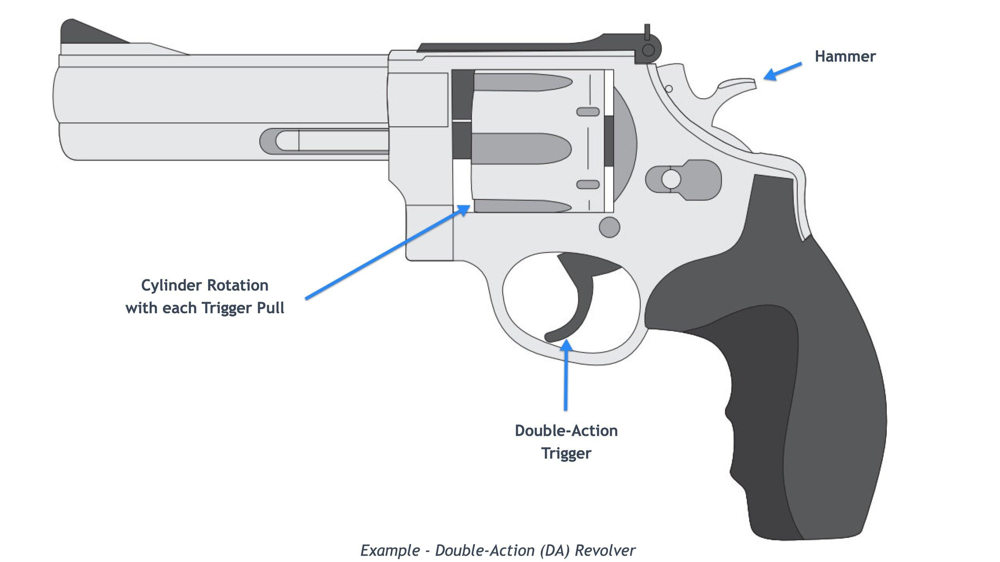

## Table of Contents

## What is the Order-Triggers-Two Mechanism?

The Order-Triggers-Two Mechanism is a strategy used in trading and investing. It means that when someone places an order to buy or sell a stock, it automatically triggers two other orders. These two orders are usually set to limit losses or to take profits.

This mechanism helps traders manage their risks better. For example, if a trader buys a stock, the first triggered order might be a stop-loss order. This order sells the stock if its price drops to a certain level, preventing big losses. The second order could be a take-profit order, which sells the stock when it reaches a higher price, locking in gains. This way, the trader can set up their trades to work automatically, without needing to watch the market all the time.

## How does the Order-Triggers-Two Mechanism work?

The Order-Triggers-Two Mechanism is a smart way to handle trading. When you place an order to buy or sell a stock, it automatically sets up two more orders. These extra orders help you manage your trades better. One order is called a stop-loss order. It sells your stock if the price goes down too much. This helps you avoid losing a lot of money. The other order is a take-profit order. It sells your stock when the price goes up to a level you're happy with. This way, you can make sure you keep some of the profit.

Using this mechanism is like setting up a safety net for your trades. You don't have to watch the market all the time because the orders work on their own. For example, if you buy a stock and its price starts to drop, the stop-loss order will kick in and sell the stock before you lose too much. If the stock's price goes up, the take-profit order will sell it at your desired profit level. This makes trading easier and helps you manage your risks better.

## What are the key components of the Order-Triggers-Two Mechanism?

The Order-Triggers-Two Mechanism is made up of three main parts: the initial order, the stop-loss order, and the take-profit order. The initial order is when you decide to buy or sell a stock. Once you place this order, it automatically triggers the other two orders. This setup helps you manage your trades without having to watch the market all the time.

The stop-loss order is very important because it protects you from losing too much money. It works by selling your stock if the price drops to a certain level that you set beforehand. This way, you can limit your losses. On the other hand, the take-profit order helps you lock in your gains. It sells your stock when the price reaches a level where you are happy with the profit. Together, these three orders make trading easier and safer.

## What are the benefits of using the Order-Triggers-Two Mechanism?

The Order-Triggers-Two Mechanism makes trading easier and safer. When you place an order to buy or sell a stock, it automatically sets up two more orders for you. This means you don't have to watch the market all the time. You can set it up and let it work on its own. This is really helpful if you have other things to do and can't always check your trades.

One big benefit is that it helps you manage your risks better. The stop-loss order protects you by selling your stock if the price drops too much. This way, you won't lose a lot of money. The take-profit order helps you make sure you keep some of the profit by selling the stock when the price goes up to a level you're happy with. Using this mechanism can help you trade more confidently because you have a plan in place to handle both gains and losses.

## Can you provide a simple example of the Order-Triggers-Two Mechanism in action?

Imagine you want to buy a stock that is currently priced at $50. You decide to use the Order-Triggers-Two Mechanism to help manage your trade. So, you place an order to buy 100 shares of this stock at $50. As soon as you place this order, two more orders are automatically set up for you.

The first order is a stop-loss order. You set this order to sell your 100 shares if the stock price drops to $45. This way, if the stock price goes down, you won't lose more than $5 per share. The second order is a take-profit order. You set this order to sell your 100 shares if the stock price goes up to $60. This means if the stock price goes up, you'll make a profit of $10 per share. With these orders in place, you can feel more secure about your trade without having to watch the market all the time.

## What industries commonly use the Order-Triggers-Two Mechanism?

The Order-Triggers-Two Mechanism is often used in the financial industry, especially by traders and investors in stock markets. People who buy and sell stocks use this method to manage their trades better. It helps them set up rules for when to sell their stocks, either to avoid losing too much money or to make sure they keep some profit. This way, they can trade without having to watch the market all the time.

The mechanism is also used in the [forex](/wiki/forex-system) market, where people trade currencies. Forex traders use it to handle their currency trades in a similar way to stock traders. They set up orders to automatically sell currencies if the price goes down too much or if it goes up to a level where they want to take their profit. This helps them manage the risks of trading currencies, which can be very fast-moving and unpredictable.

## How does the Order-Triggers-Two Mechanism compare to other similar mechanisms?

The Order-Triggers-Two Mechanism is a bit like other trading tools but has its own special way of working. One similar tool is the One-Cancels-the-Other (OCO) order. With an OCO order, you set up two orders at the same time, but if one order gets filled, the other one gets canceled. This is different from the Order-Triggers-Two Mechanism, where both orders stay active no matter what happens. The OCO order is good for when you want to either buy at a lower price or sell at a higher price, but not both. The Order-Triggers-Two Mechanism is better for when you want to make sure you have both a stop-loss and a take-profit order working at the same time.

Another similar tool is the Trailing Stop order. A Trailing Stop order moves with the price of the stock, always staying a certain distance away. If the stock price goes up, the Trailing Stop order goes up too, but if the price goes down, the order stays where it is. This can help you keep more profit if the price keeps going up. The Order-Triggers-Two Mechanism doesn't move with the price like this. It sets fixed levels for when to sell, which can be good if you want to know exactly when your orders will be triggered. Both tools help manage risk, but they do it in different ways.

## What are the potential challenges or limitations of implementing the Order-Triggers-Two Mechanism?

Using the Order-Triggers-Two Mechanism can be tricky because it depends a lot on the prices you set for your stop-loss and take-profit orders. If you set these prices too close to the current price, your orders might get triggered too soon. This means you could miss out on bigger profits if the stock price keeps going up, or you might sell too early and still lose money if the price drops a bit more. On the other hand, if you set the prices too far away, you might end up losing more money than you wanted to if the stock price falls a lot, or you might not make as much profit as you could if the price goes up but doesn't reach your take-profit level.

Another challenge is that the stock market can be unpredictable. Sometimes, the price of a stock can move very quickly because of news or other events. If this happens, your stop-loss order might get triggered even if the price goes back up right after. This is called a "whipsaw," and it can make you lose money even though the stock might have been a good investment in the long run. Also, using this mechanism means you have to trust that the system will work correctly, and there's always a small chance that something could go wrong with the technology or the trading platform.

## How can the effectiveness of the Order-Triggers-Two Mechanism be measured?

The effectiveness of the Order-Triggers-Two Mechanism can be measured by looking at how well it helps you make money and avoid losing too much. You can check this by comparing the results of your trades with and without using the mechanism. If you see that you're making more profit and losing less money when you use it, then it's working well for you. Another way to measure its effectiveness is by looking at how often your stop-loss and take-profit orders are triggered. If your stop-loss orders are saving you from big losses and your take-profit orders are helping you lock in gains, then the mechanism is doing its job.

It's also important to think about how the mechanism fits with your trading style and goals. If you're someone who likes to watch the market all the time, you might not need this mechanism as much. But if you're busy and can't always check your trades, then the Order-Triggers-Two Mechanism can be very helpful. You can also measure its effectiveness by seeing if it makes you feel more confident and less stressed about your trades. If you feel more in control and less worried about sudden price changes, then the mechanism is likely working well for you.

## What advanced strategies can be employed to optimize the Order-Triggers-Two Mechanism?

To make the Order-Triggers-Two Mechanism work better, you can use something called dynamic adjustments. This means you change your stop-loss and take-profit levels based on how the stock is moving. For example, if the stock price is going up a lot, you might want to move your take-profit level higher to try to get more profit. And if the stock is going down but then starts to go back up, you can move your stop-loss level up a bit too. This way, you're always trying to get the best out of the stock's movements without risking too much.

Another smart strategy is to use technical analysis to help set your levels. Technical analysis is when you look at charts and patterns to guess where the stock price might go next. You can use things like moving averages or support and resistance levels to decide where to set your stop-loss and take-profit orders. For example, if you see that the stock often bounces back when it hits a certain price, you might set your stop-loss just below that price. And if you see a level where the stock often goes up to before going back down, you can set your take-profit just below that level. This can help you make better choices and get more out of your trades.

## Are there any case studies that demonstrate the successful application of the Order-Triggers-Two Mechanism?

One case study that shows how well the Order-Triggers-Two Mechanism can work is about a trader named Sarah. Sarah used this mechanism when she bought shares of a tech company. She set her stop-loss order at 10% below her buying price and her take-profit order at 20% above her buying price. The stock price went up a lot because the company announced good news. Sarah's take-profit order got triggered, and she made a nice profit without having to watch the stock all the time. If the stock price had gone down instead, her stop-loss order would have saved her from losing too much money.

Another example is from a forex trader named John. He used the Order-Triggers-Two Mechanism to trade the EUR/USD currency pair. John set his stop-loss order at a level that would limit his loss to 2% of his trading capital, and his take-profit order at a level that would give him a 4% profit. The currency pair moved in his favor, and his take-profit order was triggered, giving him the profit he wanted. If the currency pair had moved against him, his stop-loss order would have kicked in and limited his loss. These examples show how the Order-Triggers-Two Mechanism can help traders manage their trades and protect their money.

## What future developments or innovations are expected in the field of Order-Triggers-Two Mechanism?

In the future, we might see the Order-Triggers-Two Mechanism become even smarter with the help of [artificial intelligence](/wiki/ai-artificial-intelligence) (AI). AI could help traders by looking at a lot of data and figuring out the best places to set stop-loss and take-profit orders. This could make the mechanism work even better because it would be able to adjust to how the market is moving in real time. Imagine if your trading orders could learn from past trades and the overall market trends to set the best levels for you. This would make trading easier and maybe more profitable for a lot of people.

Another thing that could happen is that the Order-Triggers-Two Mechanism might get more features added to it. For example, traders might be able to set up more than just two orders when they place their initial order. They could have multiple stop-loss and take-profit levels that get triggered based on different conditions. This would give traders more ways to manage their trades and protect their money. As technology keeps getting better, these kinds of innovations could make trading safer and more flexible for everyone.

## What is an example of OTT in action?

Consider a scenario where a trader is interested in purchasing shares of a stock currently priced at $100. The trader aims to implement a disciplined investment strategy by using an Order-Triggers-Two (OTT) mechanism. This setup involves placing an initial buy order at the current market price, followed by setting two contingent sell orders: a take-profit order set at 10% above the purchase price, and a stop-loss order at 5% below.

In this specific example, the trader's expectations are encapsulated in the two secondary sell orders. The take-profit order is placed at a price of $110, calculated as follows:

$$
110 = 100 \times (1 + \frac{10}{100})
$$

In the event that the stock's price appreciates to $110, this order ensures that the trader capitalizes on the gains, automatically initiating a sale to lock in the profit.

Conversely, the stop-loss order is positioned at $95, calculated by:

$$
95 = 100 \times (1 - \frac{5}{100})
$$

This safeguard mechanism ensures that if the price decreases to $95, the stock is sold automatically, thus mitigating the trader’s maximum acceptable loss.

By employing an OTT mechanism, the trader effectively maintains a controlled trading strategy without the need for constant market monitoring. This approach leverages automation to handle price movements adeptly, ensuring that trades are executed quickly and accurately as predetermined conditions are met. This example exemplifies how OTT mechanisms can streamline trading operations while upholding risk management principles.

## References & Further Reading

[1]: Bergstra, J., Bardenet, R., Bengio, Y., & Kégl, B. (2011). ["Algorithms for Hyper-Parameter Optimization."](https://dl.acm.org/doi/10.5555/2986459.2986743) Advances in Neural Information Processing Systems 24.

[2]: ["Advances in Financial Machine Learning"](https://www.amazon.com/Advances-Financial-Machine-Learning-Marcos/dp/1119482089) by Marcos Lopez de Prado

[3]: ["Evidence-Based Technical Analysis: Applying the Scientific Method and Statistical Inference to Trading Signals"](https://www.amazon.com/Evidence-Based-Technical-Analysis-Scientific-Statistical/dp/0470008741) by David Aronson

[4]: ["Machine Learning for Algorithmic Trading"](https://github.com/stefan-jansen/machine-learning-for-trading) by Stefan Jansen

[5]: ["Quantitative Trading: How to Build Your Own Algorithmic Trading Business"](https://www.amazon.com/Quantitative-Trading-Build-Algorithmic-Business/dp/1119800064) by Ernest P. Chan

[6]: Aldridge, I. (2013). ["High-Frequency Trading: A Practical Guide to Algorithmic Strategies and Trading Systems"](https://books.google.com/books/about/High_Frequency_Trading.html?id=6l0DDQAAQBAJ). Wiley.

[7]: Hasbrouck, J. (2007). ["Empirical Market Microstructure: The Institutions, Economics, and Econometrics of Securities Trading."](https://academic.oup.com/book/52241) Oxford University Press.