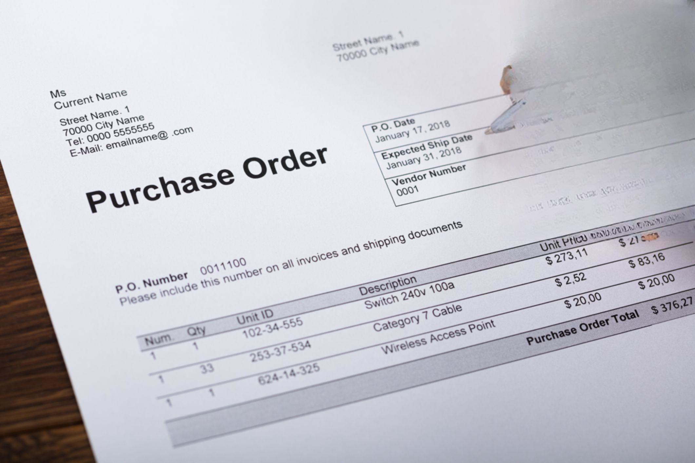

In algorithmic trading, an order is the fundamental instruction to buy or sell an asset within various financial markets. These orders represent trader intentions and dictate how transactions are executed within the marketplace. The design and execution of these orders are crucial as they determine not only the price at which trades are made but also whether they occur at all. In the fast-paced world of algorithmic trading, understanding the types of orders available and how to effectively employ them is integral to optimizing trading strategies and outcomes.

Algorithmic trading leverages complex algorithms to automate the trading process, allowing for rapid and precise execution of orders. Given that algorithms can operate at speeds far beyond human capability, the specific characteristics of different order types become even more significant. The choice between order types like market orders, which require execution at the current price, and limit orders, which specify a particular price threshold, can drastically impact trading results.



The importance of mastering different order types extends beyond just knowing how they function; it involves strategic application to meet specific trading goals. Each order type, whether it's a market or a more complex conditional order, possesses distinct attributes that can be harnessed to manage risk, control trade execution, and ultimately enhance overall trading strategy.

Within algorithmic trading systems, orders are used to automate these decision-making processes, reacting to real-time market data and executing trades based on pre-set conditions or rules. For example, an algorithm might be programmed to execute a market order when certain technical indicators align or to place a limit order to attempt capturing a better price during high volatility situations.

In conclusion, understanding and effectively utilizing various types of orders is paramount in algorithmic trading. As markets evolve and technology advances, traders who continuously enhance their knowledge of order types and strategic applications will maintain an edge in achieving better trading efficiency and performance.

## Table of Contents

## Understanding Market Orders

Market orders are a fundamental concept in [algorithmic trading](/wiki/algorithmic-trading), forming the backbone of numerous trading strategies. A market order is an instruction to buy or sell a security immediately at the best available current market price. The primary feature of market orders is their immediacy; they are executed as soon as possible, assuming there are counterparties willing to take the opposite position at the prevailing market price.

The primary advantage of market orders is the certainty of execution. When a trader places a market order, they are effectively guaranteed that their order will be filled, provided there is sufficient market [liquidity](/wiki/liquidity-risk-premium). This aspect makes market orders particularly advantageous in fast-paced markets where the speed of execution is critical. Algorithmic traders often employ market orders when they need to enter or [exit](/wiki/exit-strategy) positions quickly to take advantage of fleeting market opportunities or to meet urgent trading objectives.

However, the downside of market orders is the potential exposure to price [volatility](/wiki/volatility-trading-strategies). Since market orders are executed at the best available price, traders might experience slippage, which occurs when the final execution price is less favorable than the price observed when the order was placed. Slippage can be particularly problematic in markets with low liquidity or during periods of high volatility when prices can fluctuate significantly in a short timeframe.

Market orders are especially beneficial in scenarios where execution certainty outweighs the need for price precision. For instance, during news announcements or economic data releases, markets can move rapidly as market participants react to new information. In such cases, algorithmic traders may use market orders to quickly establish or liquidate positions to capitalize on the volatility or to mitigate risk.

Additionally, market orders are useful for traders executing a large number of relatively small trades across multiple securities, such as in portfolio rebalancing strategies. In this context, the goal is to adjust the portfolio's composition swiftly to align with pre-defined strategy parameters, making execution speed more critical than achieving a specific execution price.

Overall, while market orders offer the advantage of swift execution, traders must weigh this benefit against the potential cost of slippage and price volatility. Understanding the trade-offs involved in using market orders is crucial for algorithmic traders aiming to optimize their trading strategies in diverse market conditions.

## Exploring Limit Orders

Limit orders are fundamental in algorithmic trading, allowing traders to specify the maximum price they are willing to pay when buying or the minimum price they are willing to accept when selling a security. Unlike market orders, which execute immediately at the current market price, limit orders provide traders with greater control over their execution price, though at the risk of the order not being executed if the market doesn't reach the desired price level.

### Advantages of Limit Orders

The primary advantage of using limit orders is the price certainty they offer. By setting a specific price at which to buy or sell, traders ensure they do not pay more or sell for less than they intended. This control is particularly beneficial in volatile markets, where prices can fluctuate significantly and unexpectedly. While this certainty in price is an advantage, it can come at the cost of execution certainty. Since market conditions might never meet the limit price conditions, there's a chance the order will not be filled.

Another benefit of limit orders is the ability to act as a strategic reserve. Traders can place buy limit orders slightly below the current market price for scenarios where they anticipate a short-term price drop. Conversely, sell limit orders can be set slightly above the market price if a short-term price increase is expected. This approach allows them to capture better prices without needing constant market monitoring.

### Strategic Use in Algorithmic Trading

In algorithmic trading, limit orders are not merely set and forgotten; they are integral to more complex trading strategies. Algorithms can dynamically adjust the limit prices based on numerous [factor](/wiki/factor-investing)s, such as real-time market data, historical patterns, or statistical models, to enhance the chances of order execution while optimizing the entry or exit price.

For instance, one common strategy is the "iceberg order," where a larger limit order is divided into smaller limit orders. The smaller orders are released to the market gradually to mask the true size of the trade, minimizing the market impact and potential price slippage.

Another technique is dynamically adjusting limit order prices based on moving averages or other technical indicators. Traders can set orders to adjust in small increments based on the price direction suggested by these indicators. In Python, a simple example might involve using a moving average crossover strategy to continually adjust a buy limit order price:

```python
def adjust_limit_order(moving_average_short, moving_average_long, current_price):
    if moving_average_short > moving_average_long:  # Bullish signal
        return current_price * (1 - 0.005)  # Set buy limit slightly below current price
    else:
        return current_price * (1 + 0.005)  # Set sell limit slightly above current price

# Example usage:
current_price = 100
short_term_avg = 102
long_term_avg = 101
new_limit_price = adjust_limit_order(short_term_avg, long_term_avg, current_price)
```

By understanding and implementing such strategies, traders can leverage limit orders to better control trade execution conditions, reducing costs and potentially enhancing overall profitability. The key to success in algorithmic trading with limit orders is finding a balance between price certainty and execution likelihood, continuously refining the strategies as markets evolve.

## The Role of Time-in-Force Instructions

Time-in-force (TIF) instructions are a critical component of order types in algorithmic trading, determining the lifespan of a trade order within the market. These instructions provide traders with the flexibility to dictate how long the order remains active and under what conditions it expires or is executed. Understanding these instructions is crucial for optimizing trading strategies and managing risk.

There are several common types of time-in-force instructions:

1. **Good for Day (GFD)**: This is the default time-in-force option where an order remains active only for the trading day on which it was placed. If it isn’t executed by the end of the trading session, it gets automatically canceled. GFD orders are beneficial when traders anticipate short-term price movements and do not wish their orders to remain open beyond a single trading day.

2. **Good Til Canceled (GTC)**: These orders remain active until they are executed or the trader decides to manually cancel them. GTC orders are useful for longer-term strategies where traders are willing to wait for their desired price to be met.

3. **Immediate or Cancel (IOC)**: An IOC order must be executed immediately, either fully or partially. Any portion of the order that cannot be fulfilled instantly is canceled. This order type is suitable for traders who prioritize immediate execution but are willing to forego full execution to avoid negative price movement.

4. **Fill or Kill (FOK)**: In an FOK order, the trade must be executed immediately and entirely. If the order cannot be filled in its entirety, it is canceled. This type is ideal for situations where traders cannot accept partial fills and require exact quantities for their strategies.

The impact of these instructions on the execution and cancellation of orders is profound. They dictate how long a trader’s intent remains actionable in the market and influence the probability of execution based on the prevailing market conditions at the time the order is placed.

In algorithmic trading strategies, time-in-force instructions are particularly significant. They enable algorithms to align order lifespans with the strategy's specific parameters, ensuring that they operate within defined timeframes and react appropriately to market conditions. For example, a high-frequency trading ([HFT](/wiki/high-frequency-trading-strategies)) algorithm might use IOC orders to ensure rapid execution without leaving residual orders in the market that can be preyed upon by other traders. Conversely, a GTC order might be more suitable for a mean-reversion strategy, where capturing long-term price movements is the goal.

In summary, time-in-force instructions provide essential flexibility and control over the execution and lifetime of orders in algorithmic trading. By understanding and leveraging these instructions within trading algorithms, traders can better align their strategies with market conditions, manage risks more effectively, and ultimately enhance trading performance.

## Conditional Orders and Their Applications

Conditional orders are essential tools in algorithmic trading, allowing trades to be executed based on specific pre-set conditions. They serve as strategic instruments to manage risk and optimize trading outcomes by allowing traders to specify conditions in advance under which certain actions should be taken. These orders act as automated instructions, enabling traders to control entry and exit points without requiring constant market monitoring.

**Types of Conditional Orders**

1. **Stop Orders**: A stop order, also known as a stop-loss order, triggers a market order when a specified price, the stop price, is reached. Once the stop price is hit, the order becomes a market order and is executed at the current market price, which might differ from the stop price, especially in volatile markets. This order type is primarily used to limit a trader's loss or to secure profits.

2. **Stop-Limit Orders**: This order type combines the features of stop orders and limit orders. Once the stop price is reached, a limit order is activated instead of a market order. The limit order will only execute at the specified limit price or better. This provides more control over the execution price compared to stop orders but carries the risk that the order may not be executed if the market moves away from the limit price.

3. **Trailing Stop Orders**: Trailing stop orders automatically adjust the stop price at a fixed percentage or dollar amount below the market price. As the market price increases, the stop price increases correspondingly, but if the market price falls, the stop price does not change. This order is particularly useful for protecting gains by enabling trades to continue profiting from rising market conditions while setting a safety net that limits potential losses.

**Examples and Applications in Algorithmic Trading**

Conditional orders can effectively safeguard profits and minimize losses in algorithmic trading by enabling trades to be contingent upon market conditions without direct human intervention. Here are some examples of their application:

- **Protecting Profits**: Consider a trailing stop order set to trail by $5. If a stock initially priced at $50 rises to $60, the trailing stop would move from an initial stop price of $45 to $55, ensuring that if the price falls, the position will be exited, securing a portion of the profits (preventing a fall below $55).

- **Limiting Losses**: Using a stop order to sell stock if its price falls below a certain level (e.g., a stop price of $40 on a stock purchased at $50) enables traders to minimize potential losses, ensuring they exit positions before prices plummet further.

- **Entering Trades at Optimal Times**: A trader may use a stop-limit order to buy a stock if its price exceeds a certain level (e.g., buying if price surpasses a resistance level) but only if the price remains favorable, thereby entering trades only under specific market conditions that align with the trader’s strategy.

Overall, conditional orders in algorithmic trading provide the strategic flexibility needed to efficiently manage market entries and exits, optimize trading performance, and mitigate risks driven by market volatility. Through careful calibration, these orders help maintain disciplined trading strategies that adapt dynamically to changing market conditions.

## Advanced Order Types: OCO and OSO

One Cancels Other (OCO) and One Sends Other (OSO) orders are advanced trading strategies used to manage risk and cater to multiple market scenarios.

An OCO order combines two conditional orders where the execution of one automatically cancels the other. For instance, a trader can set a buy-stop order above the current market price and a sell-stop order below it. If the buy-stop triggers due to a price increase, the sell-stop is instantly canceled, preventing unforeseen losses from simultaneous order execution. This strategy helps traders manage uncertainty by preparing for both upward and downward price movements without manual intervention.

An OSO order, on the other hand, triggers an additional order once the primary order is executed. This strategy is beneficial when a primary trade setup is contingent on the success of an initial order. For example, if a buy order for a stock is filled, an OSO can automatically place a stop-loss order to mitigate risk and protect against adverse price movements.

Algorithmic traders utilize these order types by embedding them within trading algorithms to ensure efficient execution based on predefined criteria. OCO orders allow algorithms to hedge bets, preparing for multiple outcomes without human oversight. Similarly, OSO orders facilitate seamless transitional trading strategies, executing follow-up actions instantaneously once initial conditions are met.

By incorporating OCO and OSO orders into their trading algorithms, traders can effectively streamline operations, manage complex trading scenarios, and mitigate risks associated with volatile markets. The strategic employment of these advanced orders can significantly enhance decision-making processes and increase trading efficiency.

## Utilizing Peg Orders in Algorithmic Trading

Peg orders are a dynamic order type in algorithmic trading that adjust their pricing based on fluctuations in the market, much like how market makers operate. These orders are designed to track market price movements and adjust accordingly to maintain a competitive edge. By doing so, peg orders can optimize executions by reacting quickly to changes in the trading environment.

There are several types of peg orders, each with specific functionalities. Two notable types are Peg Best and Mid-Price Peg. Peg Best orders align with the best bid or ask price available in the market. This approach ensures that the trader's order is consistently matched with the most favorable actionable price at any given moment, supporting liquidity by actively participating in the narrowing of bid-ask spreads. On the other hand, Mid-Price Peg orders aim to execute at the midpoint between the bid and ask prices. This type of order is particularly advantageous for traders who prioritize balancing execution price with potential cost savings, thereby enhancing liquidity by facilitating transactions that could otherwise experience limited price improvement.

The utilization of peg orders presents both advantages and challenges. One significant advantage is their ability to maintain engagement with market fluctuations, thereby improving execution quality. By continuously adapting to changing market conditions, peg orders can lead to better price outcomes and reduce adverse selection – the risk of trading at times of unfavorable market information. Furthermore, these orders naturally support liquidity provision, as they often sit closer to the top of the [order book](/wiki/order-book-trading-strategies), contributing to tighter spreads.

However, there are challenges associated with employing peg orders. The primary challenge involves the complexity of their execution logic, which may require sophisticated algorithms to ensure optimal placement and movement with the market. Additionally, while peg orders are adept at reacting to current market conditions, they can also expose traders to increased market risk if rapid price changes occur, as the orders might be filled at less advantageous prices during market volatility.

In conclusion, peg orders serve as a strategic tool in algorithmic trading by emulating market makers' behavior, dynamically adjusting to price fluctuations, and enhancing market liquidity. Traders seeking to leverage these order types must carefully consider both their benefits and inherent risks, as well as employ robust technology to manage their execution in fast-paced trading environments.

## The Impact of Tick-Sensitive and At the Opening Orders

Tick-sensitive orders are specialized trading instructions that execute based on the movement of stock prices by a specific minimum increment, known as a "tick." These orders are not commonly used, given their dependence on minuscule price changes and the need for favorable market conditions. Their use is more prevalent in environments where high-frequency trading algorithms operate to capture these minimal price differences. Tick-sensitive orders are best suited for advanced algorithmic trading strategies where traders aim to exploit minute market inefficiencies that occur over short periods.

An 'At the opening' order is a type of market order executed at the market’s opening price. These orders provide traders with the ability to capture the opening price, which can often present trading opportunities due to overnight market developments or significant pre-market news. However, there are constraints: such orders must be placed before the market opens, and they [carry](/wiki/carry-trading) the risk of price volatility occurring during the opening auction. 

Strategically employing 'At the opening' orders requires careful timing and risk assessment. Traders might use them to leverage expected changes in stock price due to after-hours news or events. However, the primary risk lies in unanticipated volatility and liquidity issues that can lead to less favorable opening prices than projected. Additionally, if the market experiences a large gap opening, the execution may occur at a significantly different price than anticipated, potentially resulting in unfavorable trading outcomes.

Despite the potential benefits, both tick-sensitive and 'At the opening' orders carry inherent risks. Tick-sensitive orders rely on a high degree of precision and speed, necessitating robust algorithmic systems to manage the risks of rapid price movements. Meanwhile, 'At the opening' orders need accurate market forecasts to mitigate the risk of substantial price jumps. Utilizing these orders effectively involves understanding their unique constraints and potential impacts on the broader trading strategy.

## Electronic Markets and Order Priority

In today's fast-paced electronic trading landscape, the handling of various order types has become increasingly sophisticated, facilitated by advanced algorithms and high-speed networks. Electronic markets are equipped to efficiently process a vast array of orders, each with unique attributes and execution requirements. Understanding how these markets prioritize orders is crucial for optimizing trading strategies.

Market and limit orders typically receive priority in order processing due to their straightforward nature. Market orders are executed immediately at current market prices, ensuring swift fulfillment but with potential exposure to price slippage. Conversely, limit orders specify a price threshold, executing only when this price is met or better, which introduces a trade-off between price certainty and execution certainty.

The priority rules in electronic markets often adhere to the principle of price-time priority. This means orders are prioritized first by price—higher buy prices and lower sell prices take precedence—and second by the time of order entry, favoring earlier submissions. This system ensures fairness and efficiency, encouraging traders to compete on both price terms and timing.

Conditional orders, such as stop and stop-limit orders, and hidden orders, which are not visible in the order book, introduce additional complexity in terms of execution and priority. Conditional orders become active only when specified conditions are met, potentially delaying execution. Hidden orders, used to limit market impact or maintain anonymity, may sacrifice execution priority in exchange for strategic advantages.

Optimizing order placement in algorithmic trading environments requires a nuanced understanding of these priority rules. Traders can enhance execution quality by strategically selecting order types based on market conditions, liquidity, and volatility. For instance, utilizing hidden orders in a highly liquid market might minimize price impact, while limit orders can be effectively used in volatile markets to capitalize on favorable price swings without incurring execution slippage.

Algorithmic traders often leverage real-time market data and predictive analytics to anticipate order book dynamics and adjust strategies accordingly. Techniques such as order splitting, where a large order is broken into smaller segments to reduce market impact, and smart order routing, which seeks the most efficient path across multiple trading venues, can further optimize order placement.

By mastering the intricacies of electronic market operations and order priority rules, traders can make more informed decisions, improving trade execution and achieving better outcomes in the competitive landscape of algorithmic trading.

## Conclusion

Understanding the array of available order types is crucial in algorithmic trading. With a deep knowledge of these different orders, traders can navigate the complexities of financial markets more effectively. Utilizing the right order type can mean the difference between a successful trade and a missed opportunity. Market orders, limit orders, conditional orders, and advanced order types each serve distinct purposes, and mastering them can significantly improve trading efficiency and outcomes.

The strategic application of these orders helps traders optimize their market execution strategies, ensuring that trades occur at desirable price points and conditions. By reducing slippage, minimizing risk, and maximizing potential profit, a well-thought-out approach to order placement can greatly enhance a trader's potential for success.

Moreover, the fluid nature of financial markets necessitates a proactive stance from traders. Continual learning and adaptation are essential to stay ahead of market shifts and evolving trading technology. As algorithmic trading continues to grow and evolve, being conversant with various order types and their implications on market behavior will empower traders to leverage opportunities efficiently, maintaining a competitive edge in a rapidly changing landscape.

## References & Further Reading

[1]: ["Algorithmic Trading and DMA: An Introduction to Direct Access Trading Strategies"](https://www.amazon.fr/Algorithmic-Trading-DMA-introduction-strategies/dp/0956399207) by Barry Johnson

[2]: Aldridge, I. (2013). ["High-Frequency Trading: A Practical Guide to Algorithmic Strategies and Trading Systems"](https://www.amazon.com/High-Frequency-Trading-Practical-Algorithmic-Strategies/dp/1118343506). Wiley Finance.

[3]: Kissell, R. (2013). ["The Science of Algorithmic Trading and Portfolio Management"](https://www.sciencedirect.com/book/9780124016897/the-science-of-algorithmic-trading-and-portfolio-management). Academic Press.

[4]: Hasbrouck, J. (2007). ["Empirical Market Microstructure: The Institutions, Economics, and Econometrics of Securities Trading"](https://www.amazon.com/Empirical-Market-Microstructure-Institutions-Econometrics/dp/0195301641). Oxford University Press.

[5]: Narang, R. (2013). ["Inside the Black Box: A Simple Guide to Quantitative and High-Frequency Trading"](https://www.amazon.com/Inside-Black-Box-Quantitative-Frequency/dp/1118362411). Wiley.